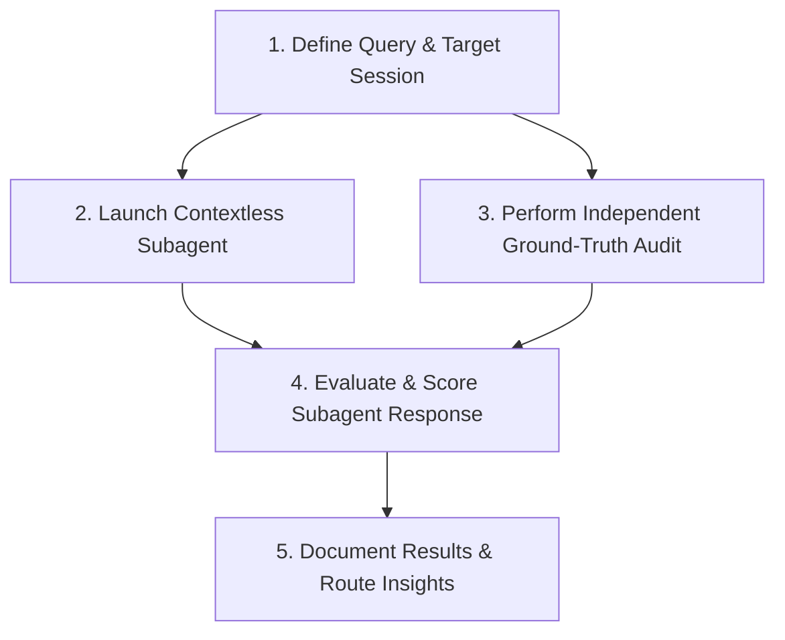

# Template: Blind Comparison & Transcript Audit Procedure for Contextless Subagents

## 🎯 Purpose & Scope

This template provides a standardized, empirical procedure for benchmarking subagent context-independence, evaluating tool selection, and auditing session transcript query accuracy.

Use this procedure when:

- Testing how well an un-prompted, context-free subagent navigates workspace artifacts.
- Validating session history claims or auditing PKB modifications from prior sessions.
- Benchmarking model autonomy, precision, and recall on multi-step investigation tasks.

---

## 📋 Standard Operating Procedure

### Step 1: Formulate Evaluation Query & Target Scope

- Identify the target session ID/slug (e.g., `ab530e51`).
- Define the specific metric/question to evaluate (e.g., _"What PKB notes and tasks were added or updated in session `<session_id>`?"_).

### Step 2: Dispatch Contextless Subagent

- Launch a subagent via `invoke_subagent` (e.g., `research` or `agy`).
- **Constraint:** Supply **only** the bare user prompt. Do not provide pre-digested hints, file paths, or search shortcuts.
- Set role to `Contextless Evaluator`.

### Step 3: Conduct Independent Ground-Truth Audit (Parent Pass)

While the subagent runs in the background, establish the ground-truth baseline:

1. Locate session transcript files in `transcripts/YYYY-MM/` (e.g., `*<session_id>*.full.md`, `*<session_id>*.controller.md`).
2. Search for tool execution logs matching target actions:
   - PKB operations: `pkb__create_task`, `pkb__create`, `pkb__update_body`, `pkb__append`, `mcp__plugin_pkb_services__pkb__*`.
3. Construct the Ground Truth Baseline Table:
   - **Tasks Created:** Node ID, title, parent, creator subagent.
   - **Notes/Memories Updated:** Node ID, title, modification details, subagent.

### Step 4: Evaluate & Score Subagent Performance

Upon receiving the subagent's response, evaluate against the baseline:

- **Precision:** Did the subagent list only true modifications without false positives?
- **Recall:** Did the subagent catch all created/updated nodes without omissions?
- **Attribution Accuracy:** Were subagent lineage and tool call reasons correctly attributed?
- **Speed & Efficiency:** Total turnaround time and tool calls executed.

### Step 5: Document Results

Record evaluation findings into the PKB or project task graph using `remember` or `pkb__create`.

---

## 📊 Evaluation Scoring Matrix

| Metric          | Score 1.0 (Optimal)                | Score 0.5 (Partial)                    | Score 0.0 (Failure)             |
| :-------------- | :--------------------------------- | :------------------------------------- | :------------------------------ |
| **Precision**   | 0 false positives                  | Minor non-PKB edits included           | Hallucinated non-existent nodes |
| **Recall**      | 100% created & updated nodes found | Found created nodes, missed updates    | Missed all nodes                |
| **Attribution** | Exact subagent ID & task rationale | Correct node, missing subagent lineage | Incorrect attribution           |
| **Navigation**  | Used transcript logs directly      | Relied on git log or broad search      | Stuck / failed search           |

---

## 🔗 Related Knowledge & Standards

- [[mem-427f193b]] — Junior delegation surfaces & subagent routing
- [[aops_c6ea7823]] — Lighter-weight peer review workflow
