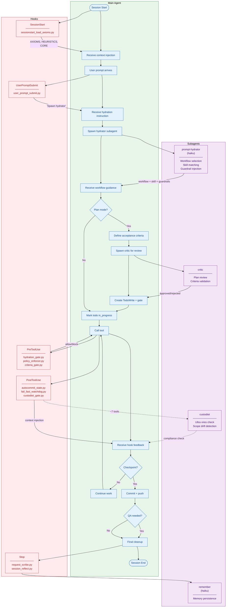
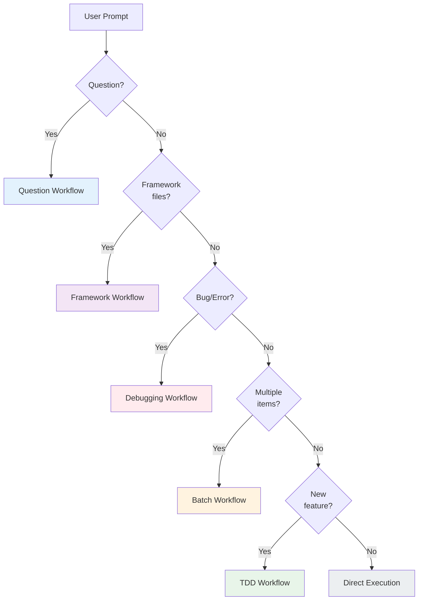
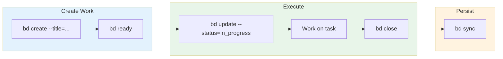
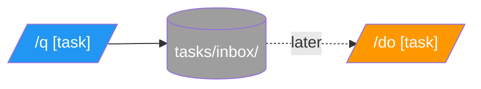

> **Generated by audit skill** - Do not edit manually.

# academicOps Execution Flow

Where the framework injects control during a Claude Code session.

**Spec**: [[specs/execution-flow-spec]]

## Instruction Loading (Before Session)

Before any hooks fire, Claude Code loads context files automatically. This happens at the platform level, not via academicOps hooks.

### Files Loaded by Claude Code

| File        | Location                                                        | Purpose                    |
| ----------- | --------------------------------------------------------------- | -------------------------- |
| `CLAUDE.md` | `~/.claude/CLAUDE.md` (global) or `.claude/CLAUDE.md` (project) | Primary instructions file  |
| `AGENTS.md` | Referenced via `@AGENTS.md` in CLAUDE.md                        | Agent-specific conventions |
| `GEMINI.md` | Gemini CLI equivalent                                           | For Gemini CLI sessions    |

**@ Include Syntax**: Files can include others using `@filename` on a line by itself. Claude Code reads and inlines the referenced file.

```markdown
# Example CLAUDE.md

@AGENTS.md
@local-conventions.md
```

### What academicOps Hooks Add

The `sessionstart_load_axioms.py` hook loads framework-specific context that lives in `$AOPS`:

| Content       | Source                   | Purpose                                            |
| ------------- | ------------------------ | -------------------------------------------------- |
| AXIOMS.md     | `$AOPS/AXIOMS.md`        | Inviolable principles (fail-fast, trust VCS, etc.) |
| HEURISTICS.md | `$AOPS/HEURISTICS.md`    | Soft guidance (prefer X over Y)                    |
| CORE.md       | `$CWD/CORE.md` (project) | Project-specific core conventions                  |

**Key distinction**:

- **AXIOMS + HEURISTICS** = Universal framework rules (from `$AOPS`)
- **CORE** = Project-specific conventions (from working directory)

### Where Workflow/Skill/Guardrail Info Comes From

The prompt-hydrator reads these files to make routing decisions:

| File                | Content                                 | Used For                  |
| ------------------- | --------------------------------------- | ------------------------- |
| `WORKFLOWS.md`      | Workflow definitions (TDD, Debug, etc.) | Selecting execution track |
| `skills/*/index.md` | Skill catalog                           | Matching skills to task   |
| `guardrails.md`     | Guardrail definitions                   | Injecting constraints     |

## Complete Execution Flow

Every prompt goes through this flow. The **Main Agent** runs as a continuous vertical spine (left column). **Hooks** and **Subagents** appear alongside when invoked (right columns), with arrows showing interaction points.



## Flow Legend

| Color           | Meaning                                  |
| --------------- | ---------------------------------------- |
| Green           | Entry/success points                     |
| Blue            | User actions                             |
| Purple          | Skill invocations                        |
| Red             | Hook enforcement (can block)             |
| Orange + dashed | Planned/in-progress (not yet enforced)   |
| Gray            | Tool execution                           |
| Cyan            | External storage (memory server, GitHub) |

## Workflow Selection (from WORKFLOWS.md)

The prompt-hydrator selects workflow based on task signals:

| Task Signal                                 | Workflow     | Skill       | Guardrails                   |
| ------------------------------------------- | ------------ | ----------- | ---------------------------- |
| Framework changes (skills/, hooks/, AXIOMS) | plan-mode    | framework   | `plan_mode`, `critic_review` |
| New functionality, "add", "create"          | tdd          | feature-dev | `require_acceptance_test`    |
| Bug reports, "doesn't work"                 | verify-first | -           | `quote_errors_exactly`       |
| Questions, explanations                     | answer-only  | -           | `answer_only`                |
| Single-step clear scope                     | direct       | -           | `verify_before_complete`     |

## Hook Enforcement Details

### PreToolUse Hooks (can block)

| Hook               | Blocks                                                                       | Enforces                                    |
| ------------------ | ---------------------------------------------------------------------------- | ------------------------------------------- |
| hydration_gate.py  | ALL tools until `Task(subagent_type="prompt-hydrator")` invoked              | Mechanical hydration enforcement            |
| policy_enforcer.py | `git reset --hard`, `push --force`, `*-GUIDE.md`, `.md` > 200 prose lines    | [[axioms/trust-version-control.md           |
| criteria_gate.py   | Edit/Write/Bash until criteria defined + critic reviewed + TodoWrite created | [[axioms/acceptance-criteria-own-success.md |

### PostToolUse Hooks (inject context)

| Hook                  | Triggers On         | Action                                                                                 |
| --------------------- | ------------------- | -------------------------------------------------------------------------------------- |
| autocommit_state.py   | Write to data/      | Auto-commit to prevent data loss                                                       |
| fail_fast_watchdog.py | Error patterns      | Inject fail-fast reminder                                                              |
| custodiet_gate.py     | Every ~7 tool calls | Spawn custodiet agent for ultra vires detection; random reminders (30%) between checks |
| request_scribe.py     | TodoWrite           | Memory documentation reminder                                                          |

**What gets injected** (via `additionalContext` in hook output):

| Hook                  | Injection Content                                                              |
| --------------------- | ------------------------------------------------------------------------------ |
| autocommit_state.py   | Confirmation message: "Auto-committed changes to data/"                        |
| fail_fast_watchdog.py | Axiom reminder: "HALT if stuck, report infrastructure failure, no workarounds" |
| custodiet_gate.py     | Either: custodiet spawn instruction OR random reminder from `reminders.txt`    |
| request_scribe.py     | Reminder to invoke `Skill(skill='remember')` to persist key decisions          |

### Agent Behavior on Hook Feedback

When the agent receives hook feedback (M12 in diagram), it should:

| Feedback Type                | Agent Response                                                                                           |
| ---------------------------- | -------------------------------------------------------------------------------------------------------- |
| **Block (exit 2)**           | Stop current action. Read error message. Comply with required action (e.g., spawn hydrator first).       |
| **Context injection**        | Read injected content. Follow instructions if actionable (e.g., spawn custodiet, invoke remember skill). |
| **Reminder**                 | Acknowledge mentally. Continue work but keep reminder in mind.                                           |
| **Auto-commit confirmation** | No action needed. Informational only.                                                                    |

**Key principle**: Hook feedback is authoritative. The agent should not argue with or work around hook blocks.

### Stop Hooks (cleanup)

| Hook               | Triggers    | Chain                                            |
| ------------------ | ----------- | ------------------------------------------------ |
| request_scribe.py  | Session end | -> remember skill -> $ACA_DATA + memory server   |
| session_reflect.py | Session end | -> session-insights -> daily note + GitHub Issue |

## Gate Flag Lifecycle

Each gate maintains state that controls when it blocks. This section explains what each gate checks and who sets/clears its flags.

### Hydration Gate (`hydration_gate.py`)

**What it checks**: Is `hydration_pending == true` in `/tmp/claude-session/hydrator-{hash}.json`?

| Action       | Who                           | When                                              |
| ------------ | ----------------------------- | ------------------------------------------------- |
| **Set flag** | `user_prompt_submit.py`       | Every user prompt (unless starts with `/` or `.`) |
| **Clear**    | `hydration_gate.py`           | Detects `Task(subagent_type="prompt-hydrator")`   |
| **Bypass**   | User prefixes prompt with `.` | UserPromptSubmit sets `hydration_pending=false`   |

**Mechanical enforcement**: Agent cannot clear flag directly - deny rules block Write/Edit to `/tmp/claude-session/**`.

### Policy Enforcer (`policy_enforcer.py`)

**What it checks**: Pattern matching on tool name + arguments (no state file).

| Pattern                       | Action | Notes                      |
| ----------------------------- | ------ | -------------------------- |
| `git reset --hard`            | Block  | Protects uncommitted work  |
| `git push --force`            | Block  | Protects shared history    |
| `git clean -f`                | Block  | Protects untracked files   |
| Write to `*-GUIDE.md`         | Block  | Force README consolidation |
| Write `.md` > 200 prose lines | Block  | Force chunking             |

**No flag state** - purely pattern-based, always active.

### Criteria Gate (`criteria_gate.py`)

**What it checks**: Has the `/do` Phase 1 workflow been completed?

| Action       | Who                | When                                                           |
| ------------ | ------------------ | -------------------------------------------------------------- |
| **Activate** | `/do` command      | When user invokes `/do [task]`                                 |
| **Clear**    | `criteria_gate.py` | Detects: criteria defined + critic reviewed + TodoWrite exists |
| **N/A**      | -                  | Gate inactive for normal prompts (only `/do` workflow)         |

**Blocks**: Edit, Write, Bash until Phase 1 complete.

### Custodiet Overdue Check (`custodiet_gate.py` + PreToolUse)

**What it checks**: Is `tool_calls_since_compliance >= 7` in `/tmp/claude-session/custodiet-{hash}.json`?

| Action         | Who                  | When                                   |
| -------------- | -------------------- | -------------------------------------- |
| **Increment**  | `custodiet_gate.py`  | Every non-read tool call (PostToolUse) |
| **Reset to 0** | `custodiet_gate.py`  | After spawning custodiet check         |
| **Block**      | PreToolUse (planned) | When counter >= 7 and tool is mutating |

**Current state**: Soft reminder only. Hard block is planned.

## Key Principles

1. **Hooks enforce axioms** - PreToolUse blocks violations before they happen
2. **Skills provide context** - Domain skills load relevant conventions
3. **Criteria are LOCKED** - Once defined in planning, cannot be weakened
4. **CHECKPOINTs require evidence** - Can't mark complete without proof
5. **Memory persists knowledge** - Stop hooks ensure learnings captured

### Planned Features (Orange in diagram)

Features shown with dashed lines are in development:

| Feature               | Status                | Enforcement                            |
| --------------------- | --------------------- | -------------------------------------- |
| Scope drift detection | Building in custodiet | Will compare TodoWrite to actual edits |
| Thrashing detection   | Building in custodiet | Count edits per file in session        |
| Automatic HALT        | Planned               | Will exit 2 from hook to block         |

Currently these rely on prompt-level guidance + periodic custodiet checks.

## Hook Registry

> **Generated from hooks/router.py HOOK_REGISTRY** - Update router.py to change hooks.

| Event                 | Script                      | Purpose                                                  |
| --------------------- | --------------------------- | -------------------------------------------------------- |
| SessionStart          | session_env_setup.sh        | Environment setup                                        |
| SessionStart          | terminal_title.py           | Set terminal title                                       |
| SessionStart          | sessionstart_load_axioms.py | Load AXIOMS, HEURISTICS, CORE                            |
| SessionStart          | unified_logger.py           | Event logging                                            |
| UserPromptSubmit      | user_prompt_submit.py       | Trigger prompt hydration                                 |
| UserPromptSubmit      | unified_logger.py           | Event logging                                            |
| PreToolUse            | hydration_gate.py           | Block ALL tools until prompt-hydrator invoked            |
| PreToolUse            | policy_enforcer.py          | Block destructive operations                             |
| PreToolUse            | criteria_gate.py            | Enforce /do Phase 1                                      |
| PreToolUse            | unified_logger.py           | Event logging                                            |
| PostToolUse           | unified_logger.py           | Event logging                                            |
| PostToolUse           | autocommit_state.py         | Auto-commit data/                                        |
| PostToolUse           | fail_fast_watchdog.py       | Detect errors                                            |
| PostToolUse           | custodiet_gate.py           | Ultra vires detection (~7 tool calls) + random reminders |
| PostToolUse:TodoWrite | request_scribe.py           | Memory documentation reminder                            |
| SubagentStop          | unified_logger.py           | Event logging                                            |
| Stop                  | unified_logger.py           | Event logging                                            |
| Stop                  | request_scribe.py           | Memory reminder                                          |
| Stop                  | session_reflect.py          | Reflection prompt                                        |

**Exit codes**: PreToolUse `0`=allow, `2`=block. PostToolUse `0`=success.

## Workflow Map

The prompt-hydrator selects a workflow track based on task signals. Each workflow has specific triggers, mandates, and execution patterns.

### Available Workflows

| Workflow             | Triggers                                        | Mandates                                  | Primary Skill |
| -------------------- | ----------------------------------------------- | ----------------------------------------- | ------------- |
| **TDD**              | "add", "create", "implement", new functionality | Write test first, run before/after        | `feature-dev` |
| **Debugging**        | "fix", "broken", "doesn't work", error messages | Quote error exactly, verify-first, bisect | -             |
| **Batch**            | Multiple items, "all", "each", patterns         | Dry-run first, checkpoint commits         | -             |
| **Framework**        | `skills/`, `hooks/`, AXIOMS, HEURISTICS edits   | Plan mode required, critic review         | `framework`   |
| **Question**         | "what", "how", "why", "explain"                 | Answer only, no unsolicited changes       | -             |
| **QA/Investigation** | "check", "verify", "audit", uncertainty         | Evidence-based, no assumptions            | `qa`          |

### Workflow Decision Tree



### When Plans Are Created

| Workflow      | Plan Mode?    | Who Plans                  | Criteria Gate |
| ------------- | ------------- | -------------------------- | ------------- |
| **TDD**       | Optional      | Main agent                 | Optional      |
| **Debugging** | No            | Main agent                 | No            |
| **Batch**     | Yes (dry-run) | Main agent                 | No            |
| **Framework** | **Required**  | Main agent → critic review | Yes           |
| **Question**  | No            | N/A                        | No            |
| **QA**        | No            | Main agent                 | No            |

**Plan mode triggers critic subagent**: When plan mode is required, the agent must define acceptance criteria and spawn the critic for review before any implementation.

## Work Management

### Primary: `bd` (Beads)

`bd` is the primary work management system for multi-session tracking, dependencies, and strategic work.



**When to use `bd`**:

- Multi-session work (spans multiple conversations)
- Work with dependencies (blocked by / blocks)
- Strategic planning and tracking
- Discoverable by future sessions

### Alternative: Task System (`/q`, `/do`)

For quick single-session capture when `bd` feels heavyweight.



**When to use `/q`**:

- Quick capture during focused work
- Single-session items
- Not worth creating a `bd` issue

### Choosing Between Them

| Signal                               | Use  |
| ------------------------------------ | ---- |
| "I'll get to this later" (vague)     | `/q` |
| "This blocks X" or "After Y is done" | `bd` |
| Quick note during work               | `/q` |
| Needs to survive session end         | `bd` |
| Discoverable by other sessions       | `bd` |
