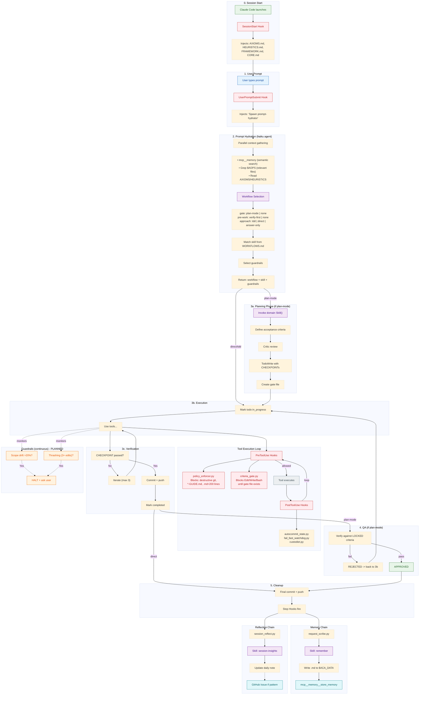
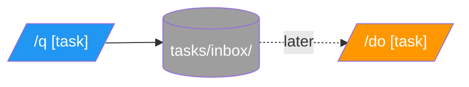

> **Generated by audit skill** - Do not edit manually.

# academicOps Execution Flow

Where the framework injects control during a Claude Code session.

**Spec**: [[specs/execution-flow-spec]]

---

## Complete Execution Flow

Every prompt goes through this flow. Hook enforcement points shown in red, skills in purple, external storage in cyan.

---

## Flow Legend

| Color | Meaning |
|-------|---------|
| Green | Entry/success points |
| Blue | User actions |
| Purple | Skill invocations |
| Red | Hook enforcement (can block) |
| Orange + dashed | Planned/in-progress (not yet enforced) |
| Gray | Tool execution |
| Cyan | External storage (memory server, GitHub) |

---

## Workflow Selection (from WORKFLOWS.md)

The prompt-hydrator selects workflow based on task signals:

| Task Signal | Workflow | Skill | Guardrails |
|-------------|----------|-------|------------|
| Framework changes (skills/, hooks/, AXIOMS) | plan-mode | framework | `plan_mode`, `critic_review` |
| New functionality, "add", "create" | tdd | feature-dev | `require_acceptance_test` |
| Bug reports, "doesn't work" | verify-first | - | `quote_errors_exactly` |
| Questions, explanations | answer-only | - | `answer_only` |
| Single-step clear scope | direct | - | `verify_before_complete` |

---

## Hook Enforcement Details

### PreToolUse Hooks (can block)

| Hook | Blocks | Enforces |
|------|--------|----------|
| policy_enforcer.py | `git reset --hard`, `push --force`, `*-GUIDE.md`, `.md` > 200 prose lines | A#15 Trust Version Control, MINIMAL principle |
| criteria_gate.py | Edit/Write/Bash until criteria defined + critic reviewed + TodoWrite created | A#22 Acceptance Criteria, A#23 Plan-First |

### PostToolUse Hooks (inject context)

| Hook | Triggers On | Action |
|------|-------------|--------|
| autocommit_state.py | Write to data/ | Auto-commit to prevent data loss |
| fail_fast_watchdog.py | Error patterns | Inject fail-fast reminder |
| custodiet.py | Every ~7 tool calls | Spawn custodiet agent for ultra vires detection; random reminders (30%) between checks |
| request_scribe.py | TodoWrite | Memory documentation reminder |

### Stop Hooks (cleanup)

| Hook | Triggers | Chain |
|------|----------|-------|
| request_scribe.py | Session end | -> remember skill -> $ACA_DATA + memory server |
| session_reflect.py | Session end | -> session-insights -> daily note + GitHub Issue |

---

## Key Principles

1. **Hooks enforce axioms** - PreToolUse blocks violations before they happen
2. **Skills provide context** - Domain skills load relevant conventions
3. **Criteria are LOCKED** - Once defined in planning, cannot be weakened
4. **CHECKPOINTs require evidence** - Can't mark complete without proof
5. **Memory persists knowledge** - Stop hooks ensure learnings captured

### Planned Features (Orange in diagram)

Features shown with dashed lines are in development:

| Feature | Status | Enforcement |
|---------|--------|-------------|
| Scope drift detection | Building in custodiet | Will compare TodoWrite to actual edits |
| Thrashing detection | Building in custodiet | Count edits per file in session |
| Automatic HALT | Planned | Will exit 2 from hook to block |

Currently these rely on prompt-level guidance + periodic custodiet checks.

---

## Hook Registry

> **Generated from hooks/router.py HOOK_REGISTRY** - Update router.py to change hooks.

| Event | Script | Purpose |
|-------|--------|---------|
| SessionStart | session_env_setup.sh | Environment setup |
| SessionStart | terminal_title.py | Set terminal title |
| SessionStart | sessionstart_load_axioms.py | Load AXIOMS, HEURISTICS, FRAMEWORK, CORE |
| SessionStart | unified_logger.py | Event logging |
| UserPromptSubmit | user_prompt_submit.py | Trigger prompt hydration |
| UserPromptSubmit | unified_logger.py | Event logging |
| PreToolUse | policy_enforcer.py | Block destructive operations |
| PreToolUse | criteria_gate.py | Enforce /do Phase 1 |
| PreToolUse | unified_logger.py | Event logging |
| PostToolUse | unified_logger.py | Event logging |
| PostToolUse | autocommit_state.py | Auto-commit data/ |
| PostToolUse | fail_fast_watchdog.py | Detect errors |
| PostToolUse | custodiet.py | Ultra vires detection (~7 tool calls) + random reminders |
| PostToolUse:TodoWrite | request_scribe.py | Memory documentation reminder |
| SubagentStop | unified_logger.py | Event logging |
| Stop | unified_logger.py | Event logging |
| Stop | request_scribe.py | Memory reminder |
| Stop | session_reflect.py | Reflection prompt |

**Exit codes**: PreToolUse `0`=allow, `2`=block. PostToolUse `0`=success.

---

## Quick Capture

`/q` saves a task for later; `/do` executes it.

