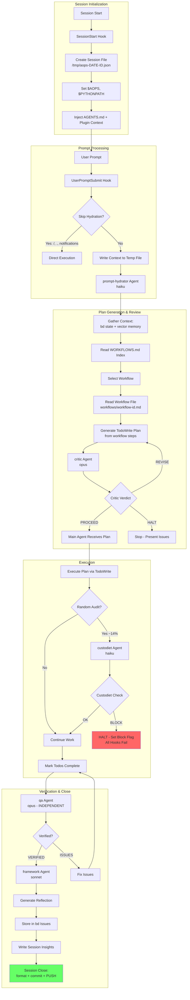

# academicOps Framework

Academic support framework for Claude Code. Minimal, fight bloat aggressively.

## Quick Start

```bash
# Required environment variables (add to ~/.bashrc or ~/.zshrc)
export AOPS="$HOME/src/academicOps"
export ACA_DATA="$HOME/writing/data"

./setup.sh  # Creates ~/.claude/ symlinks, substitutes tokens from ENV VARS into MCP config
```

**Core docs** (injected at session start):

- [AXIOMS.md](AXIOMS.md) - Inviolable principles
- [HEURISTICS.md](HEURISTICS.md) - Empirically validated rules
- [RULES.md](RULES.md) - Enforcement mechanisms mapping rules to controls
- [FRAMEWORK-PATHS.md](FRAMEWORK-PATHS.md) - Paths and configuration (generated)

## Core Concepts

### The Logical Derivation System

academicOps is built as a **validated logical system**. Every rule traces back to first principles:

| Level | Document | Contains | Status |
|-------|----------|----------|--------|
| 1 | **AXIOMS.md** | Inviolable principles | Cannot be violated |
| 2 | **HEURISTICS.md** | Empirically validated rules | Can be revised with evidence |
| 3 | **RULES.md** | Enforcement mechanisms | Maps rules to technical controls |

**The derivation rule**: Every convention MUST trace to an axiom. If it can't be derived, the convention is invalid.

Each axiom and heuristic is stored as an individual file in `aops-core/axioms/` and `aops-core/heuristics/`. These files contain:

- **Statement**: The rule itself
- **Derivation**: Why it exists (traced to first principles)
- **Evidence**: Links to bd issues showing violations and corrections
- **Enforcement**: How it's mechanically enforced

### Axioms vs Heuristics

**Axioms** are inviolable—they define what the system IS:
- "Fail-Fast": No defaults, no fallbacks, no silent failures
- "Skills Are Read-Only": No dynamic data in skills
- "Research Data Is Immutable": Never modify source datasets

**Heuristics** are working hypotheses validated by evidence:
- "Semantic Link Density": Related files MUST link to each other
- "Skills Contain No Dynamic Content": Current state lives in $ACA_DATA

The difference: axioms cannot be violated; heuristics can be revised when evidence shows they're wrong.

### Enforcement Levels

Rules aren't just documented—they're enforced at multiple levels:

| Level | Mechanism | Example |
|-------|-----------|---------|
| **Hard Gate** | Blocks action entirely | PreToolUse hooks block `git reset --hard` |
| **Soft Gate** | Injects guidance, agent can proceed | prompt-hydrator suggests skills |
| **Prompt** | Instructional (AXIOMS.md at session start) | "Verify First" reminder |
| **Detection** | Logs for analysis | custodiet compliance checks |
| **Pre-commit** | Blocks commits | Orphan file detection |

### The Self-Reflexive Framework Agent

This framework treats itself as a hypothesis. Agents are **co-developers**, not just executors:

```
When you encounter friction—something that doesn't fit, a question
the schema can't answer, a pattern that needs a name—do this:

1. Log it.
2. Propose an amendment if you see one.
3. Don't force it. If something doesn't fit, that's data.
```

The framework **evolves through use**. When agents hit friction:
- Violations are logged as bd issues (operational observations)
- Patterns that emerge get named and proposed as new heuristics
- Heuristics that prove themselves get promoted or consolidated
- Rules that don't work get revised

This creates a feedback loop: the framework improves based on real usage, not theoretical design.

### Memory Architecture

The framework distinguishes between two types of knowledge:

| Type | Storage | Example |
|------|---------|---------|
| **Episodic** | bd issues | "I tried X and it failed" (time-stamped observations) |
| **Semantic** | $ACA_DATA markdown | "X doesn't work because Y" (timeless truths) |

$ACA_DATA is a **current state machine**—always up to date, always perfect. The memory server (accessed via `mcp__memory__retrieve_memory`) is a semantic search index derived from this markdown.

## Core Loop

**For detailed specification, see**: [[aops-core/specs/flow.md]]

**Goal**: The minimal viable framework with ONE complete, working loop.

**Philosophy**: Users don't have to use aops. But if they do, it's slow and thorough. The full workflow is MANDATORY.

### Core Loop Diagram



## Architecture

The framework uses a **core + archived** structure:

- **Core plugin** (`aops-core/`): Minimal proven components with mechanical enforcement
- **Archived** (`archived/`): Non-core components preserved for reference

### Core Components

| Category   | Components                                                                               |
| ---------- | ---------------------------------------------------------------------------------------- |
| Skills (4) | remember, framework, audit, session-insights                                             |
| Agents (5) | prompt-hydrator, critic, custodiet, qa, framework                                        |
| Hooks (6)  | router.py, unified_logger.py, user_prompt_submit.py, session_env_setup.sh, overdue_enforcement.py, custodiet_gate.py |
| Governance | 7 enforced axioms, 4 enforced heuristics (with mechanical checks)                        |

### Key Agents

| Agent | Model | Role |
|-------|-------|------|
| **framework** | opus | Primary entry point for framework changes. Handles full task lifecycle. |
| **prompt-hydrator** | haiku | Enriches prompts with context, suggests workflows, applies guardrails |
| **critic** | opus | Reviews plans for errors and hidden assumptions before execution |
| **custodiet** | haiku | Periodic compliance audits (~14% of tool calls). Detects drift. |
| **qa** | opus | Independent verification that acceptance criteria are met |

The **framework agent** embodies the self-reflexive principle—it both executes framework tasks AND proposes improvements to the framework itself.

## Commands

| Command              | Purpose                                                                                      |
| -------------------- | -------------------------------------------------------------------------------------------- |
| /aops                | Show framework capabilities                                                                  |
| /audit-framework     | Comprehensive framework governance audit                                                     |
| /diag                | Quick diagnostic of what's loaded in session                                                 |
| /email               | Extract action items from emails → tasks                                                     |
| /learn               | Make minimal framework tweaks with tracking                                                  |
| /log                 | Log agent patterns to thematic learning files                                                |
| /meta                | Strategic brain + executor for framework work                                                |
| /pull                | Get and run a task from the queue                                                            |
| /q                   | Queue task for later (→ bd issues)                                                           |
| /qa                  | Verify outcomes against acceptance criteria                                                  |
| /reflect             | Self-audit process compliance; see also `/session-insights current` for automated reflection |
| /remind              | Queue agent work for later (→ bd issues)                                                     |
| /review-training-cmd | Process review/source pair for training data                                                 |
| /strategy            | Strategic thinking partner (no execution)                                                    |
| /task-next           | Get 2-3 task recommendations (should/enjoy/quick)                                            |
| /task-viz            | Task graph visualization (Excalidraw)                                                        |
| /ttd                 | TDD workflow (alias for /supervise tdd)                                                      |


## Infrastructure

- **Hooks**: Event-driven context injection (`hooks/`)
- **Skills**: Workflow instructions (`skills/`) - invoke via `Skill` tool
- **Memory**: `mcp__memory__*` tools for knowledge persistence
- **Plugin**: Core components bundled in `plugins/aops-core/`
- **Agents**: Purpose-built subagents in (`agents/`)

## Details

- [[RULES]] for mapping of rules to enforcement measures
- [[WORKFLOWS]] all supported workflows
- Framework [[VISION]].
