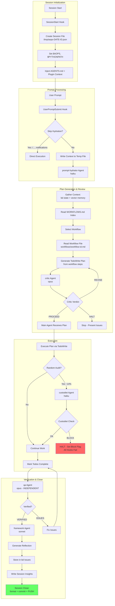

# academicOps: A constitutional automation framework for academic work

* Enforces a logical system: every rule derivable from [AXIOMS.md] with [HEURISTICS.md] supported by evidence.
* Reflexive, self-improving agents must follow a CATEGORICAL IMPERATIVE: every action must be supported by a general rule.
* Graduated approach to enforcement: [enforcement-map.md] sets out a full map of rules to enforcement mechanism, from gentle reminders to hard blocks.
* Agent autonomy is limited to the authority they were granted: live ultra vires detection loop
* Direct integration with beads for task memomory, memory mcp for vector search
* Full personal knowledge base with gardening and continuous remembering skills
* Human readable and portable Markdown files are the single sources of truth 
* Everything in git for durability and observability
* Strict separation of user data (not in this repo)
* Optimised for long-term strategic planning under conditions of uncertainty
* Includes integrated MCP tooling for email and calendar access


## Installation

### Prerequisites

- **Environment variables** in `~/.bashrc` or `~/.zshrc`:
  ```bash
  export AOPS="$HOME/src/academicOps"      # Framework code (this repo)
  export ACA_DATA="$HOME/writing/data"     # Your data (NOT in git)
  ```
- **jq** installed (`sudo apt install jq` or `brew install jq`)
- Optional: `gemini` CLI for Gemini support, Docker/Podman for container-based MCP servers

### Running Setup

```bash
./setup.sh
```

### What Gets Installed

The script configures three tools with distinct scoping:

| Tool | Scope | Configuration Location |
|------|-------|----------------------|
| **Claude Code** | User | `~/.claude/`, `~/.claude.json` |
| **Gemini CLI** | User | `~/.gemini/` |
| **Antigravity** | User + Project | `~/.gemini/antigravity/` + `$AOPS/.agent/rules/` |

#### Claude Code (User-scoped)

Creates symlinks in `~/.claude/` pointing to framework components:

```
~/.claude/
├── settings.json      → $AOPS/config/claude/settings.json
├── CLAUDE.md          → $AOPS/config/claude/CLAUDE.md
├── settings.local.json   (generated - contains AOPS/ACA_DATA paths)
└── plugins/
    ├── aops-core      → $AOPS/aops-core
    └── aops-tools     → $AOPS/aops-tools
```

MCP servers are merged into `~/.claude.json` (the user-level Claude Code config). Plugin-specific MCPs are generated from templates in each plugin's `.mcp.json`.

#### Gemini CLI (User-scoped)

Creates symlinks in `~/.gemini/`:

```
~/.gemini/
├── hooks             → $AOPS/config/gemini/hooks
├── commands          → $AOPS/config/gemini/commands
├── GEMINI.md            (generated - paths injected from env vars)
└── settings.json        (merged - hooks + MCP servers added)
```

Commands are converted to TOML format. MCP servers are converted from Claude format to Gemini format.

#### Antigravity (User + Project-scoped)

**User-scoped** (`~/.gemini/antigravity/`):
```
~/.gemini/antigravity/
├── global_workflows/    (skills linked as /<skill_name>.md)
│   ├── remember.md   → $AOPS/aops-core/skills/remember/SKILL.md
│   ├── framework.md  → $AOPS/aops-core/skills/framework/SKILL.md
│   └── ...
├── mcp_config.json      (generated - MCP servers for Antigravity)
└── GEMINI.md         → ~/.gemini/GEMINI.md
```

**Project-scoped** (`$AOPS/.agent/rules/`):
```
$AOPS/.agent/rules/
├── axioms.md         → $AOPS/AXIOMS.md
├── heuristics.md     → $AOPS/HEURISTICS.md
└── core.md           → $AOPS/config/antigravity/rules/core.md
```

#### Additional Setup

- **Memory server**: Configures `~/.memory/config.json` with project 'main' pointing to `$ACA_DATA`
- **Cron jobs**: Task index regeneration (5 min), session insights (30 min)

### Key Paths Summary

| Path | Purpose | Scope |
|------|---------|-------|
| `$AOPS` | Framework code (this repo) | Shared |
| `$ACA_DATA` | User data, notes, tasks | User |
| `~/.claude/` | Claude Code symlinks & settings | User |
| `~/.claude.json` | Claude Code MCP servers | User |
| `~/.gemini/` | Gemini CLI config | User |
| `~/.gemini/antigravity/` | Antigravity global workflows | User |
| `$AOPS/.agent/rules/` | Antigravity project rules | Project |

**Core docs** (injected at session start):

- [AXIOMS.md](AXIOMS.md) - Inviolable principles
- [HEURISTICS.md](HEURISTICS.md) - Empirically validated rules
- [enforcement-map.md](indices/enforcement-map.md) - Enforcement mechanisms mapping rules to controls
- [FRAMEWORK-PATHS.md](FRAMEWORK-PATHS.md) - Paths and configuration (generated)

## Core Concepts

### The Logical Derivation System

academicOps is built as a **validated logical system**. Every rule traces back to first principles:

| Level | Document | Contains | Status |
|-------|----------|----------|--------|
| 1 | **AXIOMS.md** | Inviolable principles | Cannot be violated |
| 2 | **HEURISTICS.md** | Empirically validated rules | Can be revised with evidence |
| 3 | **enforcement-map.md** | Enforcement mechanisms | Maps rules to technical controls |

**The derivation rule**: Every convention MUST trace to an axiom. If it can't be derived, the convention is invalid.

Each axiom and heuristic is stored as an individual file in `aops-core/axioms/` and `aops-core/heuristics/`. These files contain:

- **Statement**: The rule itself
- **Derivation**: Why it exists (traced to first principles)
- **Evidence**: Links to bd issues showing violations and corrections
- **Enforcement**: How it's mechanically enforced

### Axioms vs Heuristics

**Axioms** are inviolable—they define what the system IS:
- "Fail-Fast": No defaults, no fallbacks, no silent failures
- "Skills Are Read-Only": No dynamic data in skills
- "Research Data Is Immutable": Never modify source datasets

**Heuristics** are working hypotheses validated by evidence:
- "Semantic Link Density": Related files MUST link to each other
- "Skills Contain No Dynamic Content": Current state lives in $ACA_DATA

The difference: axioms cannot be violated; heuristics can be revised when evidence shows they're wrong.

### Skills vs Workflows

The framework distinguishes between **what** to do and **how** to do it:

| | Skills | Workflows |
|---|--------|-----------|
| **Answer** | "How do I do X?" | "What should I do?" |
| **Nature** | Fungible instructions | Composable chains of steps |
| **Examples** | Create a PDF, generate a mindmap | Feature development, TDD cycle |

**Skills** are interchangeable recipes—any skill that creates a PDF can substitute for another. They're the building blocks.

**Workflows** orchestrate those building blocks into coherent processes. A workflow defines the sequence (spec review → implementation → QA), while skills handle each step's mechanics.

For full specification, see [[aops-core/specs/workflow-system-spec]].

### Enforcement Levels

Rules aren't just documented—they're enforced at multiple levels:

| Level | Mechanism | Example |
|-------|-----------|---------|
| **Hard Gate** | Blocks action entirely | PreToolUse hooks block `git reset --hard` |
| **Soft Gate** | Injects guidance, agent can proceed | prompt-hydrator suggests skills |
| **Prompt** | Instructional (AXIOMS.md at session start) | "Verify First" reminder |
| **Detection** | Logs for analysis | custodiet compliance checks |
| **Pre-commit** | Blocks commits | Orphan file detection |

### The Self-Reflexive Framework Agent

This framework treats itself as a hypothesis. Agents are **co-developers**, not just executors:

```
When you encounter friction—something that doesn't fit, a question
the schema can't answer, a pattern that needs a name—do this:

1. Log it.
2. Propose an amendment if you see one.
3. Don't force it. If something doesn't fit, that's data.
```

The framework **evolves through use**. When agents hit friction:
- Violations are logged as bd issues (operational observations)
- Patterns that emerge get named and proposed as new heuristics
- Heuristics that prove themselves get promoted or consolidated
- Rules that don't work get revised

This creates a feedback loop: the framework improves based on real usage, not theoretical design.

### Memory Architecture

The framework distinguishes between two types of knowledge:

| Type | Storage | Example |
|------|---------|---------|
| **Episodic** | bd issues | "I tried X and it failed" (time-stamped observations) |
| **Semantic** | $ACA_DATA markdown | "X doesn't work because Y" (timeless truths) |

$ACA_DATA is a **current state machine**—always up to date, always perfect. The memory server (accessed via `mcp__memory__retrieve_memory`) is a semantic search index derived from this markdown.

## Core Loop

**For detailed specification, see**: [[aops-core/specs/flow.md]]

**Goal**: The minimal viable framework with ONE complete, working loop.

**Philosophy**: Users don't have to use aops. But if they do, it's slow and thorough. The full workflow is MANDATORY.

### Core Loop Diagram



## Architecture

The framework uses a **core + archived** structure:

- **Core plugin** (`aops-core/`): Minimal proven components with mechanical enforcement
- **Archived** (`archived/`): Non-core components preserved for reference

### Core Components

| Category    | Components                                                                               |
| ----------- | ---------------------------------------------------------------------------------------- |
| Skills (6)  | remember, framework, audit, session-insights, garden, hypervisor                         |
| Agents (5)  | prompt-hydrator, critic, custodiet, qa, framework                                        |
| Hooks (13)  | router.py (dispatcher), unified_logger.py, user_prompt_submit.py, session_env_setup.sh, hydration_gate.py, task_required_gate.py, policy_enforcer.py, overdue_enforcement.py, fail_fast_watchdog.py, custodiet_gate.py, task_binding.py, memory_sync_closed_issues.py, reflection_check.py, session_end_commit_check.py |
| Governance  | 7 enforced axioms, 4 enforced heuristics (with mechanical checks)                        |

### Key Agents

| Agent | Model | Role |
|-------|-------|------|
| **framework** | opus | Primary entry point for framework changes. Handles full task lifecycle. |
| **prompt-hydrator** | haiku | Enriches prompts with context, suggests workflows, applies guardrails |
| **critic** | opus | Reviews plans for errors and hidden assumptions before execution |
| **custodiet** | haiku | Periodic compliance audits (~14% of tool calls). Detects drift. |
| **qa** | opus | Independent verification that acceptance criteria are met |

The **framework agent** embodies the self-reflexive principle—it both executes framework tasks AND proposes improvements to the framework itself.

## Commands

| Command              | Purpose                                                                                      |
| -------------------- | -------------------------------------------------------------------------------------------- |
| /aops                | Show framework capabilities                                                                  |
| /audit-framework     | Comprehensive framework governance audit                                                     |
| /diag                | Quick diagnostic of what's loaded in session                                                 |
| /email               | Extract action items from emails → tasks                                                     |
| /learn               | Make minimal framework tweaks with tracking                                                  |
| /log                 | Log agent patterns to thematic learning files                                                |
| /meta                | Strategic brain + executor for framework work                                                |
| /pull                | Get and run a task from the queue                                                            |
| /q                   | Queue task for later (→ bd issues)                                                           |
| /qa                  | Verify outcomes against acceptance criteria                                                  |
| /reflect             | Self-audit process compliance; see also `/session-insights current` for automated reflection |
| /remind              | Queue agent work for later (→ bd issues)                                                     |
| /review-training-cmd | Process review/source pair for training data                                                 |
| /strategy            | Strategic thinking partner (no execution)                                                    |
| /task-next           | Get 2-3 task recommendations (should/enjoy/quick)                                            |
| /task-viz            | Task graph visualization (Excalidraw)                                                        |
| /ttd                 | TDD workflow (alias for /supervise tdd)                                                      |


## Infrastructure

- **Hooks**: Event-driven context injection (`hooks/`)
- **Skills**: Workflow instructions (`skills/`) - invoke via `Skill` tool
- **Memory**: `mcp__memory__*` tools for knowledge persistence
- **Plugin**: Core components bundled in `plugins/aops-core/`
- **Agents**: Purpose-built subagents in (`agents/`)

## Details

- [[RULES]] for mapping of rules to enforcement measures
- [[WORKFLOWS]] all supported workflows
- Framework [[VISION]].
