# academicOps

A constitutional framework for governing autonomous AI agents in academic environments.

The central problem of agentic AI is not capability but legitimacy. LLM-based agents are stochastic: they exercise judgment, make choices, and produce variable outputs. For anyone trained in public law, this is not an unfamiliar problem. We govern stochastic decision-makers all the time. The question is not whether an agent will always get things right, but whether its exercise of power is *valid*: authorised, constrained, reviewable, and accountable.

academicOps applies the structural logic of constitutional and administrative law to autonomous AI agents. The result is a system where agents operate with genuine autonomy within defined jurisdictions, subject to the same kinds of controls that make delegated authority workable in legal systems: enumerated powers, procedural requirements, periodic review, and a doctrine of ultra vires that voids unauthorised action.

### What makes this different

- **We avoid the "human in the loop" trap.** Requiring a human to approve every agent decision defeats the purpose of automation and does not actually produce accountability. Instead, we define the *scope* of delegated authority and audit whether the agent stays within it, the way administrative law constrains discretion without requiring ministerial sign-off on every decision.

- **Agents are stochastic, and that is fine.** Probabilistic methods channelled through deterministic processes. We do not try to make agents predictable; we make their exercise of judgment *reviewable*. An agent that exercises discretion within its grant of authority is operating legitimately, even if a human might have decided differently.

- **Limits of authority derive from first principles.** Inviolable axioms function as constitutional provisions: they define what the system *is* and cannot be overridden. Mid-level heuristics function like common law doctrine: they evolve through experience, can be revised when evidence warrants, and are promoted or demoted based on how they perform in practice.

- **We build precedent, not prescriptions.** The framework does not attempt to anticipate every problem ex ante. Instead, it builds in a systematic feedback loop: every session generates structured observations, recurring friction gets named as doctrine, and the rule system develops incrementally through use. The body of operational knowledge grows the way case law does, one decision at a time.

- **Ultra vires detection runs continuously.** A *custodiet* agent periodically audits the main agent's behaviour against the authority it was granted, checking for scope drift, principle violations, and unauthorised action. This is not a post-hoc review; it is a live jurisdictional check that can halt execution mid-session.

- **Governance, not computer science.** The dominant approach to AI safety focuses on making individual agents better: more aligned, more predictable, more constrained at the model level. We take a different bet. These are universal governance problems that persist no matter how good individual agents get, because the challenge is structural, not behavioural. So we go all in on the agentic metaphor and adopt the patterns that actually work for governing systems of autonomous individuals: distributed administrative review, drawn from everything we have learned about commons-based peer production in free/open source software and other knowledge commons. The enforcement mechanism is not a local supervisor watching over one agent's shoulder; it is a system of distributed review where agents check each other's work through structured processes, the way open source maintainers govern contributions at scale.

- **The constitutional metaphor is structural, not decorative.** Every operational rule must trace back to an axiom through explicit derivation. Rules that cannot be derived are invalid. This is the mechanism that prevents governance bloat: you cannot add arbitrary constraints, only constraints that follow from the constitution of the system.

## The core loop

Every agent session follows a structured lifecycle with gates at each transition. The key architectural decision is that **every mutating operation passes through gates**. An agent cannot edit a file without an active task (work tracking), a hydrated execution plan (intent verification), and periodic compliance audits (drift detection). Read-only operations are unrestricted, avoiding the circular dependency where an agent cannot gather context to satisfy the very gate that blocks it.

```mermaid
flowchart TD
    %% Node Definitions
    Start([Session Start])

    subgraph Initialization [1. Initialization]
        SStart[SessionStart Event] --> Router1{Universal Router}
        Router1 -.-> Setup[session_env_setup.py]
        Router1 -.-> StartGate[session_start gate]
        StartGate --> State[(Create State File)]
        StartGate --- InitExpl[Loads environment paths,<br/>AXIOMS, and HEURISTICS]
    end

    subgraph Hydration [2. Hydration & Review]
        UPS[UserPromptSubmit Event] --> Router2{Universal Router}
        Router2 -.-> SkipCheck{Skip Hydration?}
        SkipCheck -- No --> Context[Context -> Temp File]
        Context --> Hydrator[[prompt-hydrator Subagent]]
        Hydrator --> Plan[/Hydration Plan/]
        Hydrator --> GateCr[Critic Gate: CLOSED]

        Hydrator --- HydrateExpl[Fetches: Task queue, memory server,<br/>WORKFLOWS index, and relevant files]

        Plan --> Critic[[critic Subagent]]
        Critic --> CriticCheck{Plan Approved?}
        CriticCheck -- REVISE --> Plan
        CriticCheck -- PROCEED --> OpenCr[Critic Gate: OPEN]
        Critic --- CriticExpl[Evaluates plan for assumptions,<br/>safety gaps, and logic errors]
    end

    subgraph Execution [3. Execution & Hard Gates]
        PreTool[PreToolUse Event] --> Router3{Universal Router}

        Router3 -.-> GateH[Hydration Gate]
        GateH --> GateT[Task Gate]
        GateT --> GateCr_Exec[Critic Gate]

        GateH --- HExpl[Blocks mutating tools until<br/>an execution plan is generated]
        GateT --- TExpl[Enforces work tracking by requiring<br/>an active task for destructive actions]
        GateCr_Exec --- CrExpl[Blocks edit tools until plan is reviewed]

        GateCr_Exec --> ThresholdCheck{Audit Threshold?}
        ThresholdCheck -- Yes ~15 ops --> GateC[Custodiet Gate]
        ThresholdCheck -- No --> Tool[[Execute Tool]]

        GateC --- CExpl[Reviews session history for<br/>principle violations and scope drift]
        GateC --> Tool

        Tool --> PostTool[PostToolUse Event]
        PostTool --> Router4{Universal Router}
        Router4 -.-> Accountant[Accountant: Update Counters]
    end

    subgraph Termination [4. Reflection & Close]
        AfterAgent[AfterAgent Event] --> Router5{Universal Router}
        Router5 -.-> GateHa[Handover Gate]
        GateHa --- HaExpl[Ensures Framework Reflection includes<br/>all 8 required metadata fields]

        GateHa --> Stop[Stop Event]
        Stop --> Router6{Universal Router}
        Router6 -.-> Commit[Commit & Close]

        Commit --- QExpl[Mandates independent<br/>QA passage and clean git state]
    end

    %% Flow Connections
    Start --> SStart
    State --> UPS
    SkipCheck -- Yes --> PreTool
    OpenCr --> PreTool
    Accountant --> AfterAgent
    Commit --> End([Session End])

    %% Styling (Light & Dark Theme Compatible)
    classDef hook fill:#0277bd,stroke:#01579b,stroke-width:2px,color:#fff
    classDef gate fill:#c62828,stroke:#b71c1c,stroke-width:2px,color:#fff
    classDef agent fill:#6a1b9a,stroke:#4a148c,stroke-width:2px,color:#fff
    classDef state fill:#ef6c00,stroke:#e65100,stroke-width:2px,color:#fff
    classDef event fill:#424242,stroke:#212121,stroke-width:2px,color:#fff
    classDef explain fill:none,stroke:#888,stroke-width:1px,color:#888,font-style:italic

    class Router1,Router2,Router3,Router4,Router5,Router6,Setup,Accountant,Commit hook
    class StartGate,SkipCheck,GateH,GateT,GateC,GateCr,OpenCr,GateCr_Exec,GateHa,ThresholdCheck gate
    class Hydrator,Critic agent
    class State,Plan,Context state
    class SStart,UPS,PreTool,PostTool,AfterAgent,Stop event
    class InitExpl,HydrateExpl,CriticExpl,HExpl,TExpl,CrExpl,CExpl,HaExpl,QExpl explain

    %% Subgraph Styling
    style Initialization fill:none,stroke:#888,stroke-dasharray: 5 5
    style Hydration fill:none,stroke:#888,stroke-dasharray: 5 5
    style Execution fill:none,stroke:#888,stroke-dasharray: 5 5
    style Termination fill:none,stroke:#888,stroke-dasharray: 5 5
```



## The hierarchy of norms

The framework is structured as a legal hierarchy. Every operational rule must trace back to first principles, or it is invalid.

| Level | Document | Role | Analogy |
| ----- | -------- | ---- | ------- |
| 1 | **AXIOMS.md** | Inviolable principles (30+) | Constitutional provisions |
| 2 | **HEURISTICS.md** | Evidence-based working rules (40+) | Common law doctrine |
| 3 | **enforcement-map.md** | Rule-to-mechanism mapping | Regulatory implementation |

**Axioms** define what the system *is*. "Fail-Fast" means no defaults, no fallbacks, no silent failures. "Research Data Is Immutable" means source datasets are sacred. "Delegated Authority Only" means agents act within the bounds of what they were explicitly granted. These cannot be overridden.

**Heuristics** are working hypotheses, validated by evidence and revised when evidence warrants. "Probabilistic Methods, Deterministic Processes" captures the core design insight. "Subagent Verdicts Are Binding" emerged after an agent ignored a compliance finding and introduced scope drift. These evolve: they get promoted when they prove themselves, demoted or revised when they cause friction, and new ones are named as recurring patterns emerge from practice.

The derivation chain is the coherence mechanism. New rules must derive from existing axioms; if they cannot, either the rule is wrong or the axiom set is incomplete. This is how the system grows without accumulating arbitrary constraints.

## Graduated enforcement

Rules are enforced at multiple levels, calibrated to the severity of violation:

| Level | Mechanism | Example |
| ----- | --------- | ------- |
| **Hard gate** | Blocks action entirely | Task binding required for destructive operations |
| **Soft gate** | Injects guidance, agent proceeds | Prompt hydrator suggests workflows |
| **Periodic audit** | Compliance reviewed every ~15 operations | Custodiet detects scope drift and principle violations |
| **Pre-commit** | Blocks commits with structural issues | Orphan file detection, frontmatter validation |
| **Prompt-level** | Selective instruction injection via hydrator | Relevant principles surfaced just-in-time |

The enforcement map documents every rule, its mechanism, the hook point where it fires, and the axiom it derives from. This serves as both an operational reference and an audit trail for the governance system itself.

## The feedback loop

The framework treats itself as a hypothesis under continuous test. It does not attempt to get everything right from the outset. Instead, it builds in systematic mechanisms for learning from its own operation:

**Observation**: Every session generates structured data. Framework Reflections at session end capture outcome, friction points, and proposed changes. Token metrics track efficiency. Skill compliance shows whether suggested procedures were actually followed.

**Pattern recognition**: Recurring friction gets named. When the same kind of problem shows up across sessions, it becomes a candidate for doctrinal development: a new heuristic, a corollary to an existing axiom, or a change to an enforcement mechanism.

**Intervention**: The `/learn` skill captures failures as structured knowledge. Fixes are applied at the lowest effective level: a corollary first, then a heuristic, then a hook. The system is designed to develop incrementally, the way case law builds up through individual decisions rather than comprehensive legislation.

## Memory architecture

The framework distinguishes between two types of knowledge, following established memory theory:

| Type | Storage | Example |
| ---- | ------- | ------- |
| **Semantic** | $ACA_DATA markdown | "X doesn't work because Y" (timeless knowledge) |
| **Episodic** | Task graph + git issues | "I tried X on Tuesday and it failed" (observations) |

$ACA_DATA is a **current state machine**: always up to date, always the single source of truth. Human-readable markdown files, version-controlled in git, with a memory server providing semantic search via vector embeddings. Knowledge persists in a durable, portable format while remaining discoverable through natural language.

## Architecture

### Agents

| Agent | Model | Role |
| ----- | ----- | ---- |
| **prompt-hydrator** | haiku | Enriches prompts with context, selects workflows, applies guardrails |
| **custodiet** | haiku | Periodic compliance audits. Detects drift, violations, scope creep |
| **critic** | opus | Reviews execution plans for errors and hidden assumptions |
| **qa** | opus | Independent verification against acceptance criteria |
| **effectual-planner** | opus | Strategic planning under genuine uncertainty |

## Skills and commands

The framework ships with 24 skills (domain-specific instruction sets) and 7 commands (operational shortcuts). Skills are fungible: any skill that converts markdown to PDF can substitute for another. Workflows orchestrate skills into coherent processes.

| Skill | Purpose |
| ----- | ------- |
| /analyst | Research data analysis (dbt, Streamlit, statistical methods) |
| /audit | Framework governance audit and index updates |
| /daily | Daily note lifecycle, briefing, task recommendations |
| /remember | Dual-write knowledge to markdown and memory server |
| /session-insights | Structured insight extraction from session transcripts |
| /convert-to-md | Batch document conversion preserving tracked changes |
| /pdf | Academic-style PDF generation with proper typography |
| /garden | Incremental knowledge base maintenance |
| /excalidraw | Hand-drawn diagrams and mind maps |
| /flowchart | Mermaid flowcharts with accessibility best practices |
| /python-dev | Production Python with fail-fast philosophy and type safety |
| /strategy | Strategic thinking partner for planning under uncertainty |
| /planning | Decomposition patterns, spikes, and dependency management |
| /swarm-supervisor | Parallel worker orchestration with isolated worktrees |
| /email-triage | Email classification and task extraction |
| /hdr | Higher degree research student supervision workflows |

| Command | Purpose |
| ------- | ------- |
| /pull | Pull a task from the queue and claim it |
| /q | Quick-queue a task for later |
| /learn | Capture framework failures as structured knowledge |
| /dump | Session handover: commit, update tasks, reflection, halt |
| /bump | Nudge an agent back into action |
| /path | Narrative path reconstruction across sessions |
| /aops | Show framework capabilities and help |

## Installation

Distribution repository: https://github.com/nicsuzor/aops-dist

Set the data directory environment variable in `~/.bashrc` or `~/.zshrc`:

```bash
export ACA_DATA="$HOME/writing/data"     # Your knowledge base (NOT in this repo)
```

Claude Code:

```bash
command claude plugin marketplace add nicsuzor/aops-dist
command claude plugin marketplace update aops && command claude plugin install aops-core@aops && command claude plugin list
```

Gemini CLI:

```bash
(command gemini extensions uninstall aops-core || echo not installed) && command gemini extensions install git@github.com:nicsuzor/aops-dist.git --consent --auto-update --pre-release
```

## Project configuration

Projects customise the framework by adding files to a `.agent/` directory:

- **`.agent/rules/`** - Project-specific rules loaded automatically as binding constraints
- **`.agent/workflows/`** - Project-specific workflows supplementing the global index
- **`.agent/context-map.json`** - Maps project documentation to topics for just-in-time context injection
