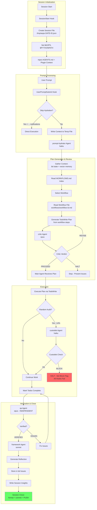

# academicOps Framework

Academic support framework for Claude Code. Minimal, fight bloat aggressively.

## Quick Start

```bash
# Required environment variables (add to ~/.bashrc or ~/.zshrc)
export AOPS="$HOME/src/academicOps"
export ACA_DATA="$HOME/writing/data"

./setup.sh  # Creates ~/.claude/ symlinks, substitutes tokens from ENV VARS into MCP config
```

**Core docs** (injected at session start):

- [AXIOMS.md](AXIOMS.md) - Inviolable principles
- [HEURISTICS.md](HEURISTICS.md) - Empirically validated rules
- [FRAMEWORK-PATHS.md](FRAMEWORK-PATHS.md) - Paths and configuration (generated)

## Core Loop

**For detailed specification, see**: [[aops-core/specs/flow.md]]

**Goal**: The minimal viable framework with ONE complete, working loop.

**Philosophy**: Users don't have to use aops. But if they do, it's slow and thorough. The full workflow is MANDATORY.

### Core Loop Diagram



## Architecture

The framework uses a **core + archived** structure:

- **Core plugin** (`aops-core/`): Minimal proven components with mechanical enforcement
- **Archived** (`archived/`): Non-core components preserved for reference

### Core Components

| Category   | Components                                                                               |
| ---------- | ---------------------------------------------------------------------------------------- |
| Skills (4) | remember, framework, audit, session-insights                                             |
| Agents (5) | prompt-hydrator, critic, custodiet, qa, framework                                        |
| Hooks (6)  | router.py, unified_logger.py, user_prompt_submit.py, session_env_setup.sh, overdue_enforcement.py, custodiet_gate.py |
| Governance | 7 enforced axioms, 4 enforced heuristics (with mechanical checks)                        |

## Commands

| Command              | Purpose                                                                                      |
| -------------------- | -------------------------------------------------------------------------------------------- |
| /aops                | Show framework capabilities                                                                  |
| /audit-framework     | Comprehensive framework governance audit                                                     |
| /diag                | Quick diagnostic of what's loaded in session                                                 |
| /email               | Extract action items from emails → tasks                                                     |
| /learn               | Make minimal framework tweaks with tracking                                                  |
| /log                 | Log agent patterns to thematic learning files                                                |
| /meta                | Strategic brain + executor for framework work                                                |
| /pull                | Get and run a task from the queue                                                            |
| /q                   | Queue task for later (→ bd issues)                                                           |
| /qa                  | Verify outcomes against acceptance criteria                                                  |
| /reflect             | Self-audit process compliance; see also `/session-insights current` for automated reflection |
| /remind              | Queue agent work for later (→ bd issues)                                                     |
| /review-training-cmd | Process review/source pair for training data                                                 |
| /strategy            | Strategic thinking partner (no execution)                                                    |
| /task-next           | Get 2-3 task recommendations (should/enjoy/quick)                                            |
| /task-viz            | Task graph visualization (Excalidraw)                                                        |
| /ttd                 | TDD workflow (alias for /supervise tdd)                                                      |


## Infrastructure

- **Hooks**: Event-driven context injection (`hooks/`)
- **Skills**: Workflow instructions (`skills/`) - invoke via `Skill` tool
- **Memory**: `mcp__memory__*` tools for knowledge persistence
- **Plugin**: Core components bundled in `plugins/aops-core/`
- **Agents**: Purpose-built subagents in (`agents/`)

## Details

- [[RULES]] for mapping of rules to enforcement measures
- [[WORKFLOWS]] all supported workflows
- Framework [[VISION]].
