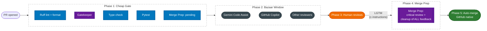

# academicOps

**Core value**: You can delegate execution to AI without delegating judgment. academicOps is the structural guarantee that academic integrity obligations are enforced at the right moments — even when the human isn't paying attention. The framework compensates for human non-meticulousness through structural enforcement.

A constitutional framework for governing autonomous AI agents with:

1. **_Ultra vires_ detection** ensures that agents operate within zones of autonomy bounded by their grant of authority — using public law theory to identify when discretionary choices become invalid.

2. **A constitutional hierarchy of norms** (axioms → heuristics → enforcement rules) requires every operational rule to derive from a first principle, preventing governance bloat through the same derivation logic that constrains delegated legislation.

3. **Commons-based peer review** applies the **bazaar** model of F/OSS peer production to AI governance. Instead of ex-ante rules, we encourage experimentation and collaborative work. Agents review each other's work through structured PR pipelines, the way open source maintainers govern contributions from autonomous participants at scale.

4. **Reflective continuous improvement** through structured session summaries and explicit transcript analysis means recurring friction gets named, codified, and promoted or demoted based on evidence — and rules evolve incrementally like common law.

5. **Domain-specific academic tools** — citation management (Zotero), research data analysis (dbt, Streamlit), document conversion, email triage, writing style enforcement.

## The distributed review pipeline


```mermaid
flowchart LR
    PR([PR opened]) --> CQ

    subgraph CQ [Phase 1: Cheap Gate]
        Lint[Ruff lint + format]
        Gate[[Gatekeeper]]
        Types[Type check]
        Tests[Pytest]
        MPGate[Merge Prep: pending]
    end

    CQ --> Bazaar

    subgraph Bazaar [Phase 2: Bazaar Window]
        direction TB
        Gemini([Gemini Code Assist])
        Copilot([GitHub Copilot])
        Others([Other reviewers])
    end

    Bazaar --> Human([Phase 3: Human reviews])

    Human -- "LGTM<br/>(± instructions)" --> Cron

    subgraph Cron [Phase 4: Merge Prep]
        MP[[Merge Prep:<br/>critical review +<br/>cleanup of ALL feedback]]
    end

    Cron --> AutoMerge([Phase 5: Auto-merge<br/>GitHub native])

    classDef agent fill:#6a1b9a,stroke:#4a148c,stroke-width:2px,color:#fff
    classDef action fill:#0277bd,stroke:#01579b,stroke-width:2px,color:#fff
    classDef human fill:#ef6c00,stroke:#e65100,stroke-width:2px,color:#fff
    classDef success fill:#2e7d32,stroke:#1b5e20,stroke-width:2px,color:#fff
    classDef bazaar fill:#37474f,stroke:#263238,stroke-width:1px,color:#fff

    class Gate,MP agent
    class Lint,Types,Tests,MPGate action
    class Human human
    class AutoMerge success
    class Gemini,Copilot,Others bazaar

    style CQ fill:none,stroke:#888,stroke-dasharray: 5 5
    style Bazaar fill:none,stroke:#888,stroke-dasharray: 5 5
    style Cron fill:none,stroke:#888,stroke-dasharray: 5 5
```

- **Bazaar model**: all external reviews (Gemini, Copilot, humans) are embraced as first-class feedback. The pipeline gets maximum value from them without being reliant on them.
- **Cheap checks run on every push** (lint, typecheck, tests, gatekeeper). Expensive LLM review runs once, at the right time.
- **One human action**: the human says "lgtm" (optionally with specific instructions like "fix the docstring on line 42"). Merge Prep handles the rest — no second approval needed.
- **Cron-based merge-prep** (every 15 min) eliminates bot cascade loops. A 30-minute bazaar window gives external reviewers time to contribute before merge-prep processes all feedback.
- **GitHub-native enforcement**: required status checks (Lint, Gatekeeper, Type Check, Pytest, Merge Prep) and required reviews (1 human) handle merge gating. No custom state machines.
- Full process documentation: [`specs/pr-process.md`](specs/pr-process.md).

## Local session lifecycle

Every mutating operation passes through gates: active task binding (work must belong to an epic), hydrated execution plan (intent verification via workflow selection), periodic compliance audits (drift detection). Sessions end with structured reflection.

## Hierarchy of norms

| Level | Document               | Role                               | Analogy                   |
| ----- | ---------------------- | ---------------------------------- | ------------------------- |
| 1     | **AXIOMS.md**          | Inviolable principles (30+)        | Constitutional provisions |
| 2     | **HEURISTICS.md**      | Evidence-based working rules (40+) | Common law doctrine       |
| 3     | **enforcement-map.md** | Rule-to-mechanism mapping          | Regulatory implementation |

Axioms are inviolable: "Fail-Fast" means no defaults, no silent failures; "Research Data Is Immutable" means source datasets are sacred. Heuristics are working hypotheses that evolve through use — "Subagent Verdicts Are Binding" emerged after an agent ignored a compliance finding and introduced scope drift. New rules must derive from existing axioms; if they can't, either the rule is wrong or the axiom set is incomplete.

## Graduated enforcement

| Level              | Mechanism        | Example                                 |
| ------------------ | ---------------- | --------------------------------------- |
| **Hard gate**      | Blocks action    | Task binding for destructive ops        |
| **Soft gate**      | Injects guidance | Hydrator suggests workflows             |
| **Periodic audit** | Every ~15 ops    | Custodiet detects drift                 |
| **Pre-commit**     | Blocks commits   | Orphan files, frontmatter validation    |
| **Prompt-level**   | JIT injection    | Relevant principles surfaced in context |

## Feedback loop

The framework treats itself as a hypothesis under continuous test. Every session generates structured reflections and compliance data. Recurring friction gets named as doctrine. The `/learn` skill captures failures as structured knowledge, with fixes applied at the lowest effective level.

## Memory architecture

| Type         | Storage                 | Example              |
| ------------ | ----------------------- | -------------------- |
| **Semantic** | `$ACA_DATA` markdown    | Timeless knowledge   |
| **Episodic** | Task graph + git issues | Session observations |

`$ACA_DATA` is a current state machine. Human-readable markdown in git, with a memory server providing semantic search over vector embeddings.

## How work is organised

The framework uses a strict taxonomy (see [`TAXONOMY.md`](aops-core/TAXONOMY.md) for full definitions):

```
GOAL  →  PROJECT  →  EPIC  →  TASK  →  ACTION
```

**Goals** are multi-month desired outcomes. **Projects** are coherent bodies of work toward a goal. **Epics** are the basic unit of verifiable work — PR-sized, including planning, execution, and verification tasks. A failure at any step fails the entire epic. **Tasks** are single-session deliverables within an epic. Every task belongs to an epic; no orphans.

The orchestration layer is separate from the work hierarchy:

```
WORKFLOW  →  STEP  →  SKILL  →  PROCEDURE
```

**Workflows** are integrity obligation profiles — they define what academic integrity obligations apply to a type of work, but do not mandate a strict sequence for the steps involved. Workflow selection calibrates verification level to stakes: reversibility, audience, downstream use, and novelty determine which obligations apply. Workflows are the Bazaar's quality guarantee. **Skills** define HOW to execute a single step. Skills are **fungible**: you could swap the Outlook skill for the Gmail skill to satisfy "check email" and the workflow wouldn't change. **Procedures** are skill-internal instructions (stored in `skills/*/procedures/`, not `workflows/`).

**Overlays** are obligations that must be satisfied — they do not mandate sequence. Only logical dependencies constrain when an obligation must be fulfilled. The Bazaar model supports creative reordering: post-publication peer review is as valid as pre-submission review; the traditional linear academic production sequence is one path, not the only one.

## Agent architecture

| Agent                 | Role                                                                 |
| --------------------- | -------------------------------------------------------------------- |
| **prompt-hydrator**   | Enriches prompts with context, selects workflows, applies guardrails |
| **custodiet**         | Live compliance audits — drift, violations, scope creep              |
| **critic**            | Reviews execution plans for errors and hidden assumptions            |
| **qa**                | Independent verification against acceptance criteria                 |
| **effectual-planner** | Strategic planning under genuine uncertainty                         |

## Two-layer architecture

The framework has two layers with fundamentally different design principles:

| Layer                             | Examples                                                                        | Design principle                                                   |
| --------------------------------- | ------------------------------------------------------------------------------- | ------------------------------------------------------------------ |
| **Core epistemic infrastructure** | Planning/task graph, memory (PKB), calibrated QA, traceability, reflection loop | Non-fungible. Maintain deeply. Evolve carefully based on evidence. |
| **Domain skills**                 | Email, Streamlit, PDF, reference letters, student supervision                   | Fungible. Design thin. Retire when external tools catch up.        |

Domain skills exist only because no better external solution exists _yet_. The framework should be designed to shrink gracefully — when a better tool appears, drop the internal skill. Less maintenance is better, not worse.

## Skills and commands

Two packages. **aops-core** is the non-fungible epistemic infrastructure — 23 skills covering planning, memory, QA, traceability, and reflection. **aops-tools** is the fungible domain layer — 6 academic tools designed to be retired when better external alternatives appear.

**aops-core** (core epistemic infrastructure):

|                      |                                                         |
| -------------------- | ------------------------------------------------------- |
| `/strategy`          | Strategic thinking under uncertainty                    |
| `/planning`          | Epic decomposition and information-value prioritisation |
| `/qa`                | Calibrated verification against acceptance criteria     |
| `/swarm-supervisor`  | Parallel worker orchestration with isolated worktrees   |
| `/hdr`               | Higher degree research supervision workflows            |
| `/remember`          | Dual-write to markdown + memory server                  |
| `/learn`             | Capture failures as structured knowledge                |
| `/pull` `/q` `/dump` | Task queue lifecycle                                    |

**aops-tools** (fungible domain skills — install separately, retire freely):

|                  |                                                |
| ---------------- | ---------------------------------------------- |
| `/analyst`       | Research data analysis (dbt, Streamlit, stats) |
| `/pdf`           | PDF generation with academic typography        |
| `/convert-to-md` | Batch DOCX/PDF/XLSX → markdown conversion      |
| `/excalidraw`    | Hand-drawn diagrams                            |
| `/flowchart`     | Mermaid flowchart generation                   |
| `/extract`       | General extraction and ingestion routing       |

## Installation

Distribution repository: https://github.com/nicsuzor/aops-dist

Set the data directory environment variable in `~/.bashrc` or `~/.zshrc`:

```bash
export ACA_DATA="$HOME/brain"     # Your knowledge base (NOT in this repo)
```

**Claude Code** — install core infrastructure (required) plus domain tools (optional):

```bash
# Core (required)
command claude plugin marketplace add nicsuzor/aops-dist

# Domain tools (optional — fungible, retire when better tools exist)
# Claude Code supports multiple simultaneous plugins; install alongside aops-core
# command claude plugin marketplace add nicsuzor/aops-dist  # (aops-tools package)
```

**Gemini CLI** — both packages install from aops-dist:

```bash
# Core (required)
(command gemini extensions uninstall aops-core || echo not installed) && \
  command gemini extensions install git@github.com:nicsuzor/aops-dist.git --consent --auto-update --pre-release

# Domain tools (optional)
(command gemini extensions uninstall aops-tools || echo not installed) && \
  command gemini extensions install git@github.com:nicsuzor/aops-dist.git#aops-tools --consent --auto-update --pre-release
```

## Development setup

```bash
git clone git@github.com:nicsuzor/academicOps.git && cd academicOps
uv sync                    # install dependencies
make install-hooks         # activate pre-commit hooks
```

Or use `make install-dev` to build, install the plugin locally, and activate hooks in one step.

> **Note**: `scripts/build.py` auto-creates git tags (`vX.X.X`, `latest`) as a side effect. After test builds, clean them up: `git tag -d vX.X.X latest`.

## Project configuration

Projects customise the framework by adding files to a `.agent/` directory:

- **`.agent/rules/`** — Project-specific rules loaded automatically as binding constraints
- **`.agent/workflows/`** — Project-specific workflows supplementing the global workflow index
- **`.agent/context-map.json`** — Maps project documentation to topics for just-in-time context injection
