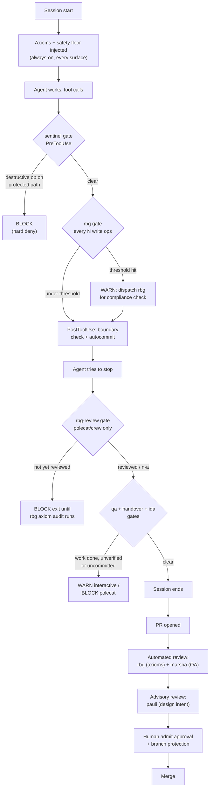

# academicOps

**Core value**: You can delegate execution to AI without delegating judgment. academicOps provides the structural guarantees that academic integrity is maintained — even when the human isn't paying close attention.

An automation framework for academic work, built as a Claude Code plugin.

## How it works

```
                    ┌─────────────────────────────────┐
                    │         YOUR NORMAL WORK         │
                    │  research · writing · teaching   │
                    └──────────────┬──────────────────┘
                                   │
          ┌────────────────────────┼────────────────────────┐
          │                        │                        │
┌─────────▼─────────┐   ┌─────────▼─────────┐   ┌─────────▼─────────┐
│    TASK SYSTEM     │   │      SKILLS        │   │   SESSION HOOKS   │
│                    │   │                    │   │                    │
│  capture ideas     │   │  /daily   /aops    │   │  load context     │
│  track work        │   │  /plan    /learn   │   │  autocommit       │
│  search context    │   │  /qa      /email   │   │  sync state       │
│  connect knowledge │   │  /pull    /sleep   │   │  capture session  │
│                    │   │  + domain skills   │   │                    │
└─────────┬──────────┘   └─────────┬──────────┘   └─────────┬──────────┘
          │                        │                        │
          └────────────────────────┼────────────────────────┘
                                   │
                                   ▼
                      ┌────────────────────────┐
                      │    LEARN AS YOU GO      │
                      │                        │
                      │  notice friction  ───► /learn
                      │  file findings   ───► PKB task
                      │  fix instructions ───► better next time
                      │                        │
                      └────────────┬───────────┘
                                   │
                      ┌────────────▼───────────┐
                      │   ASYNC QUALITY (GitHub) │
                      │                        │
                      │  PR ► lint ► review     │
                      │  ► merge prep ► human   │
                      │  approval ► merge       │
                      └────────────────────────┘
```

The framework improves as a side-effect of doing normal work. When agents hit friction, they file it via `/learn`. Findings become tasks. Tasks get prioritised. Instructions get better. The system compounds.

## Five parts

Strip away the tooling and academicOps reduces to five things, each holding up the one after it.

### 1. PKB — task and knowledge server

A hierarchical task graph with semantic search, served by a Rust MCP server (`pkb-search`). Everything flows through it: task capture, knowledge storage, memory, context recovery.

Tasks are markdown files under `data/tasks/` in your knowledge base (`$ACA_DATA`): `inbox/` → `active/` → `completed/` → `archived/`.

```
PROJECT  →  EPIC  →  TASK  →  ACTION
```

Goals link to projects via the `goals: []` metadata field (many-to-many), not the tree hierarchy.

| Type          | Storage                             | Purpose                              |
| ------------- | ----------------------------------- | ------------------------------------ |
| **Knowledge** | `$ACA_DATA` markdown + vector index | Searchable knowledge base            |
| **Tasks**     | PKB task graph                      | Work tracking with dependencies      |
| **Memory**    | PKB memories                        | Generalizable patterns and learnings |

`$ACA_DATA` is the personal knowledge base — human-readable markdown in git, with the PKB server providing semantic search over vector embeddings.

### 2. Axioms — rules that must never be breached

A small, fixed set of universal rules bind every agent, on every surface, with no ad-hoc exceptions: `halt-on-failure`, `honest-epistemics`, `data-boundaries`, `evidence-immutable`, `full-observability`, and a dozen more — each targeting a _class_ of failure, never a single instance. The full set, with the reasoning behind each, is the actual law: [`.agents/rules/AXIOMS.md`](.agents/rules/AXIOMS.md).

Axioms describe what must never happen. They don't enforce themselves — that's part 3.

### 3. Enforcement — hooks, gates, and your own rules

Enforcement is graduated: start with an instruction, escalate only when evidence shows the lower tier failing (Design Principle #6), across a cost ladder from a written rule up to human PR approval. Session hooks make every session framework-aware:

- **SessionStart**: loads principles, pulls latest state
- **PreToolUse gates**: hydration, rbg (periodic compliance), destructive-command block
- **PostToolUse**: boundary detection, warn-tier checks, autocommit
- **Stop gates**: QA and handover discipline before a session ends
- **Transcript capture**: every session recorded for reflection

The gates riding those hooks:

| Gate         | What it catches                                           | Default                                                   |
| ------------ | --------------------------------------------------------- | --------------------------------------------------------- |
| `sentinel`   | Destructive ops on protected env paths                    | `block`                                                   |
| `rbg`        | Scope drift / compliance, every N write ops               | `warn`                                                    |
| `rbg-review` | Final axiom audit before a task-bound session exits       | `block` (polecat/crew only; inert for ad hoc interactive) |
| `qa`         | Claiming "done" without running verification              | `warn`                                                    |
| `handover`   | Exiting without committing, updating tasks, or reflecting | `warn` interactive / `block` polecat                      |
| `ida`        | Honesty / criterion-substitution check before stopping    | `warn`                                                    |

(`hydration` is reserved in the config schema but not yet a real gate — its routing-hint injection runs unconditionally.) See [Configuration](#configuration) below for how to change a gate's mode for your own sessions.

**How an action gets enforced, end to end:**


```mermaid
flowchart TD
    A[Session start] --> B["Axioms + safety floor injected\n(always-on, every surface)"]
    B --> C[Agent works: tool calls]
    C --> D{sentinel gate\nPreToolUse}
    D -- destructive op on\nprotected path --> DB["BLOCK\n(hard deny)"]
    D -- clear --> E{rbg gate\nevery N write ops}
    E -- threshold hit --> EW["WARN: dispatch rbg\nfor compliance check"]
    E -- under threshold --> F[PostToolUse: boundary\ncheck + autocommit]
    EW --> F
    F --> G[Agent tries to stop]
    G --> H{rbg-review gate\npolecat/crew only}
    H -- not yet reviewed --> HB["BLOCK exit until\nrbg axiom audit runs"]
    H -- reviewed / n-a --> I{qa + handover + ida\ngates}
    I -- work done, unverified\nor uncommitted --> IW["WARN interactive /\nBLOCK polecat"]
    I -- clear --> J[Session ends]
    J --> K[PR opened]
    K --> L["Automated review:\nrbg (axioms) + marsha (QA)"]
    L --> M["Advisory review:\npauli (design intent)"]
    M --> N["Human admit approval\n+ branch protection"]
    N --> O[Merge]
```

Three postures do the work: **hard blocks** (`sentinel`, `rbg-review` on task-bound sessions) stop the action outright; **advisory warns** (`rbg`, `qa`, `handover`, `ida`, `pauli`) inject a reminder or reopen a review path but let the agent proceed; **post-hoc audit** (PR-time `rbg`/`marsha`, human admit) catches anything that slipped through before merge. Rules themselves live in `.agents/rules/` (project) and `.agents/rules/AXIOMS.md` (framework) — axioms are always enforced, everything else escalates only when a lighter mechanism is shown to fail (Design Principle #6).

The same ladder continues past the session, into GitHub:

```
PR opened → lint + typecheck + tests → agent review → merge prep → human approval → merge
```

And it isn't limited to the framework's own axioms — a project extends it under its own `.agents/` directory:

- **`.agents/rules/`** — project-specific rules loaded as binding constraints
- **`.agents/workflows/`** — project-specific workflows supplementing the global index
- **`.agents/INDEX.md`** — plain-text index of project documentation, to aid discovery

For the full gate catalogue (state machines, triggers, debugging), see [`specs/enforcement/GATES.md`](specs/enforcement/GATES.md). For the rule → mechanism → trigger register across every surface, see [`specs/ENFORCEMENT-MAP.md`](specs/ENFORCEMENT-MAP.md).

### 4. Polecat — work dispatch

Polecat spins up ephemeral, containerized agents against a specific PKB task — the mechanism behind `/dispatch`, `/pull`, and autonomous background workers. Before a container starts, the polecat launcher resolves gate posture for that session type — `run_defaults` for autonomous workers, `crew_defaults` for interactive crews — from `$AOPS_SESSIONS/polecat.yaml` (schema: [`polecat/defaults/polecat.yaml.example`](polecat/defaults/polecat.yaml.example)) and stages it into the container; direct CLI sessions skip this and use the plugin's built-in gate defaults instead.

Polecat ships as a console-script entry point in this package — see [`INSTALL.md`](INSTALL.md#polecat-installation) to install it.

### 5. Full observability — recorded, end to end

Every material action — file edits, tool calls, gate verdicts, subagent dispatches — leaves a trace an auditor can read: session transcripts, hooks JSONL logs, git commits, PRs. Nothing counts as done unless a third party could reconstruct the path from input to output. This is the `full-observability` axiom, held up by the same enforcement mechanisms as everything else in this list — not a bolt-on feature.

## Skills (how work gets done)

Skills are Claude Code extensions that know how to do specific things, split into two groups because a researcher installing this plugin mostly needs the first for their own work, while the second runs the framework's own self-improvement loop.

> **Plugin split:** `/q`, `/pull`, `/dispatch`, `/remember`, `/verify`, `/strategic-review`, `/learn`, and `/maintain` now ship in the separate `aops-pkb` plugin (the task/work-unit module — dispatch-readiness and acceptance judgment), not `aops-core`. Install both `aops-core` and `aops-pkb` to get the full command set below.

**User-facing core** (the commands a researcher actually reaches for in their own work):

| Skill          | Purpose                                                         |
| -------------- | --------------------------------------------------------------- |
| `/daily`       | Daily notes, briefing, progress sync                            |
| `/dump`        | Emergency session bail — fast handover, no commit/PR/reflection |
| `/end-session` | Canonical session close — commit, push, PR, handover            |
| `/plan` `/q`   | Effectual planning, decomposition, and task capture             |
| `/project`     | Scaffold a research project repo with smart defaults            |
| `/remember`    | Persist knowledge to PKB                                        |
| `/pull`        | Claim the next queued task and run it inline                    |

**Framework governance** (installed, but not marketed as researcher-facing daily tools — governs the framework's own quality and development process):

| Skill               | Purpose                                                                              |
| ------------------- | ------------------------------------------------------------------------------------ |
| `/aops`             | Institutional memory, framework coordination                                         |
| `/craft`            | Reviews instructions for shallow-execution defects before deployment                 |
| `/design-rubric`    | Designs fitness criteria on the spec, before user-facing work is built               |
| `/dogfood`          | Delegated instruction testing — commissions contextless execution, observes friction |
| `/strategic-review` | Multi-agent adversarial review of a document, plan, or pull request                  |
| `/supervisor`       | Delegate-and-verify supervision loop, from a single epic to a portfolio release      |
| `/triage`           | Corpus triage — retro (transcripts), trend (longitudinal), sweep (issue triage)      |
| `/verify`           | Judgment-based QA against the spec's fitness rubric                                  |

**Domain skills** (fungible — retire when better external tools exist):

| Skill      | Purpose                                            |
| ---------- | -------------------------------------------------- |
| `/analyst` | Research data analysis (dbt, Streamlit)            |
| `/pdf`     | PDF generation with academic typography            |
| `/extract` | General extraction and ingestion (incl. doc-to-md) |
| `/diagram` | Diagrams — Mermaid or Excalidraw (`style` param)   |

## Design principles

1. **Qualitative over quantitative** — evaluate fitness-for-purpose, not compliance with templates
2. **Delegate agency** — specify WHAT and WHY, not HOW
3. **Fail-fast** — no defaults, no silent failures
4. **Minimal** — fight bloat. A working simple system beats an elegant complex one
5. **Components earn their keep** — assessed against: used voluntarily? reduces friction? agents understand it? survives neglect?
6. **Graduated enforcement** — start with instructions, escalate only when evidence shows lower levels failing
7. **Anti-bloat** — before creating anything new, check if an existing thing already does it. Two okay things are worse than one good thing.
8. **Don't over-fit to one incident** — the evidence base for a framework change is _recurrence_, not the salience of the most recent failure. `/learn` files the forensic facts of an incident; a separate, detached pass (`/issue-sweep`) later weighs accumulated reports and decides whether a rule change is warranted. A single salient incident shouldn't drive a framework change that doesn't generalise.

## Installation

Distribution repository: https://github.com/nicsuzor/academicOps

**Requirements**:

- [Claude Code](https://docs.anthropic.com/en/docs/agents-and-tools/claude-code/overview)
- GitHub CLI (`gh`) for artifact retrieval
- Docker (optional, for sandboxing/testing)

**Quick Install** (`@dist` pins the published distribution branch):

```bash
command claude plugin marketplace add nicsuzor/academicOps@dist
```

### Cowork

Cowork runs **two plugins**: `aops-core` supplies the shared hook stack, agents,
and core skills; `aops-cowork` is a thin **additive, skills-only** layer on top
(the `cowork-sync` PKB↔native-task-list mirror and the Cowork variants of shared
skills). `aops-cowork` ships **no hooks of its own** — installing aops-core into
Cowork from the `nicsuzor/aops` main `dist` marketplace makes Cowork fire the
standard aops-core hooks, so a single shared hook stack serves both Claude Code
and Cowork (empirically confirmed; see `mem-fe29111a` / task `aops-04075740`).

```bash
# 1. aops-core — the shared hook stack + core skills/agents, from the main dist channel.
claude plugin marketplace add nicsuzor/academicOps@dist
claude plugin install aops-core@academicOps

# 2. aops-cowork — the additive, hooks-free Cowork layer. For LOCAL dev it ships
#    in its own isolated marketplace as `aops-coworklocal` so it never clobbers a
#    published install (see `make install-cowork`); the published plugin is
#    `aops-cowork`. Cowork nukes github-source marketplaces on restart, so the
#    local path uses a local-directory marketplace / manual zip upload.
make install-cowork        # local dev: builds + installs aops-coworklocal
# or upload dist/aops-coworklocal-latest.zip through the Cowork UI.
```

> Install aops-core **first** so Cowork picks up the hook stack; aops-cowork then
> only adds Cowork-specific skills. Because aops-cowork bundles no hooks, the
> lifecycle hooks fire exactly once (from aops-core) — no duplication.

## Configuration

The framework works out of the box after installation. Sensible defaults apply — all quality gates warn (agents see reminders without being blocked) and project repos are auto-discovered by convention.

### Environment variables

Set these in your shell profile (`~/.zshenv`, `~/.bashrc`, or equivalent):

| Variable              | Purpose                                                | Default                         |
| --------------------- | ------------------------------------------------------ | ------------------------------- |
| `ACA_DATA`            | Your personal knowledge base root                      | Required (no default)           |
| `AOPS_SESSIONS`       | Sessions repo (holds `polecat.yaml` registry)          | `$POLECAT_HOME/sessions`        |
| `AOPS_SRC_DIR`        | Default search root for project repos                  | `~/src`                         |
| `PKB_MCP_URL`         | Endpoint for the PKB MCP server                        | (local stdio fallback)          |
| `AOPS_POLECAT_CONFIG` | Explicit path to `polecat.yaml` (skips env resolution) | (resolved via `$AOPS_SESSIONS`) |

The project registry lives in `$AOPS_SESSIONS/polecat.yaml`. Path resolution is convention-based (`$AOPS_SRC_DIR/<repo>`); for off-convention repos, add a `paths:` entry to `$POLECAT_HOME/local.yaml`:

```yaml
# $POLECAT_HOME/local.yaml
paths:
  brain: ${ACA_DATA}
  myproject: /opt/work/myproject
```

### Gates (quality checks)

Gates are the runtime quality checks introduced in [Five parts → Enforcement](#3-enforcement--hooks-gates-and-your-own-rules) above. Each gate runs in one of three modes: **`warn`** (reminds the agent but doesn't block), **`block`** (stops the agent until the condition is met), or **`off`** (disabled). This section covers how to change a gate's mode for your own sessions.

#### How to configure gates

There are three ways to configure gates, depending on how you run your sessions:

**1. `polecat.yaml`** — for polecat-managed sessions (autonomous workers and crew). This is the primary configuration file:

```yaml
# $AOPS_SESSIONS/polecat.yaml
session_defaults:
  gates:
    handover: warn      # warn | block | off
    qa: warn
    rbg: warn
    ida: warn
    hydration: off
    rbg_threshold: 50   # write ops between rbg checks

# Override per session type
run_defaults:             # autonomous polecat workers
  gates:
    handover: block       # workers must hand over before exiting
    rbg: block
    rbg_threshold: 30

crew_defaults: {}         # interactive crew sessions (inherits session_defaults)
```

See [`polecat/defaults/polecat.yaml.example`](polecat/defaults/polecat.yaml.example) for the full schema.

**2. Environment variables** — for direct CLI sessions (Claude Code on your machine). The plugin's built-in defaults apply automatically; override individual gates by setting environment variables in your shell:

```bash
export HANDOVER_GATE_MODE=off       # skip handover for quick interactive chats
export RBG_GATE_MODE=block          # stricter compliance checking
```

The full list: `HANDOVER_GATE_MODE`, `QA_GATE_MODE`, `RBG_GATE_MODE`, `IDA_GATE_MODE`, `HYDRATION_GATE_MODE`, `RBG_TOOL_CALL_THRESHOLD`.

3. Per-directory overrides - to change gate behaviour for a specific project, set the environment variables in your shell environment. Note: on Mac/WSL host, environment variables set in CLI settings env blocks do not reliably reach the hooks. See [`specs/enforcement/GATES.md`](specs/enforcement/GATES.md) for technical details.

For the detailed gate reference (state machines, triggers, debugging), see [`specs/enforcement/GATES.md`](specs/enforcement/GATES.md).
