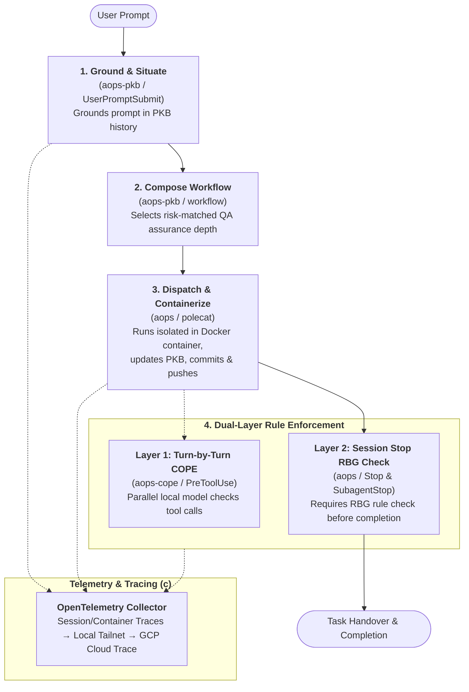

# academicOps

You can delegate execution to AI without delegating judgment.

academicOps is a streamlined suite of six plugins for Claude Code and Antigravity built around **4 core pillars** and **session telemetry**:

1. **Prompt Situation (`aops-pkb`):** Intercepts incoming prompts and grounds them in strategic history from the PKB.
2. **Workflow Composition (`aops-pkb`):** Selects appropriate risk-matched review and QA assurance levels for the task.
3. **Containerized Execution & Dispatch (`aops`):** Dispatches tasks to safe, isolated Docker containers (`polecat`), writing results back to the PKB task record, committing changes, and pushing.
4. **Dual-Layer Rule Enforcement (`aops-cope` + `aops`):** Runs a turn-by-turn local model evaluator on tool calls, plus a session-stop gate requiring agents to verify RBG rule compliance (`axioms/` + project + local rules) before task completion.

---

## How It Works


```mermaid
flowchart TD
    U([User Prompt]) --> P1["<b>1. Ground & Situate</b><br/>(aops-pkb / UserPromptSubmit)<br/>Grounds prompt in PKB history"]
    P1 --> P2["<b>2. Compose Workflow</b><br/>(aops-pkb / workflow)<br/>Selects risk-matched QA assurance depth"]
    P2 --> P3["<b>3. Dispatch & Containerize</b><br/>(aops / polecat)<br/>Runs isolated in Docker container,<br/>updates PKB, commits & pushes"]
    
    subgraph Enforcement["<b>4. Dual-Layer Rule Enforcement</b>"]
        E1["<b>Layer 1: Turn-by-Turn COPE</b><br/>(aops-cope / PreToolUse)<br/>Parallel local model checks tool calls"]
        E2["<b>Layer 2: Session Stop RBG Check</b><br/>(aops / Stop & SubagentStop)<br/>Requires RBG rule check before completion"]
    end

    P3 -.-> E1
    P3 --> E2
    E2 --> F([Task Handover & Completion])

    subgraph Tracing["<b>Telemetry & Tracing (c)</b>"]
        OTEL["<b>OpenTelemetry Collector</b><br/>Session/Container Traces → Local Tailnet → GCP Cloud Trace"]
    end

    P1 -.-> OTEL
    P3 -.-> OTEL
    Enforcement -.-> OTEL
```

---

## Master Hook Lifecycle Matrix

Every hook across the plugins is deterministic, lightweight, and single-purpose. The table below details when each hook fires, which plugin owns it, what context it requires, what payload it injects, and **WHY** it exists:

| Plugin      | Canonical Event         | Target Client            | Required Context / Env                        | Injected Payload / Action                                                                                                                             | WHY (Purpose & Rationale)                                                                                                       |
| :---------- | :---------------------- | :----------------------- | :-------------------------------------------- | :---------------------------------------------------------------------------------------------------------------------------------------------------- | :------------------------------------------------------------------------------------------------------------------------------ |
| `aops-pkb`  | `UserPromptSubmit`      | Both (Claude Code & AGY) | `PKB_MCP_URL`                                 | Strategic context search instructions & relevant PKB history.                                                                                         | **Pillar 1 (Situation):** Ground every user prompt in historical knowledge and prior decisions before acting.                   |
| `aops-cope` | `PreToolUse`            | Claude Code              | `COPE_EVALUATOR_*` (Local Reflexes LLM model) | Parallel rule compliance advisory with matched rule text & reasoning.                                                                                 | **Pillar 4 (Enforcement L1):** Non-blocking, turn-by-turn evaluation of tool calls against active rules via a fast local model. |
| `aops-cope` | `UserPromptSubmit`      | AGY (`PreInvocation`)    | Live rule set files                           | Summary roster of active rules for the turn.                                                                                                          | Provides rule visibility on surfaces that lack tool-call interception.                                                          |
| `aops`      | `SessionStart`          | Claude Code              | `POLECAT_*`, `OTEL_*`                         | 3-line session environment summary & credential isolation status.                                                                                     | Validates runtime isolation and telemetry bindings before execution begins.                                                     |
| `aops`      | `Stop` / `SubagentStop` | Both                     | `stop_hook_active` check                      | Mandatory prompt requiring agent to invoke RBG rule checker (`axioms` + project + local rules) and present checkable evidence before task completion. | **Pillar 4 (Enforcement L2):** Prevents task handoff/release without explicit evidence and rule compliance verification.        |
| `aops`      | `PreToolUse`            | Claude Code              | `NONINTERACTIVE` or `CI=1`                    | Refusal message blocking interactive prompt tools in headless runs.                                                                                   | Prevents headless container sessions from hanging on unanswerable user prompts.                                                 |
| `aops-ts`   | `SessionStart`          | Claude Code              | `CLAUDE_CODE_REMOTE=true`, `TS_AUTHKEY`       | Launches background `tailscale up` for remote connectivity.                                                                                           | Enables remote session access over Tailnet.                                                                                     |
| `aops-ts`   | `SessionEnd`            | Claude Code              | `TS_SESSION_SYNC_HOST`                        | Transmits session log bundle to remote sync host.                                                                                                     | Secures session history after termination.                                                                                      |

---

## Telemetry & OTEL Tracing Architecture

academicOps uses Claude Code's native OpenTelemetry export forwarded through a local Tailnet server to GCP:

- **Local Collector Relay:** Session and Polecat container traces send OTLP spans to a local Tailnet OTLP collector endpoint (`OTEL_EXPORTER_OTLP_ENDPOINT`).
- **GCP Export:** The collector relays traces directly to GCP Cloud Trace (`cloudtrace.googleapis.com`) and Cloud Logging.
- **Contract Variables:**
  - `CLAUDE_CODE_ENABLE_TELEMETRY=true`
  - `OTEL_EXPORTER_OTLP_ENDPOINT=http://<tailnet-collector-ip>:4318`
  - `OTEL_EXPORTER_OTLP_PROTOCOL=http/protobuf`
  - `OTEL_RESOURCE_ATTRIBUTES=service.name=academicOps,service.version=0.6.0`

---

## The Plugins

Install what you need — plugins are separately installable and loosely coupled:

| Plugin       | Owns                                                                            |
| ------------ | ------------------------------------------------------------------------------- |
| `aops`       | james, marsha, rbg. Review, QA, verification, dispatch, polecat containers.     |
| `aops-pkb`   | pauli. Memory, effectual planning, workflow composition, PKB MCP client config. |
| `aops-ida`   | ida. The interactive face.                                                      |
| `aops-cope`  | Automatic in-session rule enforcement, via turn-by-turn `PreToolUse` hook.      |
| `aops-tools` | Domain research skills (analyst, peer-review, pdf, extract, diagram, etc.).     |
| `aops-ts`    | Tailscale bring-up for remote sessions.                                         |

---

## Install

```bash
claude plugin marketplace add nicsuzor/academicOps@dist
claude plugin install aops@academicOps
claude plugin install aops-ida@academicOps
claude plugin install aops-pkb@academicOps --config pkb_mcp_url=<your PKB MCP endpoint>
```

`aops-cope`, `aops-tools`, and `aops-ts` install the same way.

Requirements: Claude Code (or Antigravity), and Docker if you want polecat's containerised workers.

---

## Build and Test

```bash
git clone git@github.com:nicsuzor/academicOps.git && cd academicOps
uv sync

make build          # assemble dist/<plugin>-<client> for every plugin
make install-dev    # build, then install dist/ as the local 'aops' marketplace
make test           # uv run pytest tests/
make lint           # ruff check
make format         # ruff format + dprint fmt
make docker         # build the crew worker image
make clean          # remove dist/
```

`make help` lists every target.

---

## Repository Layout

```
lib/        Shared source, injected into plugins at build time. Never shipped as-is.
build/      The build system.
plugins/    Plugin sources. Only what a client loads.
specs/      Design intent.
tests/      Test suite.
.agents/    Rules for agents working on this repository.
```

[`specs/ARCHITECTURE.md`](specs/ARCHITECTURE.md) is authoritative for the layout, plugin boundaries, build stages, and constraints.
Contributing: [`CONTRIBUTING.md`](CONTRIBUTING.md).
