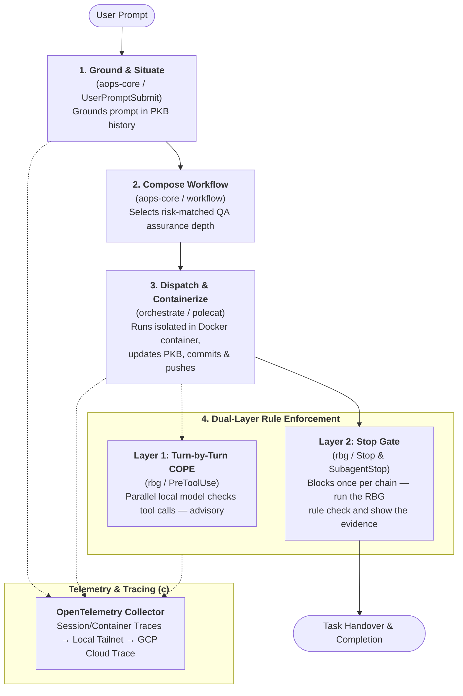

# academicOps

You can delegate execution to AI without delegating judgment.

academicOps is a streamlined suite of six plugins for Claude Code and Antigravity built around **4 core pillars** and **session telemetry**:

1. **Prompt Situation (`aops-core`):** Intercepts incoming prompts and grounds them in strategic history from the PKB.
2. **Workflow Composition (`aops-core`):** Selects appropriate risk-matched review and QA assurance levels for the task.
3. **Containerized Execution & Dispatch (`orchestrate`):** Dispatches tasks to safe, isolated Docker containers (`polecat`), writing results back to the PKB task record, committing changes, and pushing.
4. **Dual-Layer Rule Enforcement (`rbg`):** Runs a turn-by-turn local model evaluator on tool calls, advisory only; plus a stop gate that withholds the stop once per chain, directing the agent to verify RBG rule compliance (`axioms/` + project + local rules) and present checkable evidence before handing back.

## How It Works


```mermaid
flowchart TD
    U([User Prompt]) --> P1["<b>1. Ground & Situate</b><br/>(aops-core / UserPromptSubmit)<br/>Grounds prompt in PKB history"]
    P1 --> P2["<b>2. Compose Workflow</b><br/>(aops-core / workflow)<br/>Selects risk-matched QA assurance depth"]
    P2 --> P3["<b>3. Dispatch & Containerize</b><br/>(orchestrate / polecat)<br/>Runs isolated in Docker container,<br/>updates PKB, commits & pushes"]
    
    subgraph Enforcement["<b>4. Dual-Layer Rule Enforcement</b>"]
        E1["<b>Layer 1: Turn-by-Turn COPE</b><br/>(rbg / PreToolUse)<br/>Parallel local model checks tool calls — advisory"]
        E2["<b>Layer 2: Stop Gate</b><br/>(rbg / Stop & SubagentStop)<br/>Blocks once per chain — run the RBG<br/>rule check and show the evidence"]
    end

    P3 -.-> E1
    P3 --> E2
    E2 --> F([Task Handover & Completion])

    subgraph Tracing["<b>Telemetry & Tracing (c)</b>"]
        OTEL["<b>OpenTelemetry Collector</b><br/>Session/Container Traces → Local Tailnet → GCP Cloud Trace"]
    end

    P1 -.-> OTEL
    P3 -.-> OTEL
    Enforcement -.-> OTEL
```

## Master Hook Lifecycle Matrix

Every hook across the plugins is deterministic, lightweight, and single-purpose. The table below details when each hook fires, which plugin owns it, what context it requires, what payload it injects, and **WHY** it exists:

| Plugin        | Canonical Event         | Target Client            | Required Context / Env                         | Injected Payload / Action                                                                                                                                                                                                                                                                                            | WHY (Purpose & Rationale)                                                                                                                                        |
| :------------ | :---------------------- | :----------------------- | :--------------------------------------------- | :------------------------------------------------------------------------------------------------------------------------------------------------------------------------------------------------------------------------------------------------------------------------------------------------------------------- | :--------------------------------------------------------------------------------------------------------------------------------------------------------------- |
| `aops-core`   | `UserPromptSubmit`      | Both (Claude Code & AGY) | `PKB_MCP_URL`                                  | Strategic context search instructions & relevant PKB history.                                                                                                                                                                                                                                                        | **Pillar 1 (Situation):** Ground every user prompt in historical knowledge and prior decisions before acting.                                                    |
| `rbg`         | `PreToolUse`            | Claude Code              | `COPE_EVALUATOR_*` (Local Reflexes LLM model)  | Parallel rule compliance advisory with matched rule text & reasoning.                                                                                                                                                                                                                                                | **Pillar 4 (Enforcement L1):** Non-blocking, turn-by-turn evaluation of tool calls against active rules via a fast local model.                                  |
| `rbg`         | `UserPromptSubmit`      | AGY (`PreInvocation`)    | Live rule set files                            | Summary roster of active rules for the turn.                                                                                                                                                                                                                                                                         | Provides rule visibility on surfaces that lack tool-call interception.                                                                                           |
| `orchestrate` | `PostToolBatch`         | Claude Code              | none                                           | Non-blocking reminder carrying the handback doctrine: a subagent's report is second-hand, so expect proof with it and send back anything without proof. Emits nothing unless the batch contains an `Agent` call.                                                                                                     | Binds the **receiver** the instant a synchronous report lands. Verifying, re-running, or completing the work on the worker's behalf is never the receiver's job. |
| `orchestrate` | `Stop` / `SubagentStop` | Both                     | none                                           | Blocking reminder (`block`) carrying the same handback doctrine plus the worker-side register: name what you did not do, Observed vs Reported, "changed, unverified" until the originally-failing behaviour is observed passing. Fires blocking so the harness sets `stop_hook_active` to prevent repeat injections. | Binds the **worker** at its own stop — the last moment its report can still carry the evidence, since a returned result cannot be amended after it lands.        |
| `aops-core`   | `Stop`                  | Claude Code (ida face)   | none                                           | Advisory quiet gate: strip the reply down to load-bearing content before speaking to the person.                                                                                                                                                                                                                     | Face-scoped by its event. `SubagentStop` is deliberately not wired — it fires on a stopping subagent's own context, which sends no reply to the person.          |
| `rbg`         | `Stop` / `SubagentStop` | Both                     | `stop_hook_active` / `background_tasks` checks | Blocks once per stop-chain (`decision: "block"`), directing the agent to invoke the RBG rule checker (`axioms` + project + local rules) and present checkable evidence before stopping. Silent on the continuation stop and while background work runs. Advisory-only on AGY.                                        | **Pillar 4 (Enforcement L2):** Every turn ends with a rule-compliance review. The hook obliges the check; it never runs or grades it.                            |
| `ts`          | `SessionStart`          | Claude Code              | `CLAUDE_CODE_REMOTE=true`, `TS_AUTHKEY`        | Launches background `tailscale up` for remote connectivity.                                                                                                                                                                                                                                                          | Enables remote session access over Tailnet.                                                                                                                      |
| `ts`          | `SessionEnd`            | Claude Code              | `TS_SESSION_SYNC_HOST`                         | Transmits session log bundle to remote sync host.                                                                                                                                                                                                                                                                    | Secures session history after termination.                                                                                                                       |

## Telemetry & OTEL Tracing Architecture

academicOps uses Claude Code's native OpenTelemetry export forwarded through a local Tailnet server to GCP:

- **Local Collector Relay:** Session and Polecat container traces send OTLP spans to a local Tailnet OTLP collector endpoint (`OTEL_EXPORTER_OTLP_ENDPOINT`).
- **GCP Export:** The collector relays traces directly to GCP Cloud Trace (`cloudtrace.googleapis.com`) and Cloud Logging.
- **Contract Variables:**
  - `CLAUDE_CODE_ENABLE_TELEMETRY=true`
  - `OTEL_EXPORTER_OTLP_ENDPOINT=http://<tailnet-collector-ip>:4318`
  - `OTEL_EXPORTER_OTLP_PROTOCOL=http/protobuf`
  - `OTEL_RESOURCE_ATTRIBUTES=service.name=academicOps,service.version=<your installed version>`

## The Plugins

Install what you need — plugins are separately installable and loosely coupled:

| Plugin        | Owns                                                                                                                   |
| ------------- | ---------------------------------------------------------------------------------------------------------------------- |
| `aops-core`   | pauli. Memory, effectual planning, workflow composition, PKB MCP client config; ida, the interactive face.             |
| `orchestrate` | james, dispatch; marsha, QA; the review skills; the handback hooks; the polecat container launcher.                    |
| `rbg`         | Automatic in-session rule enforcement, via turn-by-turn `PreToolUse` hook and a `Stop`/`SubagentStop` rule-check gate. |
| `tools`       | Domain research skills (analyst, peer-review, pdf, extract, diagram, etc.).                                            |
| `ts`          | Tailscale bring-up for remote sessions.                                                                                |
| `aops-debug`  | Debug plugin that dumps raw hook payloads.                                                                             |

## Install

```bash
claude plugin marketplace add nicsuzor/academicOps@dist
claude plugin install aops-core@academicOps --config pkb_mcp_url=<your PKB MCP endpoint>
```

`orchestrate`, `rbg`, `tools`, `ts`, and `aops-debug` install the same way.

Requirements: Claude Code (or Antigravity), and Docker if you want polecat's containerised workers.

## Where work runs

When `orchestrate` dispatches a unit, it picks one of three surfaces by the size and cost of the work:

| Surface                  | When it is picked            | What it does                                                              |
| :----------------------- | :--------------------------- | :------------------------------------------------------------------------ |
| **In-session subagent**  | Small units                  | Runs in this session, cheapest model per effort type; commits and pushes. |
| **Isolated async agent** | Substantial, or has subtasks | Own branch or worktree; pushes before reclaim. No return path by design.  |
| **Polecat container**    | Cost-sensitive               | Docker container running `agy`, seeded with the task id, headless.        |

Asynchronous work writes its result to the task record and pushes its branch; nothing waits on it.

## Developing academicOps itself

Setup, checks, and the pull-request process are in [`CONTRIBUTING.md`](CONTRIBUTING.md).
[`specs/ARCHITECTURE.md`](specs/ARCHITECTURE.md) is authoritative for the repository layout, plugin boundaries, build stages, and the constraints on all of them.
