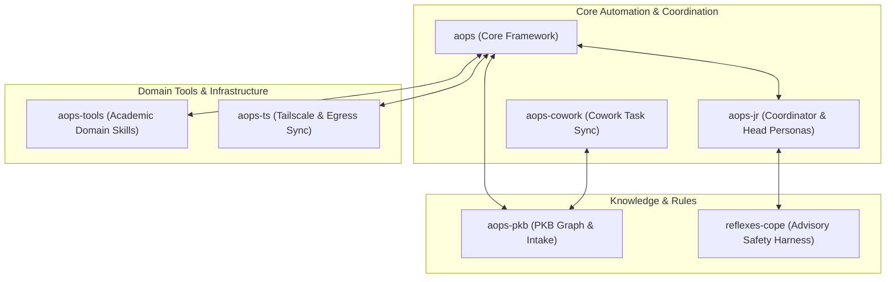

# academicOps

**Core value**: You can delegate execution to AI without delegating judgment. academicOps provides the structural guarantees that academic integrity is maintained — even when the human isn't paying close attention.

An automation framework for academic work, built as a suite of Claude Code and Antigravity plugins.

## Architecture & Plugin Overview

academicOps is structured as seven modular plugins. Each plugin owns a distinct domain, has its own `README.md` with interactive control-flow flowcharts, and exposes customisation surfaces (`userConfig` and environment variables).


```mermaid
flowchart TD
    subgraph Core ["Core Automation & Coordination"]
        AOPS["aops (Core Framework)"]
        JR["aops-jr (Coordinator & Head Personas)"]
        COWORK["aops-cowork (Cowork Task Sync)"]
    end

    subgraph Knowledge ["Knowledge & Rules"]
        PKB["aops-pkb (PKB Graph & Intake)"]
        COPE["reflexes-cope (Advisory Safety Harness)"]
    end

    subgraph Extensions ["Domain Tools & Infrastructure"]
        TOOLS["aops-tools (Academic Domain Skills)"]
        TS["aops-ts (Tailscale & Egress Sync)"]
    end

    AOPS <--> PKB
    AOPS <--> JR
    AOPS <--> TOOLS
    JR <--> COPE
    COWORK <--> PKB
    AOPS <--> TS
```

### Plugin Index

| Plugin | Core Function | Documentation & Flowchart |
| :--- | :--- | :--- |
| [`aops`](aops/) | Core framework: session hooks (`router.py`), Polecat runtime (`cli.py`), core skills (`/pull`, `/dispatch`, `/verify`, `/handover`). | [aops/README.md](aops/README.md) |
| [`aops-cowork`](aops-cowork/) | Cowork harness task list synchronization and PKB reconciliation. | [aops-cowork/README.md](aops-cowork/README.md) |
| [`aops-jr`](aops-jr/) | Coordinator charters (`ida`, `junior`), gate dispatcher, and face-discipline hooks. | [aops-jr/README.md](aops-jr/README.md) |
| [`aops-pkb`](aops-pkb/) | Personal Knowledge Base task intake (`hydrate`, `situate`, `decompose`), brief composition, memory (`remember`), and `pauli` agent. | [aops-pkb/README.md](aops-pkb/README.md) |
| [`aops-tools`](aops-tools/) | Fungible domain skills (`diagram`, `pdf`, `extract`, `analyst`, `dbt`, `streamlit`, `python-viz`, `peer-review`, `deep-research`). | [aops-tools/README.md](aops-tools/README.md) |
| [`aops-ts`](aops-ts/) | Opt-in Tailscale bring-up (`SessionStart`) and transcript egress sync (`SessionEnd`). | [aops-ts/README.md](aops-ts/README.md) |
| [`reflexes-cope`](reflexes-cope/) | Axiom safety harness policies, config loader, and advisory evaluation gate. | [reflexes-cope/README.md](reflexes-cope/README.md) |

## How it works

```
                    ┌─────────────────────────────────┐
                    │         YOUR NORMAL WORK         │
                    │  research · writing · teaching   │
                    └──────────────┬──────────────────┘
                                   │
          ┌────────────────────────┼────────────────────────┐
          │                        │                        │
┌─────────▼─────────┐   ┌─────────▼─────────┐   ┌─────────▼─────────┐
│    TASK SYSTEM     │   │      SKILLS        │   │  AGENT JUDGMENT    │
│    (aops-pkb)     │   │   (aops-tools)     │   │ (aops-jr / aops)   │
│  capture ideas     │   │  /daily  /decompose│   │  premise (pauli)   │
│  track work        │   │  /learn  /remember │   │  rules (rbg)       │
│  search context    │   │  /pull   /verify   │   │  quality (marsha)  │
│  connect knowledge │   │  + domain skills   │   │  sign-off (human)  │
│                    │   │                    │   │                    │
└─────────┬──────────┘   └─────────┬──────────┘   └─────────┬──────────┘
          │                        │                        │
          └────────────────────────┼────────────────────────┘
                                   │
                                   ▼
                      ┌────────────────────────┐
                      │    LEARN AS YOU GO      │
                      │                        │
                      │  notice friction  ───► /learn
                      │  file findings   ───► PKB task
                      │  fix instructions ───► better next time
                      │                        │
                      └────────────┬───────────┘
                                   │
                      ┌────────────▼───────────┐
                      │   ASYNC QUALITY (GitHub) │
                      │                        │
                      │  PR ► lint ► review     │
                      │  ► merge prep ► human   │
                      │  approval ► merge       │
                      └────────────────────────┘
```

The framework improves as a side-effect of doing normal work. For the detailed control-flow and trigger map, see [`specs/FLOW-MAP.md`](specs/FLOW-MAP.md).

## Framework Pillars

### 1. Task & Knowledge Graph (`aops-pkb`)

A hierarchical task graph with semantic search, served by the Rust MCP server (`pkb-search`). Tasks move from `inbox/` → `active/` → `completed/` → `archived/`. See [`aops-pkb/README.md`](aops-pkb/README.md) for task intake and graph maintenance details.

### 2. Axioms

A fixed set of universal rules binding every agent (`halt-on-failure`, `honest-epistemics`, `data-boundaries`, `evidence-immutable`, `full-observability`). See [`.agents/AXIOMS.md`](.agents/AXIOMS.md) for policy definitions.

### 3. Session Hooks & Advisory Gates (`aops`, `aops-jr`, `reflexes-cope`)

Minimal, resilient in-session hooks (`router.py`, `gate_dispatch.py`) providing environment propagation, prompt hydration, exit reminders, and advisory policy evaluations. See [`aops/README.md`](aops/README.md), [`aops-jr/README.md`](aops-jr/README.md), and [`reflexes-cope/README.md`](reflexes-cope/README.md).

### 4. Task Pipeline & Worker Runtime (`aops`)

Task lifecycle stages (`hydrate → situate → decompose → brief → execute → evaluate`) paired with Polecat containerized worker execution (`aops/polecat/cli.py`). See [`aops/README.md`](aops/README.md).

### 5. Full Observability & Egress (`aops-ts`)

Audit traces recorded via transcripts, hook JSONL logs, and opt-in Tailscale egress syncing (`SessionEnd`). See [`aops-ts/README.md`](aops-ts/README.md).

## Customisation Overview

Each plugin provides discoverable configuration knobs via manifest `userConfig` options and environment variables:

- **`aops`**: Configure `PKB_MCP_URL`, `AOPS_BOT_GH_TOKEN`, `AOPS_SRC_DIR`, `AOPS_SESSIONS`. See [`aops/README.md`](aops/README.md#customisation-surface).
- **`aops-cowork`**: Configure `auto_sync` and `sync_children`. See [`aops-cowork/README.md`](aops-cowork/README.md#customisation-surface).
- **`aops-jr`**: Configure `AOPS_GATE_STATE_DIR` and `require_subagent_model`. See [`aops-jr/README.md`](aops-jr/README.md#customisation-surface).
- **`aops-pkb`**: Configure `PKB_MCP_URL` and `ACA_DATA`. See [`aops-pkb/README.md`](aops-pkb/README.md#customisation-surface).
- **`aops-tools`**: Configure `default_diagram_style`, `pdf_engine`, `AOPS_SRC_DIR`. See [`aops-tools/README.md`](aops-tools/README.md#customisation-surface).
- **`aops-ts`**: Configure `AOPS_TS_SYNC_DEST` and `AOPS_TS_SSH_CMD`. See [`aops-ts/README.md`](aops-ts/README.md#customisation-surface).
- **`reflexes-cope`**: Configure `evaluator_model`, `provider`, `timeout_seconds`, `fail_open`. See [`reflexes-cope/README.md`](reflexes-cope/README.md#customisation-surface).

## Installation

Distribution repository: https://github.com/nicsuzor/academicOps

```bash
command claude plugin marketplace add nicsuzor/academicOps@dist
```

See [`INSTALL.md`](INSTALL.md) for full installation guidelines.
