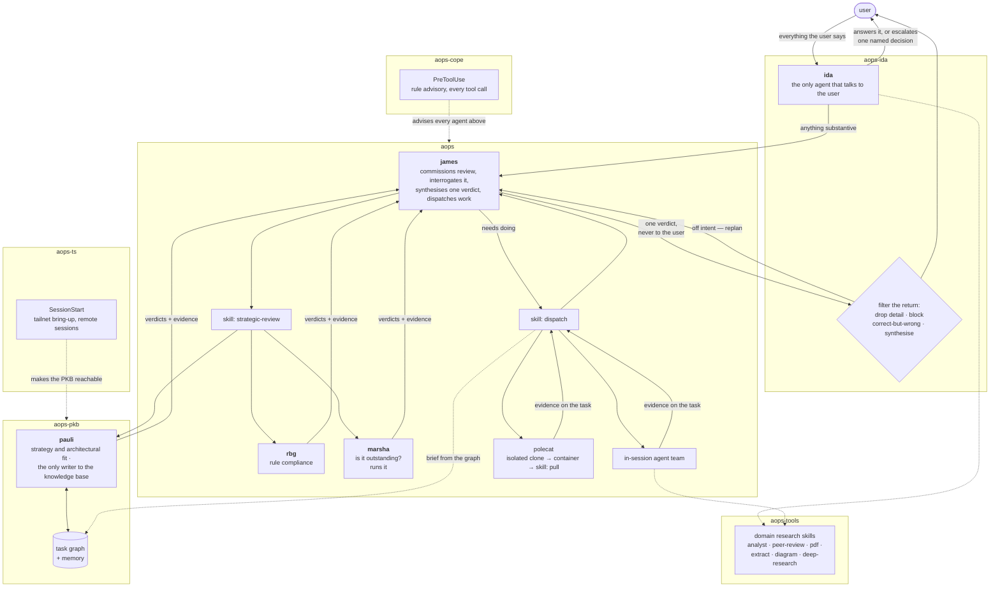

# academicOps

You can delegate execution to AI without delegating judgment.

academicOps is a set of six plugins for Claude Code and Antigravity that put a
research workflow behind a structure: one agent talks to you, one agent
dispatches work, three agents judge it, and nothing reaches you until it has been
filtered against what you actually asked for. Judgment stays with the human and
with agents whose only job is to exercise it.

## How it works


```mermaid
flowchart TD
    U([user])

    subgraph ida["aops-ida"]
        IDA["<b>ida</b><br/>the only agent that talks to the user"]
        F{"filter the return:<br/>drop detail · block<br/>correct-but-wrong · synthesise"}
    end

    subgraph aops["aops"]
        J["<b>james</b><br/>commissions review, interrogates it,<br/>synthesises one verdict, dispatches work"]
        SR["skill: strategic-review"]
        RBG["<b>rbg</b><br/>rule compliance"]
        MAR["<b>marsha</b><br/>is it outstanding?<br/>runs it"]
        DISP["skill: dispatch"]
        TEAM["in-session agent team"]
        PC["polecat<br/>isolated clone → container → skill: pull"]
    end

    subgraph pkb["aops-pkb"]
        PAULI["<b>pauli</b><br/>strategy and architectural fit ·<br/>the only writer to the knowledge base"]
        GRAPH[("task graph<br/>+ memory")]
    end

    subgraph tools["aops-tools"]
        TL["domain research skills<br/>analyst · peer-review · pdf ·<br/>extract · diagram · deep-research"]
    end

    subgraph cope["aops-cope"]
        COPE["PreToolUse<br/>rule advisory, every tool call"]
    end

    subgraph ts["aops-ts"]
        TSH["SessionStart<br/>tailnet bring-up, remote sessions"]
    end

    U -->|"everything the user says"| IDA
    IDA -->|"answers it, or escalates<br/>one named decision"| U
    IDA -->|"anything substantive"| J

    J --> SR
    SR --> RBG & MAR & PAULI
    RBG & MAR & PAULI -->|"verdicts + evidence"| J
    J -->|"needs doing"| DISP
    DISP --> TEAM & PC
    TEAM & PC -->|"evidence on the task"| DISP
    DISP --> J
    J -->|"one verdict,<br/>never to the user"| F
    F --> U
    F -->|"off intent — replan"| J

    PAULI <--> GRAPH
    DISP -.->|"brief from the graph"| GRAPH
    IDA -.-> TL
    TEAM -.-> TL
    COPE -.->|"advises every agent above"| aops
    TSH -.->|"makes the PKB reachable"| pkb
```

Ida holds between steps: after each one, control returns to you. James never
talks to the user. Pauli is the only agent that writes to the knowledge base.

## The plugins

Install what you need — they are separately installable and loosely coupled.

| Plugin       | Owns                                                                            |
| ------------ | ------------------------------------------------------------------------------- |
| `aops`       | james, marsha, rbg. Review, QA, verification, dispatch, polecat containers.     |
| `aops-pkb`   | pauli. Memory, effectual planning, workflow composition, PKB MCP client config. |
| `aops-ida`   | ida. The interactive face.                                                      |
| `aops-cope`  | Automatic in-session rule enforcement, via a `PreToolUse` hook.                 |
| `aops-tools` | Domain research skills.                                                         |
| `aops-ts`    | Tailscale bring-up for remote sessions.                                         |

Each has its own `README.md` under `plugins/<dir>/` with a flowchart of how that
plugin actually works, and its complete configuration surface.

## Install

```bash
claude plugin marketplace add nicsuzor/academicOps@dist
claude plugin install aops@academicOps
claude plugin install aops-ida@academicOps
claude plugin install aops-pkb@academicOps --config pkb_mcp_url=<your PKB MCP endpoint>
```

`aops-cope`, `aops-tools`, and `aops-ts` install the same way. `aops-ts` is
opt-in and only acts in a remote session.

Requirements: Claude Code (or Antigravity), and Docker if you want polecat's
containerised workers.

## Configure

**There are no defaults.** No endpoint, URL, host, path, token, or credential is
baked into anything shipped. Every value below comes from your environment or
from client `userConfig`. A missing required value fails loudly; it is never
guessed.

Only `aops-pkb` declares a `userConfig` field: `pkb_mcp_url`, the
streamable-HTTP endpoint of your PKB MCP server.

### Knowledge base

| Variable              | Required | Purpose                                                                               |
| --------------------- | -------- | ------------------------------------------------------------------------------------- |
| `PKB_MCP_URL`         | yes      | PKB MCP endpoint. Same value as `pkb_mcp_url`, for stdio launches and for containers. |
| `PKB_MCP_TOOL_PREFIX` | no       | Tool-name prefix, forwarded into containers.                                          |
| `ACA_DATA`            | no       | PKB root. Supplies `$ACA_DATA/.agents/rules/` and `$ACA_DATA/.agents/workflows/`.     |

Unset `ACA_DATA` means the user rule and workflow layers are absent — not an
error.

### Polecat containers (`aops`)

| Variable                                           | Required | Purpose                                                         |
| -------------------------------------------------- | -------- | --------------------------------------------------------------- |
| `POLECAT_HOME`                                     | yes\*    | Cache root for isolated clones, staging, and session logs.      |
| `POLECAT_IMAGE`                                    | yes\*    | Container image reference.                                      |
| `AOPS_BOT_GH_TOKEN`                                | yes      | Repository access inside the container.                         |
| `GIT_AUTHOR_NAME`, `GIT_AUTHOR_EMAIL`              | yes      | Commit identity. No default identity exists.                    |
| `AOPS_CC_OAUTH_TOKEN` or `CLAUDE_CODE_OAUTH_TOKEN` | yes      | Agent CLI authentication, forwarded into the container.         |
| `AOPS_SESSIONS`                                    | no       | Session-log root, and the default location of `polecat.yaml`.   |
| `AOPS_POLECAT_CONFIG`                              | no       | Explicit path to `polecat.yaml`.                                |
| `POLECAT_STAGING_BASE`                             | no       | Where the per-session staging directory is created.             |
| `POLECAT_AGENT_HOME`                               | no       | Host directory holding the agent CLI config. Unset stages none. |
| `POLECAT_WORKER_MODEL`                             | no       | Model written into the container's staged settings.             |
| `POLECAT_PRINT_TIMEOUT`                            | no       | Ceiling on a headless agy run.                                  |
| `CLAUDE_ENV_FILE`                                  | no       | Scoped env file the `SessionStart` hook writes.                 |

\* or the equivalent key in `polecat.yaml` (`polecat_home`, `docker.image`).

### Remote sessions (`aops-ts`)

| Variable             | Required | Purpose                                                                 |
| -------------------- | -------- | ----------------------------------------------------------------------- |
| `CLAUDE_CODE_REMOTE` | yes      | Must be exactly `true`, or the hook does nothing.                       |
| `TS_AUTHKEY`         | yes      | Tailscale auth key.                                                     |
| `HOSTNAME`           | no       | Names the device `claude-web-${HOSTNAME}`. Unset lets Tailscale choose. |

### Telemetry

Claude Code's native OpenTelemetry export is the tracing mechanism; it is
session-scoped, so setting it once covers every plugin. The framework forwards
the contract into containers and scheduled runs and sets none of it. The full
variable list is in [`specs/ARCHITECTURE.md`](specs/ARCHITECTURE.md#observability).

## Build and test

```bash
git clone git@github.com:nicsuzor/academicOps.git && cd academicOps
uv sync

make build          # assemble dist/<plugin>-<client> for every plugin, both clients
make install-dev    # build, then install dist/ as the local 'aops' marketplace
make uninstall-dev  # restore the released marketplace
make test           # uv run pytest tests/
make lint           # ruff check
make format         # ruff format + dprint fmt
make docker         # build the crew worker image
make clean          # remove dist/
```

`make help` lists every target.

## Repository layout

```
lib/        Shared source, injected into plugins at build time. Never shipped as-is.
build/      The build system.
plugins/    Plugin sources. Only what a client loads.
specs/      Design intent.
tests/      Test suite.
.agents/    Rules for agents working on this repository.
```

[`specs/ARCHITECTURE.md`](specs/ARCHITECTURE.md) is authoritative for the layout,
the plugin boundaries, the build stages, and the constraints on all of them.
Contributing: [`CONTRIBUTING.md`](CONTRIBUTING.md).
