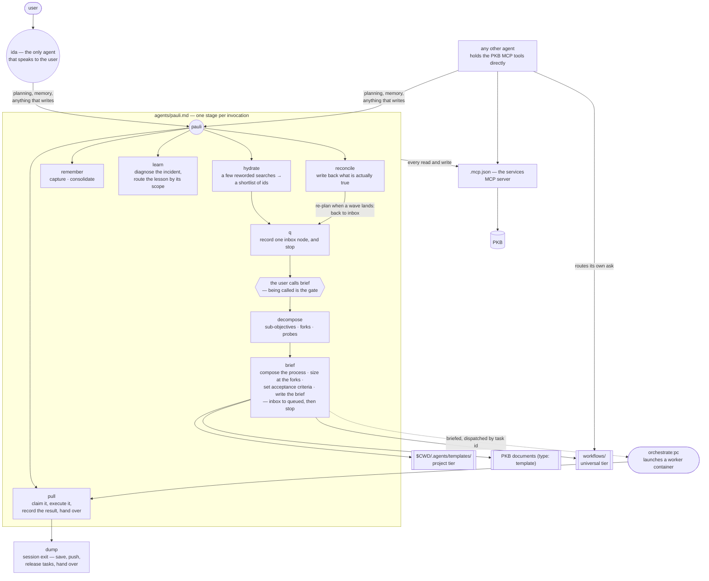

# aops

Ida for strategy, pauli for memory: the interactive face, the sole writer to the
Personal Knowledge Base, the skills that capture and plan work, and the client
wiring for the PKB MCP server.

## How it works

Nothing fires on every prompt to ground it in the PKB; the plugin ships no
`UserPromptSubmit` handler. Grounding is `hydrate`'s job, and the difference from
an advisory is that it runs — the skill issues the searches itself and returns
pointers, not prose: ids with a line each saying why the thing might bear on the
ask. Reading them is `brief`'s job, once, on the asks that turn out to be worth
it.

Each skill runs, then stops; no stage fires the next. `inbox` is the signal that
an ask has been captured but not worked out. Two breakpoints are the user's:
`brief` runs only when it is called, and it alone moves a task to `queued`; then
the pull request and its sign-offs.

Dispatch happens **by task id**, never by handing freshly-composed text to a
worker as a prompt. The executor's first act is to read the brief cold from the
task, which is what makes the brief bind rather than restate the reasoning that
produced it.

Routing and composition are different jobs. **Routing** picks which template a
class of work follows; the universal templates live in `workflows/` and any agent reads
them directly. **Composition** assembles a full process for work released for
dispatch, happens only inside `brief`, and draws on all three template tiers as
one namespace — a PKB template composes exactly like a shipped one.

Everything that mutates the PKB routes through pauli by instruction rather than
by tool grant: pauli, james, marsha and rbg all omit `tools`, so each inherits
its parent's full effective set including the PKB MCP namespace. `ida` is the one
agent whose declared `tools` exclude them; she commissions the work instead.

## What it provides

### Agents

| Agent   | Does                                                                                                                                                |
| ------- | --------------------------------------------------------------------------------------------------------------------------------------------------- |
| `ida`   | The strategic face, and the only agent that speaks to the user. Plans, prioritises, and holds anything needing the user's decision. Never executes. |
| `pauli` | Logician, effectual strategist, and custodian of the PKB. Every mutation routes here. Call first, and call often.                                   |

### Skills

| Skill              | Does                                                                                                                                      |
| ------------------ | ----------------------------------------------------------------------------------------------------------------------------------------- |
| `hydrate`          | A few reworded searches, cut to a shortlist of ids the caller can ask more about. Always first.                                           |
| `q`                | Intake — place one ask on the graph under the right parent, wired to what it serves and valued at intake.                                 |
| `decompose`        | Expand one situated objective into sub-objectives, decision branches, prerequisites, and alternate paths. Stops before implementation.    |
| `brief`            | Work out the process, size at the forks, set acceptance criteria, write the brief a cold executor is judged against. `inbox` to `queued`. |
| `strategize`       | The thinking pass for "plan this" and "what next" — fix the altitude, test the plan, route each piece to the stage that owns it.          |
| `pull`             | Claim a queued task, execute it, record the result on the task, and hand over.                                                            |
| `reconcile`        | Establish what is true about in-flight and finished work, write it back, return the affected tasks to `inbox`.                            |
| `remember`         | Capture knowledge as it emerges; consolidate episodic records into durable notes.                                                         |
| `learn`            | Diagnose an incident back to its structural cause, then route the lesson to the one destination its scope claims.                         |
| `craft`            | The authoring standard and quality gate for any instruction text an agent will read.                                                      |
| `workflow-library` | List, read, add, edit, and retire the workflow templates `brief` composes from — the only surface that sees all three tiers.              |
| `workflow-create`  | Turn a process the user has just been through and approved into a reusable template.                                                      |
| `strategic-review` | Multi-agent review of a document, plan, proposal, or PR — rbg, pauli and marsha in parallel, reconciled into one verdict.                 |
| `dump`             | Session exit — save and push work, release claimed tasks with a report, and emit a final handover.                                        |

There are no slash commands; every entry point is a skill.

### Templates

`workflows/` is the universal tier of the process-template library, and `workflows/archive/`
holds retired templates. The other two tiers — project-local `$CWD/.agents/templates/` and PKB
documents carrying `type: template` — live outside this plugin.

### Hook

| Event           | Does                                                                                                                                                   |
| --------------- | ------------------------------------------------------------------------------------------------------------------------------------------------------ |
| `PostToolBatch` | Reminds ida to strip her reply to load-bearing content before speaking. Fires only for `aops:ida`, and stays quiet while background tasks are running. |

Wording lives in `hooks/messages/quiet.md` and is editable without touching code.
The manifest wires this event for the `claude` client alone; the plugin ships no
agy `hooks.json`.

## Configuration

There are no defaults. No URL, host, port, path, or token is baked into anything
this plugin ships, and it declares no client `userConfig` options.

| Setting                | Where it comes from | For                                                                                                                                                                                                                         |
| ---------------------- | ------------------- | --------------------------------------------------------------------------------------------------------------------------------------------------------------------------------------------------------------------------- |
| `PKB_MCP_URL`          | environment         | The streamable-HTTP endpoint of the PKB MCP server. The `services` server config resolves it at launch (`fastmcp run "$PKB_MCP_URL"`) on every client, so it must already be set in the environment that starts the client. |
| `AOPS_UVX_SEARCH_PATH` | environment         | Optional, and only read by `scripts/run-mcp.sh`: colon-separated directories to probe for `uvx` when the launching client supplies a minimal `PATH`.                                                                        |

`scripts/run-mcp.sh` is a stdio launcher for clients that cannot be handed the
endpoint at launch. It requires `PKB_MCP_URL` and exits non-zero without it,
strips any trailing slash (the endpoint 404s with one), finds `uvx`, and execs
the same server. The build wires it into the Cowork upload zip with the URL
resolved into the server's `env` block; the ordinary client dists keep the
environment-variable form.

`$ACA_DATA` is the PKB's own storage. Nothing in this plugin reads or writes it
as a filesystem path — every read and write goes through the MCP tools, and the
skills forbid reaching around them.

## Depends on

- A PKB MCP server reachable at `$PKB_MCP_URL`. The server is external to this
  plugin; the plugin ships client wiring only.
- `lib/hooks/` and `lib/polecat/`, injected into `hooks/` and `polecat/` at build
  time (`manifest/plugin.toml`).
- `uv`, for `uvx` to launch the MCP server.
