# v1.0 Core Loop - Overview

**For detailed specification, see**: [[aops-core/specs/flow.md]]

**Goal**: The minimal viable framework with ONE complete, working loop.

**Philosophy**: Users don't have to use aops. But if they do, it's slow and thorough. The full workflow is MANDATORY.

## Core Loop Diagram

```mermaid
flowchart TD
    subgraph "Session Initialization"
        A[Session Start] --> B[SessionStart Hook]
        B --> C[Create Session File<br>/tmp/aops-DATE-ID.json]
        C --> D[Set $AOPS, $PYTHONPATH]
        D --> E[Inject AGENTS.md + Plugin Context]
    end

    subgraph "Prompt Processing"
        E --> F[User Prompt]
        F --> G[UserPromptSubmit Hook]
        G --> H{Skip Hydration?}
        H -->|Yes: /, ., notifications| I[Direct Execution]
        H -->|No| J[Write Context to Temp File]
        J --> K[prompt-hydrator Agent<br>haiku]
    end

    subgraph "Plan Generation & Review"
        K --> L[Gather Context:<br>bd state + vector memory]
        L --> L1[Read WORKFLOWS.md Index]
        L1 --> M[Select Workflow]
        M --> M1[Read Workflow File<br>workflows/workflow-id.md]
        M1 --> N[Generate TodoWrite Plan<br>from workflow steps]
        N --> O[critic Agent<br>opus]
        O --> P{Critic Verdict}
        P -->|PROCEED| Q[Main Agent Receives Plan]
        P -->|REVISE| N
        P -->|HALT| R[Stop - Present Issues]
    end

    subgraph "Execution"
        Q --> S[Execute Plan via TodoWrite]
        S --> T{Random Audit?}
        T -->|Yes ~14%| U[custodiet Agent<br>haiku]
        T -->|No| V[Continue Work]
        U --> W{Custodiet Check}
        W -->|OK| V
        W -->|BLOCK| X[HALT - Set Block Flag<br>All Hooks Fail]
        V --> Y[Mark Todos Complete]
    end

    subgraph "Verification & Close"
        Y --> Z[qa-verifier Agent<br>opus - INDEPENDENT]
        Z --> AA{Verified?}
        AA -->|VERIFIED| AB[framework Agent<br>sonnet]
        AA -->|ISSUES| AC[Fix Issues]
        AC --> Y
        AB --> AD[Generate Reflection]
        AD --> AE[Store in bd Issues]
        AE --> AF[Write Session Insights]
        AF --> AG[Session Close:<br>format + commit + PUSH]
    end

    style X fill:#ff6666
    style AG fill:#66ff66
```



## Session Initialization (SessionStart Hook)

The core loop BEGINS with SessionStart, before any user prompt is processed.

### SessionStart Hook Dispatch

When a Claude Code session starts, `router.py` dispatches two hooks in sequence:

1. **session_env_setup.sh** - Environment configuration
   - Sets `$AOPS` to the academicOps root directory
   - Adds `$AOPS` to `$PYTHONPATH` for Python imports
   - Writes environment to `$CLAUDE_ENV_FILE` (persists for session)
   - Validates path by checking for `AXIOMS.md`

2. **unified_logger.py** - Session state initialization
   - Creates session file at `/tmp/aops-{YYYY-MM-DD}-{session_id}.json`
   - Records session start timestamp
   - Initializes empty state for hydration, subagents, and insights

### Initial File Injection (claude.md)

Claude Code's built-in `claude.md` mechanism injects context at session start:

1. **Project CLAUDE.md** (`.claude/CLAUDE.md`) - Contains `@AGENTS.md` reference
2. **AGENTS.md** (repository root) - Dogfooding instructions loaded via `@` directive
3. **Plugin context** - Any registered plugin instructions

This injection happens BEFORE the first UserPromptSubmit, ensuring the agent has:

- Framework development guidelines (dogfooding mode)
- Reflection format requirements
- Session close workflow requirements

### Hook Registration

SessionStart hooks are registered in `.claude/settings.json`:

```json
"SessionStart": [
  {
    "hooks": [{
      "type": "command",
      "command": "PYTHONPATH=$AOPS uv run python $AOPS/aops-core/hooks/router.py"
    }]
  },
  {
    "hooks": [{"type": "command", "command": "bd prime"}]
  }
]
```

The router dispatches to `session_env_setup.sh` and `unified_logger.py` based on `HOOK_REGISTRY` in `router.py`.

## What's IN (Core v1.0)

### Agents (5)

| Agent               | Model  | Purpose                                               | Trigger                      |
| ------------------- | ------ | ----------------------------------------------------- | ---------------------------- |
| **prompt-hydrator** | haiku  | Transform prompts → execution plans                   | UserPromptSubmit hook        |
| **critic**          | opus   | Review plans BEFORE execution                         | After hydration              |
| **custodiet**       | haiku  | Detect scope drift, BLOCK on violation                | Random audit (~7 tool calls) |
| **qa-verifier**     | opus   | Independent end-to-end verification                   | Before completion            |
| **framework**       | sonnet | Stateful framework understanding, manages reflections | Before session close         |

### Hooks (3 + router)

| Hook                      | Event            | Purpose                                         |
| ------------------------- | ---------------- | ----------------------------------------------- |
| **router.py**             | All              | Central dispatcher, checks custodiet block flag |
| **user_prompt_submit.py** | UserPromptSubmit | Write context to temp, trigger hydration        |
| **unified_logger.py**     | All              | Log events to session file                      |
| **session_env_setup.sh**  | SessionStart     | Set $AOPS, $PYTHONPATH                          |

### Supporting Libraries

| File                    | Purpose                        |
| ----------------------- | ------------------------------ |
| `lib/paths.py`          | Path resolution                |
| `lib/session_state.py`  | Single session file management |
| `lib/session_reader.py` | Transcript context extraction  |

### External Tools

| Tool               | Purpose                   | Integration           |
| ------------------ | ------------------------- | --------------------- |
| **bd**             | Workflow/issue management | Agents invoke CLI     |
| **mcp__memory__*** | User context retrieval    | MCP server (existing) |

### Skills

**NONE in v1.0 core.** Skills are extensions, not the loop.

## What's OUT (Archived)

- All 28 skills (in archived/skills/)
- 19 additional hooks (in archived/hooks/)
- Other agents: planner, effectual-planner, framework-executor
- Unenforced axioms/heuristics

## Composable Workflow System

**NEW in v1.0**: Workflows are now stored as YAML+Markdown files in `workflows/` directory.

The prompt-hydrator selects from **9 composable workflows**:

### Development Workflows
- **[[workflows/feature-dev]]** - Full TDD feature development (critic → TDD → QA)
- **[[workflows/minor-edit]]** - Streamlined for small, focused changes
- **[[workflows/debugging]]** - Systematic debugging with reproducible tests
- **[[workflows/tdd-cycle]]** - Classic red-green-refactor TDD cycle

### Planning & QA Workflows
- **[[workflows/spec-review]]** - Critic feedback iteration loop
- **[[workflows/qa-demo]]** - Independent QA verification

### Operations & Routing Workflows
- **[[workflows/batch-processing]]** - Parallel processing for multiple items
- **[[workflows/simple-question]]** - Minimal info-only workflow
- **[[workflows/direct-skill]]** - Direct skill/command routing

**Workflow selection**: See [[WORKFLOWS.md]] decision tree.

**Composition**: Workflows can reference other workflows using `[[wikilinks]]`:
- `feature-dev` includes `[[spec-review]]`, `[[tdd-cycle]]`, `[[qa-demo]]`
- Each workflow file has YAML frontmatter with structured steps
- Phase 1 complete: Basic reading. Phase 2: Recursive composition.

## Quality Gates

Three mandatory quality gates ensure correctness:

1. **Critic** (BEFORE execution) - Reviews plan, outputs `PROCEED` | `REVISE` | `HALT`
2. **Custodiet** (DURING execution) - Random audit, can BLOCK all hooks on violation
3. **QA Verifier** (BEFORE completion) - Independent verification, outputs `VERIFIED` | `ISSUES`

**See**: [[aops-core/specs/flow.md]] for detailed specifications.

## Session Close

Work is NOT complete until `git push` succeeds. See AGENTS.md for full landing protocol.

---

**For comprehensive details**, see [[aops-core/specs/flow.md]]
