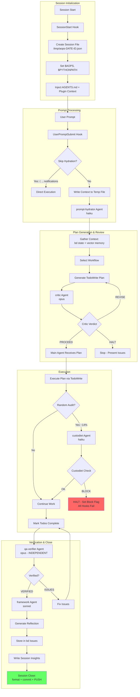

# v1.0 Core Loop

**Goal**: The minimal viable framework with ONE complete, working loop.

**Philosophy**: Users don't have to use aops. But if they do, it's slow and thorough. The full workflow is MANDATORY.

## Core Loop Diagram



## Session Initialization (SessionStart Hook)

The core loop BEGINS with SessionStart, before any user prompt is processed.

### SessionStart Hook Dispatch

When a Claude Code session starts, `router.py` dispatches two hooks in sequence:

1. **session_env_setup.sh** - Environment configuration
   - Sets `$AOPS` to the academicOps root directory
   - Adds `$AOPS` to `$PYTHONPATH` for Python imports
   - Writes environment to `$CLAUDE_ENV_FILE` (persists for session)
   - Validates path by checking for `AXIOMS.md`

2. **unified_logger.py** - Session state initialization
   - Creates session file at `/tmp/aops-{YYYY-MM-DD}-{session_id}.json`
   - Records session start timestamp
   - Initializes empty state for hydration, subagents, and insights

### Initial File Injection (claudeMd)

Claude Code's built-in `claudeMd` mechanism injects context at session start:

1. **Project CLAUDE.md** (`.claude/CLAUDE.md`) - Contains `@AGENTS.md` reference
2. **AGENTS.md** (repository root) - Dogfooding instructions loaded via `@` directive
3. **Plugin context** - Any registered plugin instructions

This injection happens BEFORE the first UserPromptSubmit, ensuring the agent has:

- Framework development guidelines (dogfooding mode)
- Reflection format requirements
- Session close workflow requirements

### Hook Registration

SessionStart hooks are registered in `.claude/settings.json`:

```json
"SessionStart": [
  {
    "hooks": [{
      "type": "command",
      "command": "PYTHONPATH=$AOPS uv run python $AOPS/aops-core/hooks/router.py"
    }]
  },
  {
    "hooks": [{"type": "command", "command": "bd prime"}]
  }
]
```

The router dispatches to `session_env_setup.sh` and `unified_logger.py` based on `HOOK_REGISTRY` in `router.py`.

## What's IN (Core v1.0)

### Agents (5)

| Agent               | Model  | Purpose                                               | Trigger                      |
| ------------------- | ------ | ----------------------------------------------------- | ---------------------------- |
| **prompt-hydrator** | haiku  | Transform prompts → execution plans                   | UserPromptSubmit hook        |
| **critic**          | opus   | Review plans BEFORE execution                         | After hydration              |
| **custodiet**       | haiku  | Detect scope drift, BLOCK on violation                | Random audit (~7 tool calls) |
| **qa-verifier**     | opus   | Independent end-to-end verification                   | Before completion            |
| **framework**       | sonnet | Stateful framework understanding, manages reflections | Before session close         |

### Hooks (3 + router)

| Hook                      | Event            | Purpose                                         |
| ------------------------- | ---------------- | ----------------------------------------------- |
| **router.py**             | All              | Central dispatcher, checks custodiet block flag |
| **user_prompt_submit.py** | UserPromptSubmit | Write context to temp, trigger hydration        |
| **unified_logger.py**     | All              | Log events to session file                      |
| **session_env_setup.sh**  | SessionStart     | Set $AOPS, $PYTHONPATH                          |

### Supporting Libraries

| File                    | Purpose                        |
| ----------------------- | ------------------------------ |
| `lib/paths.py`          | Path resolution                |
| `lib/session_state.py`  | Single session file management |
| `lib/session_reader.py` | Transcript context extraction  |

### External Tools

| Tool               | Purpose                   | Integration           |
| ------------------ | ------------------------- | --------------------- |
| **bd**             | Workflow/issue management | Agents invoke CLI     |
| **mcp__memory__*** | User context retrieval    | MCP server (existing) |

### Skills

**NONE in v1.0 core.** Skills are extensions, not the loop.

## What's OUT (Archived)

- All 28 skills (in archived/skills/)
- 19 additional hooks (in archived/hooks/)
- Other agents: planner, effectual-planner, framework-executor
- Unenforced axioms/heuristics

## Workflow Catalog

The prompt-hydrator routes prompts to one of 6 workflows:

| Workflow       | Trigger Signals                      | Quality Gate            | Guardrails                                                    |
| -------------- | ------------------------------------ | ----------------------- | ------------------------------------------------------------- |
| **question**   | "?", "how", "what", "explain"        | Answer accuracy         | `answer_only`                                                 |
| **minor-edit** | Single file, clear change            | Verification            | `verify_before_complete`, `fix_within_design`                 |
| **tdd**        | "implement", "add feature", "create" | Tests pass              | `require_acceptance_test`, `verify_before_complete`           |
| **batch**      | Multiple files, "all", "each"        | Per-item + aggregate QA | `per_item_verification`, `aggregate_qa`, `parallel_subagents` |
| **qa-proof**   | "verify", "check", "investigate"     | Evidence gathered       | `evidence_required`, `quote_errors_exactly`                   |
| **plan-mode**  | Complex, infrastructure, multi-step  | User approval           | `plan_mode`, `critic_review`, `user_approval_required`        |

## QA Gate Specifications

### 1. Critic (BEFORE Execution)

**When**: After hydration generates plan, BEFORE main agent executes

**Checks**:

1. Logical errors - Flawed reasoning, non-sequiturs
2. Unstated assumptions - What's taken for granted?
3. Missing verification - Claims without evidence
4. Scope drift - Does plan address what was asked?
5. Missing edge cases - What could go wrong?
6. Feasibility - Can this plan actually be executed?

**Output**: `PROCEED` | `REVISE` | `HALT`

### 2. Custodiet (BLOCKING Gate)

**When**: Random chance audit (~every 7 tool calls)

**On BLOCK**:

- Sets `custodiet_blocked: true` in session state file
- Immediate HALT - write up progress and error
- ALL hooks check this flag and FAIL until cleared
- Session cannot continue until user restarts

**Checks**:

1. Axiom/heuristic compliance
2. Scope drift from original request
3. Ultra vires actions (beyond granted authority)

**Output**: `OK` | `BLOCK` (immediate HALT)

### 3. QA Verifier (BEFORE Completion)

**When**: After execution complete, before reflection

**CRITICAL**: Must be INDEPENDENT agent, not the one that did the work

**Input** (from session state file):

- Original hydrated prompt
- Acceptance criteria (as approved by Critic)
- Current state of work

**Checks**:

1. Does output match original hydrated intent?
2. Are all acceptance criteria met?
3. Do tests pass?
4. Is documentation updated?
5. Are there any obvious errors?

**Output**: `VERIFIED` | `ISSUES` (list problems to fix)

## Reflection Format (MANDATORY)

After completing work, output this structure:

```
## Framework Reflection

**Request**: [Original user request in brief]
**Guidance received**: [Hydrator/custodiet advice, or "N/A - direct execution"]
**Followed**: [Yes/No/Partial - explain what was followed or skipped]
**Outcome**: [Success/Partial/Failure]
**Accomplishment**: [What was accomplished, if success/partial]
**Root cause** (if not success): [Which framework component failed]
**Proposed change**: [Specific improvement or "none needed"]
```

Then invoke `/log [reflection summary]` to persist.

## Session State File

Single temp file per session at `/tmp/aops-{YYYY-MM-DD}-{session_id}.json`:

```json
{
  "session_id": "abc123",
  "date": "2026-01-13",
  "started_at": "2026-01-13T10:00:00Z",
  "ended_at": null,

  "state": {
    "custodiet_blocked": false,
    "custodiet_block_reason": null,
    "current_workflow": "tdd",
    "hydration_pending": false
  },

  "hydration": {
    "original_prompt": "...",
    "hydrated_intent": "...",
    "acceptance_criteria": ["criterion 1", "criterion 2"],
    "critic_verdict": "PROCEED"
  },

  "main_agent": {
    "current_task": "ns-xyz",
    "todos_completed": 3,
    "todos_total": 5
  },

  "subagents": {
    "prompt-hydrator": { "last_invoked": "...", "result": "..." },
    "critic": { "last_invoked": "...", "verdict": "PROCEED" },
    "custodiet": { "last_invoked": "...", "result": "OK" },
    "qa-verifier": { "last_invoked": "...", "result": "VERIFIED" }
  },

  "insights": null
}
```

## Session Close (MANDATORY)

Work is NOT complete until `git push` succeeds.

```bash
./scripts/format.sh        # Format all files
git add -A                  # Stage formatted files
git commit -m "..."         # Pre-commit validates
git pull --rebase           # Sync with remote
bd sync                     # Sync beads
git push                    # MANDATORY
git status                  # MUST show "up to date with origin"
```

**CRITICAL**: Agent MUST push. Never say "ready to push when you are".

## Success Criteria for v1.0

- [ ] Fresh session triggers hydration automatically
- [ ] Hydration includes bd state and vector memory context
- [ ] Critic reviews plan BEFORE execution
- [ ] Custodiet BLOCKS all hooks when violation detected
- [ ] QA verifier independently checks work before completion
- [ ] Framework agent generates reflection
- [ ] Session insights written to single session file
- [ ] Commit + push completes every session
- [ ] All agents know to use bd for workflow management

## Implementation Constraint

**CRITICAL: NO NEW CODE**

Everything described in this spec ALREADY EXISTS. The v1.0 implementation is about:

1. **Wiring existing components** - connecting hooks, agents, tools
2. **Configuration changes** - updating settings, templates, agent definitions
3. **Moving files** - from archived/ to aops-core/ as needed

**If something doesn't exist**: Stop, document the gap, request spec review.
