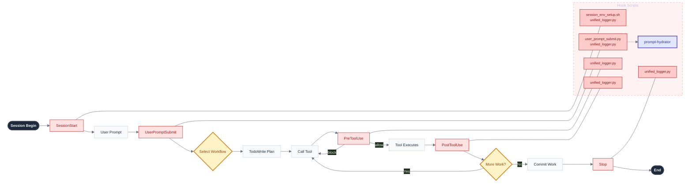
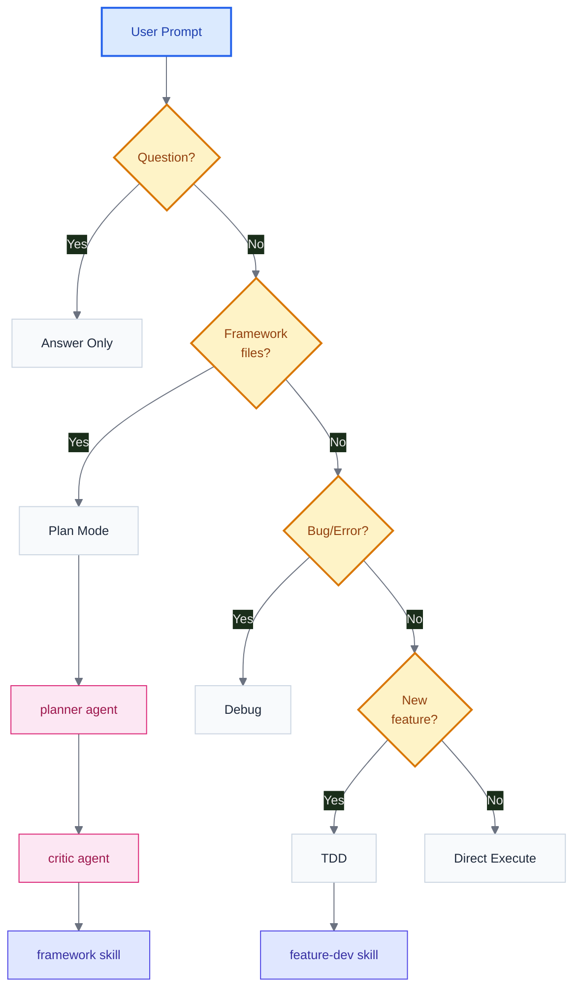

# aops-core Execution Flow

How the plugin injects control during a Claude Code session.

## Plugin Structure

```
aops-core/
├── .claude-plugin/plugin.json   # Plugin manifest
├── agents/                      # Subagent definitions
│   ├── critic.md               # Plan review
│   ├── custodiet.md            # Ultra vires detection
│   ├── planner.md              # Task decomposition
│   └── prompt-hydrator.md      # Workflow routing
├── axioms/                      # Inviolable principles
├── commands/                    # Slash commands (/q, /log, etc.)
├── heuristics/                  # Soft guidance
├── hooks/                       # Event handlers
│   ├── router.py               # Central dispatcher
│   └── templates/              # Prompt templates
├── lib/                         # Shared Python utilities
├── skills/                      # Domain context
│   ├── audit/                  # Session auditing
│   ├── feature-dev/            # Feature development
│   ├── framework/              # Framework development
│   ├── python-dev/             # Python conventions
│   ├── remember/               # Memory persistence
│   └── tasks/                  # Task management
└── specs/                       # Specifications
```

## Complete Execution Flow

Main flow (left) with hooks and their scripts (right column).



## Workflow Selection

The prompt-hydrator routes to workflows based on task signals.



| Workflow        | Triggers                           | Agents          | Skill       |
| --------------- | ---------------------------------- | --------------- | ----------- |
| **Answer Only** | "what", "how", "why", questions    | -               | -           |
| **Plan Mode**   | skills/, hooks/, axioms/ edits     | planner, critic | framework   |
| **Debug**       | "fix", "broken", error messages    | -               | -           |
| **TDD**         | "add", "create", new functionality | -               | feature-dev |
| **Direct**      | Clear single-step scope            | -               | -           |

## Hook System

All hooks route through `hooks/router.py`, which dispatches to registered sub-scripts.

### Hook Registry

| Event                | Scripts                                  | Purpose                     |
| -------------------- | ---------------------------------------- | --------------------------- |
| **SessionStart**     | session_env_setup.sh, unified_logger.py  | Environment setup + logging |
| **UserPromptSubmit** | user_prompt_submit.py, unified_logger.py | Trigger prompt hydration    |
| **PreToolUse**       | unified_logger.py                        | Logging                     |
| **PostToolUse**      | unified_logger.py                        | Logging                     |
| **SubagentStop**     | unified_logger.py                        | Logging                     |
| **Stop**             | unified_logger.py                        | Logging                     |

> **Note**: Additional hooks (hydration_gate.py, policy_enforcer.py, custodiet_gate.py, etc.) are available in `archived/hooks/` and can be restored as needed.

### Exit Codes

- `0` = Allow/Success
- `1` = Warning
- `2` = Block (PreToolUse only)

### Output Merging

Router merges outputs from multiple scripts:

- `additionalContext`: Concatenate with separator
- `permissionDecision`: Most restrictive wins (deny > ask > allow)
- `continue`: AND logic
- `suppressOutput`: OR logic

## Agents

| Agent               | Purpose                                     | Spawned By             |
| ------------------- | ------------------------------------------- | ---------------------- |
| **prompt-hydrator** | Route prompt to workflow, inject guardrails | UserPromptSubmit       |
| **planner**         | Decompose complex tasks                     | Framework workflow     |
| **critic**          | Review plans before execution               | Framework workflow     |
| **custodiet**       | Detect scope drift (ultra vires)            | PostToolUse (~7 calls) |

Agent definitions in `agents/*.md`.

## Skills

Skills provide domain-specific context. Loaded via `Skill(skill="name")`.

| Skill           | Purpose                           |
| --------------- | --------------------------------- |
| **framework**   | Framework development conventions |
| **feature-dev** | TDD, user stories, test specs     |
| **python-dev**  | Python coding standards           |
| **remember**    | Memory persistence patterns       |
| **tasks**       | Task management workflows         |
| **audit**       | Session auditing                  |

Skills are read-only context - they don't execute code.

## Axioms & Heuristics

### Axioms (Inviolable)

| Axiom                   | Enforcement                                   |
| ----------------------- | --------------------------------------------- |
| trust-version-control   | policy_enforcer.py blocks destructive git ops |
| fail-fast-code          | fail_fast_watchdog.py injects reminders       |
| research-data-immutable | policy_enforcer.py blocks data/ edits         |
| data-boundaries         | Prompt guidance                               |
| single-purpose-files    | Prompt guidance                               |
| skills-are-read-only    | Prompt guidance                               |
| self-documenting        | Prompt guidance                               |

### Heuristics (Soft Guidance)

- file-category-classification
- no-horizontal-dividers
- semantic-link-density
- skills-no-dynamic-content

## Commands

Slash commands in `commands/*.md`:

| Command   | Purpose               |
| --------- | --------------------- |
| /q        | Quick task capture    |
| /log      | Learning log entry    |
| /reflect  | Session reflection    |
| /remind   | Set reminder          |
| /email    | Email workflow        |
| /qa       | Quality assurance     |
| /strategy | Strategic planning    |
| /meta     | Meta-level discussion |

## Key Principles

1. **Router consolidates hooks** - Single entry point reduces noise
2. **Hooks enforce axioms** - PreToolUse blocks violations
3. **Skills provide context** - Read-only, loaded on demand
4. **Agents handle complexity** - Subagents for routing, planning, review
5. **Custodiet detects drift** - Periodic ultra vires checks
