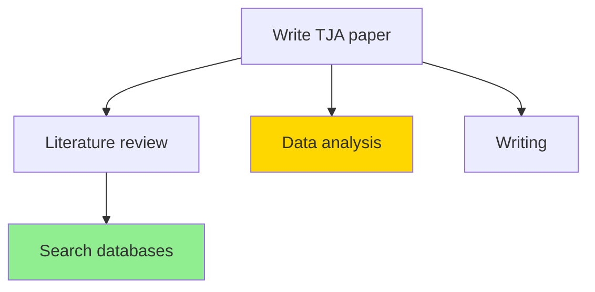

# BD-Markdown Integration Specification

## User Story

**As a** framework user
**I want** bd tasks connected to project markdown files with automatic decomposition and visual task trees
**So that** I can see the whole picture (strategy to tactics), throw loose goals at the system and have them structured, and know what's blocking me

## Design Principles

### Principle 1: Unified Task Abstraction

All work items are **tasks**. No separate "tiers" or "types" beyond what bd already provides (epic, task, bug, etc.). The only distinctions that matter:

- **Can we decompose further?** (Do we have enough information?)
- **Is it skill-sized?** (Can @bot execute it?)
- **Who owns it?** (@bot for automated, @nic for human, unassigned for triage)

### Principle 2: Single Source of Truth

- **bd** is the source of truth for tasks (status, dependencies, assignments)
- **Markdown** is the source of truth for projects/goals (context, knowledge, strategy)
- **Links** connect them (bd tasks reference projects, projects display task trees)

### Principle 3: One-Way Sync for Data Integrity

Markdown task views are **read-only** and **generated from bd**. Never edit task data in markdown - it will be overwritten. This prevents sync conflicts and data corruption.

### Principle 4: Progressive Decomposition

Tasks are decomposed **just-in-time** to the most detailed level currently known. Coarse tasks remain coarse until we have information to expand them. Discovery tasks bridge knowledge gaps.

---

## Component 1: Linking Schema

### BD Side: Project Labels

Tasks link to projects via the `project:` label:

```bash
bd create "Literature review" --parent=aops-nn1l --label project:tja-paper
```

**Convention**: `project:<project-slug>` where `<project-slug>` matches the markdown filename.

### Markdown Side: Project Frontmatter

Project files declare their identity:

```yaml
---
title: TJA Paper
type: project
project: tja-paper          # Must match bd label
status: active
---
```

### Query: Find Tasks for Project

```bash
bd list --label project:tja-paper
```

### Query: Find Project for Task

Read task labels, extract `project:*` label, map to `$ACA_DATA/projects/**/[project-slug].md`.

---

## Component 2: RO ASCII View Generator

### Purpose

Generate a read-only task tree in project markdown files, showing the full decomposition from epic to skill-sized tasks.

### Output Format

```markdown
## Tasks (auto-generated)

<!-- BD-TASK-TREE:START - Do not edit below this line -->
```
○ aops-nn1l [P1] [epic] Write TJA paper
├─○ aops-lr01 [P2] Literature review
│  ├─● aops-lr02 [P2] @bot Search databases for [terms]
│  └─○ aops-lr03 [P2] Screen 50 abstracts
├─◐ aops-da01 [P1] @nic Data analysis
│  └─○ aops-da02 [P2] [discovery] Clarify methodology
└─○ aops-wr01 [P2] Writing
   └─○ aops-wr02 [P3] Draft introduction
```
Last synced: 2026-01-18T10:30:00+10:00
<!-- BD-TASK-TREE:END -->
```

### Status Symbols

| Symbol | Meaning |
|--------|---------|
| `○` | Open |
| `●` | Closed |
| `◐` | In-progress |
| `⊘` | Blocked |

### Annotations

| Annotation | Meaning |
|------------|---------|
| `@bot` | Assigned to automated agent |
| `@nic` | Assigned to human |
| `[discovery]` | Needs human input to proceed |
| `[P1]` | Priority level |

### Implementation: Skill or Script

Create as a skill (`/task-tree`) or script that:

1. Takes a project slug as input
2. Queries bd for all tasks with `project:<slug>` label
3. Builds parent-child tree from bd's `parent` field
4. Renders ASCII tree with status symbols
5. Replaces content between `BD-TASK-TREE:START` and `BD-TASK-TREE:END` markers
6. Updates "Last synced" timestamp

### Regeneration Triggers

- **On demand**: User runs `/task-tree tja-paper`
- **Session end**: Hook regenerates trees for touched projects
- **bd sync**: After `bd sync`, regenerate affected project trees

---

## Component 3: Decomposition Algorithm

### Entry Point

User provides a loose goal:

```
"Write the TJA paper"
```

### Step 1: Create Epic

```bash
bd create "Write TJA paper" --type=epic --priority=1 --label project:tja-paper
```

### Step 2: Infer Necessary Steps

Use domain knowledge to identify **strictly necessary** components. For "academic paper":

- Literature review
- Data collection/analysis
- Writing
- Submission

Create as children:

```bash
bd create "Literature review" --parent=aops-nn1l --label project:tja-paper
bd create "Data analysis" --parent=aops-nn1l --label project:tja-paper
bd create "Writing" --parent=aops-nn1l --label project:tja-paper
bd create "Submission" --parent=aops-nn1l --label project:tja-paper
```

### Step 3: Expand Where Possible

For each child, ask: **Do we have enough information to decompose further?**

- **Yes** → Create skill-sized subtasks
- **No** → Create discovery task to gather information

Example:
```bash
# We know how to do literature searches
bd create "Search databases for [terms]" --parent=aops-lr01 --assignee=bot

# We don't know the methodology yet
bd create "[discovery] Clarify methodology approach" --parent=aops-da01 --assignee=nic
```

### Step 4: Mark Ready Work

After decomposition, identify what's actionable:

```bash
bd ready --label project:tja-paper
```

Shows tasks that are:
- Skill-sized (leaf nodes or explicitly marked ready)
- Have no unmet dependencies
- Assigned (@bot or @nic)

### Decomposition Heuristics

| Signal | Action |
|--------|--------|
| Domain knowledge exists (e.g., "paper" → known structure) | Infer necessary steps |
| User provided detail | Create detailed subtasks |
| Path unclear | Create `[discovery]` task assigned to @nic |
| Task is skill-sized | Stop decomposing, mark ready |
| Task is coarse but boundaries clear | Keep coarse, expand later |

### Skill-Sized Criteria (from Principle #6)

A task is skill-sized when:
- Maps to exactly one skill (python-dev, analyst, pdf, etc.)
- Clear input/output boundaries
- Can be verified independently
- No decision points requiring human input mid-task

---

## Component 4: Visualization Options

### Option A: Obsidian Graph View

Project markdown files naturally create a graph via wikilinks:
- `[[tja-paper]]` links to project
- Project contains task tree
- Tasks can link to related projects/concepts

### Option B: Mermaid Flowchart

Generate mermaid diagram alongside ASCII:

```markdown
## Task Graph


```

Color coding:
- Green: @bot (automated)
- Yellow: @nic in-progress
- Gray: blocked

### Option C: Excalidraw Mind Map

Use excalidraw skill to generate visual mind map with:
- Nodes for each task
- Edges for parent-child
- Color for status/assignee
- Position for priority (important = center)

---

## Implementation Phases

### Phase 1: Linking Schema (1 session)

- [ ] Document `project:` label convention
- [ ] Update bd templates to include project label
- [ ] Create example project markdown with frontmatter

### Phase 2: ASCII View Generator (1-2 sessions)

- [ ] Create `/task-tree` skill or script
- [ ] Implement tree building from bd JSON
- [ ] Implement ASCII rendering with symbols
- [ ] Add marker-based replacement in markdown
- [ ] Test on real project (tja-paper)

### Phase 3: Decomposition Workflow (1-2 sessions)

- [ ] Update hydrator to recognize loose goals
- [ ] Implement domain-knowledge inference (paper, feature, etc.)
- [ ] Add discovery task generation
- [ ] Integrate with skill-sized check (Principle #6)
- [ ] Test on new goal

### Phase 4: Visualization (future)

- [ ] Mermaid generation option
- [ ] Excalidraw integration
- [ ] Session-end hook for auto-regeneration

---

## Success Criteria

1. **Linking works**: `bd list --label project:tja-paper` returns all TJA tasks
2. **ASCII view accurate**: Task tree in markdown matches bd state
3. **Decomposition useful**: "Write paper X" decomposes into actionable structure
4. **User visibility**: Can see at a glance what's blocking, what's ready, what's mine
5. **Data integrity**: Markdown views never diverge from bd (always regenerated)

---

## Open Questions

1. **Project file location**: Should projects live in `$ACA_DATA/projects/` flat or `$ACA_DATA/projects/<domain>/`?
2. **Multi-project tasks**: Can a task belong to multiple projects? (Probably not - keep it simple)
3. **Archive behavior**: When project completes, archive task tree or keep in markdown?
4. **Cross-project dependencies**: How to handle a task in project A blocking project B?

---

## Related

- [[workflow-system-spec]] - Principle #6 (Skill-Sized Minimum Granularity)
- [[decompose]] - Progressive decomposition workflow
- [[skill-pilot]] - Building new skills for irreducible tasks
