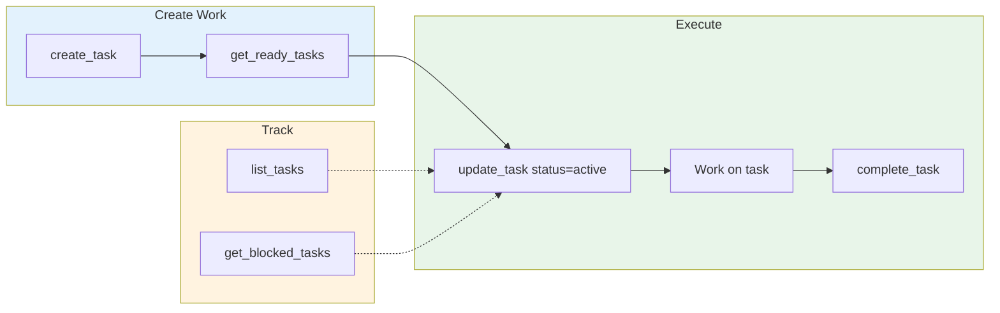

# Work Management: Tasks MCP

Tasks MCP is the primary work management system for multi-session tracking, dependencies, and strategic work.



**When to use Tasks MCP**:

- Multi-session work (spans multiple conversations)
- Work with dependencies (blocked by / blocks)
- Strategic planning and tracking
- Discoverable by future sessions

## Core Functions

| Function | Purpose |
|----------|---------|
| `mcp__plugin_aops-core_tasks__create_task()` | Create new task |
| `mcp__plugin_aops-core_tasks__get_task(id)` | Get task details |
| `mcp__plugin_aops-core_tasks__update_task(id, ...)` | Update task fields |
| `mcp__plugin_aops-core_tasks__complete_task(id)` | Mark task done |
| `mcp__plugin_aops-core_tasks__list_tasks(...)` | List/filter tasks |
| `mcp__plugin_aops-core_tasks__search_tasks(query)` | Search tasks |
| `mcp__plugin_aops-core_tasks__get_ready_tasks(project, caller)` | Get actionable tasks (caller filters by assignee) |
| `mcp__plugin_aops-core_tasks__get_blocked_tasks()` | Get blocked tasks |
| `mcp__plugin_aops-core_tasks__decompose_task(id, children)` | Break down task |

## Task Lifecycle

```
inbox → active → done
         ↓
      blocked/waiting
```

**Statuses**:
- `inbox`: New, not started
- `active`: Currently being worked on
- `blocked`: Waiting on dependencies
- `waiting`: Deferred for later
- `done`: Completed
- `cancelled`: Abandoned

## Multi-Project Organization

Tasks are organized by `project` field:

| Project | Use For |
|---------|---------|
| `aops` | Framework tasks |
| `writing` | Writing project tasks |
| (custom) | Other projects |

**Create with project**:
```python
mcp__plugin_aops-core_tasks__create_task(
    title="Task title",
    type="task",
    project="aops",
    priority=2
)
```

## Dependencies

Tasks can depend on other tasks:

```python
# Create dependent task
mcp__plugin_aops-core_tasks__create_task(
    title="Implement feature",
    depends_on=["task-id-of-prerequisite"]
)

# Check what's blocked
mcp__plugin_aops-core_tasks__get_blocked_tasks()
```

## Graph Insertion Responsibility

**The creating agent is responsible for inserting tasks onto the work graph.**

Every task must be connected to the hierarchy:

```
task → epic → chain → project → strategic priority
```

When creating a task, the agent MUST:

1. **Identify the parent epic** - Search for existing epics in the project
2. **Link the task** - Use `depends_on` or wikilinks to connect to parent
3. **Create intermediates if needed** - If no suitable epic exists, create one that links to a project

**Why this matters:**
- Disconnected tasks become invisible to prioritization
- Orphaned work cannot be sequenced for delivery
- The task graph visualization reveals structural gaps

**Anti-pattern:** Creating standalone tasks without graph connections. If a task has no parent, it's not properly inserted.

```python
# WRONG: Orphaned task
mcp__plugin_aops-core_tasks__create_task(
    title="Fix login bug",
    project="webapp"
)

# RIGHT: Connected to parent epic
mcp__plugin_aops-core_tasks__create_task(
    title="Fix login bug",
    project="webapp",
    depends_on=["webapp-auth-epic"]  # Links to parent
)
```

## Task Assignment

Tasks can be assigned to a specific actor:

| Assignee | Meaning |
|----------|---------|
| `nic` | Human tasks - requires judgment, external context |
| `bot` | Agent tasks - automatable work |
| (unset) | Available to anyone (legacy compatibility) |

**Creating assigned tasks**:
```python
mcp__plugin_aops-core_tasks__create_task(
    title="Review proposal",
    assignee="nic"  # Human task
)
```

**Getting ready tasks by caller**:
```python
# Bot tasks + unassigned (default for /pull)
mcp__plugin_aops-core_tasks__get_ready_tasks(project="aops", caller="bot")

# Human tasks + unassigned
mcp__plugin_aops-core_tasks__get_ready_tasks(project="aops", caller="nic")

# All ready tasks (no filter)
mcp__plugin_aops-core_tasks__get_ready_tasks(project="aops")
```

## Task Storage

Tasks are stored as markdown files in `data/tasks/`:
- `data/tasks/inbox/` - New tasks
- `data/tasks/index.json` - Task index for fast queries
