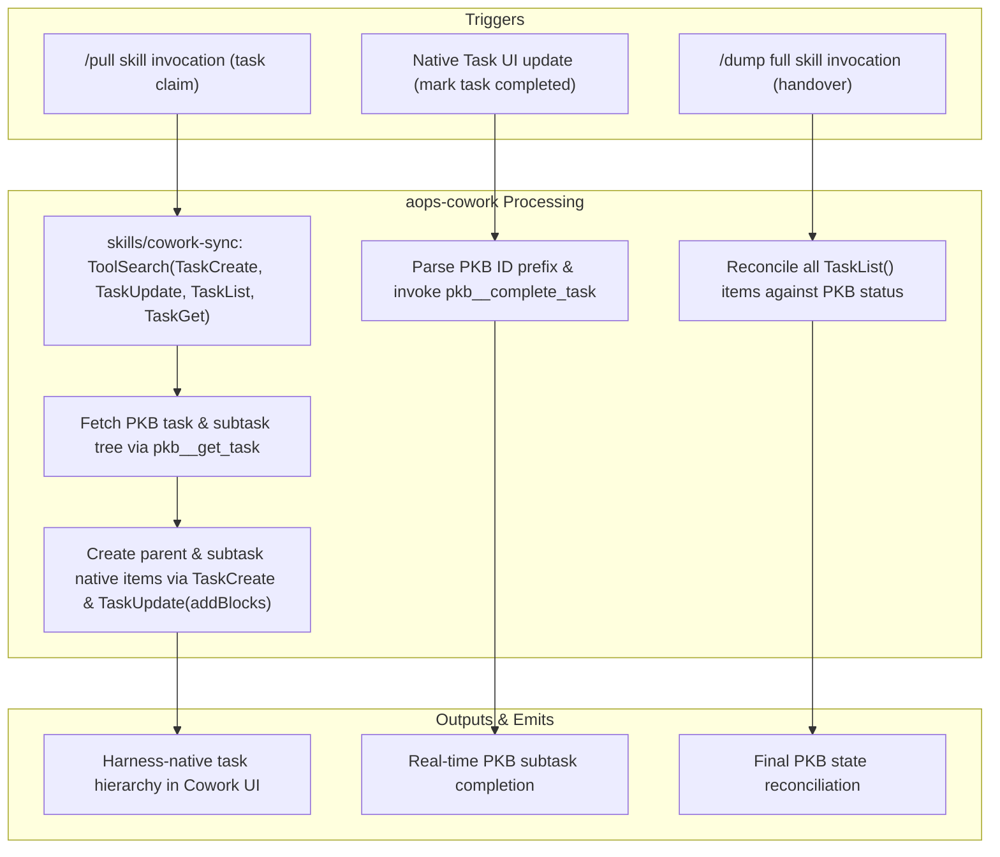

# aops-cowork: Cowork Native Task Synchronization

`aops-cowork` provides task list synchronization for Anthropic Cowork environments. It mirrors task units from the Personal Knowledge Base (PKB) onto Cowork's native interactive task list at `/pull` claim time and syncs completed status back to PKB.

## Control Flow & Architecture



## Customisation Surface

**As of the current build, this plugin has no configurable knobs.** An earlier draft declared `auto_sync` and `sync_children` `userConfig` booleans, but `aops-cowork` ships no executable hook or script code — its only artifact is `skills/cowork-sync/SKILL.md`, a prompt-driven procedure that never reads or references either key. Sync-to-native and subtask-mirroring behavior described in the Control Flow diagram above is always-on and not currently adjustable. The declarations were removed rather than left as decoration; re-add them only alongside real code (or an explicit prompt instruction in `SKILL.md`) that consults them.

## Installation & Quickstart

`aops-cowork` is bundled in the Cowork distribution build (`dist/cowork`).

```bash
claude plugin install aops-cowork@academicOps-cowork
```

## Contents

- `skills/cowork-sync/` — Procedures for mirroring tasks and reconciling status between PKB and Cowork native tasks.
- `.claude-plugin/plugin.json` — Plugin manifest (no `userConfig` options; see Customisation Surface above).
