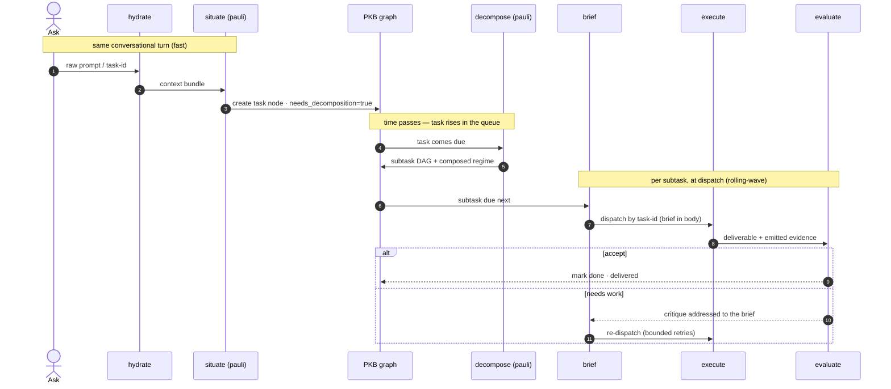

# Workflow-system pipeline — component & contract reference

Developer documentation for the five-stage pipeline in `aops-extras/skills/`. Covers **which
component fires when** and the **data contract at each seam**.

## Architecture in one line

Stages **do not call each other directly**. Each reads from and writes to the **PKB graph** (a
task's frontmatter + body is the message bus); the next stage is triggered by graph state + queue
position, not by a return value. Two cadences:

- **Per conversational turn** (fast, every task): `hydrate` → `situate`.
- **Queue-driven** (deliberate, only when a task comes due — often a later tick or a different
  session): `decompose` → `brief` → _execute_ → `evaluate`.

```mermaid
flowchart LR
    IN(["Intake — raw ask or task-id"]):::ext

    subgraph TURN["Per turn — fast, every task"]
        direction LR
        HY["1 · hydrate<br/>context assembly"]:::agn
        SI["2 · situate · pauli<br/>intake + valuation"]:::pauli
    end

    subgraph QUEUE["Queue-driven — when the task comes due"]
        direction LR
        DE["3 · decompose · pauli<br/>structure + regime"]:::pauli
        BR["4 · brief<br/>delegation brief"]:::agn
    end

    G[("PKB graph")]:::bus
    EX["execute<br/>any capable agent (out of scope)"]:::ext
    EV{"evaluate — /verify + /strategic-review"}:::gate
    DONE(["delivered"]):::done

    IN -->|"raw prompt / task-id"| HY
    HY -->|"context bundle (4 sections)"| SI
    SI -->|"task node · needs_decomposition"| G
    G -. "task rises in queue" .-> DE
    DE -->|"subtask DAG + regime"| BR
    BR -->|"task-id reference"| EX
    EX -->|"deliverable + emitted evidence"| EV
    EV -->|"accept"| DONE
    EV -. "needs work — critique to brief" .-> BR

    classDef pauli fill:#e7ecfb,stroke:#2b57d6,color:#17337f;
    classDef agn fill:#eef1f5,stroke:#57616c,color:#1b2027;
    classDef gate fill:#faedd8,stroke:#a86408,color:#7a4a06;
    classDef ext fill:#ffffff,stroke:#b8c0cc,color:#57616c;
    classDef done fill:#dcf0e9,stroke:#0f7a63,color:#0b5c4a;
    classDef bus fill:#f5f6f8,stroke:#838d97,color:#57616c;
```



## Component contract table

| # | Component                        | Fires when                                                       | Consumes                                                                  | Produces (→ where)                                                                                                             | Identity                                           | Tool surface                                                                                                                        |
| - | -------------------------------- | ---------------------------------------------------------------- | ------------------------------------------------------------------------- | ------------------------------------------------------------------------------------------------------------------------------ | -------------------------------------------------- | ----------------------------------------------------------------------------------------------------------------------------------- |
| 1 | `hydrate`                        | Any inbound ask, every turn (`needs_task: false`)                | raw prompt **or** task-id                                                 | **context bundle** → task body (`append`) or handed forward in-turn                                                            | agnostic                                           | read-only PKB: `search, task_search, get_task, get_semantic_neighbors, retrieve_memory, get_dependency_tree, append` — **≤6 calls** |
| 2 | `situate`                        | After hydrate, non-trivial ask, every turn (`needs_task: false`) | context bundle                                                            | **one task node**: parent, `contributes_to` edge (weight+justification), 6 valuation dims, `needs_decomposition: true` → graph | **pauli** (sole graph-shaper)                      | `create_task, update_task, append, search, task_search, get_network_metrics, get_dependency_tree, AskUserQuestion`                  |
| 3 | `decompose`                      | A `needs_decomposition` task comes **due** (`needs_task: true`)  | the due task + `workflows/INDEX.md`                                       | **unexploded subtask DAG** + **composed regime** (named templates); gates as blocking DAG nodes → task bodies                  | **pauli**                                          | `get_task, decompose_task, append, search, get_dependency_tree`                                                                     |
| 4 | `brief`                          | A subtask is **about to dispatch** (`needs_task: true`)          | one due subtask + its regime                                              | **seven-element brief** → subtask body; dispatch **by task-id**                                                                | agnostic — **briefer ≠ executor**                  | `get_task, append, update_task, get_dependency_tree, Skill, Task`                                                                   |
| — | _execute_                        | On dispatch                                                      | task-id                                                                   | deliverable + emitted evidence (per the brief's emit contract)                                                                 | any capable agent                                  | _(out of scope — the pipeline deliberately does not script this)_                                                                   |
| 5 | `evaluate` = `/verify`           | At a QA/verification gate                                        | deliverable + **brief's emit-for-evaluation contract** (primary evidence) | verdict: accept / critique-to-brief / escalate                                                                                 | marsha (quality + claim-reliability)               | `Task, Read, Glob, Grep`                                                                                                            |
| 5 | `evaluate` = `/strategic-review` | At a compliance/premise gate                                     | deliverable + emit contract                                               | verdict; compliance lens                                                                                                       | rbg (axioms) + pauli (premise) + james (synthesis) | `Agent, Bash, Read, Glob, Grep, AskUserQuestion`                                                                                    |

**Loop:** on FAIL the critique is addressed to the _brief_ (not a fresh plan) → `brief` updates →
re-dispatch to _execute_. Bounded retries (~3), then escalate. **Thin/missing emitted evidence is
itself a FAIL** — it does not license the evaluator to re-investigate from scratch.

## Seam contracts (the exact records passed)

### hydrate → situate: the context bundle

Four named sections, stable, written to the task body (or handed forward in-turn):

```markdown
## Intent — one-sentence restatement of the ask

## Context — prior knowledge/attempts/decisions, each with a spot-checkable node id

## Standards — applicable obligations, sourced from workflows/INDEX.md + project config

## Dependencies — known blocking/related task ids
```

Right-sized: simple question → answer-shaped micro-bundle (1–2 calls); substantial work → full bundle.

### decompose → brief: the subtask DAG row + regime record

```
DAG row:  | id | one-line scope | door-type (two-way|one-way) | depends_on |
Regime:   Process: <template…>  ·  Gates: <template…>  ·  Standing: <template…>   (by name, from workflows/INDEX.md)
```

Subtasks stay **unexploded** (title + one-line scope + door-type + deps). No briefs yet. Review/
approval gates are added as **blocking DAG nodes**, not prose.

### brief → execute: the seven-element delegation brief

Prose, in the subtask body — never a step-script (READ-DO only for order-critical/dangerous work):

1. **Intent** (+ why) 2. **Scoped context** (incl. the hydrate bundle's `## Context`, so the
   executor never asks "what's been tried?") 3. **Constraints** (left/right limits) 4. **Autonomy +
   non-goals** 5. **Done + observable acceptance criteria** 6. **Emit-for-evaluation contract**
   (quality rubric · claim-provenance rule · procedural record) 7. **Effort budget + door-type**.

### execute → evaluate: the emit-for-evaluation contract

Element 6 of the brief _is_ the evaluator's evidence spec. The evaluator judges the **emitted
evidence against the pre-agreed rubric** — it does not re-run the work. Missing evidence → FAIL.

## Fire order (one epic, end to end)



## Invariants

- **pauli owns graph mutation** — only `situate`, `decompose`, and `graph-maintenance` write graph
  structure (single authoritative writer for edges/scores).
- **briefer ≠ executor** — the identity that writes a brief never executes it (same-context
  self-instruction does not bind). Enforced structurally: `brief` dispatches by task-id, never inlines.
- **Rolling-wave** — `decompose` leaves subtasks coarse; `brief` pays the detail cost only for the
  subtask actually dispatching. Never brief the whole DAG up front.
- **Templates are composed, not invented** — `decompose` selects gate/process templates from
  `workflows/INDEX.md`; a missing template is a flagged library gap, never freelanced.
