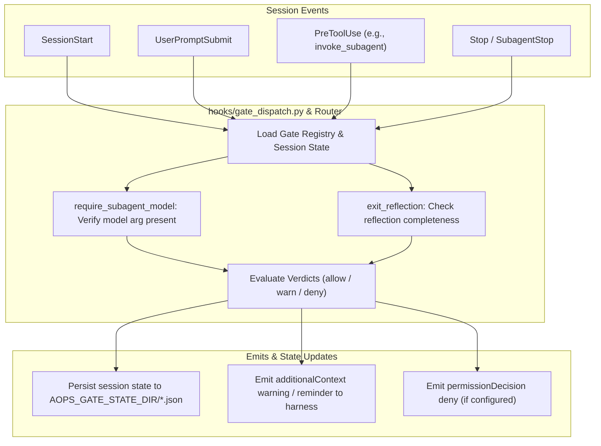

# aops-jr: Coordinator & Face Discipline

`aops-jr` is the head-persona package (`junior` and `ida`). It provides coordinator charters, process gate evaluation, and face-discipline hooks for head personas.

> **Topology Note**: As of `epic_725fd517` (v0.5 topology relocation), **the live `polecat` dispatch CLI and `/dispatch` skill live in `aops` core** (`aops/polecat/` and `aops/skills/dispatch/`). `aops-jr` holds head persona charters (`agents/ida.md`, `agents/junior.md`), face-discipline hook router (`hooks/router.py`), and process gates (`hooks/gates/`).

## Control Flow & Architecture



## Customisation Surface

### Plugin Configuration (`userConfig`)

| Option | Type | Default | Description |
| :--- | :--- | :--- | :--- |
| `gate_state_dir` | `string` | Auto-resolved | Directory path for storing persistent session gate state files. Maps to `AOPS_GATE_STATE_DIR`. |
| `require_subagent_model` | `boolean` | `true` | Enforce that subagent invocations specify an explicit model parameter. |

### Environment Variables

| Variable | Required | Description | Default |
| :--- | :--- | :--- | :--- |
| `AOPS_GATE_STATE_DIR` | Optional | Directory where gate state JSON files are saved. | System temp directory |
| `AOPS_HOOK_LOG_PATH` | Optional | Log file path for gate event execution details. | None |

## Installation & Quickstart

### Claude Code

```bash
claude plugin install aops-jr@academicOps
```

### Antigravity (`agy`)

```bash
agy plugin install ./dist/aops-jr-antigravity
```

## Contents

- `agents/` — Persona charters for Ida (`ida.md`) and Junior (`junior.md`).
- `hooks/` — Face-discipline hook router (`router.py`), gate dispatcher (`gate_dispatch.py`), and gate rules (`gates/`).
- `templates/` — Head-persona templates (`honesty.md`, `verify.md`, `aops-jr.template.json`).
