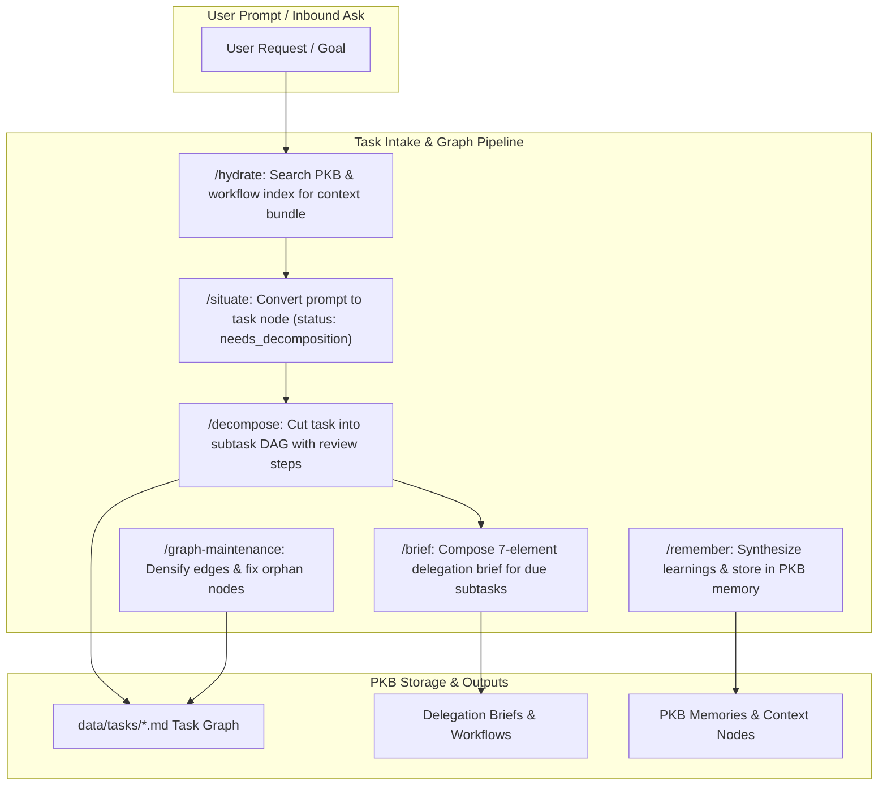

# aops-pkb: Personal Knowledge Base & Task Intake

`aops-pkb` is the knowledge graph and task intake package for academicOps. It contains the Pauli persona (`pauli`), graph maintenance procedures, task intake skills (`hydrate`, `situate`, `decompose`), brief composition (`brief`), and unified memory storage (`remember`).

## Control Flow & Architecture



## Customisation Surface

### Plugin Configuration (`userConfig`)

| Option | Type | Description |
| :--- | :--- | :--- |
| `pkb_mcp_url` | `string` | Endpoint URL of the PKB MCP server (`PKB_MCP_URL`). |
| `aca_data` | `string` | Path to your personal knowledge base root directory (`ACA_DATA`). |

### Environment Variables

| Variable | Required | Description | Default |
| :--- | :--- | :--- | :--- |
| `PKB_MCP_URL` | Yes (remote) | URL for the PKB MCP server (Streamable HTTP or local stdio fallback). | Local stdio |
| `ACA_DATA` | Yes | Path to local personal knowledge base root directory containing tasks and notes. | None |

## Installation & Quickstart

### Claude Code

```bash
claude plugin install aops-pkb@academicOps
```

### Antigravity (`agy`)

```bash
agy plugin install ./dist/aops-pkb-antigravity
```

## Contents

- `agents/pauli.md` — Persona charter for Pauli (design intent & graph guardian).
- `skills/` — Graph and intake skills (`hydrate`, `situate`, `decompose`, `brief`, `remember`, `graph-maintenance`).
- `workflows/` — Standard operating procedures and process indexes (`INDEX.md`, `feature-dev.md`, `tdd.md`, etc.).
- `templates/` — Manifest templates (`aops-pkb.template.json`, `mcp.template.json`).
