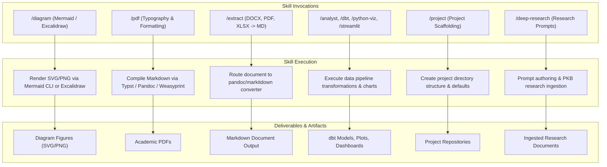

# aops-tools: Academic Domain Skills

`aops-tools` provides **fungible** academic domain skills for the academicOps framework. These skills are optional, specialized tools for data analysis, diagramming, document ingestion, and PDF rendering designed to be swappable when external tooling improves.

## Control Flow & Architecture



## Customisation Surface

### Plugin Configuration (`userConfig`)

| Option | Type | Default | Description |
| :--- | :--- | :--- | :--- |
| `default_diagram_style` | `string` | `"mermaid"` | Default rendering style for the `/diagram` skill (`mermaid` or `excalidraw`). |
| `pdf_engine` | `string` | `"typst"` | Preferred PDF rendering backend for the `/pdf` skill (`typst`, `pandoc`, `weasyprint`). |
| `src_dir` | `string` | Auto-resolved | Search root for project repository discovery (`AOPS_SRC_DIR`). |

### Environment Variables

| Variable | Required | Description | Default |
| :--- | :--- | :--- | :--- |
| `ACA_DATA` | Optional | Path to personal knowledge base data root. | None |
| `AOPS_SRC_DIR` | Optional | Root path for project discovery. | `~/src` |

## Discovery & Path Discipline

- **Path Discovery**: To discover project locations, read `.agents/INDEX.md` in the relevant repo.
- **Fail-Fast Rule**: If documented paths or tools are missing, **STOP and report** — do not invent broad search workarounds.

## Installation

### Claude Code

```bash
claude plugin install aops-tools@academicOps
```

### Antigravity (`agy`)

```bash
agy plugin install ./dist/aops-tools-antigravity
```

## Contents

- `analyst` — Research data analysis (dbt, Streamlit, statistics).
- `dbt` — Data build tool transformation models.
- `deep-research` — Author deep-research prompts & ingest results into PKB.
- `diagram` — Diagram creation (Mermaid or Excalidraw via `style` parameter).
- `extract` — General extraction and ingestion routing (DOCX, PDF, XLSX → markdown).
- `new-project` — Scaffold research project repo structure.
- `pdf` — PDF generation with academic typography.
- `peer-review` — Peer review of grant applications & submissions.
- `python-viz` — Publication-quality figures (Matplotlib, Seaborn, Statsmodels).
- `streamlit` — Streamlit presentation dashboard design.
- `style` — Analyze writing samples and build style guides.
