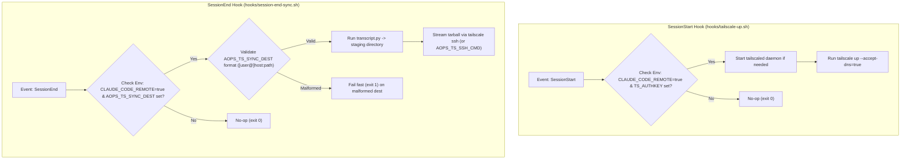

# aops-ts: Tailscale Bring-Up & Transcript Egress

`aops-ts` provides opt-in Tailscale bring-up and transcript egress synchronization for academicOps remote and cloud sessions.

`aops-ts` ships two hooks:
- **`SessionStart`**: Runs `tailscale up` so tailnet-only services — most importantly the **PKB MCP server** at `*.ts.net` — resolve inside a remote session.
- **`SessionEnd`**: Parses session transcripts and ships them to a tailnet host over `tailscale ssh`, preserving transcript records when cloud containers are reclaimed.

## Control Flow & Architecture



## Customisation Surface

### Plugin Configuration (`userConfig`)

| Option | Type | Description |
| :--- | :--- | :--- |
| `sync_dest` | `string` | Transcript egress destination `[user@]host:path` on the tailnet. Maps to `AOPS_TS_SYNC_DEST`. |
| `ssh_cmd` | `string` | Custom SSH command override for transcript egress. Maps to `AOPS_TS_SSH_CMD`. |

### Environment Variables

| Variable | Required | Meaning | Default |
| :--- | :--- | :--- | :--- |
| `CLAUDE_CODE_REMOTE` | Yes (activation) | Hook no-ops unless set to `true` (remote/cloud session indicator). | None |
| `TS_AUTHKEY` | Yes (SessionStart) | Tailscale authentication key used for container bring-up. | None |
| `AOPS_TS_SYNC_DEST` | Yes (SessionEnd) | Destination `[user@]host:path` on the tailnet. Both host and `:path` are required. Malformed destination exits 1. | None |
| `AOPS_TS_SSH_CMD` | Optional | Full remote-shell command override. Defaults to `tailscale ssh` when tailscale is present. | `tailscale ssh` |
| `AOPS_TS_SSH_OPTS` | Optional | Extra SSH options for fallback plain `ssh` (ignored if `AOPS_TS_SSH_CMD` is set). | None |
| `AOPS_SRC_DIR` | Optional | `aops-core` source directory used to locate `transcript.py`. | Plugin cache search |

## Behaviour & Prerequisites

1. **Tailscale installed**: Prerequisites require `tailscale` binary on `PATH`.
2. **`TS_AUTHKEY` set**: Injected at session runtime.
3. **Session Egress Layout**: Destination receives payload structured into `transcripts/`, `summaries/`, and raw JSONL fallback in `incoming/`.

## Installation

```bash
claude plugin install aops-ts@academicOps
```

## Contents

- `hooks/tailscale-up.sh` — `SessionStart` Tailscale bring-up script.
- `hooks/session-end-sync.sh` — `SessionEnd` transcript packaging and SSH streaming script.
- `hooks/hooks.json` — Manifest declaring `SessionStart` and `SessionEnd` hooks.
