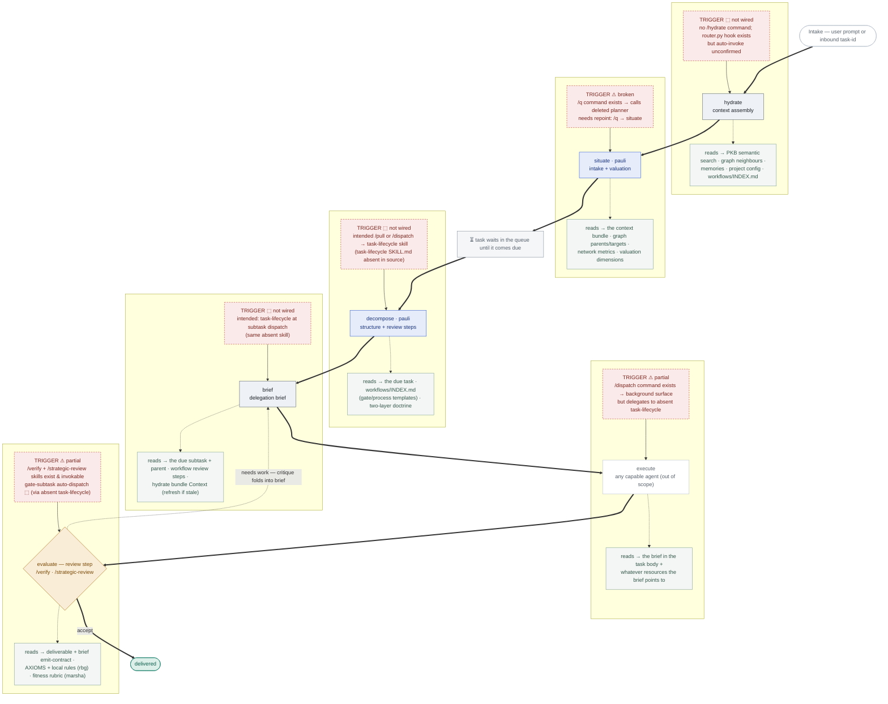
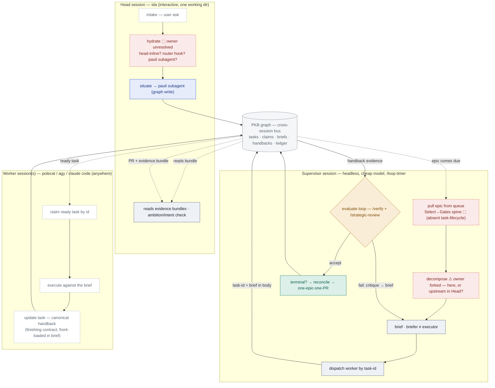
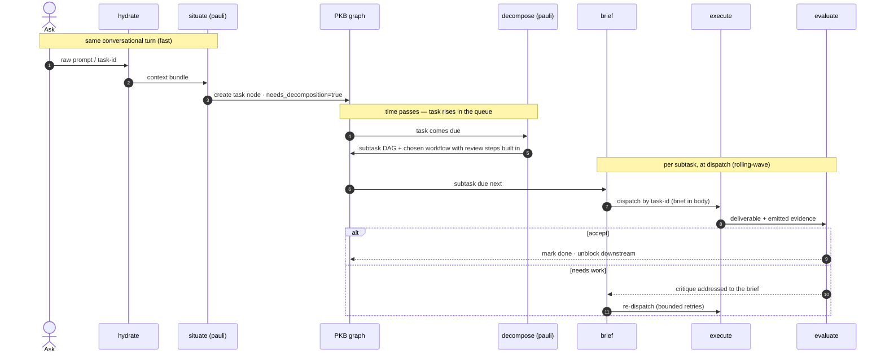

# Workflow-system pipeline — component, trigger & contract reference

Developer documentation for the five-stage pipeline in `aops-extras/skills/`. Covers **how each
stage is triggered**, **where each stage pulls information from**, and the **data contract at each
seam**.

## Architecture in one line

Stages **do not call each other directly**. Each reads from / writes to the **PKB graph** (a task's
frontmatter + body is the message bus); the next stage is triggered by graph state + queue position,
not by a return value.

> ### ⚠ Wiring status (read this first)
>
> The five pipeline **skills are implemented** (`aops-extras/skills/`). The **trigger layer that
> should fire them is not yet repointed** to them — it still targets the now-deleted `planner` skill
> and an absent `task-lifecycle` skill. **Today the pipeline runs only by manual `Skill()`
> invocation.** Every trigger below is marked with its real status: ✅ wired · ⚠ partial/broken · ⬚
> not wired. The blanks are shown as blanks, not glossed over.

## The pipeline, vertically — trigger (left) · stage · sources (right)



## Trigger status — what actually fires each stage (verified against source)

| Stage                    | Intended trigger                                                                                                 | State in source today                                                                                                                                                                                  | Status                                                |
| ------------------------ | ---------------------------------------------------------------------------------------------------------------- | ------------------------------------------------------------------------------------------------------------------------------------------------------------------------------------------------------ | ----------------------------------------------------- |
| `hydrate`                | `router.py` (UserPromptSubmit hook) hydrates every inbound ask, or a `/hydrate` command                          | No `/hydrate` command exists. `router.sh`→`router.py` **is** registered on `UserPromptSubmit` (`aops-core/hooks/hooks.json`), but I did **not** confirm it invokes the new `hydrate` skill.            | ⬚ **not wired / unverified**                          |
| `situate`                | `/q` (capture) → `situate`                                                                                       | `aops-pkb/commands/q.md` exists but runs `Skill(skill="planner", …)` — **`planner` was deleted**.                                                                                                      | ⚠ **broken** — repoint `/q` → `situate`               |
| `decompose`              | `/pull` or `/dispatch` → `task-lifecycle` fires `decompose` when a `needs_decomposition` task comes due          | `/pull` + `/dispatch` commands exist but delegate to a **`task-lifecycle` skill with no `SKILL.md` in source** (`aops-pkb/skills/task-lifecycle/` absent).                                             | ⬚ **not wired**                                       |
| `brief`                  | `task-lifecycle` expands the due subtask into a brief just before dispatch                                       | Same absent `task-lifecycle` skill. Nothing else invokes `brief`.                                                                                                                                      | ⬚ **not wired**                                       |
| _execute_                | `/dispatch` → background surface (polecat / subagent) reads the brief by task-id                                 | `/dispatch` command exists; delegates to the absent `task-lifecycle`.                                                                                                                                  | ⚠ **partial**                                         |
| `evaluate` (review step) | a workflow's review step runs `/verify` or `/strategic-review`; the outer loop advances only once it's satisfied | `/verify` + `/strategic-review` skills **exist and are invokable**. `decompose` writes review steps into the plan, but the **outer loop that enforces them runs through the absent `task-lifecycle`**. | ⚠ **partial** — evaluators present, enforcement blank |

**To actually wire the pipeline, the remaining work is:** repoint `/q`→`situate`; create (or restore) the `task-lifecycle` skill and have it invoke `decompose` (task comes due) and `brief` (subtask dispatch); decide `hydrate`'s trigger (router hook vs. command) and wire it. None of this shipped with the skills — it's the integration layer.

## Review is a workflow step, not a blocking gate

The framework does **not** enforce quality with blocking gate nodes that intercept a running
session. Review is a **step built into the workflow**, and _strict_ enforcement lives **outside the
session** — in the supervisor's cross-session review loop and the PR/merge pipeline.

1. **Where it lives.** `decompose` selects the epic's **outer** workflow (how the epic reaches
   acceptance) and each subtask's **inner** workflow (how a task reaches done). Review steps are
   ordinary steps _inside_ those workflows, stated in plain prose — never separate DAG nodes.
2. **The two near-mandatory reviews** (stated once, at epic level, on every epic):
   - **Independent review before acceptance** — a reviewer identity distinct from the author
     (`/strategic-review`: rbg axioms · pauli premise/strategy · marsha QA → james). The author
     never reviews their own work.
   - **Human sign-off before anything externally-visible ships** — send / publish / prod / spend /
     delete / merge to a protected branch. The one hard line; carried whenever a subtask is one-way.
     Beyond these, match review to stakes — reversible, read-only work needs none.
3. **The review's "work"** = running an evaluator: **`/verify`** (marsha — assume-broken runtime QA;
   quality + claim-reliability) or **`/strategic-review`** (rbg axioms + pauli premise + james).
4. **Enforcement is external.** `decompose` writes the review step into the plan; making it _stick_
   is the outer loop's job — the supervisor advances a subtask only once its inner-workflow review
   step is satisfied, and the PR/merge pipeline holds the human sign-off. No node blocks a running
   worker mid-flight.
5. **What's wired vs. blank.** The evaluator skills (`/verify`, `/strategic-review`) exist and run
   ✅; `decompose` is authored to write review steps into the plan ✅. The **blank ⬚** is the outer
   loop that enforces them across sessions — the supervisor's review-advance depends on the absent
   `task-lifecycle` skill. You can run `/verify` or `/strategic-review` on an artifact manually today.

## Surfaces & sessions — who runs each stage, in which session

The stages don't all run in one place. **Three session types coordinate only through the PKB graph**
— no direct calls across sessions — the same message-bus principle as the in-session seams, now
across process/host boundaries.



### Session roles (grounded in `agents/ida.md` + `aops-core/skills/supervisor/SKILL.md`)

- **Head session — `ida`** (interactive, one working dir): talks to the user; runs intake → hydrate
  → situate, delegating graph writes to a **pauli** subagent _in the same harness session_; reads
  finished **evidence bundles** (never logs); applies the ambition/intent check and blocks
  correct-but-wrong epics. **Never** dispatches or supervises. (ida §Delegation Rule, §Supervision
  Boundary.)
- **Supervisor session** — headless, cheap-model, `/loop`-timer background process; unit of work =
  one **epic**; stateless tick, cross-tick state in the epic body. Reuses the task-lifecycle
  Select→Gates spine, then owns brief composition, worker dispatch, the evaluate/review loop, the
  ledger, terminal detection, and hand-back (one-epic-one-PR). Nic never meets it.
- **Worker session(s)** — polecat / agy / claude-code / any capable agent, **running anywhere**:
  claim a ready task by id, execute against the brief, save the work (PR / evidence), return the
  **canonical structured handback** — the finishing contract the supervisor front-loads into every
  brief (supervisor §5/§7; format in `specs/enforcement/evidence-contract.md`).
- **pauli** — not a session, a **subagent** invoked for graph mutation (sole graph-shaper) inside
  whichever session needs a write (situate / decompose / graph-maintenance).

### Stage → session map

| Stage            | Session / agent               | Invocation                                                                                                          | Status                                                        |
| ---------------- | ----------------------------- | ------------------------------------------------------------------------------------------------------------------- | ------------------------------------------------------------- |
| intake           | head (`ida`)                  | user types                                                                                                          | ✅                                                            |
| hydrate          | ⬚ **unresolved**              | head-inline vs router hook vs pauli/hydrate subagent — not decided                                                  | ⬚ open                                                        |
| situate          | head → pauli subagent         | ida delegates the graph write to pauli                                                                              | ⚠ skill exists; `/q` trigger broken                           |
| decompose        | ⚠ **forked**                  | ida: supervisor gets an _already-decomposed_ epic (⇒ decompose upstream); your model: supervisor decomposes on pull | ⚠ open                                                        |
| brief            | supervisor                    | supervisor composes per subtask at dispatch                                                                         | ⚠ supervisor exists but not yet calling the new `brief` skill |
| execute          | worker (anywhere)             | claims ready task by id                                                                                             | ✅ polecat system                                             |
| evaluate         | supervisor spawns reviewers   | `/verify` + `/strategic-review` as review subtasks                                                                  | ⚠ evaluators exist; auto-dispatch via absent task-lifecycle   |
| reconcile / done | **supervisor** (same session) | terminal detection → one-epic-one-PR                                                                                | ⚠ logic exists; depends on task-lifecycle spine               |

### The unifying principle

Three session types, three hosts, one coordination surface: **the PKB graph is the message bus
across sessions exactly as task bodies are across pipeline stages.** No session calls another
directly — they hand off through task state (`claim_task` / `update_task` / `append` /
`release_task`) and queue position. That is what lets a worker run literally anywhere.

## Component contract table

| # | Component           | Consumes                          | Produces (→ where)                                                                                                | Identity                                           | Tool surface (from frontmatter)                                                                                                 |
| - | ------------------- | --------------------------------- | ----------------------------------------------------------------------------------------------------------------- | -------------------------------------------------- | ------------------------------------------------------------------------------------------------------------------------------- |
| 1 | `hydrate`           | raw prompt **or** task-id         | **context bundle** → task body (`append`) or handed forward in-turn                                               | agnostic                                           | `search, task_search, get_task, get_semantic_neighbors, retrieve_memory, get_dependency_tree, append` — **≤6 calls, read-only** |
| 2 | `situate`           | context bundle                    | **one task node**: parent, `contributes_to` (weight+justification), 6 valuation dims, `needs_decomposition: true` | **pauli**                                          | `create_task, update_task, append, search, task_search, get_network_metrics, get_dependency_tree, AskUserQuestion`              |
| 3 | `decompose`         | due task + `workflows/INDEX.md`   | **unexploded subtask DAG** + chosen **workflow** with **review steps** built in (no blocking gate nodes)          | **pauli**                                          | `get_task, decompose_task, append, search, get_dependency_tree`                                                                 |
| 4 | `brief`             | one due subtask + regime          | **seven-element brief** → subtask body; dispatch by task-id                                                       | agnostic — **briefer ≠ executor**                  | `get_task, append, update_task, get_dependency_tree, Skill, Task`                                                               |
| — | _execute_           | task-id                           | deliverable + emitted evidence                                                                                    | any capable agent                                  | _(out of scope)_                                                                                                                |
| 5 | `/verify`           | deliverable + brief emit-contract | verdict: accept / critique-to-brief / escalate                                                                    | marsha (quality + claim-reliability)               | `Task, Read, Glob, Grep`                                                                                                        |
| 5 | `/strategic-review` | deliverable + emit-contract       | verdict (compliance lens)                                                                                         | rbg (axioms) + pauli (premise) + james (synthesis) | `Agent, Bash, Read, Glob, Grep, AskUserQuestion`                                                                                |

**Loop:** on FAIL the critique is addressed to the _brief_ → `brief` updates → re-dispatch. **Thin or
missing emitted evidence is itself a FAIL** — not a licence to re-investigate from scratch.

## Seam contracts (the exact records passed)

**hydrate → situate — the context bundle** (four named sections, written to the task body):

```markdown
## Intent — one-sentence restatement of the ask

## Context — prior knowledge/attempts/decisions, each with a spot-checkable node id

## Standards — applicable obligations, from workflows/INDEX.md + project config

## Dependencies — known blocking/related task ids
```

**decompose → brief — DAG row + regime record:**

```
DAG row:  | id | one-line scope | door-type (two-way|one-way) | depends_on |
Regime:   Process: <template…> · Gates: <template…> · Standing: <template…>   (by name, from workflows/INDEX.md)
```

**brief → execute — the seven-element brief** (prose, in the subtask body, never a step-script):
Intent (+why) · Scoped context (incl. the hydrate bundle's `## Context`) · Constraints · Autonomy +
non-goals · Done + observable AC · Emit-for-evaluation contract (rubric · claim-provenance ·
procedural record) · Effort budget + door-type.

**execute → evaluate — the emit-for-evaluation contract:** element 6 of the brief _is_ the
evaluator's evidence spec; the evaluator judges emitted evidence against the pre-agreed rubric, it
does not re-run the work.

## Intended fire order (⚠ several triggers not yet wired — see status table)



## Invariants

- **pauli owns graph mutation** — only `situate`, `decompose`, `graph-maintenance` write graph
  structure (single authoritative writer for edges/scores).
- **briefer ≠ executor** — the identity that writes a brief never executes it; enforced structurally
  (`brief` dispatches by task-id, never inlines the brief text).
- **Rolling-wave** — `decompose` leaves subtasks coarse; `brief` pays the detail cost only for the
  subtask dispatching now.
- **Templates are composed, not invented** — `decompose` selects from `workflows/INDEX.md`; a missing
  template is a flagged library gap, never freelanced.
