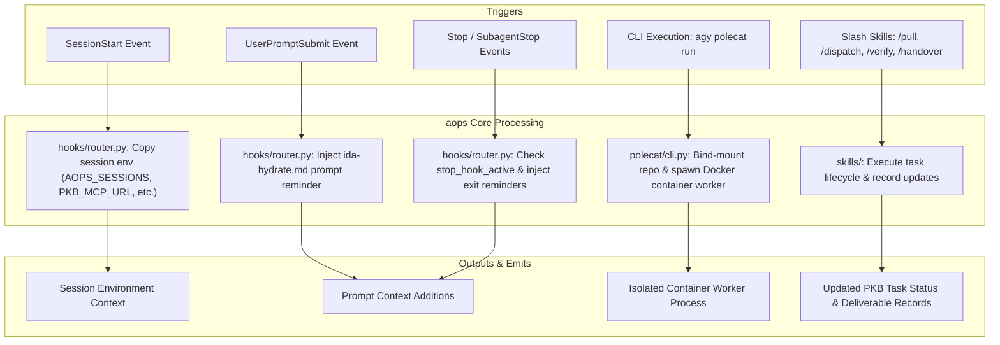

# aops: Core Framework

`aops` is the core framework plugin for academicOps. It provides session hooks, the Polecat containerized worker runtime, environment bootstrapping, and core task-lifecycle skills.

## Control Flow & Architecture



## Customisation Surface

`aops` exposes discoverable user configuration and environment variables to customize its runtime behavior.

### Plugin Configuration (`userConfig`)

| Option | Type | Description |
| :--- | :--- | :--- |
| `pkb_mcp_url` | `string` | URL of your academicOps PKB MCP server (Streamable HTTP). |
| `bot_gh_token` | `string` | GitHub personal access token for git/gh operations. Sets `AOPS_BOT_GH_TOKEN`. |
| `src_dir` | `string` | Default root directory for project repository discovery. Sets `AOPS_SRC_DIR`. |
| `sessions_dir` | `string` | Path to the local sessions registry repository. Sets `AOPS_SESSIONS`. |

### Environment Variables

| Variable | Required | Description | Default |
| :--- | :--- | :--- | :--- |
| `AOPS_BOT_GH_TOKEN` | Yes (git/gh) | GitHub token for git and `gh` operations (enforced by `require_aops_bot_gh_token.py`). | None |
| `PKB_MCP_URL` | Optional | Endpoint URL for the PKB MCP server. | Local stdio |
| `AOPS_SRC_DIR` | Optional | Default search root for project repositories. | `~/src` |
| `AOPS_SESSIONS` | Optional | Path to sessions repository holding `polecat.yaml`. | `$POLECAT_HOME/sessions` |
| `AOPS_POLECAT_CONFIG` | Optional | Explicit path to `polecat.yaml` registry file. | Auto-resolved |
| `AOPS_POLECAT_CONTAINER` | Internal | Set to `1` inside Polecat container execution environments. | None |
| `AOPS_CC_OAUTH_TOKEN` | Optional | OAuth token for Claude Code inside container execution. | None |
| `CLAUDE_ENV_FILE` | Optional | Target file for writing exported variables during `SessionStart`. | None |
| `AOPS_HOOK_LOG_PATH` | Optional | Destination path for JSONL log of hook router events. | None |

## Installation & Quickstart

### Claude Code

```bash
claude plugin install aops@academicOps
```

### Antigravity (`agy`)

```bash
agy plugin install ./dist/aops-antigravity
```

## Contents

- `polecat/` — Polecat worker CLI (`cli.py`), entrypoint scripts, and default container configurations.
- `hooks/` — Core hook router (`router.py`) and basic safety gates (`require_aops_bot_gh_token.py`).
- `skills/` — Core lifecycle skills (`pull`, `dispatch`, `verify`, `handover`, `strategic-review`).
- `scripts/` — Helper scripts (`run-mcp.sh`, `ensure-path.sh`).
- `templates/` — Manifest templates and prompt reminders (`ida-hydrate.md`, `aops.template.json`).
