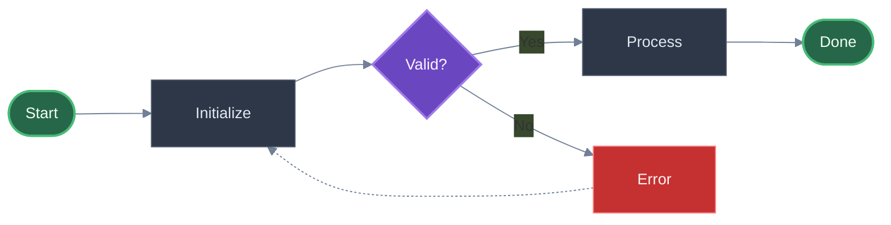

# Flowchart Templates and Examples

Reference templates for common Mermaid flowchart patterns.

## Template: Horizontal Process Flow (Recommended)

## Template: Horizontal Multi-Phase Workflow

For complex workflows, arrange phases horizontally with vertical steps inside:

```mermaid
%%{init: {
  'theme': 'base',
  'themeVariables': { 'lineColor': '#718096', 'fontSize': '14px' },
  'flowchart': { 'nodeSpacing': 50, 'rankSpacing': 60, 'padding': 15 }
}}%%
flowchart LR
    classDef phase fill:#1a202c,stroke:#4a5568,color:#e2e8f0
    classDef step fill:#2d3748,stroke:#4a5568,color:#e2e8f0
    classDef check fill:#6b46c1,stroke:#9f7aea,color:#faf5ff,stroke-width:2px

    subgraph SETUP["SETUP"]
        direction TB
        S1[Load config]:::step
        S2[Validate]:::step
        S1 --> S2
    end

    subgraph PROCESS["PROCESS"]
        direction TB
        P1[Execute]:::step
        P2{OK?}:::check
        P3[Commit]:::step
        P1 --> P2
        P2 -->|Yes| P3
    end

    subgraph CLEANUP["CLEANUP"]
        direction TB
        C1[Release]:::step
        C2[Report]:::step
        C1 --> C2
    end

    SETUP --> PROCESS
    PROCESS --> CLEANUP
    P2 -->|No| S1

    style SETUP fill:#1a365d,stroke:#2b6cb0
    style PROCESS fill:#22543d,stroke:#38a169
    style CLEANUP fill:#744210,stroke:#d69e2e
```

## Example: Complex System Flow (Horizontal)

For multi-phase systems like hook pipelines, use horizontal layout with vertical subgraph internals:

```mermaid
---
config:
  layout: elk
  elk:
    mergeEdges: true
---
%%{init: {
  'theme': 'base',
  'themeVariables': {
    'primaryColor': '#1e293b',
    'lineColor': '#64748b',
    'fontSize': '13px'
  },
  'flowchart': { 'nodeSpacing': 50, 'rankSpacing': 55, 'padding': 12 }
}}%%
flowchart LR
    classDef default fill:#334155,stroke:#475569,color:#e2e8f0
    classDef entry fill:#166534,stroke:#22c55e,color:#f0fdf4,stroke-width:2px
    classDef gate fill:#7c3aed,stroke:#a78bfa,color:#f5f3ff,stroke-width:2px
    classDef state fill:#0369a1,stroke:#38bdf8,color:#f0f9ff

    IN([Prompt]):::entry

    subgraph PRE["PRE-ACTION"]
        direction TB
        H1[Hook fires]
        H2[Load state]:::state
        H3[Spawn hydrator]:::gate
        H1 --> H2 --> H3
    end

    subgraph EXEC["EXECUTION"]
        direction TB
        A1[Agent executes]
        A2{Gate check}:::gate
        A3[Tool runs]
        A1 --> A2
        A2 -->|Pass| A3
    end

    subgraph POST["POST-ACTION"]
        direction TB
        P1[Increment counter]
        P2{Threshold?}:::gate
        P3[Spawn audit]
        P1 --> P2
        P2 -->|Yes| P3
    end

    OUT([Done]):::entry

    IN --> PRE
    PRE --> EXEC
    EXEC --> POST
    POST --> OUT
    A2 -->|Fail| H3

    style PRE fill:#1e3a5f,stroke:#3b82f6
    style EXEC fill:#14532d,stroke:#22c55e
    style POST fill:#581c87,stroke:#a855f7
```

**Key techniques used**:

- `layout: elk` for automatic optimal positioning
- `flowchart LR` with `direction TB` subgraphs
- 4 colors only: default (slate), entry (green), gate (purple), state (blue)
- Links between subgraphs, not internal nodes
- Generous spacing (50/55) with padding
