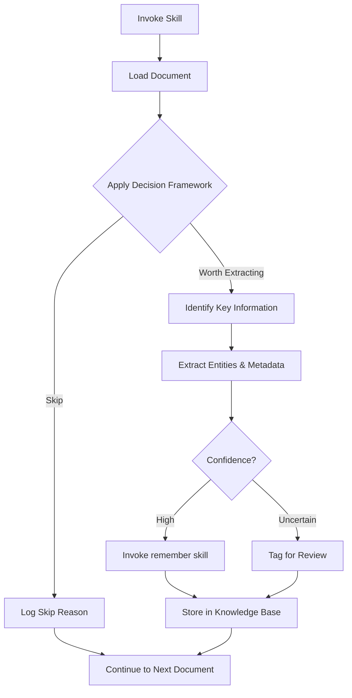

# Extractor Skill

**Status**: Implemented
See [[skills/extractor/SKILL.md]] for full implementation.

## Workflow



## Purpose

Filter noise from archival documents (emails, correspondence, receipts) and identify genuinely significant information worth preserving. Most documents have NO long-term value - be highly selective.

## Problem Statement

Archival documents accumulate rapidly:

- Hundreds of emails per week
- Mixed signal-to-noise ratio
- Important milestones buried in routine correspondence
- Financial records scattered across inboxes
- Relationship context lost over time

Without systematic extraction:

- Important milestones forgotten
- Collaborator context unavailable when needed
- Financial records missing at acquittal time
- Research outcomes undocumented

## Solution

LLM-powered semantic judgment to identify extractable information, with strict criteria to avoid noise. The skill provides assessment logic only - actual storage delegates to the `remember` skill.

## How It Works

### Invocation

```
Skill(skill="extractor")
```

Invoke when processing archival documents, email batches, or correspondence files.

### Core Behaviors

**1. Decision Framework (CRITICAL)**

For each document, apply LLM judgment:

| Question                                                 | If NO, skip |
| -------------------------------------------------------- | ----------- |
| Important enough to mention at monthly research meeting? | Skip        |
| Would I want to remember this in 5 years?                | Skip        |
| Is this a concrete outcome, not just noise?              | Skip        |
| Did Nic take significant action (not passive/routine)?   | Skip        |

**2. Extraction Categories**

| Category                 | Extract                                     | Skip                                 |
| ------------------------ | ------------------------------------------- | ------------------------------------ |
| Projects & Publications  | Submissions, acceptances, publications      | CFPs, generic invitations            |
| Professional Activities  | Events organized, talks given, reviews done | Invitations declined, reminders      |
| Applications & Career    | Submitted applications, outcomes            | Drafts, ideas, planning              |
| Contacts & Relationships | New collaborations, significant connections | Routine correspondence               |
| Financial Records        | Receipts, invoices, contracts               | N/A (always extract if identifiable) |

**3. Key Information to Extract**

When extracting, identify:

- **People**: Names, affiliations, roles, relationship to Nic
- **Organizations**: Institutions, funding bodies, conferences
- **Events**: Conferences, speaking engagements, significant meetings
- **Projects**: Research topics, grant proposals, collaborations
- **Dates**: When correspondence occurred, event timelines
- **Identifiers**: Message IDs, DOIs, URLs (CRITICAL for future reference)

**4. Storage Delegation**

All storage handled by `remember` skill:

```
Skill(skill="remember")
```

Tag appropriately: `#email`, `#correspondence`, `#project`, `#financial`

### Confidence Handling

| Confidence | Action                                    |
| ---------- | ----------------------------------------- |
| High       | Extract and store via remember skill      |
| Uncertain  | Extract with `#review-classification` tag |
| Skip       | Log reason, continue to next document     |

## Relationships

### Depends On

- [[remember]] for knowledge base storage
- Outlook MCP for email access (when processing inbox)
- [[convert-to-md]] for document conversion

### Used By

- [[email]] skill for email-to-task workflow
- [[daily]] skill for email triage
- Manual archive processing sessions

### Framework Integration

This is a judgment skill - provides criteria, not automation. Human review expected for uncertain cases.

## Success Criteria

1. **High precision**: Extracted items are genuinely significant (>90% valuable)
2. **Acceptable recall**: Major milestones captured (tolerate missing minor items)
3. **Canonical identifiers**: Every extraction includes source reference
4. **Clean delegation**: Storage always via remember skill, never direct writes
5. **Fail-fast on ambiguity**: Uncertain items tagged, not guessed

## Design Rationale

**Why LLM judgment over patterns?**

Per AXIOM #30 (semantic classification), regex patterns miss context. "Grant" in subject line could be a name or funding. LLM judgment handles nuance.

**Why high selectivity?**

Knowledge base value degrades with noise. Better to miss a minor item than pollute with routine correspondence. Monthly research meeting test ensures significance threshold.

**Why delegate storage?**

Single responsibility. Extractor provides judgment; remember handles formatting, deduplication, and storage mechanics. Clean separation of concerns.

**Why require identifiers?**

Future reference and verification. When a memory entry says "paper accepted", the identifier enables finding the original email for details.

## Axiom Derivations

| Axiom                       | Application                                      |
| --------------------------- | ------------------------------------------------ |
| #3 Don't Make Shit Up       | Extract only what's clearly present in document  |
| #5 Do One Thing             | Assess and extract, delegate storage to remember |
| #8 Fail-Fast                | Skip ambiguous documents rather than guess       |
| #30 Semantic Classification | Use LLM judgment, not regex patterns             |
| #29 Maintain Integrity      | Canonical identifiers preserve relational links  |
