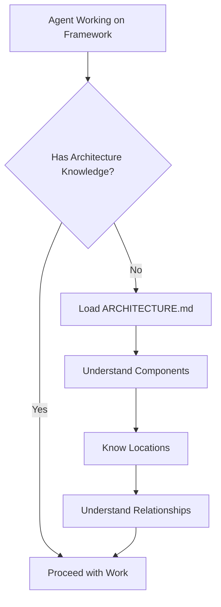

# Framework-Aware Operations

**Status**: Requirement (not yet implemented)

## Workflow

## Original Request

"When working on framework issues, agents have accurate architectural knowledge"

Context: learning-log skill incorrectly stated "skills ARE the slash commands" when commands and skills are separate namespaces. Agent lacked knowledge that /meta and /framework skills have.

## Feature Summary

When any agent works on framework-related issues (bugs, features, changes), it should have accurate knowledge of the framework architecture - what components exist, where they live, and how they relate.

## Requirements

### Functional Requirements

**Core functionality**:

1. Agents working on framework issues MUST know the component architecture (commands vs skills vs hooks vs agents)
2. Agents MUST know where components live (`$AOPS/commands/`, `$AOPS/skills/`, etc.)
3. Agents MUST understand relationships between components (e.g., commands invoke skills, hooks inject context)

**System behavior**:

- When agent makes claims about framework architecture, claims are accurate
- When agent is uncertain about architecture, it verifies before proceeding

### Non-Functional Requirements

**Performance**: Architectural knowledge should be available without requiring file reads each time
**Maintainability**: Single source of truth for architecture - not duplicated across skills

### Out of Scope

- Teaching agents about Claude Code internals (outside our control)
- Making agents omniscient about all implementation details

## Success Criteria

1. **Accuracy**: Agent correctly identifies component type (command vs skill vs hook) when discussing framework issues
2. **Location**: Agent knows correct paths for each component type
3. **Relationships**: Agent understands how components connect (e.g., `/do` command enriches prompts via prompt hydration)
4. **No false claims**: Agent doesn't make up relationships or components that don't exist

**Acceptance**:

- [ ] Test case: Ask "what's the difference between commands and skills?" → accurate answer
- [ ] Test case: Ask "where does X live?" → correct path
- [ ] Test case: Framework debugging doesn't produce architectural misunderstandings

## Context

**User need**: Framework owner wants to delegate framework management to agents without constantly correcting basic misunderstandings

**Current behavior**: Skills operate in silos. learning-log doesn't know what /meta knows. Each skill has its own limited view.

**Desired behavior**: Any agent working on framework issues has a shared, accurate mental model of the architecture.

## Implementation Options

1. **Shared reference file**: `$AOPS/ARCHITECTURE.md` loaded by relevant skills
2. **Memory server**: Store architecture facts, retrieve when relevant
3. **Mandatory framework skill invocation**: All framework-related work goes through /framework first
4. **Embedded summaries**: Each skill that touches framework includes brief architecture reference

## Questions & Decisions

- **Q**: Should this be a separate file or integrated into existing FRAMEWORK-PATHS.md?
  - **A**: TBD

- **Q**: Which skills need this knowledge?
  - **A**: At minimum: learning-log, framework, meta

## Notes

Triggered by LOG entry 2025-12-23 14:05 - learning-log incorrectly claimed skills ARE commands.
