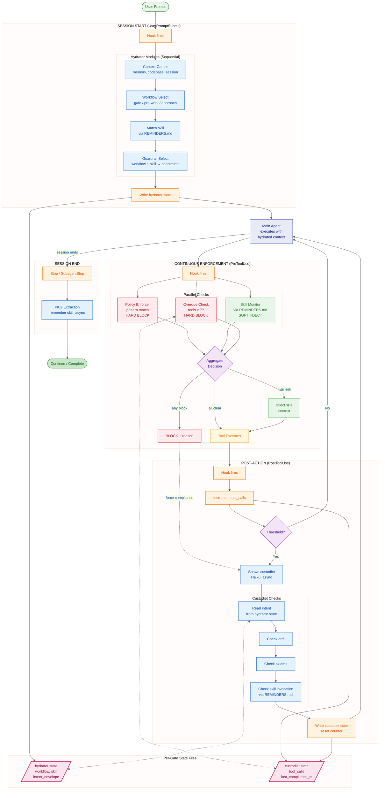

# Gate Agent Architecture

Unified architecture for gate agents that control session flow.

## Gate Functions

Gate agents perform distinct functions across three execution phases:

### Session Start (UserPromptSubmit)

| Function             | Purpose                                             | Owner           |
| -------------------- | --------------------------------------------------- | --------------- |
| **Context Gather**   | Retrieve relevant info (memory, codebase, session)  | prompt-hydrator |
| **Workflow Select**  | Choose approach dimensions (gate/pre-work/approach) | prompt-hydrator |
| **Initial Skill**    | Identify domain expertise needed for prompt         | prompt-hydrator |
| **Guardrail Select** | Pick applicable constraints from RULES.md           | prompt-hydrator |

### Continuous Enforcement (PreToolUse) - Parallel Execution

| Function            | Purpose                                    | Owner              | Type        |
| ------------------- | ------------------------------------------ | ------------------ | ----------- |
| **Hydration Gate**  | Block ALL tools until hydrator invoked     | hydration_gate.py  | Hard block  |
| **Policy Enforcer** | Block mechanical violations (patterns)     | policy_enforcer.py | Hard block  |
| **Skill Monitor**   | Detect domain drift, inject skill context  | skill_monitor.py   | Soft inject |
| **Overdue Check**   | Block mutating tools if compliance overdue | pre_tool_use.py    | Hard block  |

### Post-Action Gates (PostToolUse, Stop, SubagentStop)

| Function                 | Purpose                                      | Owner          |
| ------------------------ | -------------------------------------------- | -------------- |
| **Compliance Check**     | Detect ultra vires actions, drift from scope | custodiet      |
| **Knowledge Extraction** | Capture decisions/learnings to PKG           | remember skill |

## Architecture Overview



### Legend

| Color  | Component Type                 |
| ------ | ------------------------------ |
| Green  | Entry/Exit points, soft inject |
| Orange | Hook mechanics (Python)        |
| Blue   | Gate agents (Haiku LLM)        |
| Pink   | Per-gate state files           |
| Purple | Decision points                |
| Yellow | Tool execution                 |
| Red    | Hard blocks                    |

## Design Principle: Internal Modules, Not Separate Agents

Gate functions are **conceptually separate** but **executed together** within a single agent invocation per hook. Rationale:

1. **Latency**: Separate agents add sequential overhead
2. **Dependencies**: Workflow selection depends on context; guardrails depend on workflow
3. **Token efficiency**: Single agent call with temp file is cheaper than multiple

Each gate agent internally runs modules in order, but the user sees one agent per hook.

## Module Input/Output Specifications

Each module receives targeted context (not full transcript) for token efficiency.

### Session Start Modules (Hydrator)

| Module               | Inputs (from transcript/state)                                     | Token Budget | Output                                          |
| -------------------- | ------------------------------------------------------------------ | ------------ | ----------------------------------------------- |
| **Context Gather**   | Current prompt, last 3 user prompts, active skill from prior state | ~150         | Relevant context bundle                         |
| **Workflow Select**  | Current prompt, context bundle                                     | ~100         | `declared_workflow: {gate, pre_work, approach}` |
| **Initial Skill**    | Current prompt, context bundle, file paths mentioned               | ~50          | `active_skill: string`                          |
| **Guardrail Select** | Workflow + skill decisions                                         | ~50          | `guardrails: string[]`                          |

**Template writes to temp file** (`/tmp/claude-hydrator/hydrate_{id}.md`):

```markdown
# Prompt Hydration Request

## User Prompt

{current_prompt}

## Session Context

- Recent prompts: {last_3_prompts}
- Active skill: {previous_active_skill}
- Todos: {todo_counts}

## Your Task

[workflow selection instructions]
```

### Continuous Enforcement Modules (PreToolUse)

| Module              | Inputs                                                                        | Token Budget | Output                              |
| ------------------- | ----------------------------------------------------------------------------- | ------------ | ----------------------------------- |
| **Hydration Gate**  | `hydration_pending` from hydrator state, tool name, tool args                 | 0 (no LLM)   | `block` or `allow`                  |
| **Policy Enforcer** | Tool name, tool args (pattern match only)                                     | 0 (no LLM)   | `block` or `allow`                  |
| **Skill Monitor**   | Tool name, tool args (file paths), current `active_skill` from hydrator state | ~50          | `inject: {skill context}` or `none` |
| **Overdue Check**   | `tool_calls_since_compliance` from custodiet state                            | 0 (no LLM)   | `block` or `allow`                  |

**Hydration Gate logic**:

1. UserPromptSubmit sets `hydration_pending=true` in hydrator state (unless prompt starts with `/` or `.`)
2. PreToolUse (`hydration_gate.py`) blocks ALL tools while `hydration_pending=true`
3. When `Task(subagent_type="prompt-hydrator")` is detected, the gate clears and allows
4. Agent cannot bypass: deny rules block Write/Edit to `/tmp/claude-session/**`
5. Override: User can prefix next prompt with `.` to skip hydration

**Skill Monitor domain signals** (no LLM, pattern matching):

Domain patterns sourced from [[REMINDERS.md]] Skill Invocation Triggers table. Example patterns:

```python
# See REMINDERS.md for authoritative mapping
DOMAIN_PATTERNS = {
    "framework": ["hooks/", "skills/", "agents/", "AXIOMS", "HEURISTICS", "REMINDERS"],
    "python-dev": [".py", "pytest", "mypy", "ruff"],
    "analyst": ["dbt/", "streamlit", ".sql"],
}
```

**On domain drift**, injects skill summary (not full skill file):

```markdown
## Skill Context Injection

Domain shifted to: {new_domain}
Active skill: {skill_name}

Key constraints:

- {constraint_1}
- {constraint_2}
```

### Post-Action Modules (Custodiet)

| Module                     | Inputs                                                     | Token Budget | Output                 |
| -------------------------- | ---------------------------------------------------------- | ------------ | ---------------------- |
| **Read Intent**            | `intent_envelope` from hydrator state                      | ~30          | Intent context         |
| **Check Drift**            | Intent + last 5 tool calls (name + truncated args)         | ~150         | Drift assessment       |
| **Check Axioms**           | Relevant axioms for declared workflow (Jinja2 conditional) | ~100         | Axiom violations       |
| **Skill Invocation Check** | TodoWrite items + [[REMINDERS.md]] triggers                | ~50          | Missing skill warnings |

**Skill Invocation Check**: Reviews TodoWrite items against [[REMINDERS.md]] skill triggers. If work matches a domain but no skill invocation is evident, issues H2 (Skill-First Action) reminder.

**Template** (`custodiet-context.j2`):

```jinja2
# Compliance Check

## Original Intent
{{ intent_envelope }}

## Declared Workflow
{{ declared_workflow }}

## Recent Tool Calls (since last check)

- {{ tool.name }}({{ tool.args | truncate(80) }})



## Relevant Axioms
- #28: Mandatory Acceptance Testing

```

## Per-Gate State Files

Each gate owns its own state file. Cross-gate reads are read-only.

### Hydrator State

**Location**: `/tmp/claude-session/hydrator-{project_hash}.json`

**Owner**: UserPromptSubmit hook (write), PreToolUse/PostToolUse (read-only)

```json
{
  "last_hydration_ts": 1736234567.89,
  "declared_workflow": {
    "gate": "none",
    "pre_work": "verify-first",
    "approach": "direct"
  },
  "active_skill": "framework",
  "intent_envelope": "fix the type error in parser.py",
  "guardrails": ["verify_before_complete", "fix_within_design"],
  "hydration_pending": false
}
```

**Note**: `hydration_pending` is set `true` by UserPromptSubmit (unless prompt starts with `/` or `.`). Cleared only when `hydration_gate.py` detects `Task(subagent_type="prompt-hydrator")`. This is a mechanical trigger the agent cannot bypass.

### Custodiet State

**Location**: `/tmp/claude-session/custodiet-{project_hash}.json`

**Owner**: PostToolUse hook (write), PreToolUse (read-only for overdue check)

```json
{
  "last_compliance_ts": 1736234890.12,
  "tool_calls_since_compliance": 4,
  "last_drift_warning": null
}
```

### Atomic Updates

Hooks use write-then-rename for atomic updates:

```python
temp_path = state_path.with_suffix('.tmp')
temp_path.write_text(json.dumps(state))
temp_path.rename(state_path)
```

## Overdue Enforcement

### Thresholds

| Metric                        | Threshold | Enforcement                   |
| ----------------------------- | --------- | ----------------------------- |
| `tool_calls_since_compliance` | 7         | Hard block on Edit/Write/Bash |

### Enforcement Levels

| Tool Category                | If Gate Overdue                |
| ---------------------------- | ------------------------------ |
| Mutating (Edit, Write, Bash) | Block until gate runs          |
| Read-only (Read, Glob, Grep) | Soft reminder only             |
| MCP tools                    | Block if writes, soft if reads |

### Overdue Enforcement Implementation

PreToolUse hook checks session state before allowing mutating tools:

```python
state = load_session_state()
if state["tool_calls_since_compliance"] >= THRESHOLD:
    return {
        "decision": "block",
        "reason": "Compliance check overdue. Spawn custodiet first."
    }
```

## Transcript Processor

Single implementation for extracting gate-relevant information from session transcripts.

### API

```python
def extract_gate_context(
    transcript_path: Path,
    include: set[str],
    max_turns: int = 5,
) -> dict[str, Any]:
    """Extract configurable context for gate agents.

    Args:
        transcript_path: Path to session JSONL
        include: Set of extraction types
        max_turns: Lookback limit for prompts/tools

    Returns:
        Dict with requested context sections
    """
```

### Extraction Types

| Type        | Contents                                      | Used By             |
| ----------- | --------------------------------------------- | ------------------- |
| `prompts`   | Last N user prompts (cleaned)                 | hydrator            |
| `skill`     | Most recent Skill invocation                  | hydrator, custodiet |
| `todos`     | TodoWrite state (counts, in_progress)         | hydrator, custodiet |
| `intent`    | First non-meta user prompt (original request) | custodiet           |
| `errors`    | Recent tool errors                            | custodiet           |
| `tools`     | Recent tool calls with args                   | custodiet           |
| `files`     | Files modified in session                     | PKG extraction      |
| `decisions` | User statements indicating decisions          | PKG extraction      |

### Location

`lib/session_reader.py` - extends existing `extract_router_context()`.

## Template System

### When to Use Jinja2

Convert to Jinja2 (`.j2` extension) when template needs:

- Conditional sections based on context
- Loops over variable-length data
- Includes of shared fragments

Keep as markdown with `{var}` substitution when:

- Simple variable replacement only
- No conditional logic needed

### Current Templates

| Template                          | Format     | Reason                                |
| --------------------------------- | ---------- | ------------------------------------- |
| `prompt-hydrator-context.md`      | Markdown   | Simple substitution                   |
| `prompt-hydration-instruction.md` | Markdown   | Simple substitution                   |
| `custodiet-context.md`            | **Jinja2** | Conditional axiom/heuristic injection |
| `custodiet-instruction.md`        | Markdown   | Simple substitution                   |

### Jinja2 Environment

```python
from jinja2 import Environment, FileSystemLoader

env = Environment(
    loader=FileSystemLoader(TEMPLATES_DIR),
    trim_blocks=True,
    lstrip_blocks=True,
)
```

## Knowledge Extraction (PKG)

### Trigger Points

| Hook         | Condition               | Extraction Type        |
| ------------ | ----------------------- | ---------------------- |
| Stop         | Session ending          | Full session decisions |
| SubagentStop | Subagent completed work | Subagent outcomes      |
| PostToolUse  | (reserved)              | (not implemented)      |

### What Gets Extracted

Per [[skills/remember/SKILL.md]]:

| Content Type                | Destination                  |
| --------------------------- | ---------------------------- |
| User preferences discovered | `$ACA_DATA/context/`         |
| Project decisions           | `$ACA_DATA/projects/<name>/` |
| Tool usage patterns         | Memory server only           |
| Workflow observations       | bd issues (episodic)         |

### PKG Extraction Implementation

Background subagent using remember skill:

```python
Task(
    subagent_type="general-purpose",
    model="haiku",
    run_in_background=True,
    description="PKG extraction",
    prompt="Extract and persist key decisions from this session..."
)
```

## Relationship to Other Specs

| Spec                            | Relationship                         |
| ------------------------------- | ------------------------------------ |
| [[specs/prompt-hydration]]      | Pre-action gate implementation       |
| [[specs/ultra-vires-custodiet]] | Post-action gate implementation      |
| [[specs/execution-flow-spec]]   | Shows where gates fit in flow        |
| [[RULES.md]]                    | Guardrail definitions                |
| [[REMINDERS.md]]                | Skill invocation triggers (static)   |
| [[AXIOMS.md]]                   | Inviolable principles for compliance |
| [[HEURISTICS.md]]               | Empirical patterns for drift checks  |

## Files

| File                          | Purpose                                         |
| ----------------------------- | ----------------------------------------------- |
| `lib/session_reader.py`       | Transcript processor (`extract_gate_context()`) |
| `lib/session_state.py`        | Session state management                        |
| `hooks/user_prompt_submit.py` | Pre-action gate hook (sets `hydration_pending`) |
| `hooks/hydration_gate.py`     | PreToolUse gate (blocks until hydrator invoked) |
| `hooks/custodiet_gate.py`     | Post-action gate hook                           |
| `hooks/templates/*.j2`        | Jinja2 templates                                |
| `hooks/templates/*.md`        | Simple markdown templates                       |
