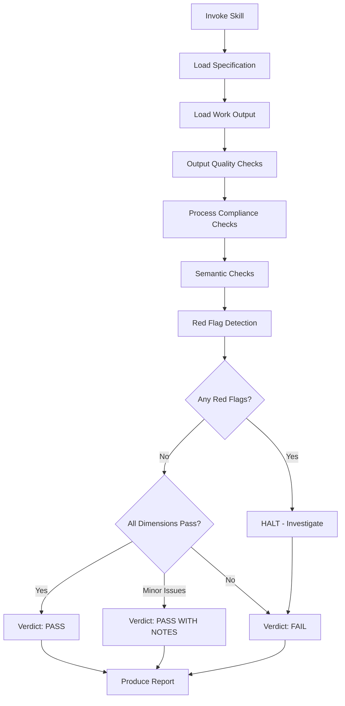

# QA Evaluation Skill

**Status**: Implemented
See [[skills/qa-eval/SKILL.md]] for full implementation.

## Workflow



## Purpose

Provide rigorous, cynical verification that work **actually achieves** what the user needs - not just that tests pass or agents claim success.

**Core principle**: Tests passing ≠ success. Success = the system works as intended with real data in production contexts.

## Problem Statement

Agents often claim success based on:

- Tests passing (but tests may be incomplete or Volkswagen tests)
- Surface-level checks (file exists, field present)
- Self-reported completion (no independent verification)

Users need an independent verification process that:

1. Checks actual outcomes, not proximate indicators
2. Compares results against specifications
3. Applies cynical scrutiny (assume broken until proven working)
4. Produces actionable findings

## Axiom Derivations

| Axiom                               | Application                                               |
| ----------------------------------- | --------------------------------------------------------- |
| #8 Fail-Fast (Code)                 | If verification cannot complete, HALT - don't rationalize |
| #26 Verify First                    | Check actual state, never assume from reports             |
| #27 No Excuses                      | Everything must work - no partial success                 |
| #31 Acceptance Criteria Own Success | Only user-defined criteria determine completion           |

## Scope

### In Scope

- Verifying work output against specification
- Checking process compliance against workflow requirements
- Detecting Volkswagen tests (tests that pass without verifying behavior)
- Producing structured verification reports
- Identifying gaps between claimed and actual outcomes

### Out of Scope

- Making implementation decisions
- Modifying code to fix issues (report only)
- Changing specifications or requirements
- Approving work without real-world testing

## Verification Model

### Three Verification Dimensions

1. **Output Quality** - Does the result match what was specified?
2. **Process Compliance** - Did the work follow required workflow?
3. **Semantic Correctness** - Does the result make sense for its purpose?

### Cynical Verification Mindset

**Default assumption: IT'S BROKEN.** The skill must PROVE it works, not confirm it works.

**Triple-Check Protocol** (for every claim):

1. READ THE FULL OUTPUT - not summaries, not first lines
2. LOOK FOR EMPTY/PLACEHOLDER DATA - empty sections, repeated headers, unfilled templates
3. VERIFY SEMANTIC CONTENT - does data MAKE SENSE? Is it REAL or GARBAGE?

### Red Flags (HALT triggers)

Any of these require immediate investigation:

- Repeated section headers (template/variable bug)
- Empty sections between headers
- Placeholder text (`{variable}`, `TODO`)
- Suspiciously short output for complex operations
- "Success" claims without showing actual output
- Tests that check existence but not content
- Silent error handling (try/except swallowing errors)

## Input Requirements

The skill requires:

1. **Specification** - What the work SHOULD produce (file path, inline spec, or reference)
2. **Work output** - What was actually produced (file path, command output, or reference)
3. **Context** (optional) - User requirements, acceptance criteria, workflow constraints

## Output Format

```markdown
## QA Evaluation Report

**Subject**: [What was evaluated]
**Specification**: [Reference to spec used]
**Verdict**: PASS | PASS WITH NOTES | FAIL

### Dimension 1: Output Quality

| Check        | Expected    | Actual     | Status |
| ------------ | ----------- | ---------- | ------ |
| [check name] | [from spec] | [observed] | ✓/✗    |

**Findings**: [Summary of output quality assessment]

### Dimension 2: Process Compliance

| Requirement    | Evidence       | Status |
| -------------- | -------------- | ------ |
| [process step] | [how verified] | ✓/✗    |

**Findings**: [Summary of process compliance]

### Dimension 3: Semantic Correctness

- [ ] Content makes sense for its purpose
- [ ] No placeholder or garbage data
- [ ] No structural anomalies (duplicates, empty sections)
- [ ] Output would be useful to its intended consumer

**Findings**: [Summary of semantic assessment]

### Red Flags Detected

[List any red flags found, or "None detected"]

### Recommendation

**Verdict justification**: [Why this verdict]

**If FAIL or PASS WITH NOTES**:

- Issue 1: [description] → [suggested fix]
- Issue 2: [description] → [suggested fix]
```

## Workflow Steps

1. **Load specification** - Read the spec that defines expected behavior
2. **Load work output** - Read what was actually produced
3. **Run output quality checks** - Compare actual vs expected
4. **Run process compliance checks** - Verify workflow was followed
5. **Run semantic checks** - Apply cynical verification
6. **Detect red flags** - Scan for common failure patterns
7. **Produce report** - Structured findings with verdict

## Scoring Criteria

| Verdict             | Criteria                                              |
| ------------------- | ----------------------------------------------------- |
| **PASS**            | All dimensions pass, no red flags                     |
| **PASS WITH NOTES** | Minor issues in non-critical areas                    |
| **FAIL**            | Any critical dimension fails OR any red flag detected |

## Relationships

### Depends On

- Specifications to verify against (file paths or inline)
- Work output to evaluate (files, command output)
- Read tool for loading specs and output
- Grep for pattern detection

### Used By

- [[feature-dev]] skill (verification phase)
- [[framework]] agent (post-work verification)
- /qa command for manual verification
- Any workflow requiring independent verification

### Framework Integration

QA-eval is the final gate before claiming work complete. Should be invoked after implementation, after tests pass, before committing.

## Design Rationale

**Why cynical by default?**

Agents have incentive to claim success. Independent verification must assume failure until proven otherwise. This catches Volkswagen tests and surface-level checks.

**Why three dimensions?**

Output quality catches spec mismatches. Process compliance catches workflow violations. Semantic correctness catches garbage that technically matches format but is useless.

**Why structured reports?**

Actionable findings require traceability. Each issue must trace to a spec requirement or workflow step. Structured format enables systematic remediation.

**Why red flags as HALT triggers?**

Red flags indicate systemic problems, not edge cases. Template bugs, placeholder text, and silent errors require investigation before continuing.

## Anti-Patterns

The skill MUST NOT:

- Trust agent self-reports without verification
- Skip verification steps to save time
- Approve work without real-world testing
- Modify specifications to match output
- Rationalize failures as "edge cases"

## Success Criteria for This Skill

The skill is working correctly when:

- Users can rely on PASS verdicts without re-checking
- Problems are caught before production deployment
- Verification focuses on real-world usage, not just tests
- Recommendations clearly trace to specifications
- Work approved by this skill reliably solves user problems
