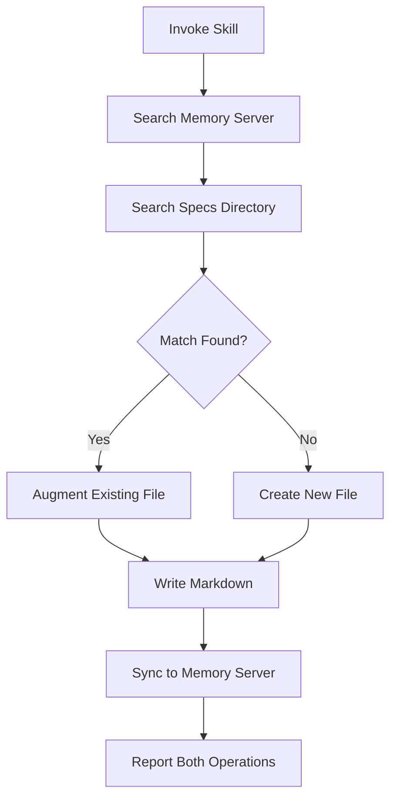

# Remember Skill

**Status**: Implemented

## Workflow



## Purpose

Persist knowledge to the framework's dual memory system: markdown files for human reading and memory server for semantic search.

## Problem Statement

Knowledge capture risks:

- Writing markdown but forgetting memory server sync (content not searchable)
- Creating duplicate files instead of augmenting existing
- Placing files in wrong locations
- Creating arbitrary directories that fragment knowledge

## Solution

A skill that enforces search-before-create, dual-write to markdown and memory server, and correct file placement.

## How It Works

### Invocation

```
Skill(skill="remember")
```

Invoke when capturing decisions, learnings, observations, or any knowledge that should persist across sessions.

### Core Behaviors

**1. Dual-Write Requirement**

Every knowledge capture must:

1. Write markdown file to `$ACA_DATA/` hierarchy
2. Sync to memory server via `mcp__memory__store_memory`

If only markdown is written, semantic search won't find it.

**2. Search-Before-Create**

Before creating any file:

1. Search memory server: `mcp__memory__retrieve_memory(query="topic")`
2. Search specs: `Glob` + grep in `$ACA_DATA/projects/*/specs/`
3. If match found in EITHER → augment existing file
4. Only create new if no match in either source

**3. File Location Enforcement**

| Content Type      | Location                       |
| ----------------- | ------------------------------ |
| General notes     | `$ACA_DATA/context/`           |
| Goals             | `$ACA_DATA/goals/`             |
| Project metadata  | `$ACA_DATA/projects/<name>.md` |
| Project details   | `$ACA_DATA/projects/<name>/`   |
| Learning patterns | `$AOPS/learning/`              |
| Session notes     | `$ACA_DATA/sessions/`          |
| Tasks             | Delegate to [[tasks-skill]]    |

**DO NOT** create arbitrary directories (`tech/`, `dev/`, `tools/`).

**4. Frontmatter Format**

```markdown
---
title: Descriptive Title
type: note
tags: [relevant, tags]
created: YYYY-MM-DD
---
```

### Output

Reports both operations:

- File written: `[path]`
- Memory stored: `[confirmation]`

## Relationships

### Depends On

- [[AXIOMS]] #20 (Maintain Relational Integrity), #28 (Current State Machine)
- Memory server MCP tools

### Used By

- [[feature-dev-skill]] - Records experiment outcomes
- [[learning-log]] - Captures framework patterns
- Any skill that needs to persist knowledge

### Workflows (bundled)

- `workflows/capture` - Session mining extraction
- `workflows/validate` - Format compliance checking
- `workflows/prune` - Low-value file cleanup

## Success Criteria

1. **Dual-write enforced**: Every markdown write synced to memory server
2. **No duplicates**: Search-before-create prevents redundant files
3. **Correct placement**: Files in designated locations per table
4. **Semantic searchable**: All persisted content findable via `mcp__memory__retrieve_memory`

## Capture Architecture

Knowledge capture happens through skill workflows, not automatic hooks.

| Capture Method            | How It Works                               | Examples                                                                                    |
| ------------------------- | ------------------------------------------ | ------------------------------------------------------------------------------------------- |
| **Skill-embedded**        | Capture steps built into skill workflow    | `/daily` extracts FYI content into daily note; `/session-insights` extracts accomplishments |
| **Skill delegation**      | Skill provides judgment, delegates storage | `/extractor` → `/remember`; `/email` → `/tasks`                                             |
| **Background invocation** | Non-blocking capture pattern               | Any skill can spawn background agent to remember                                            |
| **Direct invocation**     | User explicitly requests                   | "Remember this for later"                                                                   |

**Hook-triggered skills:**

- Stop hook → `/session-insights` (extracts accomplishments from transcript)

**Not auto-capture:** The remember skill doesn't fire automatically on events. Capture happens when skills invoke it as part of their workflow.

## General Knowledge Base

`$ACA_DATA/knowledge/` stores factual observations NOT about the user - a "squirrel cache" for interesting facts worth preserving.

### Constraints

- **STRICTLY factual** - no personal context, opinions, plans
- **Maximum 200 words** - enables dense vector embeddings
- **One fact per file** - atomic for retrieval
- **Broad topic directories** - e.g., `knowledge/cyberlaw/` (covers copyright, defamation, privacy, AI ethics, platform law)
- **[[wikilinks]] on proper nouns** - always link people ([[Eugene Volokh]]), companies ([[Google]]), cases, concepts

### Format

```markdown
---
title: Wolf River Electric v. Google
type: knowledge
topic: cyberlaw
source: CyberProf mailing list
date: 2026-01-10
---

[[AI]] libel case remanded to state court. [[Google]] failed to remove within 30 days of demand letter stating $24.7M damages. Key precedent: settlement letters constitute "other paper" under [[28 USC § 1446(b)(3)]].

[[Eugene Volokh]] notes: Did [[Google]]'s lawyers err by not treating the demand letter as notice of removability?
```

### Topic Directories

| Directory   | Covers                                                                                     |
| ----------- | ------------------------------------------------------------------------------------------ |
| `cyberlaw/` | Copyright, defamation, privacy, AI ethics, platform law, robot law, intermediary liability |
| `tech/`     | Technical facts, protocols, standards                                                      |
| `research/` | Methodology, statistics, study findings                                                    |

Create new directories sparingly. Prefer broad categories.

## Design Rationale

**Why dual-write?**

The knowledge base has two access patterns: human browsing (Obsidian, file system) and agent retrieval (semantic search). Markdown alone supports only human access. Memory server sync enables `mcp__memory__retrieve_memory` to find content. Both are required.

**Why search-before-create?**

Per [[AXIOMS]] #20: Maintain relational integrity. Creating new files when content belongs in existing files fragments knowledge. Searching both sources (memory server + specs) catches existing content regardless of where it lives.

**Why strict file locations?**

Arbitrary directories fragment the knowledge base. A predictable structure means agents and humans know where to find content. Project-related content in `projects/<name>/` keeps knowledge organized by context.
