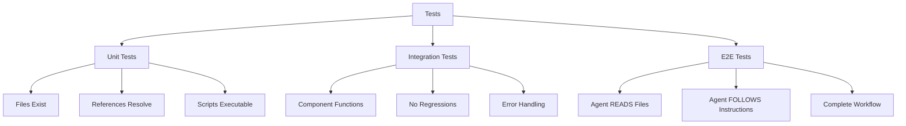

# Testing Framework Overview

**Status**: Active (guiding principles)

## Test Hierarchy



## Test Types

The academicOps framework distinguishes between three types of tests:

### Unit Tests

Verify structural prerequisites exist:

- Files exist at expected paths
- References resolve correctly
- Scripts are executable
- Configuration is valid

### Integration Tests

Verify component functionality:

- New components perform intended function
- No regressions in existing components
- Error handling works correctly

**Design Principle**: Design tests BEFORE implementation - fail-fast on known requirements #testing #tdd

### End-to-End (E2E) Tests

Verify agent behavior in actual workflows:

- Agent READS the files (not just that files exist)
- Agent FOLLOWS the instructions (not just that instructions exist)
- Complete workflow executes from user input to final output
- Agent makes correct decisions based on context

**Core Testing Principle**: Agent READS files (not just that files exist), FOLLOWS instructions (not just that instructions exist), complete workflow executes correctly #agent-testing #verification

## Critical Distinction

Testing that `data/tasks/` exists ≠ testing that agent uses task scripts. Testing that `README.md` contains task references ≠ testing that agent reads and follows those references.

## Test Requirements

**MANDATORY before committing any framework changes:**

1. All tests must pass
2. No partial success accepted
3. Fix or revert, never commit broken state
4. Update test documentation when adding/modifying tests

## Test Location

Tests are stored in: `$AOPS/tests/`

Documentation: `$AOPS/tests/README.md`

## Test Infrastructure Principles

**MANDATE**: NEVER create new test databases/configs/data - use EXISTING test infrastructure with live data connections #infrastructure #mandate

**ANTI-PATTERN**: Creating diagnostic scripts/temporary pipelines wastes time and creates confusion about canonical data. Use existing infrastructure. #anti-pattern #efficiency

## LLM Non-Determinism Handling

When testing agent behavior with LLMs, follow four core principles:

1. **Verify outcomes not paths**: Test what the agent achieves, not how it gets there #verification #outcomes
2. **Expect multiple valid paths**: Accept different approaches to the same goal #flexibility #agent-behavior
3. **Use reliability thresholds**: Define acceptable success rates rather than demanding perfection #reliability #thresholds
4. **Graceful degradation**: Tests should handle partial success appropriately #resilience #degradation

## Test Format

Using pytest with strict typing:

```python
def test_something(fixture: Type) -> None:
    """Test description.

    Args:
        fixture: Description of fixture

    Raises:
        AssertionError: If test condition fails
    """
    # Arrange
    # Act
    # Assert
```

## Quality Gates

When integration tests fail:

- HALT immediately
- Do not commit
- Do not rationalize
- Fix or revert
- No exceptions

## Defense-in-Depth for Test Violations

Four+ layers prevent test violations and ensure quality:

1. **TTD command**: Test-driven development workflow enforcement #tooling #workflow
2. **Python-dev skill**: Development best practices and patterns #skills #development
3. **Dev agent routing**: Intelligent routing to appropriate agents for testing tasks #agents #routing
4. **Reference documentation**: Comprehensive docs for test requirements and patterns #documentation #standards

This multi-layered approach ensures tests are not bypassed and quality standards are maintained #enforcement #quality-assurance
