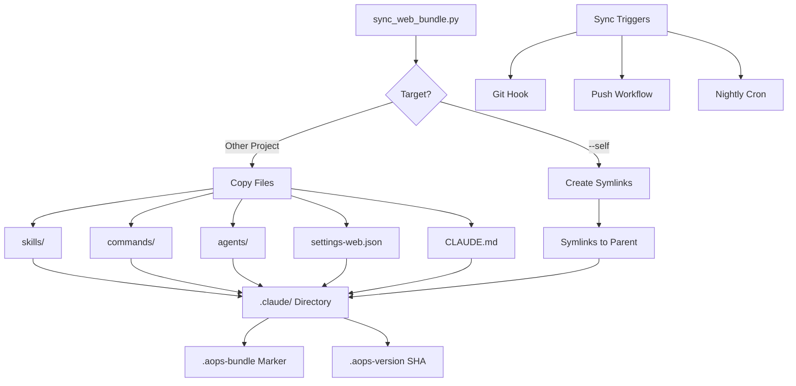

# Web Bundle Sync

**Status**: Implemented

## Workflow



Bundles the aOps framework into a project's `.claude/` directory for use in limited environments (Claude Code Web) where only one repository is accessible.

## Problem

Claude Code Web and similar limited environments cannot access `~/.claude/` or external repos. Without bundling, skills, commands, and agents are unavailable in these environments.

## Solution

The `sync_web_bundle.py` script copies (or symlinks for self) framework content into a project's `.claude/` directory. This bundle is committed to the repo, making aOps available when the project is opened on Claude Code Web.

**Key behaviors:**

- **Other projects**: Copies files, generates `CLAUDE.md` with skills table, uses `settings-web.json` (no hooks)
- **academicOps itself**: Creates symlinks to parent directories, uses full settings
- **Version tracking**: Writes aOps commit SHA to `.aops-version`
- **Safety**: Creates `.aops-bundle` marker; refuses to overwrite non-aOps `.claude/` without `--force`

## Usage

```bash
# Sync to another project (copies files, installs git hook)
python scripts/sync_web_bundle.py /path/to/project

# Sync academicOps itself (uses symlinks)
python scripts/sync_web_bundle.py --self

# Options
--force      # Overwrite existing non-aOps .claude/
--no-hook    # Skip git hook installation
--dry-run    # Preview changes without writing
```

## Sync Strategies

| Strategy             | Trigger       | Use Case                  | Template                                |
| -------------------- | ------------- | ------------------------- | --------------------------------------- |
| **Git Hook**         | Every commit  | Local dev, single machine | Auto-installed                          |
| **Push Workflow**    | Push to main  | Teams, CI integration     | `github-workflow-sync-aops.yml`         |
| **Nightly Workflow** | 3am UTC daily | Minimal overhead          | `github-workflow-sync-aops-nightly.yml` |

## Files

| File                                              | Purpose                        |
| ------------------------------------------------- | ------------------------------ |
| `scripts/sync_web_bundle.py`                      | Main sync script               |
| `config/claude/settings-web.json`                 | Hook-free settings for bundles |
| `hooks/git-post-commit-sync-aops`                 | Git hook for auto-sync         |
| `templates/github-workflow-sync-aops.yml`         | Push-triggered CI workflow     |
| `templates/github-workflow-sync-aops-nightly.yml` | Scheduled nightly workflow     |
| `docs/WEB-BUNDLE.md`                              | Full tutorial documentation    |

## Acceptance Criteria

1. `python scripts/sync_web_bundle.py /path/to/project` creates `.claude/` with skills/, commands/, agents/, settings.json, CLAUDE.md
2. `.aops-bundle` marker file is created
3. `.aops-version` contains aOps commit SHA
4. Re-running sync overwrites bundle safely (marker present)
5. `--dry-run` produces no file changes
6. `--self` creates symlinks (not copies) in academicOps repo
7. Git hook auto-syncs on commit when `$AOPS` is set
8. Bundled projects work on Claude Code Web (skills/commands/agents load)
