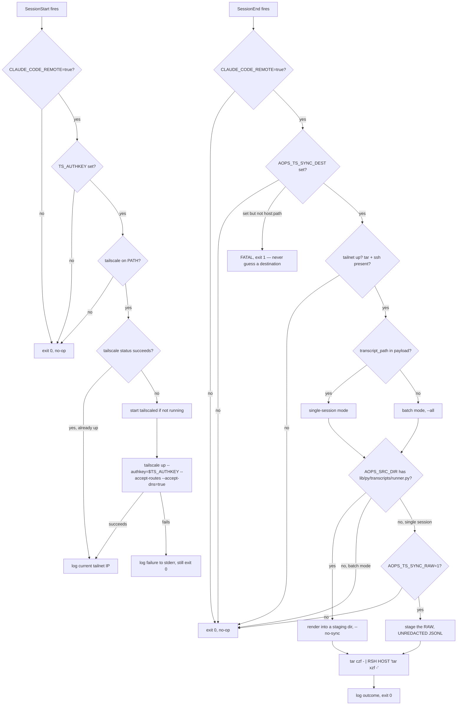

# ts

Opt-in Tailscale bring-up for academicOps remote/cloud sessions, and the
transcript sync that gets a session's record off the box before it disappears.

Both hooks always exit 0 — a Tailscale failure never blocks session start, and
a sync failure never blocks session end. The one exception is a malformed
`AOPS_TS_SYNC_DEST`, which exits 1 rather than invent a landing directory. All
diagnostics go to stderr; stdout stays empty because hook stdout is injected
into the model context.

## Provides

| Type | Name           | Effect                                                                                    |
| ---- | -------------- | ----------------------------------------------------------------------------------------- |
| Hook | `SessionStart` | Runs `hooks/tailscale-up.sh`, bringing the tailnet up.                                    |
| Hook | `SessionEnd`   | Runs `hooks/session-end-sync.sh`, shipping the session transcript to the configured host. |

Both are wired for Claude Code. `SessionStart` is also wired for agy;
`SessionEnd` is not, because agy has no confirmed wire event for it.

## Configuration

No value in this plugin has a default. Every value below must come from the
environment. With none of them set, both hooks are silent no-ops.

| Var                  | Used by        | Required       | Meaning                                                                                                                                                                        |
| -------------------- | -------------- | -------------- | ------------------------------------------------------------------------------------------------------------------------------------------------------------------------------ |
| `CLAUDE_CODE_REMOTE` | both           | yes            | Must be exactly `true` for either hook to act at all.                                                                                                                          |
| `TS_AUTHKEY`         | `SessionStart` | yes            | Tailscale auth key used for `tailscale up --authkey=...`.                                                                                                                      |
| `HOSTNAME`           | `SessionStart` | no             | When set, the tailnet device is named `claude-web-${HOSTNAME}`. When unset, no `--hostname` is passed and Tailscale chooses its own device name.                               |
| `AOPS_TS_SYNC_DEST`  | `SessionEnd`   | yes            | Where transcripts land, as `[user@]host:path`. Both halves required. Unset means no sync at all; malformed means exit 1.                                                       |
| `AOPS_SRC_DIR`       | `SessionEnd`   | yes, to render | An academicOps checkout containing `lib/py/transcripts/runner.py` and either a `.venv` or `uv` on `PATH`. The pipeline has third-party dependencies, so it runs from there.    |
| `AOPS_TS_SYNC_RAW`   | `SessionEnd`   | no             | `1` permits shipping the raw session JSONL when the pipeline is unavailable. Raw transcripts are **unredacted**. Unset means such a session is skipped rather than sent as-is. |
| `AOPS_TS_SSH_CMD`    | `SessionEnd`   | no             | Remote-shell program. `tailscale ssh` when tailscale is on `PATH`, else `ssh`. A program name only — every host and path comes from `AOPS_TS_SYNC_DEST`.                       |
| `AOPS_TS_SSH_OPTS`   | `SessionEnd`   | no             | Extra options for the plain-`ssh` path, e.g. `-o StrictHostKeyChecking=accept-new`.                                                                                            |

The payload lands under the destination path as `transcripts/` (rendered
markdown, HTML, and JSON) and, on the opt-in raw path only, `incoming/`.

## Depends on

- `tailscale` (and `tailscaled`) on `PATH`, installed by the environment's own
  setup/init script — this plugin never installs it.
- `openssh-client` and `tar` on `PATH` for the sync; `tar` on the remote. No
  `rsync` on either side.
- Passwordless `sudo` when the session runs as a non-root user (auto-detected;
  falls back to running direct, which works only as root).
- An academicOps checkout at `AOPS_SRC_DIR` for transcript rendering. The
  plugin ships no Python and reads no other plugin's files; without the
  checkout it renders nothing.
