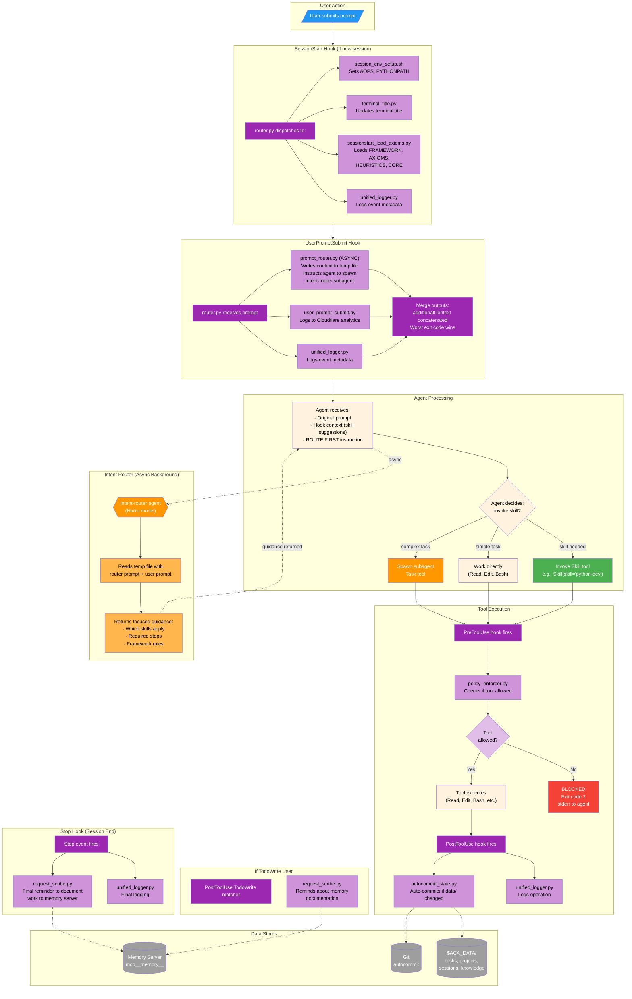
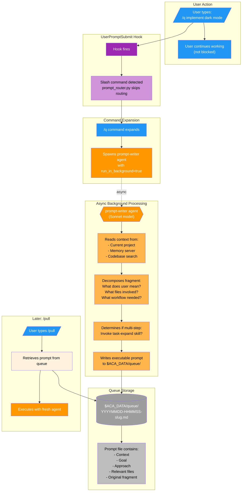
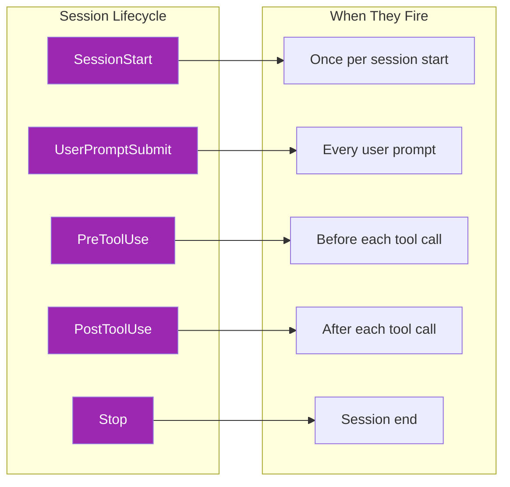

# academicOps Execution Flow

This document traces the **temporal execution sequence** when a user interacts with the academicOps framework. Each diagram shows what happens step-by-step, with annotations explaining the purpose of each component.

---

## Color Legend

| Color | Meaning |
|-------|---------|
| Blue (#2196f3) | User actions |
| Purple (#9c27b0) | Hook events and scripts |
| Orange (#ff9800) | Agents (subagents) |
| Green (#4caf50) | Skills |
| Gray (#9e9e9e) | Data stores |
| Diamond shapes | Decision points |

---

## Diagram 1: Standard Prompt Flow

When a user submits a regular prompt (e.g., "help me understand this code"):

### Annotations: Standard Prompt Flow

| Step | Component | Purpose |
|------|-----------|---------|
| 1 | User submits prompt | Entry point - user types in Claude Code |
| 2 | SessionStart hook | Only fires on NEW session; loads framework context |
| 3 | sessionstart_load_axioms.py | Injects FRAMEWORK.md, AXIOMS.md, HEURISTICS.md, CORE.md |
| 4 | UserPromptSubmit hook | Fires on EVERY prompt |
| 5 | prompt_router.py (async) | Writes context to temp file, tells agent to spawn intent-router |
| 6 | intent-router agent | Haiku model analyzes prompt, returns task-specific guidance |
| 7 | Agent decides | Based on guidance: skill, direct work, or spawn subagent |
| 8 | PreToolUse hook | policy_enforcer.py blocks dangerous operations |
| 9 | Tool executes | Read, Edit, Bash, Grep, Glob, etc. |
| 10 | PostToolUse hook | Logs operation, auto-commits data/ changes |
| 11 | TodoWrite hook | If todo list updated, reminds about memory documentation |
| 12 | Stop hook | Final reminder to persist learnings to memory server |

---

## Diagram 2: Supervised Workflow Flow

When a user invokes `/supervise` for multi-step orchestrated work:

```mermaid
flowchart TD
    subgraph USER["User Action"]
        U1[/"User types:<br/>/supervise tdd fix the bug"/]
    end

    subgraph PROMPT_HOOK["UserPromptSubmit Hook"]
        PH1["Hook fires (same as standard)"]
        PH2["But slash command detected<br/>prompt_router.py skips routing"]
    end

    subgraph COMMAND_EXPAND["Command Expansion"]
        C1["/supervise command expands"]
        C2["Invokes Skill(skill='supervisor')"]
        C3["Skill loads supervisor.md"]
    end

    subgraph HYPERVISOR["Hypervisor Agent (Opus)"]
        H1{{"hypervisor agent<br/>spawned via Task"}}
        H2["Reads workflow template<br/>(e.g., tdd.md if specified)"]
    end

    subgraph PHASE0["Phase 0: Planning"]
        P0A["0.1: Define acceptance criteria"]
        P0B["0.2: Spawn Plan agent<br/>to investigate & plan"]
        P0C["0.3: Spawn Critic agent<br/>to review plan"]
        P0D{"Critic<br/>approves?"}
        P0E["Revise plan"]
        P0F["0.4: TodoWrite<br/>ALL steps populated"]
        P0G["Acceptance criteria LOCKED<br/>(immutable from here)"]
        P0A --> P0B --> P0C --> P0D
        P0D -->|REVISE| P0E --> P0C
        P0D -->|APPROVE| P0F --> P0G
    end

    subgraph PHASE1["Phase 1-3: Iteration Cycles"]
        I1["Mark task in_progress<br/>in TodoWrite"]
        I2["Spawn subagent with<br/>specific instructions"]
        I3["Subagent works<br/>(PreToolUse/PostToolUse<br/>hooks fire)"]
        I4["Quality gate check"]
        I5{"Gate<br/>passed?"}
        I6["Iterate on failure<br/>(max 3 attempts)"]
        I7["Git commit + push"]
        I8["Mark task completed"]
        I1 --> I2 --> I3 --> I4 --> I5
        I5 -->|No| I6 --> I2
        I5 -->|Yes| I7 --> I8
    end

    subgraph PHASE4["Phase 4: Iteration Gate"]
        G1["Scope drift detection"]
        G2{"Plan grown<br/>>20%?"}
        G3["HALT: Ask user<br/>to re-scope"]
        G4["Thrashing detection"]
        G5{"Same file<br/>modified 3+<br/>times?"}
        G6["HALT: Log thrashing<br/>Ask user for help"]
        G7["Continue to<br/>next iteration"]
        G1 --> G2
        G2 -->|Yes| G3
        G2 -->|No| G4 --> G5
        G5 -->|Yes| G6
        G5 -->|No| G7
    end

    subgraph PHASE5["Phase 5: QA Verification"]
        Q1["Spawn QA subagent"]
        Q2["QA verifies against<br/>LOCKED criteria"]
        Q3["QA runs validations<br/>with REAL data"]
        Q4{"Criteria<br/>met?"}
        Q5["REJECTED<br/>Return to implementation"]
        Q6["APPROVED<br/>with evidence"]
        Q7["Document via tasks skill"]
        Q8["Final report to user"]
        Q1 --> Q2 --> Q3 --> Q4
        Q4 -->|No| Q5
        Q4 -->|Yes| Q6 --> Q7 --> Q8
    end

    subgraph STOP["Stop Hook"]
        ST1["Stop event fires"]
        ST2["request_scribe.py<br/>Reminder to document"]
    end

    %% Flow connections
    U1 --> PH1
    PH1 --> PH2
    PH2 --> C1
    C1 --> C2 --> C3
    C3 --> H1 --> H2
    H2 --> PHASE0
    P0G --> PHASE1
    I8 --> PHASE4
    G7 --> I1
    G7 -->|all tasks done| Q1
    Q8 --> ST1

    %% Styling - User
    style U1 fill:#2196f3,color:#fff

    %% Styling - Hooks
    style PH1 fill:#9c27b0,color:#fff
    style PH2 fill:#ce93d8,color:#000
    style ST1 fill:#9c27b0,color:#fff
    style ST2 fill:#ce93d8,color:#000

    %% Styling - Command/Skill
    style C1 fill:#2196f3,color:#fff
    style C2 fill:#4caf50,color:#fff
    style C3 fill:#4caf50,color:#fff

    %% Styling - Agents
    style H1 fill:#ff9800,color:#fff
    style H2 fill:#ffb74d,color:#000

    %% Styling - Phase 0
    style P0A fill:#fff3e0,color:#000
    style P0B fill:#ff9800,color:#fff
    style P0C fill:#ff9800,color:#fff
    style P0D fill:#e1bee7,color:#000
    style P0E fill:#ffb74d,color:#000
    style P0F fill:#4caf50,color:#fff
    style P0G fill:#4caf50,color:#fff,stroke:#2e7d32,stroke-width:3px

    %% Styling - Phase 1-3
    style I1 fill:#4caf50,color:#fff
    style I2 fill:#ff9800,color:#fff
    style I3 fill:#ffb74d,color:#000
    style I4 fill:#fff3e0,color:#000
    style I5 fill:#e1bee7,color:#000
    style I6 fill:#ffb74d,color:#000
    style I7 fill:#9e9e9e,color:#fff
    style I8 fill:#4caf50,color:#fff

    %% Styling - Phase 4
    style G1 fill:#fff3e0,color:#000
    style G2 fill:#e1bee7,color:#000
    style G3 fill:#f44336,color:#fff
    style G4 fill:#fff3e0,color:#000
    style G5 fill:#e1bee7,color:#000
    style G6 fill:#f44336,color:#fff
    style G7 fill:#4caf50,color:#fff

    %% Styling - Phase 5
    style Q1 fill:#ff9800,color:#fff
    style Q2 fill:#ffb74d,color:#000
    style Q3 fill:#ffb74d,color:#000
    style Q4 fill:#e1bee7,color:#000
    style Q5 fill:#f44336,color:#fff
    style Q6 fill:#4caf50,color:#fff
    style Q7 fill:#4caf50,color:#fff
    style Q8 fill:#2196f3,color:#fff
```

### Annotations: Supervised Workflow Flow

| Phase | Step | Purpose |
|-------|------|---------|
| Entry | /supervise command | Triggers supervisor skill, spawns hypervisor agent |
| Phase 0 | Planning | Create plan, get critic review, LOCK acceptance criteria |
| Phase 0 | TodoWrite | ALL workflow steps must be in todo list BEFORE Phase 1 |
| Phase 1-3 | Iteration | One atomic task at a time; subagent implements, hypervisor verifies |
| Phase 1-3 | Quality gate | Each step must pass validation before proceeding |
| Phase 1-3 | Commit/push | Each cycle persists changes to git before next cycle |
| Phase 4 | Scope drift | If plan grows >20%, HALT and ask user |
| Phase 4 | Thrashing | If same file modified 3+ times without progress, HALT |
| Phase 5 | QA verification | Independent QA subagent verifies LOCKED criteria with evidence |
| Phase 5 | Final report | Summary of accomplishments, commits, criteria met |

### Key Enforcement Rules

1. **Supervisor Contract**: Hypervisor has NO implementation tools (Read, Edit, Bash)
2. **Criteria LOCK**: Acceptance criteria defined in Phase 0 are IMMUTABLE
3. **TodoWrite First**: ALL steps in todo list before any implementation
4. **One Step at a Time**: Subagent does single atomic step, reports back
5. **Commit Each Cycle**: No proceeding until changes pushed to remote

---

## Diagram 3: Quick Capture Flow (/q)

When a user captures an idea fragment for later execution:

### Annotations: Quick Capture Flow

| Step | Component | Purpose |
|------|-----------|---------|
| 1 | User types /q | Zero-friction idea capture |
| 2 | Command expansion | Spawns prompt-writer in background |
| 3 | User continues | NOT blocked - can alt-tab away immediately |
| 4 | prompt-writer investigates | Searches memory, codebase for context |
| 5 | Decrypts shorthand | Interprets what user actually meant |
| 6 | Determines workflow | Direct edit? /supervise? /meta? Research first? |
| 7 | Writes to queue | Self-contained executable prompt |
| 8 | Later: /pull | Retrieves and executes queued prompts |

### Key Design Decisions

1. **Async Execution**: User doesn't wait; agent works in background
2. **Context Preservation**: Agent investigates NOW while context is fresh
3. **Self-Contained Output**: Prompt file executable by fresh Claude instance
4. **Chain-Aware**: Multi-step tasks decomposed into chained prompts

---

## Hook Timing Summary

### Hook Registry (from router.py)

| Event | Scripts | Purpose |
|-------|---------|---------|
| SessionStart | session_env_setup.sh, terminal_title.py, sessionstart_load_axioms.py, unified_logger.py | Initialize environment, load framework context |
| UserPromptSubmit | prompt_router.py (async), user_prompt_submit.py, unified_logger.py | Route intent, log prompt, inject guidance |
| PreToolUse | policy_enforcer.py, unified_logger.py | Block dangerous ops, log |
| PostToolUse | unified_logger.py, autocommit_state.py | Log, auto-commit data/ changes |
| PostToolUse:TodoWrite | request_scribe.py | Remind about memory documentation |
| Stop | unified_logger.py, request_scribe.py | Final logging, documentation reminder |

---

## Exit Code Semantics

### PreToolUse Hooks

| Exit | Behavior | Message Shown To |
|------|----------|------------------|
| 0 | Allow | JSON stdout (verbose mode) |
| 1 | Warn but allow | stderr to **user AND agent** |
| 2 | Block execution | stderr to **agent only** |

### PostToolUse Hooks

| Exit | Behavior | Message Shown To |
|------|----------|------------------|
| 0 | Success | JSON stdout (verbose mode) |
| 1 | Non-blocking error | stderr (verbose mode only) |
| 2 | Report to agent | stderr to **agent** (for action) |
