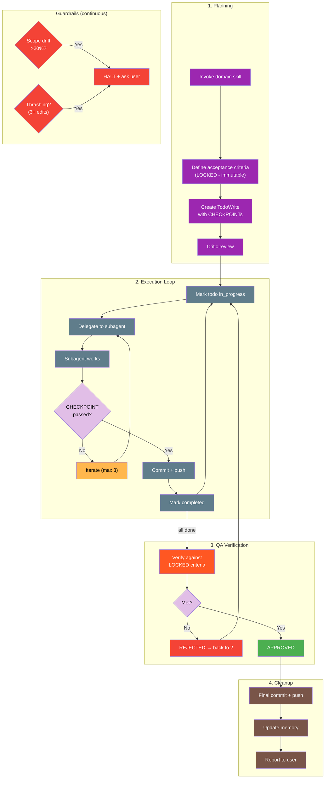
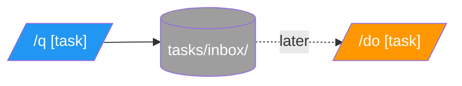

# academicOps Execution Flow

Where the framework injects control during a Claude Code session.

**Spec**: [[specs/execution-flow-spec]]

---

## Universal Execution Flow

Every prompt goes through this flow. Framework insertion points branch horizontally.

```
                    ┌──────────────────┐
                    │  Session Start   │ ──────► SessionStart hook
                    └────────┬─────────┘         → hooks/sessionstart_load_axioms.py
                             │
                             │                   Loads content from:
                             │                   → FRAMEWORK.md (paths)
                             │                   → AXIOMS.md (principles)
                             │                   → HEURISTICS.md (empirical)
                             │                   → CORE.md (user context)
                             ▼
                    ┌──────────────────┐         ┌─────────────────────────────┐
                    │ 1. User Prompt   │ ──────► │ UserPromptSubmit hook       │
                    │    arrives       │         │ → hooks/user_prompt_submit.py
                    └────────┬─────────┘         │                             │
                             │                   │ Injects instruction from:   │
                             │                   │ → templates/prompt-hydration│
                             │                   │   -instruction.md           │
                             │                   └─────────────────────────────┘
                             ▼
                    ┌──────────────────┐         ┌─────────────────────────────┐
                    │ 2. Prompt        │ ──────► │ prompt-hydrator agent runs: │
                    │    Hydration     │         │ • memory search             │
                    └────────┬─────────┘         │ • codebase signals          │
                             │                   │ • session context           │
                             │                   │ → [[specs/prompt-hydration]]│
                             │                   └─────────────────────────────┘
                             ▼
                    ┌──────────────────┐         ┌─────────────────────────────┐
                    │ 3. Workflow      │ ──────► │ [[WORKFLOWS]] (routing)     │
                    │    Selection     │         │ [[hooks/guardrails]] (rules)│
                    └────────┬─────────┘         └─────────────────────────────┘
                             │
                             ▼
                    ┌──────────────────┐         ┌─────────────────────────────┐
                    │ 4. Execute       │ ──────► │ Workflow implementations:   │
                    │    Workflow      │         │ → See table below           │
                    └────────┬─────────┘         │ → [[commands/do]] (full)    │
                             │                   └─────────────────────────────┘
                             │
          ┌──────────────────┼──────────────────┐
          ▼                  ▼                  ▼
    ┌──────────┐       ┌──────────┐       ┌──────────┐
    │ PreTool  │       │ Tool     │       │ PostTool │
    │ Use hook │       │ executes │       │ Use hook │
    └──────────┘       └──────────┘       └──────────┘
          │                                     │
          │                                     │
          ▼                                     ▼
    ┌──────────────┐                     ┌──────────────┐
    │ policy_      │                     │ autocommit,  │
    │ enforcer.py  │                     │ logging,     │
    │              │                     │ scribe       │
    │ Template:    │                     │              │
    │ (none - uses │                     │ Templates:   │
    │ settings.json│                     │ → scribe     │
    │ deny rules)  │                     │   reminder.md│
    └──────────────┘                     └──────────────┘
                             │
                             ▼
                    ┌──────────────────┐         ┌─────────────────────────────┐
                    │ 5. Session End   │ ──────► │ Stop hook                   │
                    │                  │         │ → hooks/request_scribe.py   │
                    └──────────────────┘         │                             │
                                                 │ Template:                   │
                                                 │ → (inline reminder)         │
                                                 └─────────────────────────────┘
```

---

## Workflow Implementations

Box 4 is pluggable. The workflow selected in Box 3 determines what happens:

| Workflow | What Happens | When Selected | Spec |
|----------|--------------|---------------|------|
| answer-only | Answer, then STOP | Questions, explanations | [[hooks/guardrails]] |
| direct | Main agent executes directly | Simple tasks, clear scope | — |
| verify-first | Reproduce → understand → fix | Bug reports, errors | [[hooks/guardrails]] |
| tdd | Test first → implement → verify | New features, refactors | [[specs/feature-dev-skill]] |
| plan-mode | Get approval → full orchestration | Framework changes, complex work | [[commands/do]] |
| checklist | Systematic verification steps | Reviews, audits | — |

**Full routing table**: [[WORKFLOWS]]

---

## Full Orchestration Workflow

When `plan-mode` is selected OR `/do` is invoked explicitly, the agent becomes a **hypervisor**.

**Command**: [[commands/do]]
**Spec**: [[specs/hypervisor-workflow]] (if exists) or inline below



### Key Principles

1. **Orchestrate, don't implement** - Hypervisor delegates edits to subagents
2. **Criteria are LOCKED** - Acceptance criteria defined in planning are immutable
3. **CHECKPOINTs require evidence** - Can't mark complete without proof
4. **Commit each cycle** - Changes pushed before next iteration
5. **Guardrails halt on problems** - Scope drift or thrashing → ask user

---

## Hook Trigger Mechanism

When Claude Code fires a hook event:

```
Event fires (e.g., UserPromptSubmit)
    ↓
Hook script receives JSON input:
  • prompt, transcript_path, tool info, etc.
    ↓
Hook loads template (if applicable):
  • templates/*.md files contain "soft tissue"
  • Python substitutes placeholders
    ↓
Hook returns JSON with additionalContext
    ↓
Claude Code injects additionalContext into agent
```

**Pattern**: Separate mechanics (Python) from content (templates).

---

## Hook Registry

| Event | Script | Template/Content | Purpose |
|-------|--------|------------------|---------|
| SessionStart | sessionstart_load_axioms.py | AXIOMS.md, HEURISTICS.md, FRAMEWORK.md, CORE.md | Load framework context |
| UserPromptSubmit | user_prompt_submit.py | templates/prompt-hydration-instruction.md | Inject prompt hydration |
| PreToolUse | policy_enforcer.py | settings.json (deny rules) | Block destructive git, oversized files |
| PostToolUse | autocommit_state.py | — | Auto-commit data/ changes |
| PostToolUse | fail_fast_watchdog.py | — | Detect errors, inject fail-fast reminder |
| PostToolUse | unified_logger.py | — | Universal event logging |
| PostToolUse:TodoWrite | request_scribe.py | (inline) | Memory documentation reminder |
| Stop | session_reflect.py | — | Session-end reflection prompt |
| Stop | request_scribe.py | (inline) | Final memory reminder |

**Exit codes**: PreToolUse `0`=allow, `1`=warn, `2`=block. PostToolUse `0`=success, `2`=report to agent.

**Full hook documentation**: [[docs/HOOKS]]

---

## Quick Capture

`/q` saves a task for later; `/do` executes it.

**Commands**: [[commands/q]], [[commands/do]]


