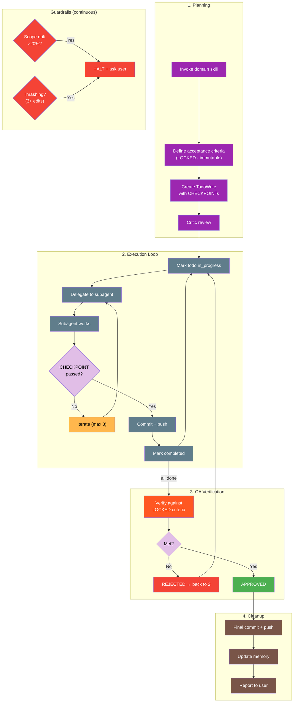
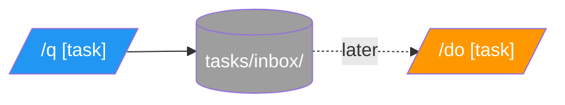

# academicOps Execution Flow

Where the framework injects control during a Claude Code session.

---

## Universal Execution Flow

Every prompt goes through this flow. Framework insertion points branch horizontally.

```
                    ┌──────────────────┐
                    │  Session Start   │ ──────► SessionStart hook
                    └────────┬─────────┘         → AXIOMS, HEURISTICS, FRAMEWORK, CORE
                             │
                             ▼
                    ┌──────────────────┐         ┌─────────────────────────────┐
                    │ 1. User Prompt   │ ──────► │ UserPromptSubmit hook       │
                    │    arrives       │         │ → hooks/user_prompt_submit.py
                    └────────┬─────────┘         │                             │
                             │                   │ Injects instruction from:   │
                             │                   │ → templates/prompt-hydration│
                             │                   │   -instruction.md           │
                             │                   └─────────────────────────────┘
                             ▼
                    ┌──────────────────┐         ┌─────────────────────────────┐
                    │ 2. Prompt        │ ──────► │ prompt-hydrator agent runs: │
                    │    Hydration     │         │ • memory search             │
                    └────────┬─────────┘         │ • codebase signals          │
                             │                   │ • session context           │
                             │                   │ → [[specs/prompt-hydration]]│
                             │                   └─────────────────────────────┘
                             ▼
                    ┌──────────────────┐         ┌─────────────────────────────┐
                    │ 3. Workflow      │ ──────► │ [[WORKFLOWS]] (routing)     │
                    │    Selection     │         │ [[hooks/guardrails]] (rules)│
                    └────────┬─────────┘         └─────────────────────────────┘
                             │
                             ▼
                    ┌──────────────────┐
                    │ 4. Execute       │ ◄────── See "Workflow Implementations"
                    │    Workflow      │
                    └────────┬─────────┘
                             │
          ┌──────────────────┼──────────────────┐
          ▼                  ▼                  ▼
    ┌──────────┐       ┌──────────┐       ┌──────────┐
    │ PreTool  │       │ Tool     │       │ PostTool │
    │ Use hook │       │ executes │       │ Use hook │
    └──────────┘       └──────────┘       └──────────┘
          │                                     │
          └──► policy_enforcer.py               └──► autocommit, logging
                             │
                             ▼
                    ┌──────────────────┐         ┌─────────────────────────────┐
                    │ 5. Cleanup       │ ──────► │ Stop hook                   │
                    │                  │         │ → memory reminder           │
                    └──────────────────┘         └─────────────────────────────┘
```

---

## Workflow Implementations

Box 4 is pluggable. The workflow selected in Box 3 determines what happens:

| Workflow | What Happens | When Selected |
|----------|--------------|---------------|
| answer-only | Answer, then STOP | Questions, explanations |
| direct | Main agent executes directly | Simple tasks, clear scope |
| verify-first | Reproduce → understand → fix | Bug reports, errors |
| tdd | Test first → implement → verify | New features, refactors |
| plan-mode | Get approval → full orchestration | Framework changes, complex work |
| checklist | Systematic verification steps | Reviews, audits |

**Full routing table**: [[WORKFLOWS]]

---

## Full Orchestration Workflow

When `plan-mode` is selected OR `/do` is invoked explicitly, the agent becomes a **hypervisor** that orchestrates work through the complete pipeline:



### Key Principles

1. **Orchestrate, don't implement** - Hypervisor delegates edits to subagents
2. **Criteria are LOCKED** - Acceptance criteria defined in planning are immutable
3. **CHECKPOINTs require evidence** - Can't mark complete without proof
4. **Commit each cycle** - Changes pushed before next iteration
5. **Guardrails halt on problems** - Scope drift or thrashing → ask user

**Command**: [[commands/do]] transforms agent into hypervisor

---

## Guardrails

Guardrails prevent known failure patterns. Applied based on workflow selection.

| Guardrail | Purpose |
|-----------|---------|
| verify_before_complete | Always verify actual state before claiming done |
| answer_only | Don't implement when asked a question |
| require_skill | Invoke domain skill before acting |
| plan_mode | Get user approval before implementation |
| require_acceptance_test | TodoWrite must include e2e verification |
| quote_errors_exactly | No paraphrasing error messages |
| fix_within_design | Don't redesign during debugging |
| critic_review | Get second opinion on plans |

**Full definitions**: [[hooks/guardrails]]

---

## Hook Trigger Mechanism

When Claude Code fires a hook event, the hook script:
1. Receives JSON input (prompt, transcript path, tool info, etc.)
2. Processes and returns JSON output with `additionalContext`
3. Claude Code injects `additionalContext` into the agent's context

**Example: UserPromptSubmit**

```
User types prompt
    ↓
Claude Code fires UserPromptSubmit event
    ↓
hooks/user_prompt_submit.py runs:
  • Loads template from templates/prompt-hydration-instruction.md
  • Substitutes {prompt_preview}, {escaped_prompt}, {session_context}
  • Returns JSON with additionalContext
    ↓
Claude Code injects additionalContext into agent
    ↓
Main agent sees: original prompt + hydration instruction
```

**Template file**: [[hooks/templates/prompt-hydration-instruction.md]] - edit this to change what the agent sees.

---

## Hook Registry

| Event | Scripts | Purpose |
|-------|---------|---------|
| SessionStart | sessionstart_load_axioms.py, session_env_setup.sh | Load framework context |
| UserPromptSubmit | user_prompt_submit.py | Inject prompt hydration |
| PreToolUse | policy_enforcer.py | Block dangerous operations |
| PostToolUse | autocommit_state.py, unified_logger.py | Autocommit, logging |
| PostToolUse:TodoWrite | request_scribe.py | Memory documentation reminder |
| Stop | request_scribe.py | Final memory reminder |

**Exit codes**: PreToolUse `0`=allow, `1`=warn, `2`=block. PostToolUse `0`=success, `2`=report to agent.

**Full hook documentation**: [[docs/HOOKS]]

---

## Quick Capture

`/q` saves a task for later; `/do` executes it.


