# academicOps Execution Flow

This document maps **every intervention point** where the framework injects control during a Claude Code session.

---

## Framework Goals: The Ideal Intervention Pipeline

What we're trying to achieve - independent of current implementation:

```mermaid
flowchart TB
    subgraph INPUT["📥 User Input"]
        U1[/"Simple prompt"/]
    end

    subgraph CONTEXT["1️⃣ CONTEXT INJECTION"]
        C1["Make agent stateful"]
        C2["• Knowledge base (memory server)<br/>• Relevant project files<br/>• Prior decisions/patterns<br/>• User preferences"]
    end

    subgraph STEER["2️⃣ STEERING"]
        S1["Guide toward good workflows"]
        S2["• Match task to workflow pattern<br/>• Surface relevant heuristics<br/>• Warn about failure modes<br/>• Suggest required skills"]
    end

    subgraph PLAN["3️⃣ PLANNING"]
        P1["Produce structured prompt flow"]
        P2["• Decompose into steps<br/>• Define acceptance criteria<br/>• Lock criteria (immutable)<br/>• Identify specialist tasks"]
    end

    subgraph DELEGATE["4️⃣ SKILL DELEGATION"]
        D1["Route specialist work"]
        D2["• Framework changes → framework skill<br/>• Python code → python-dev skill<br/>• Memory → remember skill<br/>• etc."]
    end

    subgraph EXECUTE["5️⃣ EXECUTION"]
        E1["Work happens here"]
        E2["• Follow the plan<br/>• Track via TodoWrite<br/>• Skills provide guardrails"]
    end

    subgraph POLICY["5️⃣b TOOL POLICY"]
        PO1["Enforce tool constraints"]
        PO2["• Block dangerous operations<br/>• Require confirmations<br/>• Restrict tools by context<br/>• Log for audit"]
    end

    subgraph GATES["6️⃣ QUALITY GATES"]
        G1["Prevent premature completion"]
        G2["• Check acceptance criteria<br/>• Verify actual state<br/>• Independent QA review<br/>• Block until criteria met"]
    end

    subgraph CLEANUP["7️⃣ POST-TASK CLEANUP"]
        CL1["Persist and document"]
        CL2["• Git commit + push<br/>• Update memory server<br/>• Document decisions<br/>• Archive task"]
    end

    subgraph MONITOR["8️⃣ COMPLIANCE MONITORING (Future)"]
        M1["Detect failure modes in-flight"]
        M2["• Review hooks during execution<br/>• Intervene on detected patterns<br/>• Log for learning"]
    end

    U1 --> CONTEXT
    CONTEXT --> STEER
    STEER --> PLAN
    PLAN --> DELEGATE
    DELEGATE --> EXECUTE
    POLICY -.->|guards each tool| EXECUTE
    EXECUTE --> GATES
    GATES -->|criteria not met| EXECUTE
    GATES -->|criteria met| CLEANUP
    MONITOR -.->|observes| EXECUTE
    MONITOR -.->|can halt| GATES

    style U1 fill:#2196f3,color:#fff
    style C1 fill:#4caf50,color:#fff
    style C2 fill:#c8e6c9,color:#000
    style S1 fill:#ff9800,color:#fff
    style S2 fill:#ffe0b2,color:#000
    style P1 fill:#9c27b0,color:#fff
    style P2 fill:#e1bee7,color:#000
    style D1 fill:#00bcd4,color:#fff
    style D2 fill:#b2ebf2,color:#000
    style E1 fill:#607d8b,color:#fff
    style E2 fill:#cfd8dc,color:#000
    style PO1 fill:#f44336,color:#fff
    style PO2 fill:#ffcdd2,color:#000
    style G1 fill:#ff5722,color:#fff
    style G2 fill:#ffccbc,color:#000
    style CL1 fill:#795548,color:#fff
    style CL2 fill:#d7ccc8,color:#000
    style M1 fill:#e0e0e0,color:#666,stroke-dasharray: 5 5
    style M2 fill:#f5f5f5,color:#666,stroke-dasharray: 5 5
```



### Goal Summary

| Stage | Purpose | Key Question |
|-------|---------|--------------|
| **1. Context** | Make agent stateful | What does the agent need to know? |
| **2. Steering** | Prevent failure modes | What patterns apply? What to avoid? |
| **3. Planning** | Structure the work | What are the steps? What's "done"? |
| **4. Delegation** | Use specialists | Which skills handle which parts? |
| **5. Execution** | Do the work | (Skills provide internal guardrails) |
| **5b. Tool Policy** | Enforce constraints | Is this tool use allowed? Safe? |
| **6. Gates** | Ensure quality | Are acceptance criteria actually met? |
| **7. Cleanup** | Persist state | Committed? Documented? Remembered? |
| **8. Monitor** | Learn and intervene | (Future: detect failures in-flight) |

### Design Decisions

1. **Single golden path** - All work goes through the full pipeline. No shortcuts.
2. **`/do` is the single orchestrator** - Kills `/supervise`. One command to rule them all.
3. **`/do` orchestrates, doesn't execute** - Like a supervisor, it coordinates but doesn't directly do work.
4. **Quality gates are baked into the plan** - Not a separate stage. Planning skills add QA checkpoints as todo items.
5. **Control the plan = control the work** - Agent must follow TodoWrite. Good plans = good work.

### The `/do` Architecture


### How Quality Gates Work

Instead of a separate QA stage, **planning skills bake QA into the todo list**:

```
Example TodoWrite from planning skill:

1. [ ] Reproduce the issue
2. [ ] Identify root cause
3. [ ] Implement fix
4. [ ] **CHECKPOINT: Verify fix works** ← QA baked in
5. [ ] Run test suite
6. [ ] **CHECKPOINT: All tests pass** ← QA baked in
7. [ ] Commit with descriptive message
8. [ ] **CHECKPOINT: Verify commit pushed** ← QA baked in
```

The agent can't skip checkpoints because they're todo items. Control the plan, control the work.

### Planning Skills (Swappable)

Different task types can use different planning skills:

| Task Type | Planning Skill | Brings |
|-----------|----------------|--------|
| Framework changes | `framework` | Categorical imperative, skill-first rules |
| Python code | `python-dev` | TDD workflow, type safety rules |
| Debug | `debug` (future) | Verify-first, quote-errors-exactly |
| Feature dev | `feature-dev` | Acceptance criteria, plan-first |

For now, keep it simple: one planning skill that handles common cases. Specialize later.

### What Dies

- `/supervise` - redundant, `/do` does this
- Separate QA stage - baked into plan
- `hypervisor` agent - `/do` orchestrator replaces it

---

## Current Implementation Map

Every point where we can inject guidance, from session start to session end:


### Intervention Point Summary

| Event | Hook/Mechanism | What We Do | Control |
|-------|----------------|------------|---------|
| **Session start** | `SessionStart` hook | Inject AXIOMS, HEURISTICS, FRAMEWORK, CORE | 🟢 HIGH |
| **Every prompt** | `UserPromptSubmit` hook | Currently noop | 🔴 LOW |
| **`/command` typed** | Claude Code routing → `commands/*.md` | Our command file loads with instructions | 🟢 HIGH |
| **`Skill()` invoked** | Claude Code → `skills/*/SKILL.md` | Our skill content loads | 🟢 HIGH |
| **Freeform prompt** | (none) | Only baseline context from SessionStart | 🔴 NONE |
| **Before tool** | `PreToolUse` hook | Logging; could block dangerous tools | 🟡 MED |
| **After tool** | `PostToolUse` hook | Logging + autocommit `data/` changes | 🟡 MED |
| **Subagent done** | `SubagentStop` hook | Logging only | 🔴 LOW |
| **Session end** | `Stop` hook | `request_scribe.py` reminder | 🔴 LOW |

### Key Insight: The Control Gap

Our **high-control** points require explicit user action (`/command`) or agent action (`Skill()`).

For **freeform prompts**, we have no active intervention - only passive baseline context. The planned **Prompt Enricher** (`specs/prompt-enricher.md`) would close this gap by analyzing each prompt and injecting relevant skill suggestions.

---

## Color Legend

| Color | Meaning |
|-------|---------|
| Green | High control - our content loads |
| Yellow/Orange | Medium control - can intervene |
| Red/Pink | Low/no control - logging or noop |
| Purple | Claude Code routing (not ours) |
| Blue | User/tool actions |
| Dashed gray | Planned/future |

---

## Detailed Flows

The following diagrams show specific intervention paths in detail.

### Session Initialization

The framework lifecycle starts when Claude Code launches, NOT when the user submits a prompt.

```mermaid
flowchart LR
    subgraph LAUNCH["1. Launch"]
        L1[/"User opens<br/>Claude Code"/]
    end

    subgraph SESSION_START["2. SessionStart Hook"]
        S1["settings.json →<br/>router.py →<br/>sessionstart_load_axioms.py"]
    end

    subgraph INJECTION["3. Baseline Injected"]
        I1["• FRAMEWORK.md (paths)<br/>• AXIOMS.md (principles)<br/>• HEURISTICS.md (patterns)<br/>• CORE.md (identity)"]
    end

    subgraph READY["4. Ready"]
        R1[/"Agent waiting<br/>for input"/]
    end

    L1 --> S1 --> I1 --> R1

    style L1 fill:#2196f3,color:#fff
    style S1 fill:#9c27b0,color:#fff
    style I1 fill:#fff3e0,color:#000
    style R1 fill:#2196f3,color:#fff
```



### SessionStart Hook: Implementation Details

| Component | Value |
|-----------|-------|
| **Trigger** | `settings.json` → `hooks` → `SessionStart` |
| **Entry point** | `hooks/router.py` |
| **Dispatches to** | `hooks/sessionstart_load_axioms.py` |
| **Input (stdin)** | `{"hook_event_name": "SessionStart", "session_id": "...", "cwd": "..."}` |
| **Output (stdout)** | `{"hookSpecificOutput": {"additionalContext": "...", "filesLoaded": [...]}}` |
| **Exit code** | `0` = success, `1` = fatal (missing files) |

### Files Loaded at SessionStart

| File | Source | Purpose |
|------|--------|---------|
| `FRAMEWORK.md` | `$AOPS/FRAMEWORK.md` | Resolved paths (WHERE) |
| `AXIOMS.md` | `$AOPS/AXIOMS.md` | Inviolable principles (WHAT) |
| `HEURISTICS.md` | `$AOPS/HEURISTICS.md` | Empirical patterns (HOW) |
| `CORE.md` | `$ACA_DATA/CORE.md` | User identity (WHO) |

**Spec**: `specs/session-start-injection.md`

---

### /do Command Flow

The `/do` command provides intelligent context enrichment and guardrailed execution.


### /do Command: Implementation Details

| Component | Value |
|-----------|-------|
| **Command file** | `commands/do.md` |
| **Spawns** | `intent-router` agent via Task tool |
| **Model** | Sonnet (or configurable) |
| **Router location** | `agents/intent-router.md` |
| **Guardrails source** | `hooks/guardrails.md` |

### Intent Router: Input/Output

**Input** (Task tool prompt):
```
User fragment: [whatever user typed after /do]
```

**Output** (structured YAML):
```yaml
task_type: [debug|feature|question|framework|...]
workflow: [verify-first|tdd|direct|...]
skills_to_invoke: [skill names]
guardrails:
  plan_mode: true/false
  verify_before_complete: true/false
  answer_only: true/false
  require_acceptance_test: true/false
  quote_errors_exactly: true/false
  fix_within_design: true/false
  require_skill: [skill name or null]
enriched_context: |
  [Summary of memory search + codebase search results]
todo_items:
  - "[Step 1]"
  - "[Step 2]"
warnings:
  - "[Potential issues]"
original_fragment: |
  [User's exact words]
```

### Guardrails Applied by /do

| Guardrail | When True |
|-----------|-----------|
| `plan_mode` | Enter Plan Mode before implementation |
| `answer_only` | Answer the question, then STOP |
| `require_skill` | Invoke the specified skill first |
| `verify_before_complete` | Must verify actual state before claiming done |
| `require_acceptance_test` | Todo list must include verification step |
| `quote_errors_exactly` | Quote error messages verbatim |
| `fix_within_design` | Fix bugs within current architecture |

**Spec**: `commands/do.md`, `agents/intent-router.md`

---

### /supervise Workflow Flow

When a user invokes `/supervise` for multi-step orchestrated work:


### Annotations: Supervised Workflow Flow

| Phase | Step | Purpose |
|-------|------|---------|
| Entry | /supervise command | Triggers supervisor skill, spawns hypervisor agent |
| Phase 0 | Planning | Create plan, get critic review, LOCK acceptance criteria |
| Phase 0 | TodoWrite | ALL workflow steps must be in todo list BEFORE Phase 1 |
| Phase 1-3 | Iteration | One atomic task at a time; subagent implements, hypervisor verifies |
| Phase 1-3 | Quality gate | Each step must pass validation before proceeding |
| Phase 1-3 | Commit/push | Each cycle persists changes to git before next cycle |
| Phase 4 | Scope drift | If plan grows >20%, HALT and ask user |
| Phase 4 | Thrashing | If same file modified 3+ times without progress, HALT |
| Phase 5 | QA verification | Independent QA subagent verifies LOCKED criteria with evidence |
| Phase 5 | Final report | Summary of accomplishments, commits, criteria met |

### Key Enforcement Rules

1. **Supervisor Contract**: Hypervisor has NO implementation tools (Read, Edit, Bash)
2. **Criteria LOCK**: Acceptance criteria defined in Phase 0 are IMMUTABLE
3. **TodoWrite First**: ALL steps in todo list before any implementation
4. **One Step at a Time**: Subagent does single atomic step, reports back
5. **Commit Each Cycle**: No proceeding until changes pushed to remote

---

### /q Quick Capture Flow

When a user captures an idea fragment for later execution:


### Annotations: Quick Capture Flow

| Step | Component | Purpose |
|------|-----------|---------|
| 1 | User types /q | Zero-friction idea capture |
| 2 | Command expansion | Spawns prompt-writer in background |
| 3 | User continues | NOT blocked - can alt-tab away immediately |
| 4 | prompt-writer investigates | Searches memory, codebase for context |
| 5 | Decrypts shorthand | Interprets what user actually meant |
| 6 | Determines workflow | Direct edit? /supervise? /meta? Research first? |
| 7 | Writes to queue | Self-contained executable prompt |
| 8 | Later: /pull | Retrieves and executes queued prompts |

### Key Design Decisions

1. **Async Execution**: User doesn't wait; agent works in background
2. **Context Preservation**: Agent investigates NOW while context is fresh
3. **Self-Contained Output**: Prompt file executable by fresh Claude instance
4. **Chain-Aware**: Multi-step tasks decomposed into chained prompts

---

## Hook Implementation Details

The master map above shows intervention control levels. This section details the actual hook implementations.

### Hook Sequence


### Hook Registry (from router.py)

| Event | Scripts | Purpose |
|-------|---------|---------|
| SessionStart | session_env_setup.sh, terminal_title.py, sessionstart_load_axioms.py, unified_logger.py | Initialize environment, load framework context |
| UserPromptSubmit | user_prompt_submit.py, unified_logger.py | Log prompt, inject context from prompts/user-prompt-submit.md |
| PreToolUse | policy_enforcer.py, unified_logger.py | Block dangerous ops, log |
| PostToolUse | unified_logger.py, autocommit_state.py | Log, auto-commit data/ changes |
| PostToolUse:TodoWrite | request_scribe.py | Remind about memory documentation |
| SubagentStop | unified_logger.py | Log subagent completion |
| Stop | unified_logger.py, request_scribe.py | Final logging, documentation reminder |

---

## Exit Code Semantics

### PreToolUse Hooks

| Exit | Behavior | Message Shown To |
|------|----------|------------------|
| 0 | Allow | JSON stdout (verbose mode) |
| 1 | Warn but allow | stderr to **user AND agent** |
| 2 | Block execution | stderr to **agent only** |

### PostToolUse Hooks

| Exit | Behavior | Message Shown To |
|------|----------|------------------|
| 0 | Success | JSON stdout (verbose mode) |
| 1 | Non-blocking error | stderr (verbose mode only) |
| 2 | Report to agent | stderr to **agent** (for action) |
