# academicOps Execution Flow

Where the framework injects control during a Claude Code session.

---

## Intervention Points

| Event | Mechanism | Control |
|-------|-----------|---------|
| **Session start** | `SessionStart` hook | 🟢 HIGH - loads baseline context |
| **`/command`** | Claude Code routing → `commands/*.md` | 🟢 HIGH - our instructions load |
| **`Skill()` invoked** | `skills/*/SKILL.md` | 🟢 HIGH - domain context loads |
| **Freeform prompt** | `UserPromptSubmit` hook | 🟡 PLANNED - [[specs/prompt-hydration]] |
| **Tool use** | `PreToolUse` / `PostToolUse` hooks | 🟡 MED - can block, log, autocommit |
| **Session end** | `Stop` hook | 🔴 LOW - reminder only |

### Prompt Hydration (Planned)

[[specs/prompt-hydration]] specifies automatic context enrichment on every prompt:
- Context gathering (memory, codebase, session)
- Task classification
- Skill matching
- Guardrail selection

Once implemented, freeform prompts get the same intelligent routing as `/do`, just lighter weight.

---

## Hypervisor Workflow

`/do` transforms the agent into a **hypervisor** that orchestrates work through the full pipeline. This is the "golden path" for guardrailed execution.

```mermaid
flowchart TD
    subgraph ENTRY["1. Entry"]
        U1[/"User: /do [task]"/]
        H1["Agent becomes hypervisor"]
    end

    subgraph CONTEXT["2. Context + Classification"]
        C1["Parallel: memory search,<br/>codebase exploration"]
        C2["Classify task type<br/>(pattern matching)"]
        C3["Select guardrails"]
    end

    subgraph PLAN["3. Planning"]
        P1["Invoke domain skill"]
        P2["Define acceptance criteria<br/>(LOCKED - immutable)"]
        P3["Create TodoWrite<br/>with CHECKPOINTs"]
        P4["Critic review"]
    end

    subgraph EXECUTE["4. Execution Loop"]
        E1["Mark todo in_progress"]
        E2["Delegate to subagent"]
        E3["Subagent works"]
        E4{"CHECKPOINT<br/>passed?"}
        E5["Iterate (max 3)"]
        E6["Commit + push"]
        E7["Mark completed"]
    end

    subgraph GUARDS["Guardrails (continuous)"]
        G1{"Scope drift<br/>>20%?"}
        G2{"Thrashing?<br/>(3+ edits)"}
        G3["HALT + ask user"]
    end

    subgraph QA["5. QA Verification"]
        Q1["Verify against<br/>LOCKED criteria"]
        Q2{"Met?"}
        Q3["REJECTED → back to 4"]
        Q4["APPROVED"]
    end

    subgraph CLEANUP["6. Cleanup"]
        CL1["Final commit + push"]
        CL2["Update memory"]
        CL3["Report to user"]
    end

    U1 --> H1 --> C1 --> C2 --> C3 --> P1
    P1 --> P2 --> P3 --> P4 --> E1
    E1 --> E2 --> E3 --> E4
    E4 -->|No| E5 --> E2
    E4 -->|Yes| E6 --> E7 --> E1
    E7 -->|all done| Q1
    G1 -->|Yes| G3
    G2 -->|Yes| G3
    Q1 --> Q2
    Q2 -->|No| Q3 --> E1
    Q2 -->|Yes| Q4 --> CL1 --> CL2 --> CL3

    style U1 fill:#2196f3,color:#fff
    style H1 fill:#4caf50,color:#fff
    style C1 fill:#ff9800,color:#fff
    style C2 fill:#ff9800,color:#fff
    style C3 fill:#ff9800,color:#fff
    style P1 fill:#9c27b0,color:#fff
    style P2 fill:#9c27b0,color:#fff
    style P3 fill:#9c27b0,color:#fff
    style P4 fill:#9c27b0,color:#fff
    style E1 fill:#607d8b,color:#fff
    style E2 fill:#607d8b,color:#fff
    style E3 fill:#607d8b,color:#fff
    style E4 fill:#e1bee7,color:#000
    style E5 fill:#ffb74d,color:#000
    style E6 fill:#607d8b,color:#fff
    style E7 fill:#607d8b,color:#fff
    style G1 fill:#f44336,color:#fff
    style G2 fill:#f44336,color:#fff
    style G3 fill:#f44336,color:#fff
    style Q1 fill:#ff5722,color:#fff
    style Q2 fill:#e1bee7,color:#000
    style Q3 fill:#f44336,color:#fff
    style Q4 fill:#4caf50,color:#fff
    style CL1 fill:#795548,color:#fff
    style CL2 fill:#795548,color:#fff
    style CL3 fill:#795548,color:#fff
```

### Key Principles

1. **Orchestrate, don't implement** - Hypervisor delegates edits to subagents
2. **Criteria are LOCKED** - Acceptance criteria defined in planning are immutable
3. **CHECKPOINTs require evidence** - Can't mark complete without proof
4. **Commit each cycle** - Changes pushed before next iteration
5. **Guardrails halt on problems** - Scope drift or thrashing → ask user

### Task Classification

See [[WORKFLOWS.md]] for the authoritative task type → workflow mapping.

| Pattern | Type | Workflow | Guardrails |
|---------|------|----------|------------|
| skills/, hooks/, AXIOMS, HEURISTICS | framework | plan-mode | critic_review |
| error, bug, broken, debug | debug | verify-first | quote_errors_exactly |
| implement, build, create | feature | tdd | acceptance_testing |
| how, what, where, explain, "?" | question | — | answer_only |

### Component Roles

| Component | Role |
|-----------|------|
| `/do` command | Transforms agent into hypervisor |
| Domain skills | Inject domain rules and patterns |
| Subagents | Do actual implementation work |
| `WORKFLOWS.md` | Task type → workflow routing table (generated) |
| `hooks/guardrails.md` | Constraint definitions |

**Specs**: `commands/do.md`, [[specs/prompt-hydration]]

---

## Other Flows

### Session Initialization

| File | Purpose |
|------|---------|
| `FRAMEWORK.md` | Resolved paths |
| `AXIOMS.md` | Inviolable principles |
| `HEURISTICS.md` | Empirical patterns |
| `CORE.md` | User identity |

### /q Quick Capture

`/q` saves a task for later; `/do` executes it.

---

## Hook Details

### Hook Registry

| Event | Scripts | Purpose |
|-------|---------|---------|
| SessionStart | session_env_setup.sh, terminal_title.py, sessionstart_load_axioms.py, unified_logger.py | Load framework context |
| UserPromptSubmit | user_prompt_submit.py, unified_logger.py | Log prompt |
| PreToolUse | policy_enforcer.py, unified_logger.py | Block dangerous ops |
| PostToolUse | unified_logger.py, autocommit_state.py, fail_fast_watchdog.py | Log, autocommit, detect workarounds |
| PostToolUse:TodoWrite | request_scribe.py | Memory documentation reminder |
| SubagentStop | unified_logger.py | Log subagent completion |
| Stop | unified_logger.py, request_scribe.py | Final logging |

### Exit Codes

**PreToolUse**: `0` = allow, `1` = warn + allow, `2` = block

**PostToolUse**: `0` = success, `1` = non-blocking error, `2` = report to agent
