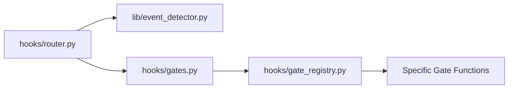

# Agent Development Guide for AOPS Framework

This guide summarizes key architectural patterns and "gotchas" for agents working on the `aops-core` hooks and gates system.

## Core Architecture

The system uses a **Universal Hook Router** (`hooks/router.py`) that delegates logic to specialized components.

### Key Components

1. **Router**: Entry point. Should be provider-agnostic. Converts inputs to "Canonical JSON" internally.
2. **Event Detector** (`lib/event_detector.py`): Centralized logic for detecting state changes (Plan Mode, Task Binding, Hydration Result) from tool calls or text. **Do not hardcode detection logic in individual hooks.**
3. **Gate Registry** (`hooks/gate_registry.py`): Contains the actual implementation of gate checks (`check_hydration_gate`, `check_custodiet_gate`, etc.).
4. **Active Gates** (`hooks/gates.py`): The configuration list that determines *which* gates run for which events.

## Workflow: Adding or Modifying a Gate

To add a new gate or modify an existing one, you must touch three places:

1. **Implementation**: Write the logic in `hooks/gate_registry.py`. Return `GateResult(verdict=...)`.
2. **Registration**: Add your function to the `GATE_CHECKS` dictionary at the bottom of `hooks/gate_registry.py`.
3. **Activation**: Add the gate to the `ACTIVE_GATES` list in `hooks/gates.py`. **Crucial:** If you forget this, your code will never run (e.g., the SessionStart bug).

## Best Practices & Pitfalls

### 1. Robust Event Detection

When detecting triggers in text (like "HYDRATION RESULT"), **use Regex**.

* ❌ Bad: `if "## HYDRATION RESULT" in text:` (Misses casing, bolding, missing markdown)
* ✅ Good: `re.search(r"(?:##\s*|\*\*)?HYDRATION RESULT", text, re.IGNORECASE)`

### 2. Strict Gates & Exceptions

When implementing blocking gates (like Hydration), consider the "Trap" problem.

* If you block `PreToolUse`, ensure you allow the specific tools needed to *unblock* the state (e.g., `activate_skill`, `write_to_file` for temp).
* Use `HYDRATION_ALLOWED_TOOLS` or specific logic to whitelist minimal escape hatches.

### 3. Testing is Mandatory

Use `unittest.mock` to isolate your gate logic.

* Mock `session_state` and `session_paths` to strictly control the environment.
* Test **edge cases**: What if the file is missing? What if the `##` prefix is gone?
* See `tests/test_post_hydration.py` or `tests/test_hydration_strict.py` for examples.

### 4. Canonical JSON

Always output `GateResult` objects (serialized to JSON).

* `verdict`: "allow", "deny", "warn", "ask"
* `system_message`: Text shown to the model/user.
* `context_injection`: Internal context injected into the prompt.

### 5. Transcript Generation

A dedicated hook `hooks/generate_transcript.py` is registered to the `Stop` (SessionEnd) event. It invokes `scripts/transcript.py` to generate clean markdown transcripts for the session log.

## Debugging

* **Logs**: Check `~/.gemini/tmp/academicOps-hooks.log` (or `hooks.log`) to see the raw JSON passing through the router.
* **Gemini CLI**: Use `gemini hooks list` to verify your hook is registered.

## Key Principles for Hook Development

1. **The Registration Triad**: A gate only runs if it is:
    * **Implemented** in `gate_registry.py`.
    * **Mapped** in `GATE_CHECKS`.
    * **Registered** in `hooks/gates.py` (ACTIVE_GATES).
    * *Tip*: Always check `hooks/gates.py` first if your code isn't running.

2. **Explicit State Management**: Hooks are stateless. Any decision to block or unblock must be explicitly persisted to `session_state`. Do not rely on implicit side effects or in-memory variables across tool calls.

3. **Template-Driven Control**: If the agent stalls or loops, check the injected templates (`hooks/templates/`). The prompt is the primary control plane. Use strong, explicit directives (e.g., "IMMEDIATE ACTION") in templates to override default model stopping behaviors.

4. **Lifecycle Awareness**: Unit tests confirm logic, but **Integration Tests** confirm behavior. Test the full chain (PreTool -> State Change -> PostTool) using real (temp) session files to catch persistence and router issues that mocks miss.
