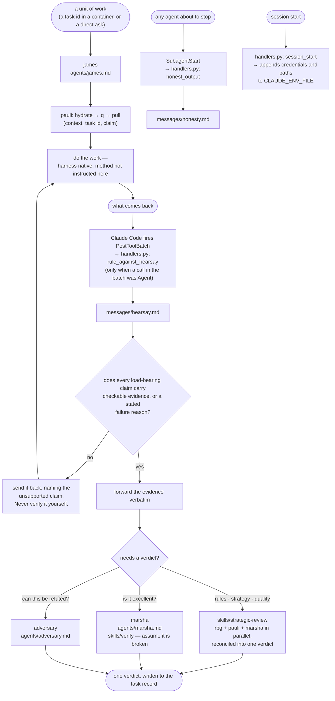

# orchestrate

The worker side: james, who takes a unit of work and sees it through; marsha,
who judges whether what he produced is any good; adversary, who tries to knock
it down; and the two hooks that carry the handback contract to both ends of the
exchange.

James is the persona a polecat container boots into (`lib/polecat/cli.py`,
`DEFAULT_AGENT`). Nothing here dispatches containers, and nothing here talks to
the user.

The two hooks are the same doctrine aimed at opposite ends of one exchange.
`honest_output` binds a worker at the start of its turn with the evidence
contract its report must satisfy — a returned result cannot be amended once it
reaches the caller. `rule_against_hearsay` fires in the caller's context the
instant a report lands, and tells it what to do with one that arrived without
proof: send it back. Not verify it, not re-run it, not fill the gap. Each half
is written in its own message file — `hooks/messages/honesty.md` for the worker,
`hooks/messages/hearsay.md` for the receiver — and nowhere else in this plugin's
hook code.

How an agent uses its harness — spawning, naming, messaging, fan-out — is not
instructed by anything in this plugin. That is the harness's business, and
instructions about it went stale faster than they earned their length.

## What it provides

| Kind  | Name               | Purpose                                                                                                             |
| ----- | ------------------ | ------------------------------------------------------------------------------------------------------------------- |
| Agent | `james`            | Takes a unit of work through to a verified result. Bounces reports that arrive without proof; never re-does work.   |
| Agent | `marsha`           | QA. Judges whether an artifact is outstanding, and runs it to find out.                                             |
| Agent | `adversary`        | Red-team review: attacks the evidence, the logic, and the scope. Never builds or fixes.                             |
| Skill | `strategic-review` | Deploys rbg, pauli, and marsha in parallel and reconciles their findings into one verdict. Bound to james.          |
| Skill | `verify`           | Marsha's QA pass: assume it is broken, then prove otherwise. Bound to marsha; commissioned, never invoked directly. |
| Hook  | `PostToolBatch`    | The handback doctrine (rule against hearsay), delivered to the receiver when a subagent's report lands.             |
| Hook  | `SubagentStart`    | The handback doctrine (honesty / evidence reminder), delivered to a subagent starting its turn.                     |
| Hook  | `SessionStart`     | Writes session credentials and paths into `CLAUDE_ENV_FILE`.                                                        |
| Hook  | `Stop`             | Closes session tracing and telemetry.                                                                               |

No commands.

## Configuration

No `userConfig` field. The `SessionStart` hook reads five environment variables and has no defaults for any of them — every one is absent-tolerant, and absence simply means that value is not carried into the session:

- `CLAUDE_ENV_FILE` — where the client expects per-session environment exports. Unset, the hook is a silent no-op.
- `AOPS_BOT_GH_TOKEN` — when present, becomes `GH_TOKEN` and `GITHUB_TOKEN` for the session, and pins `GIT_SSH_COMMAND` and a git credential helper so the session cannot reach GitHub through the operator's own SSH identity.
- `AOPS_SESSIONS`, `PKB_MCP_URL`, `PKB_MCP_TOOL_PREFIX` — forwarded verbatim.

No endpoint, host, registry, account or credential is written into anything this plugin ships.

## Depends on

- `lib/hooks/` for the hook runtime, injected at build time (`manifest/plugin.toml`).
- The `rbg` and `aops-core` plugins at runtime, for `rbg:rbg` and `aops-core:pauli`, whom `strategic-review` always deploys, and for the `services` MCP server provided by `aops-core` (`plugins/aops-core/manifest/mcp.template.json`) which `james` accesses via `mcpServers: [services, plugin:aops-core:services]`.
- The `aops-core` plugin, which ships the polecat launcher that starts the containers james runs inside.
