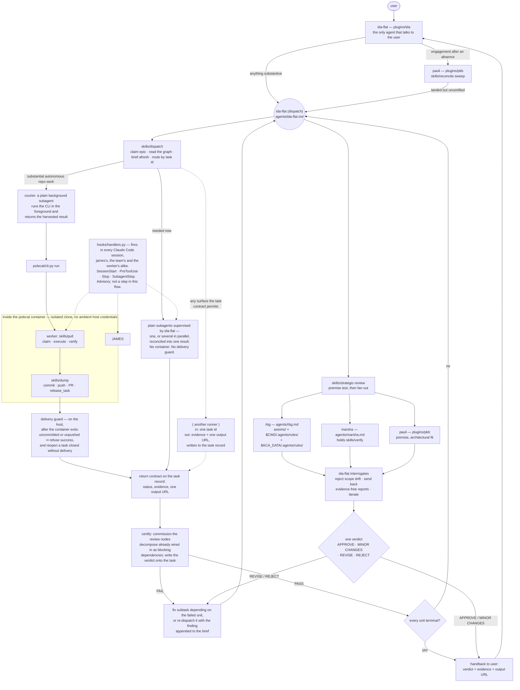

# aops

Review, QA, and dispatch: three reviewing agents, the machinery that reconciles them into one verdict, and the container runner that executes the work that verdict authorises.

## How it works



James never talks to the user; ida does. He never executes the work either — workers return evidence and he ranks and narrates the outcome. He does own the boundary the work crosses on its way back: nothing is finished until he has checked the return contract against the brief and written a certification verdict onto the record.

### James has two entry points, not one

His frontmatter grants two skills and they are co-equal. `strategic-review` judges an artifact. `dispatch` delivers an epic, and begins by claiming a task — not by receiving a verdict. A `REVISE` or `REJECT` is one of the things that puts work on the dispatch path; a queued epic coming due is another, and needs no review upstream of it at all.

He commissions the third skill rather than invoking it. `verify` is bound to marsha, whose broken-until-proven disposition is the reason it exists, and it is absent from james's own allowlist. `pull` and `dump` are the worker's contract and appear nowhere in his instructions.

The review shape does not change with the surface. Cadence is a routing detail; the claim, the return contract, and the certification step below are identical whichever surface ran the work.

### The task is the contract

The boundary is `claim_task` in, `release_task` out — one session, one claimed task, its children included (`specs/enforcement/task-contract.md`). An epic is a task with children and needs no special machinery. The invariant that a session claims exactly one task is held by convention and review; that spec concedes there is no code-level blocking check for it today.

**What the task carries when it is briefed.** The body accumulates, in order: `hydrate`'s four-section context bundle; `decompose`'s record — the subtask DAG, the composed process, and the review obligations emitted as real blocking nodes; then `brief`'s seven elements, appended under what is already there. The brief is composed immediately before dispatch and freshly each time, and the executor is handed a task id rather than the text, so its first act is to read the brief cold. A brief written earlier and unchanged since may be dispatched as it stands.

**Synthesis and log are different surfaces.** The task record is append-only by construction and is one of the framework's history surfaces, alongside version control and the transcript. The knowledge base around it is not: pauli integrates a new fact into the one document that already holds it, and timestamped history entries, decision logs, changelogs, and deprecation notices are prohibited content there (`plugins/pkb/agents/pauli.md`). So status is read from the task's status field and its latest handback, never reconstructed by replaying the body.

**When a claim is required.** No mutating work without a task claimed to the session. Cheap read-only probes are exempt — nothing is lost by running one twice, so claiming for them buys graph noise instead of recoverability. A dispatch whose loss would matter beyond its own session is claimed twice, deliberately: the dispatch surface writes a `Dispatched:` line before the worker starts, and the worker's own claim from inside its session is what moves the status. A launch claim with no worker claim behind it is exactly the stale-claim signal a reconcile sweep probes.

**Status, and where work parks.** The taxonomy that governs it is `plugins/pkb/skills/graph-maintenance/references/taxonomy.md`. The spine runs `inbox` → `ready` → `queued` → `in_progress` → one of `done`, `partial`, `cancelled`. `queued` is the human gate: agents pull from it and never promote into it, so the pipeline cannot run end to end unattended. Two statuses park work rather than end it, and they are not the same park. `merge_ready` is parked on a pull request and may be auto-closed when it merges; `review` is parked on a human decision and is never auto-closed. Both are actionable — the terminal set is `done`, `cancelled`, `someday`, `partial`.

**Released, and still open.** `merge_ready` is the documented path for work that shipped and is waiting on something outside the session: the reconcile sweep folds the merged pull request back in, re-reads the acceptance criteria against the merged artifact, and completes the task. There is **no equivalent status for released-and-awaiting-certification**, which is why the sweep has to re-read tasks that are already terminal to find work sitting at `done` with no verdict on it.

### Certification, and the gap it lives in

A unit that has landed is not finished. `skills/dispatch` verifies by side-effect first — the return contract on the task, checked against the brief's acceptance criteria, by james or a subagent, never by reading the launch wrapper's exit code. Then it certifies: it commissions the review the graph already carries, the nodes `decompose` emitted as blocking dependencies, and writes back the verdict they return. Executing those nodes _is_ certification at completion; a second review standing beside them gives two paths and leaves one unread. James supplies no judgment of his own here and never relays a worker's own "confirmed" as fact. The step has a precondition — commissioning a review means deploying reviewers, so a context holding no subagent surface hands the unit to one that does and says so, rather than reading the artifact itself and calling that a verdict.

A `FAIL` is not a separate phase. It goes into the graph as a fix subtask depending on the failed unit, or as a re-dispatch of that unit with the finding appended to its brief, so the next pass sees it without james.

**Where a verdict gets written.** Certification is prose on the task record. There is no dedicated status for it and no frontmatter field. Four surfaces write it, and all four write to that one record: `skills/dispatch` §4, which commissions the review and records what comes back; `skills/strategic-review` §5, which writes its verdict onto the record of any reviewed artifact that has one, whatever its action flags said; `skills/verify`, which writes its verdict and evidence there too; and the review nodes `decompose` emitted, which are real tasks carrying their own outcome. Ida routes work toward certification and never certifies. The reconcile sweep detects uncertified work and never certifies it either.

**Certification is synchronous. Nothing writes one asynchronously.** Three surfaces look as though they might, and none of them does:

- **The worker.** A polecat worker writes its own return contract onto the task. `skills/dispatch` refuses to treat that as certification: _"Never relay a worker's own 'confirmed' as fact."_
- **The reconcile sweep.** It completes a task whose pull request merged, after re-reading the acceptance criteria against the merged artifact. That is completion, not certification — which is why the same skill carries a separate step for units already sitting at `done` with no verdict, and why it is forbidden from certifying any of them itself.
- **The pull-request pipeline.** `.github/workflows/agent-qa.yml` posts its verdict to `gh pr review` and to a commit status. It runs marsha's prompt with `--allowed-tools "Bash,Read"` and carries no PKB MCP server and no `PKB_MCP_URL` in its environment, so a green `qa-status` never reaches the task record.

So work that lands out of session lands uncertified, and stays that way until someone comes back: the user re-engages, ida commissions the sweep, pauli finds the units sitting at `done` with no verdict, and hands them to james, who certifies them then. `specs/enforcement/enforcement.md` names this as the reason the boundary needs a sweep behind it at all — "completed work sits uncertified".

### What james hands back to ida

Certification is the first of two signatures on `done`; acceptance against the user's intent is ida's, and neither substitutes for the other (`specs/enforcement/workflow.md`). What crosses between them is the evidence contract, defined once in `specs/enforcement/evidence-contract.md`. Its canonical structured form is six fields:

```
VERDICT: <PASS | PARTIAL | FAIL | BLOCKED | NEEDS-PRINCIPAL>
CLAIM: <one sentence — the conclusion>
GATE: <the acceptance criterion tested, and the observed result against it>
EVIDENCE: <pointers — command+output, file:line, resolving URL, quoted source>
CONFIDENCE: <high|med|low> + <what single check would falsify this>
CONFOUND CHECK: <did a clean-room/differential control run? result? — or "NOT RUN">
```

At release-unit scale the same contract is one page of prose rather than that block, and the rule is identical: every delivered or checked claim carries a resolvable pointer or a stated failure reason.

Two rules are what make either form load-bearing rather than ceremonial. Every claim carries checkable evidence or a stated failure reason — there is no third option, and honest failure is always a legal exit. And every itemised claim is labelled **Observed** (james saw the primary evidence himself) or **Reported** (a worker, transcript, or document said it, attributed, with its verification status). A filled-in field whose citation does not support the claim attached to it is the same violation as no citation.

The handback is written to the PKB task record. That record is the only message bus; a result held in a session transcript or a pull-request body has not been delivered.

### Who runs polecat, and what any other runner owes

`skills/dispatch` is the mandatory pathway to a container: _"A raw `polecat run` outside this skill bypasses the dispatch contract."_ Two callers are sanctioned — james, through a courier subagent, and a person at a terminal, for whom the CLI drops into an interactive run when stdin is a TTY and no headless flag was passed. Nothing else.

The courier exists because a container emits no completion signal of its own and a detached session's report reaches nobody. It is a plain background subagent that runs the CLI in the foreground, takes the exit code directly rather than through a pipe, reads the return contract off the task and quotes it, and carries the whole result in its final message — because nothing it says earlier reaches james.

Other surfaces are permitted. `specs/enforcement/task-contract.md` lets any fully-specified task be claimed by "any worker on any surface", which is why the diagram carries an empty box. The contract on that box is the whole of what a new runner has to satisfy: **in**, one task id, whose brief it reads fresh from the record; **out**, evidence plus one output URL, written to the PKB task record. One deliverable per claimed task — never a spray of per-child pull requests reviewed individually. How the worker demonstrates compliance and QA internally is its own business.

### When work is committed, and how the pull-request pipeline relates

Committing is the `dump` skill's job, and the path picks the behaviour. `full` commits, pushes, opens a pull request, and releases the task. `partial` commits and pushes too, opening the pull request as a draft, and releases at `partial` with the refused decisions and unmet criteria named. `bail` and `pause` commit nothing — they hand over with the work still in the tree. The delivery guard is aimed squarely at the mismatch: a container that exits leaving changes uncommitted, or commits unpushed, is refused whatever it claimed.

The GitHub Actions pipeline is not another `strategic-review`, and not a substitute for one. It is the workflow-level sign-off over a whole release unit, instantiated for the surface work happens to ship on (`specs/enforcement/sign-off.md`) — required reviewer statuses, a human admit gate, branch protection, and mechanical CI. Sign-off is surface-agnostic by design; not all work ships through GitHub. `strategic-review` is a review james commissions over an artifact at whatever point he needs one. The two are independent layers, and the pipeline's verdict lives on the pull request, never on the task.

## What this plugin provides

### Agents

| Agent    | File               | Role                                                                                                                     |
| -------- | ------------------ | ------------------------------------------------------------------------------------------------------------------------ |
| `james`  | `agents/james.md`  | Commissions the review lenses, interrogates them, synthesises one verdict. Also the dispatcher, and the certifying role. |
| `marsha` | `agents/marsha.md` | Judges whether an artifact is outstanding. Runs it. `PASS` / `FAIL` / `REVISE`.                                          |
| `rbg`    | `agents/rbg.md`    | Judges rule compliance across three rule sources. Silent unless she finds a violation.                                   |

### Skills

| Skill              | File                               | Purpose                                                                                                  |
| ------------------ | ---------------------------------- | -------------------------------------------------------------------------------------------------------- |
| `strategic-review` | `skills/strategic-review/SKILL.md` | Fan out three reviewers, apply the premise test, reconcile into one verdict. James's.                    |
| `verify`           | `skills/verify/SKILL.md`           | Marsha's QA pass: forcing checks, halt triggers, verification report. Bound to her disposition.          |
| `dispatch`         | `skills/dispatch/SKILL.md`         | The only pathway to a polecat container. Claim, brief, route, verify by side-effect, certify. James's.   |
| `pull`             | `skills/pull/SKILL.md`             | The worker contract: claim a queued task, execute it, verify it, hand over through `dump`.               |
| `dump`             | `skills/dump/SKILL.md`             | Session exit — bail, full, partial, or pause. The only path that commits, pushes, and releases the task. |

### Hooks

| Event          | Handler                                   | Message                                         | Effect                                                                                                                                                                                                                                                                                |
| -------------- | ----------------------------------------- | ----------------------------------------------- | ------------------------------------------------------------------------------------------------------------------------------------------------------------------------------------------------------------------------------------------------------------------------------------- |
| `SessionStart` | `session_start`                           | `session-start.md`, `session-start-isolated.md` | Reports which plugin build is running, what else the client has installed, and the OpenTelemetry configuration — a report, never a value set. Then writes: it appends git credential configuration to the env file named by `CLAUDE_ENV_FILE`. See below; the write isolates nothing. |
| `PreToolUse`   | `refuse_interactive_prompt_when_headless` | `headless-interactive-prompt.md`                | Refuses an interactive prompt in a headless session. The only hook in the framework that blocks a call.                                                                                                                                                                               |
| `SubagentStop` | `present_checkable_evidence`              | `answer-evidence.md`                            | Reminds the stopping subagent to present its answer with checkable evidence. The output reaches the agent that is stopping, not its parent. Skipped when `stop_hook_active` is set, or while background tasks are running.                                                            |
| `Stop`         | `present_checkable_evidence`              | `answer-evidence.md`                            | The same reminder, the same handler, the same two skips, at the end of a session rather than a subagent.                                                                                                                                                                              |

`SessionStart` is registered unconditionally for Claude Code, so it fires in every session — james's, a reviewer's, a courier's, and the worker's inside the container. Its credential branch is gated on `CLAUDE_ENV_FILE` being set, not on the session being a container. **What that branch does is not isolation.** Every value it writes was read from the process environment and stays there; the file adds a second copy for tools the client launches from it and confines nothing. `lib/hooks/credentials.py` says so in its own module docstring and requires any agent-facing text about it to say so too. What the agent is told is narrower and true: a token and git credential configuration are present in this session, `git` and `gh` authenticate on their own, and no credential is ever to be read, printed, or copied into a file, a commit message, or another agent's prompt.

The two stop hooks fire at every session and subagent termination regardless of what the agent was doing, so they are not steps in the flow: they change no state, nothing reads back whether the agent complied, and the output addresses whoever is stopping rather than whoever commissioned the work. `answer-evidence.md` asks for four things — every load-bearing claim carrying its evidence inline and labelled Observed or Reported; anything unrun, unreachable, or unfinished named plainly; "fixed", "works", and "passing" reserved for the originally-failing behaviour observed passing, and "changed, unverified" until then; and the response still _being_ the deliverable rather than a summary of it or commentary on the agent's own process. Two cases skip the reminder. `stop_hook_active` is set once a stop hook has already continued this stop cycle, and injecting again re-continues it — an unbounded loop with no user input. Outstanding `background_tasks` mean the agent is holding rather than stopping, and nagging it there re-outputs a deliverable that does not exist yet.

Three of the four hooks are advisory: nothing blocks on a rule verdict. `PreToolUse` blocks, and only on a capability fact — a headless session has no human to answer `AskUserQuestion`, so the call cannot return and the session hangs until it times out. A session is headless when any of `NONINTERACTIVE`, `CI`, `AOPS_POLECAT_CONTAINER`, or `CLAUDE_CODE_NON_INTERACTIVE` is `1`. Every other tool passes untouched, and so do these tools in a session with someone in it. `lib/hooks/result.py` holds the rule for when a refusal is legitimate; a handler that has an opinion about compliance returns an advisory instead.

Wording lives in `hooks/messages/` and is editable without touching code.

On agy, only `Stop` fires, arriving as `PostInvocation`. agy has no session-level hook event of any kind, so `SessionStart` cannot fire there at all. It does have tool events of its own, but `lib/hooks/clients.py` maps only `PreInvocation` and `PostInvocation` for agy — no agy tool event is mapped, so none routes, and the headless refusal is Claude-only. The mapping is withheld because agy's tool-event payload is shaped differently from the two invocation phases `lib/hooks/context.py` normalises; it is not a question of what the tool field is called, which `context.py` already reads under either spelling.

### Container runner

`polecat/cli.py` runs an agent CLI inside an isolated container: a per-session standalone git clone (never a shared checkout), a read-only staging mount for per-session settings, and a delivery guard that refuses to report success while the workspace has uncommitted changes or unpushed commits, reopening a task the worker closed without delivering. The guard runs on the host after the container exits, which is why the diagram draws it outside the box. `polecat/entrypoint.sh` configures git and the scoped credential helper inside the container, then execs the agent.

## Configuration

Nothing here has a default. Every value arrives from the environment or from the operator's `polecat.yaml`; a missing required value is a loud failure.

| Variable                                               | Read by                                                 | Purpose                                                                                                                                                                                                       |
| ------------------------------------------------------ | ------------------------------------------------------- | ------------------------------------------------------------------------------------------------------------------------------------------------------------------------------------------------------------- |
| `POLECAT_HOME`                                         | `polecat/cli.py`                                        | Cache root for isolated clones, staging, and session logs. Required, or `polecat_home` in the config file.                                                                                                    |
| `POLECAT_IMAGE`                                        | `polecat/cli.py`                                        | Container image reference. Required, or `docker.image` in the config file.                                                                                                                                    |
| `AOPS_POLECAT_CONFIG`                                  | `polecat/cli.py`                                        | Path to the config file. Falls back to `polecat.yaml` under `AOPS_SESSIONS`.                                                                                                                                  |
| `AOPS_SESSIONS`                                        | `polecat/cli.py`                                        | Session-log root, and the config file's default location.                                                                                                                                                     |
| `POLECAT_STAGING_BASE`                                 | `polecat/cli.py`                                        | Where the per-session staging directory is created.                                                                                                                                                           |
| `POLECAT_AGENT_HOME`                                   | `polecat/cli.py`                                        | Host directory holding the agent CLI's config. Unset means no credential is staged.                                                                                                                           |
| `POLECAT_WORKER_MODEL`                                 | `polecat/cli.py`                                        | Model written into the container's staged settings. Unset means the client decides.                                                                                                                           |
| `POLECAT_PRINT_TIMEOUT`                                | `polecat/cli.py`                                        | Ceiling on a headless agy run. Unset means the CLI's own limit applies.                                                                                                                                       |
| `AOPS_BOT_GH_TOKEN`                                    | `cli.py`, `entrypoint.sh`, `lib/hooks/credentials.py`   | Repository access inside the container. The container refuses to start without it.                                                                                                                            |
| `AOPS_CC_OAUTH_TOKEN` / `CLAUDE_CODE_OAUTH_TOKEN`      | `polecat/cli.py`                                        | Agent CLI authentication, forwarded into the container.                                                                                                                                                       |
| `GIT_AUTHOR_NAME`, `GIT_AUTHOR_EMAIL`                  | `entrypoint.sh`                                         | Commit identity. The container refuses to start without both — there is no default identity.                                                                                                                  |
| `PKB_MCP_URL`, `PKB_MCP_TOOL_PREFIX`                   | `polecat/cli.py`                                        | Knowledge-base MCP endpoint, forwarded into the container and used by the delivery guard to reopen a task closed without delivery.                                                                            |
| `CLAUDE_ENV_FILE`                                      | `lib/hooks/credentials.py`                              | The env file the `SessionStart` hook appends to. Absent means it writes nothing.                                                                                                                              |
| `ACA_DATA`                                             | `agents/rbg.md`                                         | User-scoped rule layer, `$ACA_DATA/.agents/rules/`. Absence is a missing layer, not an error.                                                                                                                 |
| `POLECAT_RULES_DIR`, or `rules_dir` in the config file | `polecat/cli.py`                                        | Host directory of user-scoped cope/rbg rules, mounted read-only at the container's own `$ACA_DATA/.agents/rules/`. Absent means no layer 3 inside the container; configured but unreadable is a hard failure. |
| `COPE_EVALUATOR_*`, or `cope:` in the config file      | `polecat/cli.py`                                        | cope's evaluator, forwarded into the container. A host variable wins over its config-file counterpart. Absent means cope evaluates nothing in the container.                                                  |
| The OpenTelemetry contract                             | `lib/hooks/telemetry.py`, forwarded by `polecat/cli.py` | Reported at `SessionStart` and forwarded into containers. Never set here. Full list in `specs/ARCHITECTURE.md`.                                                                                               |

The plugin declares no `userConfig` fields.

## Depends on

- `lib/hooks/` — shared hook runtime (`dispatch.py`, `context.py`, `result.py`, `clients.py`, `messages.py`, `credentials.py`, `telemetry.py`, `provenance.py`, `degraded.py`), injected into `hooks/` at build time.
- `lib/axioms/` — injected into `axioms/` at build time; rbg's first rule source and the source of `axioms.jsonl`.
- `lib/axioms/` — applied as global rule context. `delegation.md` is what makes the surface rules binding above ida-flat's own instructions.
- `plugins/pkb` at runtime, for `pauli` (the third review lens, the only writer to the knowledge base, and the agent that runs the reconcile sweep) and the task graph ida-flat dispatches against.
- Docker on the host that runs `polecat`.
