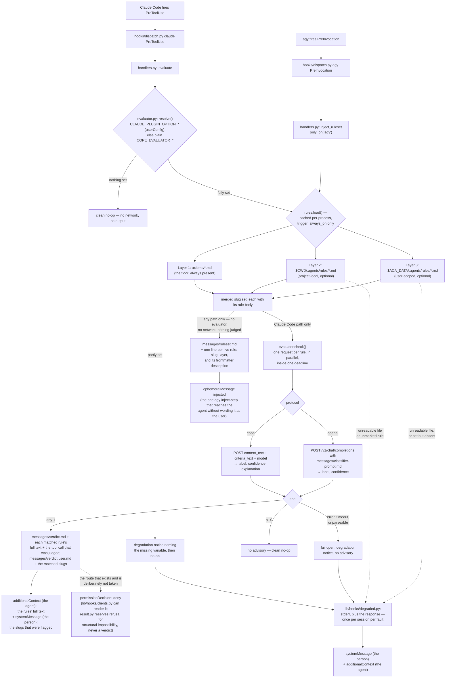

# aops-cope

Advisory, in-session rule checking: on every tool call it asks a small language model whether the call matches any rule in a three-layer rule set, and injects the matched rule into the agent's context so it can correct itself. It never blocks anything.



A missing or unreadable layer 2 or layer 3 directory degrades to whatever did load. Layer 1 is the plugin's own `axioms/`, injected by the build, so its presence is a build guarantee rather than a runtime condition and its absence is the one thing the loader does not check for — an installation without it is a broken build, not a session to be warned about. An unreadable `axioms/` directory, or an unreadable file inside it, is still reported like any other. A later layer can only add a slug not already claimed — it can never override an axiom's entry, so a project or user rule file cannot weaken the floor by reusing its filename.

Every layer counts only the `*.md` files declaring `trigger: always_on` — the same line `build/axioms.py` draws when it emits a client's native rule mechanism. A rules directory holds reference material as well as policies: an index, a path table, a note-taking convention, a stub. Only a policy can be classified, so only a marked file is sent to the evaluator.

Nothing else is dropped quietly. A file skipped for want of the marker is named, with the layer's directory — except in the shipped `axioms/`, whose non-rule files (`README.md`, `AXIOMS-REVIEW.md`) are a known set nobody in the session can act on. `$ACA_DATA` set to a path with no `.agents/rules/` directory is named too: setting the variable is a claim that the layer exists. `$ACA_DATA` unset, and a project with no `.agents/rules/` directory, are ordinary absences and say nothing.

"Named" means named to the person running the session, not only to a log. Every degradation here goes through `lib/hooks/degraded.py`: the reason still goes to stderr, and it additionally rides out on the hook's response — the full reason as `additionalContext` for the agent, one sentence as `systemMessage` for the person, who is the only one who can go and fix the file. Because this hook fires on every tool call, each distinct fault is announced **once per session**: a dead evaluator says so once, not once per rule per call. Repeats stay in the log. A fault report is never a gate — it can only ever add an advisory, and the tool call proceeds either way.

## What this plugin provides

| Component            | File                                   | Purpose                                                                                           |
| -------------------- | -------------------------------------- | ------------------------------------------------------------------------------------------------- |
| `PreToolUse` hook    | `hooks/dispatch.py` (shared, injected) | Entry point Claude Code executes on every tool call.                                              |
| `PreInvocation` hook | `hooks/dispatch.py` (shared, injected) | Entry point agy executes on every turn.                                                           |
| Evaluation handler   | `hooks/handlers.py` — `evaluate`       | Loads the rule set, sends the tool call for judgment, injects what came back.                     |
| Ruleset handler      | `hooks/handlers.py` — `inject_ruleset` | Injects the live rule roster once per turn. agy only.                                             |
| Evaluator client     | `hooks/evaluator.py`                   | Configuration gate, both wire protocols, the deadline, and the fail-open policy.                  |
| Rule loader          | `hooks/rules.py`                       | Three-layer loading described above; carries each rule's body as its policy text.                 |
| Fault reporting      | `hooks/degraded.py` (shared, injected) | Puts cope's own failures on the response as well as on stderr, once per session.                  |
| Advisory wording     | `hooks/messages/*.md`                  | `verdict.md`, `verdict.user.md`, `ruleset.md`, and `classifier-prompt.md`. Editable without code. |

## How the judgment is made

The evaluation is a small language model's judgment call, reached over the [Reflexes](https://reflexes.sh) evaluator contract ([SPEC.md](https://github.com/zentropi-ai/reflexes/blob/main/SPEC.md), §4). The contract is one policy in, one verdict out: cope sends a rule's own markdown as the `policy` and the tool call as the `content`, and gets back a `label` of 0 or 1. Because each rule is asked about separately, a match names the rule it matched — which is what makes the advisory actionable rather than a vague warning.

Every live rule is evaluated on every tool call, in parallel, inside one deadline. Nothing is pre-filtered: a rule quietly left out of the check is a rule quietly switched off.

Two protocols are supported, so the same mechanism serves a hosted API and a local model:

- `cope` — the CoPE label API: `POST` with `{"content_text", "criteria_text", "model"}`, answering `{"label", "confidence", "explanation"}`. Spoken by the hosted Zentropi service and by a self-hosted CoPE server alike; the model is open-weights, so remote and local are the same protocol pointed at different hosts.
- `openai` — any OpenAI-compatible `/v1/chat/completions` server: Ollama, vLLM, LocalAI, llama.cpp, or a hosted provider. The classifier instruction is `hooks/messages/classifier-prompt.md`.

**Nothing about this plugin is a verdict.** A match is one model's reading of one rule against one tool call, injected for the agent to weigh. Real enforcement is a separate merge-stage check; nothing in-session blocks on a rule verdict (`specs/ARCHITECTURE.md`, Enforcement).

**A blocking route exists and is not taken.** The shared runtime can render one: `lib/hooks/result.py` has `refuse()`, a refusal beats any advisory in `merge`, and `lib/hooks/clients.py` renders it as `permissionDecision: deny` for Claude Code and as `decision: deny` for agy. What keeps cope out of it is doctrine, not capability. `result.py` reserves refusal for _structural impossibility_ — the session as configured physically cannot carry the call out, so letting it through produces a hang rather than an outcome — and states that refusal is never a rule verdict, however confident the handler is. The only surface a rule-driven refusal could ever act on is Claude Code's `PreToolUse`, which is the one event cope handles there and the one place a decision about a call is a decision the client honours. It could not be extended to `Stop` or `SubagentStop`: `_render_claude` branches on the result, not the event, so it would emit a permission field the client does not honour on those events. On agy it reaches nothing today — a refusal renders only for a tool event, and no agy tool event is mapped.

**Unconfigured, cope evaluates nothing.** No endpoint ships with this plugin, so an installation that has not set one gets a clean no-op on every tool call — no network call, no output, no error. This is a legitimate state and is never reported as a fault. Configure some of the variables but not all and you get one degradation notice naming what is missing, then the same no-op: a half-configured evaluator is somebody's intent that did not land, and guessing the missing value is the default this plugin may not have.

**It fails open, always.** A dead socket, a slow endpoint, an error status, a body that will not parse — none of them produce an advisory, and none of them delay or block the tool call beyond the deadline. The reason is reported and the call proceeds. There are no retries: a retry in front of every tool call multiplies the stall the agent is waiting through.

**What leaves the machine.** When an evaluator is configured, every tool call's name and input are sent to it, once per live rule — including file paths, command strings, and file contents, truncated to the first 4000 characters of rendered input. Point `COPE_EVALUATOR_URL` at a locally hosted model if that is not acceptable for the work in front of you.

## The two surfaces

`PreToolUse` carries a tool call, so that is where the evaluation runs. agy fires tool events of its own — `PreToolUse` and `PostToolUse` are two of the five events it has — but their payload is shaped differently from Claude Code's, and `lib/hooks/context.py` cannot read it, so the shared runtime leaves them unmapped and maps only the two invocation phases (`lib/hooks/clients.py`). That is deferred work, not a missing capability on agy's side. The asymmetry that is permanent is a different one: agy has no session-level event at all, so `SessionStart` and `SessionEnd` cannot fire there and no row can ever be written for them.

The consequence for cope is exact. cope is wired on agy — the manifest wires `PreInvocation` under `agy`. What is not wired on agy is the _evaluator_: with no tool event mapped, `evaluate` never runs there, only `inject_ruleset` does. **On agy the rules are stated, never checked.** No request is made, so `COPE_EVALUATOR_URL` and its companions are inert on that client however they are configured, and nothing cope does on agy puts anything on the network.

What agy's `PreInvocation` does carry is the turn itself, which is enough to state which rules are live: `inject_ruleset` injects a one-line-per-rule roster, each line marked with the layer it came from.

The roster is scoped to agy. Claude Code fires both events, is already covered at `PreToolUse`, and has its `UserPromptSubmit` hook owned by `aops-pkb`, so a second injection there would be redundant. The scope is declared twice, both times explicitly: the manifest wires `PreInvocation` under `agy` only, and the handler carries `only_on_clients = {"agy"}` via the `only_on` decorator, which `lib/hooks/dispatch.py` honours by skipping out-of-scope handlers before running them.

### Why the roster is injected rather than baked in

For layer 1 it _is_ baked in, by the same mechanism on both clients, and the roster does not duplicate that. `trigger: always_on` is one line drawn once in `build/axioms.py`, and each client's native rule mechanism is filled from it: `build/clients/agy.py` copies every always-on axiom into the plugin's `rules/` directory at build time, and on Claude Code the build emits `axioms.jsonl` and the installer merges it into `autoMode` in `~/.claude/settings.json` (`specs/ARCHITECTURE.md`, Installation). Both are static, both are settled before the session starts, and both carry layer 1 and nothing else.

Layers 2 and 3 are what neither can carry. A project's rules live in the checkout the session happens to open, and a user's live wherever `$ACA_DATA` points; neither is knowable when the plugin is built or installed, and both can change between one turn and the next. Claude Code covers that gap at `PreToolUse`, where `evaluate` reloads all three layers in every hook process — one per tool call, so a rule file edited mid-session is live on the next one. agy has no such surface, so the roster covers it. That is why the roster is load-bearing on agy and would be redundant on Claude Code, which is why it is not wired there.

### What a roster line contains

One line per live rule, and the line is the rule's frontmatter `description` — nothing else. No rule body reaches the roster, whatever its length: bodies are not truncated or summarised, they are simply not in it. The body has two other destinations, which is why the roster does not need it. It goes to the evaluator as the `policy`, whole; and on a match it goes into the advisory whole, because a rule named without its content is a scolding the agent cannot act on. The roster is composed at hook time from the rule files as they are on disk for that turn, sorted by layer then slug.

The sharp edge is a rule file with `trigger: always_on` and no `description`: its line is a bare slug, a name with no content behind it. Every shipped axiom carries a description, so this can only bite a project- or user-authored rule — which is exactly the kind the roster exists to announce.

## Configuration

Every value arrives from the environment or from client `userConfig`. No endpoint, host, model name, token, or path is baked into anything this plugin ships, and nothing here has a default.

Each evaluator setting can be supplied two ways, and they are the same setting:

- **Claude Code `userConfig`** — declared in the plugin manifest, so Claude Code prompts for it when the plugin is enabled. Claude Code exports each option into the hook's environment as `CLAUDE_PLUGIN_OPTION_<KEY>`, the option key uppercased (Claude Code hooks documentation, "Available String Substitutions and Environment Variables"); cope's option keys are named so that uppercasing one yields exactly the variable in the table below. Substitution into the hook's `command` string is not an option and is not used: cope's hook is shell form, and a shell-form plugin hook whose `command` references `${user_config.*}` fails with an error instead of running (same document, "Shell Form vs Exec Form").
- **A plain environment variable** — the fallback, and the only route on agy and in containers, neither of which has `userConfig` at all.

`evaluator._setting` does one lookup over both, in that order, and the first non-empty value wins. An option the user left blank falls through to the plain variable rather than blanking it.

**Why two routes and not just the environment.** For four of the five settings the environment alone would do, and does: `URL`, `PROTOCOL`, `MODEL`, and `TIMEOUT` are non-secret operator values, and they already travel by environment on every surface that has no `userConfig` — `plugins/aops/polecat/env_contract.py` forwards all five into containers by name, and `plugins/aops/polecat/cli.py` fills any the host left unset from the operator's `polecat.yaml` `cope:` block. The fifth is the reason the `userConfig` route exists at all. `COPE_EVALUATOR_API_KEY` is the one credential in the set, and `cope_evaluator_api_key` is the one option declared `"sensitive": true` in `manifest/plugin.template.json`. That declaration is the only way cope can tell the client it is handing over a secret rather than a setting, and it changes where the secret lands: a `sensitive` option is masked as it is typed and stored in secure storage instead of `settings.json` — the macOS Keychain, or `~/.claude/.credentials.json` on platforms where no supported keychain is available (Claude Code plugins reference, "User configuration"). An environment variable carries no such marking, and a secret exported into the process environment is readable by everything else in it. The other four options are declared so the whole set is configured in one place rather than one secret in a dialogue and four values in a shell profile.

**Which route wins.** A `userConfig` value beats the plain variable when both are set, and `tests/test_cope.py` pins that ordering. The option is the more specific of the two: it is a value someone entered against this option, for this plugin, at the moment they enabled it. It is also the better attested. Claude Code ignores the `pluginConfigs` block — the settings key a `userConfig` answer is recorded under — when it appears in a project's `.claude/settings.json` or `.claude/settings.local.json`, a restriction documented as a security measure and specific to `pluginConfigs` rather than to settings in general (same document and section): both those files live in the workspace, so without it a cloned repository could supply values that flow into plugin hook commands, MCP server configs, LSP commands, and monitor commands. A `userConfig` value therefore cannot have come from the checkout the session opened. The plain variable is ambient — process environment that anything in the chain launching the client may have set, for any reason. The specific, attested setting wins over the ambient one.

| Variable (`userConfig` key is the lowercase form) | Purpose                                                                                                                                                                                      | Default                                                          |
| ------------------------------------------------- | -------------------------------------------------------------------------------------------------------------------------------------------------------------------------------------------- | ---------------------------------------------------------------- |
| `COPE_EVALUATOR_URL`                              | Full URL of the evaluator endpoint — a hosted CoPE label API, a self-hosted CoPE server, or a local OpenAI-compatible server.                                                                | none — with it unset, cope evaluates nothing.                    |
| `COPE_EVALUATOR_PROTOCOL`                         | Which wire protocol that URL speaks: `cope` or `openai`. Any other value is refused rather than guessed.                                                                                     | none — required alongside the URL.                               |
| `COPE_EVALUATOR_MODEL`                            | Model identifier sent with each request.                                                                                                                                                     | none — required alongside the URL.                               |
| `COPE_EVALUATOR_API_KEY`                          | Bearer token for the endpoint. Omit it for a local server that needs no auth; the `Authorization` header is then not sent at all.                                                            | none — optional, and its absence is not an error.                |
| `COPE_EVALUATOR_TIMEOUT`                          | Seconds allowed for the whole evaluation of one tool call, across all rules. The longest a tool call can be held up. Unparseable or non-positive values fall back with a degradation notice. | 5.0 seconds. Not an endpoint or a credential — a latency budget. |
| `ACA_DATA`                                        | Path to the PKB repo; enables layer 3 (`$ACA_DATA/.agents/rules/*.md`). Set to a path with no such directory, cope says so.                                                                  | none — absence just means layer 3 doesn't load.                  |

`ACA_DATA` is environment-only: it is shared with the rest of the framework rather than owned by this plugin, so cope declares no `userConfig` option for it.

Every one of these is inert on agy except `ACA_DATA`, which still selects layer 3 for the roster. The evaluator settings are read only by `evaluate`, which agy never reaches.

## Running against a local model

The classifier is open-weights ([`zentropi-ai/cope-b-a4b`](https://huggingface.co/zentropi-ai/cope-b-a4b)), so the `cope` protocol can point at loopback instead of a hosted service. Take the Q4_K_M GGUF from [`mradermacher/cope-b-a4b-GGUF`](https://huggingface.co/mradermacher/cope-b-a4b-GGUF) and a llama.cpp build at b10155 or later, compiled with CUDA.

Two processes serve it: `llama-server` holding the model, and `scripts/cope_eval_shim.py` in front of it translating the CoPE label API onto single-token completions. Start both with one command:

```bash
python3 scripts/cope_eval_stack.py start \
  --server-bin <llama.cpp>/build/bin/llama-server \
  --model <path>/cope-b-a4b.Q4_K_M.gguf \
  --log-dir <state-dir> \
  --warmup .agents/rules
```

On WSL, prefix that with `LD_LIBRARY_PATH=/usr/lib/wsl/lib` so the CUDA loader finds the driver libraries; both processes inherit the launcher's environment. Add `--host`, `--upstream-port`, or `--shim-port` to move off `127.0.0.1:8090` and `127.0.0.1:8099`, and `--extra-args` to append llama-server flags, which land last and so override the ones the launcher sets.

`--warmup <rules-dir>` classifies a throwaway tool call against every `trigger: always_on` rule there before the command returns, so the first real tool call is not the one that pays for cold policy prefixes. A rule that fails to warm is reported and the stack still comes up.

`cope_eval_stack.py status` reports both endpoints; `cope_eval_stack.py stop` shuts down only the processes `start` recorded, and only after confirming the recorded PID is still running them. Both need the same `--log-dir`.

To watch llama-server's own output, run the two by hand instead:

```bash
llama-server --host 127.0.0.1 --port 8090 --model <path>/cope-b-a4b.Q4_K_M.gguf \
  -ngl 99 --n-cpu-moe 99 --swa-full --ctx-size 24576 --parallel 8 -ub 1024 --jinja
python3 scripts/cope_eval_shim.py --port 8099 --upstream http://127.0.0.1:8090
```

Set `--threads` and `--threads-batch` to suit the host. `--swa-full` is not optional: without it the model's sliding-window attention disables prefix caching, and every rule reprocesses its policy on every tool call. `curl http://127.0.0.1:8099/v1/health` reports the shim's own status and whether llama-server is answering.

Then point cope at the shim:

| Variable                  | Value                                                                                                                                                                     |
| ------------------------- | ------------------------------------------------------------------------------------------------------------------------------------------------------------------------- |
| `COPE_EVALUATOR_URL`      | `http://127.0.0.1:8099/v1/label`                                                                                                                                          |
| `COPE_EVALUATOR_PROTOCOL` | `cope`                                                                                                                                                                    |
| `COPE_EVALUATOR_MODEL`    | `cope-b-a4b` — passed through to llama-server, which serves the one model it was started with.                                                                            |
| `COPE_EVALUATOR_API_KEY`  | Leave unset. The shim needs no credential, ignores any `Authorization` header it is sent, and forwards none.                                                              |
| `COPE_EVALUATOR_TIMEOUT`  | `15`. The first sweep after a cold server start can still exceed it; those rules go unevaluated and the tool call proceeds, which is what `--warmup` is there to prevent. |

An upstream that is unreachable, slow, or answering with anything other than `0` or `1` gets a 5xx from the shim and never a label — which cope fails open on, as it does on any other evaluator failure.

## Depends on

- `lib/hooks/` — shared hook runtime (`dispatch.py`, `context.py`, `result.py`, `clients.py`, `messages.py`, `degraded.py`, and `messages/degraded*.md`), injected into `hooks/` at build time.
- `lib/axioms/` — injected into `axioms/` at build time; layer 1 of the rule set.
- An evaluator endpoint, external and operator-supplied: a Reflexes-compatible CoPE label API or an OpenAI-compatible chat-completions server. Nothing is bundled, and the hook runtime uses only the Python standard library — no `reflexes` package, no `httpx`, nothing to install.
