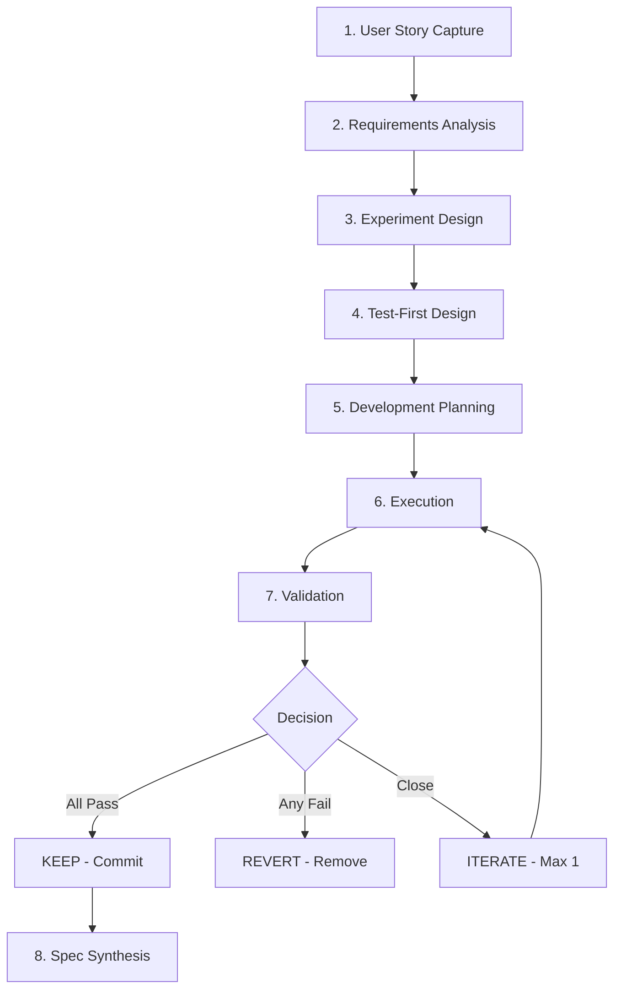

# Feature-Dev Skill

**Status**: Implemented

## Workflow



## Purpose

Guide rigorous, test-first feature development from idea to validated implementation, ensuring features are properly specified, tested, and documented before shipping.

## Problem Statement

Feature development risks:

- Incomplete requirements leading to wasted work
- Implementation before testing (bugs discovered late)
- Partial success shipped (features that mostly work)
- Implementation artifacts scattered across repo
- Specs diverging from actual implementation

## Solution

An 8-phase workflow that enforces test-first development, explicit success criteria, and fail-fast validation.

## How It Works

### Invocation

```
Skill(skill="feature-dev")
```

Invoke when adding new features, building significant functionality, or implementing user-requested capabilities. NOT for bug fixes or simple refactoring.

### Core Behaviors

**1. Eight-Phase Workflow**

| Phase                    | Purpose                                      |
| ------------------------ | -------------------------------------------- |
| 1. User Story Capture    | Zero-friction idea intake (any format)       |
| 2. Requirements Analysis | Transform into testable requirements         |
| 3. Experiment Design     | Formalize plan with hypothesis               |
| 4. Test-First Design     | Write integration tests FIRST                |
| 5. Development Planning  | Break into discrete steps                    |
| 6. Execution             | Build with continuous validation             |
| 7. Validation            | Verify and decide keep/revert/iterate        |
| 8. Spec Synthesis        | Update spec, delete implementation artifacts |

**2. Test-First Requirement**

Integration tests must be written and committed BEFORE implementation code. Tests must:

- Complete user-facing workflow end-to-end
- Validate each success criterion
- Fail before feature exists
- Pass after feature complete

**3. Fail-Fast Decision Matrix**

| Outcome                            | Action                                    |
| ---------------------------------- | ----------------------------------------- |
| All criteria met + tests pass      | **KEEP** - Commit and document            |
| Any criteria not met OR tests fail | **REVERT** - Remove feature, document why |
| Close to success with clear fix    | **ITERATE** (max 1 cycle)                 |

Never commit partial success.

**4. Spec Synthesis (Phase 8)**

Per [[AXIOMS]] #29: Implementation artifacts are temporal, specs are timeless. After validation:

- Merge implementation knowledge into spec
- Strip temporal content (dates, deliberation)
- Delete orphan experiment/learning files
- Spec reads as "how it works" not "how it was built"

### Progress Tracking

TodoWrite mandatory at each phase:

- Initial setup: High-level phases as items
- Development phase: Specific implementation steps
- One item in_progress at a time
- Mark completed immediately upon finishing

## Relationships

### Depends On

- [[AXIOMS]] - All axioms enforced
- [[ACCOMMODATIONS]] - ADHD accommodations (zero-friction capture, bias for action)
- [[python-dev-skill]] - For Python implementation work

### Produces

- Experiment logs in `$AOPS/experiments/`
- Integration tests in appropriate test directories
- Updated specs in `$AOPS/specs/`

### Templates (bundled)

- `templates/user-story.md`
- `templates/experiment-plan.md`
- `templates/test-spec.md`
- `templates/dev-plan.md`

## Success Criteria

1. **Test-first enforced**: No implementation without failing tests first
2. **Clear success criteria**: Every feature has measurable outcomes defined upfront
3. **No partial success**: Features are fully working or reverted
4. **Single source of truth**: One spec per feature, no orphan implementation docs
5. **Visual progress**: TodoWrite tracks all phases and steps

## Design Rationale

**Why 8 phases?**

Each phase has a distinct deliverable and decision point. Clear phase separation prevents scope creep, ensures nothing is skipped, and provides natural checkpoints for validation.

**Why test-first?**

Writing tests before code forces explicit success criteria. Tests that pass without implementation prove nothing; tests that fail prove they're testing correctly. Discovering test requirements during implementation is too late.

**Why spec synthesis?**

Implementation artifacts (experiment logs, learning files) are temporal - they capture the journey. Specs are timeless - they capture the destination. After implementation, the spec should contain everything needed to understand the feature; implementation artifacts become cruft.

**Why fail-fast decisions?**

Partial success is technical debt. A feature that "mostly works" creates false confidence and hides bugs. Reverting cleanly leaves tests as documentation of future requirements. Shipping broken features is worse than shipping nothing.
