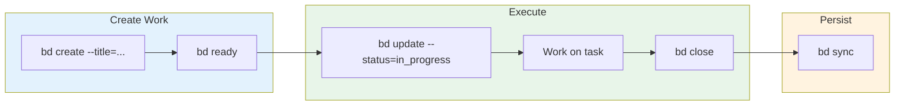

# Work Management: `bd` (Beads)

`bd` is the primary work management system for multi-session tracking, dependencies, and strategic work.



**When to use `bd`**:

- Multi-session work (spans multiple conversations)
- Work with dependencies (blocked by / blocks)
- Strategic planning and tracking
- Discoverable by future sessions

#### Multi-Project Prefix Routing

This project uses a **shared beads database** at `~/writing/.beads/` with different prefixes per project. When creating issues, use the `--rig` flag to ensure correct prefix assignment:

| CWD                | Command                              | Prefix          |
| ------------------ | ------------------------------------ | --------------- |
| `$AOPS`            | `bd create --rig aops --title="..."` | `aops-`         |
| `~/src/buttermilk` | `bd create --rig bm --title="..."`   | `bm-`           |
| `~/writing`        | `bd create --title="..."`            | `ns-` (default) |

**Why this matters**: Without `--rig`, all issues get the database's default prefix (`ns-`), regardless of which project directory you're in. The routing system can find issues by prefix, but cannot auto-detect which prefix to use when creating.

**Alternative**: Use `--prefix` for one-off prefix overrides without route lookup:

```bash
bd create --prefix aops --title="One-off with custom prefix"
```
