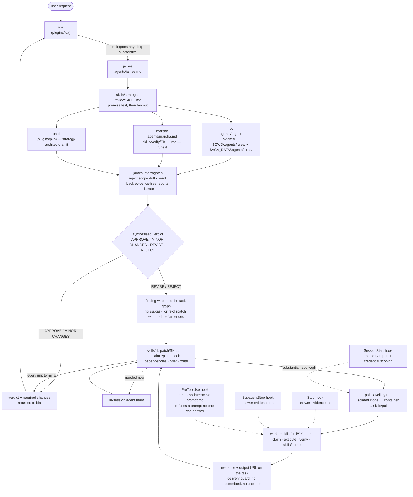

# aops

Review, QA, and dispatch: three reviewing agents, the machinery that reconciles them into one verdict, and the container runner that executes the work that verdict authorises.

<!-- NS: review diagram and docs for currency and intent and completeness. A couple of things I noticed:
    - draw a box around where the polecat container goes
    - it looks like James' only skill is 'strategic-review', but I think James handles a bunch of dispatch, review, redispatch work?
    - Show the full flow for decomposition and planning and explain who's responsible for each bit, including whether the user has to invoke it or it's sequenced in some way
    - Make it clear where a given task boundary is, including what level of instructions it carries, how it is synthesised, whether it contains a log of changes or a synthesis, how it is used to report status when a task is released, when a task is required to be claimed before certain work is permitted, how a task might be released and hang around for a while until a different async process reconciles (e.g. merged PRs or certification from a QA review etc, not necessarily linearly scheduled)
    - explain when exactly James, as dispatcher, reviews the output of a supposedly completed task by a worker -- and how it might get redispatched
    - explain when agents are instructed to commit and push their changes (including to draft and ready PRs) and whether the GH PR Review process is the duplicative, different, or alternative to the strategic-review fan-out
    - who runs polecat cli, and make an empty box for other potential runners of tasks, including the input/output contract (and whether the runner is expected to updatehe task itself in the PKB or whether it can return info any other way)
    - under what circumstances, if any, is James permitted to run an in-session agent team instead of dispatching a polecat? I'm not sure he can, but I could be wrong. If he can, how does that fit into the QA review process and does it require binding and updating and releasing a task?
    - can ida dispatch subagents, and if so, what sort of work can they do and how do they communicate back? How is that work assessed?
    - what's the contract between James and Ida, or between workers and Ida? Does Ida need to be satisfied that work carries attestations that it has been reviewed? If work is done async, how does this certification get back onto the task before it gets to Ida?
    - when does James run synchronous agents and are they run in containers? if not why not, that sounds dangerous?

-->

James never talks to the user; ida does. James never sits inside the dispatch → review → reconcile loop; workers return evidence and he ranks and narrates the outcome.

## What this plugin provides

### Agents

| Agent    | File               | Role                                                                                                      |
| -------- | ------------------ | --------------------------------------------------------------------------------------------------------- |
| `james`  | `agents/james.md`  | Commissions the review lenses, interrogates them, synthesises one verdict. Also routes work to a surface. |
| `marsha` | `agents/marsha.md` | Judges whether an artifact is outstanding. Runs it. `PASS` / `FAIL` / `REVISE`.                           |
| `rbg`    | `agents/rbg.md`    | Judges rule compliance across three rule sources. Silent unless she finds a violation.                    |

### Skills

| Skill              | File                               | Purpose                                                                              |
| ------------------ | ---------------------------------- | ------------------------------------------------------------------------------------ |
| `strategic-review` | `skills/strategic-review/SKILL.md` | Fan out three reviewers, apply the premise test, reconcile into one verdict.         |
| `verify`           | `skills/verify/SKILL.md`           | Marsha's QA pass: forcing checks, halt triggers, verification report.                |
| `dispatch`         | `skills/dispatch/SKILL.md`         | The only pathway to a polecat container. Claim, brief, route, verify by side-effect. |
| `pull`             | `skills/pull/SKILL.md`             | The worker contract: claim a queued task, execute it, record the result.             |
| `dump`             | `skills/dump/SKILL.md`             | Session exit — bail, full, partial, or pause.                                        |

### Hooks

| Event          | Handler                                   | Message                                         | Effect                                                                                                                                      |
| -------------- | ----------------------------------------- | ----------------------------------------------- | ------------------------------------------------------------------------------------------------------------------------------------------- |
| `SessionStart` | `session_start`                           | `session-start.md`, `session-start-isolated.md` | Reports telemetry configuration; scopes credentials for a container session. Reports only — sets nothing.                                   |
| `PreToolUse`   | `refuse_interactive_prompt_when_headless` | `headless-interactive-prompt.md`                | Refuses an interactive prompt in a headless session. The only hook in the framework that blocks a call.                                     |
| `SubagentStop` | `present_checkable_evidence`              | `answer-evidence.md`                            | Reminds the stopping subagent to present its answer with checkable evidence. The output reaches the agent that is stopping, not its parent. |
| `Stop`         | `present_checkable_evidence`              | `answer-evidence.md`                            | Reminds an agent to present its answer with checkable evidence.                                                                             |

Three of the four are advisory: nothing blocks on a rule verdict. `PreToolUse` blocks, and only on a capability fact — a headless session has no human to answer `AskUserQuestion`, so the call cannot return and the session hangs until it times out. A session is headless when any of `NONINTERACTIVE`, `CI`, `AOPS_POLECAT_CONTAINER`, or `CLAUDE_CODE_NON_INTERACTIVE` is `1`. Every other tool passes untouched, and so do these tools in a session with someone in it. `lib/hooks/result.py` holds the rule for when a refusal is legitimate; a handler that has an opinion about compliance returns an advisory instead.

Wording lives in `hooks/messages/` and is editable without touching code.

On agy, only `Stop` fires, as `PostInvocation`. agy has no session-level hook event of any kind, so `SessionStart` cannot fire there. It does have a `PreToolUse`, but its payload names the tool differently from Claude Code's, which `lib/hooks/context.py` is the only thing that reads — so the refusal stays Claude-only until that payload can be parsed, and wiring it sooner would ship a hook that fires and cannot see the tool it is judging. See `lib/hooks/clients.py`.

### Container runner

`polecat/cli.py` runs an agent CLI inside an isolated container: a per-session standalone git clone (never a shared checkout), a read-only staging mount for per-session settings, and a delivery guard that refuses to report success while the workspace has uncommitted changes or unpushed commits. `polecat/entrypoint.sh` configures git and the scoped credential helper inside the container, then execs the agent.

## Configuration

Nothing here has a default. Every value arrives from the environment or from the operator's `polecat.yaml`; a missing required value is a loud failure.

| Variable                                               | Read by                                                 | Purpose                                                                                                                                                                                                       |
| ------------------------------------------------------ | ------------------------------------------------------- | ------------------------------------------------------------------------------------------------------------------------------------------------------------------------------------------------------------- |
| `POLECAT_HOME`                                         | `polecat/cli.py`                                        | Cache root for isolated clones, staging, and session logs. Required, or `polecat_home` in the config file.                                                                                                    |
| `POLECAT_IMAGE`                                        | `polecat/cli.py`                                        | Container image reference. Required, or `docker.image` in the config file.                                                                                                                                    |
| `AOPS_POLECAT_CONFIG`                                  | `polecat/cli.py`                                        | Path to the config file. Falls back to `polecat.yaml` under `AOPS_SESSIONS`.                                                                                                                                  |
| `AOPS_SESSIONS`                                        | `polecat/cli.py`                                        | Session-log root, and the config file's default location.                                                                                                                                                     |
| `POLECAT_STAGING_BASE`                                 | `polecat/cli.py`                                        | Where the per-session staging directory is created.                                                                                                                                                           |
| `POLECAT_AGENT_HOME`                                   | `polecat/cli.py`                                        | Host directory holding the agent CLI's config. Unset means no credential is staged.                                                                                                                           |
| `POLECAT_WORKER_MODEL`                                 | `polecat/cli.py`                                        | Model written into the container's staged settings. Unset means the client decides.                                                                                                                           |
| `POLECAT_PRINT_TIMEOUT`                                | `polecat/cli.py`                                        | Ceiling on a headless agy run. Unset means the CLI's own limit applies.                                                                                                                                       |
| `AOPS_BOT_GH_TOKEN`                                    | `cli.py`, `entrypoint.sh`, `lib/hooks/credentials.py`   | Repository access inside the container. The container refuses to start without it.                                                                                                                            |
| `AOPS_CC_OAUTH_TOKEN` / `CLAUDE_CODE_OAUTH_TOKEN`      | `polecat/cli.py`                                        | Agent CLI authentication, forwarded into the container.                                                                                                                                                       |
| `GIT_AUTHOR_NAME`, `GIT_AUTHOR_EMAIL`                  | `entrypoint.sh`                                         | Commit identity. The container refuses to start without both — there is no default identity.                                                                                                                  |
| `PKB_MCP_URL`, `PKB_MCP_TOOL_PREFIX`                   | `polecat/cli.py`                                        | Knowledge-base MCP endpoint, forwarded into the container and used by the delivery guard to reopen a task closed without delivery.                                                                            |
| `CLAUDE_ENV_FILE`                                      | `lib/hooks/credentials.py`                              | Scoped env file the `SessionStart` hook writes. Absent means no scoping is needed.                                                                                                                            |
| `ACA_DATA`                                             | `agents/rbg.md`                                         | User-scoped rule layer, `$ACA_DATA/.agents/rules/`. Absence is a missing layer, not an error.                                                                                                                 |
| `POLECAT_RULES_DIR`, or `rules_dir` in the config file | `polecat/cli.py`                                        | Host directory of user-scoped cope/rbg rules, mounted read-only at the container's own `$ACA_DATA/.agents/rules/`. Absent means no layer 3 inside the container; configured but unreadable is a hard failure. |
| `COPE_EVALUATOR_*`, or `cope:` in the config file      | `polecat/cli.py`                                        | cope's evaluator, forwarded into the container. A host variable wins over its config-file counterpart. Absent means cope evaluates nothing in the container.                                                  |
| The OpenTelemetry contract                             | `lib/hooks/telemetry.py`, forwarded by `polecat/cli.py` | Reported at `SessionStart` and forwarded into containers. Never set here. Full list in `specs/ARCHITECTURE.md`.                                                                                               |

The plugin declares no `userConfig` fields.

## Depends on

- `lib/hooks/` — shared hook runtime (`dispatch.py`, `context.py`, `result.py`, `clients.py`, `messages.py`, `credentials.py`, `telemetry.py`, `degraded.py`), injected into `hooks/` at build time.
- `lib/axioms/` — injected into `axioms/` at build time; rbg's first rule source and the source of `axioms.jsonl`.
- `lib/doctrine/` — inlined into the agent files at build time via `@include`.
- `plugins/pkb` at runtime, for `pauli` (the third review lens, and the only writer to the knowledge base) and the task graph james dispatches against.
- Docker on the host that runs `polecat`.
