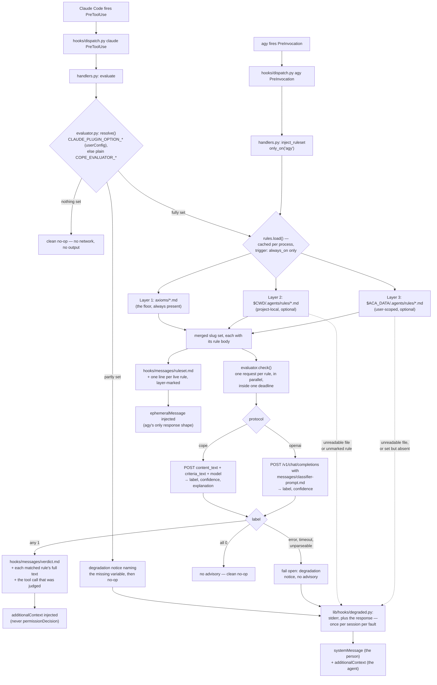

# aops-cope

<!-- NS: We are going to run RBG head-to-head against Cope. Cope is going to evaluate every tool use. RBG is going to sit on the boundaries (subagentstop, stop) and check, much less frequently, for any infringement of the axioms plus project plus user scoped rules in EITHER (not sure yet, so make it configurable and we'll set up an A/B test) the initial user prompt + the final response + a bare list of tool calls, OR the full transcript. RBG will use a more expensive model that can reason about the rules. We will compare the two and see if RBG catches anything that Cope does not.

-->

Advisory, in-session rule checking: on every tool call it asks a small language model whether the call matches any rule in a three-layer rule set, and injects the matched rule into the agent's context so it can correct itself. It never blocks anything.



<!-- NS: review for completeness and accuracy. Some points I noticed:
- why are AGY events treated differently from Claude Code events?
- why is cope not wired up in agy?
- For agy rules, why are we injecting rulesets dynamically and not in the docker container? How does this differ from the way we insert claude code 'auto-mode' rules into the user scoped settings? they should be the same.
- how do long multi-line rules get translated to a ruleset.md? when?
- are rules just shouted at agy clients? not actually checked through theevaluator?
- is there a blocking route that might be turned on in future? show it dashed if so, explain which surfaces it can act on.
- why do we use userConfig for one surface but env vars for another? seems cleaner just to use env vars and keep them DRY.
-->

A missing or unreadable layer 2 or layer 3 directory degrades to whatever did load; layer 1 (the shipped `axioms/`) is always present. A later layer can only add a slug not already claimed — it can never override an axiom's entry, so a project or user rule file cannot weaken the floor by reusing its filename.

Every layer counts only the `*.md` files declaring `trigger: always_on` — the same line `build/axioms.py` draws when it emits a client's native rule mechanism. A rules directory holds reference material as well as policies: an index, a path table, a note-taking convention, a stub. Only a policy can be classified, so only a marked file is sent to the evaluator.

Nothing is dropped quietly. A file skipped for want of the marker is named, with the layer's directory — except in the shipped `axioms/`, whose non-rule files (`README.md`, `AXIOMS-REVIEW.md`) are a known set nobody in the session can act on. `$ACA_DATA` set to a path with no `.agents/rules/` directory is named too: setting the variable is a claim that the layer exists. `$ACA_DATA` unset, and a project with no `.agents/rules/` directory, are ordinary absences and say nothing.

"Named" means named to the person running the session, not only to a log. Every degradation here goes through `lib/hooks/degraded.py`: the reason still goes to stderr, and it additionally rides out on the hook's response — the full reason as `additionalContext` for the agent, one sentence as `systemMessage` for the person, who is the only one who can go and fix the file. Because this hook fires on every tool call, each distinct fault is announced **once per session**: a dead evaluator says so once, not once per rule per call. Repeats stay in the log. A fault report is never a gate — it can only ever add an advisory, and the tool call proceeds either way.

## What this plugin provides

| Component            | File                                   | Purpose                                                                               |
| -------------------- | -------------------------------------- | ------------------------------------------------------------------------------------- |
| `PreToolUse` hook    | `hooks/dispatch.py` (shared, injected) | Entry point Claude Code executes on every tool call.                                  |
| `PreInvocation` hook | `hooks/dispatch.py` (shared, injected) | Entry point agy executes on every turn.                                               |
| Evaluation handler   | `hooks/handlers.py` — `evaluate`       | Loads the rule set, sends the tool call for judgment, injects what came back.         |
| Ruleset handler      | `hooks/handlers.py` — `inject_ruleset` | Injects the live rule roster once per turn. agy only.                                 |
| Evaluator client     | `hooks/evaluator.py`                   | Configuration gate, both wire protocols, the deadline, and the fail-open policy.      |
| Rule loader          | `hooks/rules.py`                       | Three-layer loading described above; carries each rule's body as its policy text.     |
| Fault reporting      | `hooks/degraded.py` (shared, injected) | Puts cope's own failures on the response as well as on stderr, once per session.      |
| Advisory wording     | `hooks/messages/*.md`                  | `verdict.md`, `ruleset.md`, and the evaluator's `classifier-prompt.md`. No code edit. |

## How the judgment is made

The evaluation is a small language model's judgment call, reached over the [Reflexes](https://reflexes.sh) evaluator contract ([SPEC.md](https://github.com/zentropi-ai/reflexes/blob/main/SPEC.md), §4). The contract is one policy in, one verdict out: cope sends a rule's own markdown as the `policy` and the tool call as the `content`, and gets back a `label` of 0 or 1. Because each rule is asked about separately, a match names the rule it matched — which is what makes the advisory actionable rather than a vague warning.

Every live rule is evaluated on every tool call, in parallel, inside one deadline. Nothing is pre-filtered: a rule quietly left out of the check is a rule quietly switched off.

Two protocols are supported, so the same mechanism serves a hosted API and a local model:

- `cope` — the CoPE label API: `POST` with `{"content_text", "criteria_text", "model"}`, answering `{"label", "confidence", "explanation"}`. Spoken by the hosted Zentropi service and by a self-hosted CoPE server alike; the model is open-weights, so remote and local are the same protocol pointed at different hosts.
- `openai` — any OpenAI-compatible `/v1/chat/completions` server: Ollama, vLLM, LocalAI, llama.cpp, or a hosted provider. The classifier instruction is `hooks/messages/classifier-prompt.md`.

**Nothing about this plugin is a verdict.** A match is one model's reading of one rule against one tool call, injected for the agent to weigh. Real enforcement is a separate merge-stage check; nothing in-session blocks on a rule verdict (`specs/ARCHITECTURE.md`, Enforcement).

**Unconfigured, cope evaluates nothing.** No endpoint ships with this plugin, so an installation that has not set one gets a clean no-op on every tool call — no network call, no output, no error. This is a legitimate state and is never reported as a fault. Configure some of the variables but not all and you get one degradation notice naming what is missing, then the same no-op: a half-configured evaluator is somebody's intent that did not land, and guessing the missing value is the default this plugin may not have.

**It fails open, always.** A dead socket, a slow endpoint, an error status, a body that will not parse — none of them produce an advisory, and none of them delay or block the tool call beyond the deadline. The reason is reported and the call proceeds. There are no retries: a retry in front of every tool call multiplies the stall the agent is waiting through.

**What leaves the machine.** When an evaluator is configured, every tool call's name and input are sent to it, once per live rule — including file paths, command strings, and file contents, truncated to the first 4000 characters of rendered input. Point `COPE_EVALUATOR_URL` at a locally hosted model if that is not acceptable for the work in front of you.

## The two surfaces

`PreToolUse` carries a tool call, so that is where the evaluation runs. agy has no `PreToolUse` equivalent — its hook phases map to `UserPromptSubmit` and `Stop` (`lib/hooks/clients.py`) — so on agy there is nothing for the evaluator to judge. What agy's `PreInvocation` does carry is the turn itself, which is enough to state which rules are live: `inject_ruleset` injects a one-line-per-rule roster, each line marked with the layer it came from. Layers 2 and 3 are the load-bearing part, because agy's static `rules/` directory is built from layer 1 alone and cannot know about a project's or a user's own rules.

The roster is scoped to agy. Claude Code fires both events, is already covered at `PreToolUse`, and has its `UserPromptSubmit` hook owned by `aops-pkb`, so a second injection there would be redundant. The scope is declared twice, both times explicitly: the manifest wires `PreInvocation` under `agy` only, and the handler carries `only_on_clients = {"agy"}` via the `only_on` decorator, which `lib/hooks/dispatch.py` honours by skipping out-of-scope handlers before running them.

## Configuration

Every value arrives from the environment or from client `userConfig`. No endpoint, host, model name, token, or path is baked into anything this plugin ships, and nothing here has a default.

Each evaluator setting can be supplied two ways, and they are the same setting:

- **Claude Code `userConfig`** — declared in the plugin manifest, so Claude Code prompts for it when the plugin is enabled. Claude Code exports each option into the hook's environment as `CLAUDE_PLUGIN_OPTION_<KEY>`, the option key uppercased; cope's option keys are named so that uppercasing one yields exactly the variable in the table below. Substitution into the hook's `command` string is not an option and is not used: cope's hook is shell form, and Claude Code rejects `${user_config.*}` in shell-form commands outright rather than let a configured value reach a shell.
- **A plain environment variable** — the fallback, and the only route on agy and in containers, neither of which has `userConfig` at all.

A `userConfig` value wins over the plain variable when both are set. Claude Code accepts `pluginConfigs` only from user settings, managed policy, or `--settings`, and deliberately ignores a project's own settings files so that a cloned repository cannot supply one — which makes it the more trustworthy of the two. An option the user left blank falls through to the plain variable rather than blanking it.

| Variable (`userConfig` key is the lowercase form) | Purpose                                                                                                                                                                                      | Default                                                          |
| ------------------------------------------------- | -------------------------------------------------------------------------------------------------------------------------------------------------------------------------------------------- | ---------------------------------------------------------------- |
| `COPE_EVALUATOR_URL`                              | Full URL of the evaluator endpoint — a hosted CoPE label API, a self-hosted CoPE server, or a local OpenAI-compatible server.                                                                | none — with it unset, cope evaluates nothing.                    |
| `COPE_EVALUATOR_PROTOCOL`                         | Which wire protocol that URL speaks: `cope` or `openai`. Any other value is refused rather than guessed.                                                                                     | none — required alongside the URL.                               |
| `COPE_EVALUATOR_MODEL`                            | Model identifier sent with each request.                                                                                                                                                     | none — required alongside the URL.                               |
| `COPE_EVALUATOR_API_KEY`                          | Bearer token for the endpoint. Omit it for a local server that needs no auth; the `Authorization` header is then not sent at all.                                                            | none — optional, and its absence is not an error.                |
| `COPE_EVALUATOR_TIMEOUT`                          | Seconds allowed for the whole evaluation of one tool call, across all rules. The longest a tool call can be held up. Unparseable or non-positive values fall back with a degradation notice. | 5.0 seconds. Not an endpoint or a credential — a latency budget. |
| `ACA_DATA`                                        | Path to the PKB repo; enables layer 3 (`$ACA_DATA/.agents/rules/*.md`). Set to a path with no such directory, cope says so.                                                                  | none — absence just means layer 3 doesn't load.                  |

`ACA_DATA` is environment-only: it is shared with the rest of the framework rather than owned by this plugin, so cope declares no `userConfig` option for it.

The API key option is declared `sensitive`, so Claude Code masks it on entry and stores it in the macOS Keychain — or `~/.claude/.credentials.json` where no keychain is available — instead of `settings.json`. Supplying the key that way rather than as an ambient environment variable is the better of the two on Claude Code, and it is the reason the option exists.

## Running against a local model

The classifier is open-weights ([`zentropi-ai/cope-b-a4b`](https://huggingface.co/zentropi-ai/cope-b-a4b)), so the `cope` protocol can point at loopback instead of a hosted service. Take the Q4_K_M GGUF from [`mradermacher/cope-b-a4b-GGUF`](https://huggingface.co/mradermacher/cope-b-a4b-GGUF) and a llama.cpp build at b10155 or later, compiled with CUDA.

Two processes serve it: `llama-server` holding the model, and `scripts/cope_eval_shim.py` in front of it translating the CoPE label API onto single-token completions. Start both with one command:

```bash
python3 scripts/cope_eval_stack.py start \
  --server-bin <llama.cpp>/build/bin/llama-server \
  --model <path>/cope-b-a4b.Q4_K_M.gguf \
  --log-dir <state-dir> \
  --warmup .agents/rules
```

On WSL, prefix that with `LD_LIBRARY_PATH=/usr/lib/wsl/lib` so the CUDA loader finds the driver libraries; both processes inherit the launcher's environment. Add `--host`, `--upstream-port`, or `--shim-port` to move off `127.0.0.1:8090` and `127.0.0.1:8099`, and `--extra-args` to append llama-server flags, which land last and so override the ones the launcher sets.

`--warmup <rules-dir>` classifies a throwaway tool call against every `trigger: always_on` rule there before the command returns, so the first real tool call is not the one that pays for cold policy prefixes. A rule that fails to warm is reported and the stack still comes up.

`cope_eval_stack.py status` reports both endpoints; `cope_eval_stack.py stop` shuts down only the processes `start` recorded, and only after confirming the recorded PID is still running them. Both need the same `--log-dir`.

To watch llama-server's own output, run the two by hand instead:

```bash
llama-server --host 127.0.0.1 --port 8090 --model <path>/cope-b-a4b.Q4_K_M.gguf \
  -ngl 99 --n-cpu-moe 99 --swa-full --ctx-size 24576 --parallel 8 -ub 1024 --jinja
python3 scripts/cope_eval_shim.py --port 8099 --upstream http://127.0.0.1:8090
```

Set `--threads` and `--threads-batch` to suit the host. `--swa-full` is not optional: without it the model's sliding-window attention disables prefix caching, and every rule reprocesses its policy on every tool call. `curl http://127.0.0.1:8099/v1/health` reports the shim's own status and whether llama-server is answering.

Then point cope at the shim:

| Variable                  | Value                                                                                                                                                                     |
| ------------------------- | ------------------------------------------------------------------------------------------------------------------------------------------------------------------------- |
| `COPE_EVALUATOR_URL`      | `http://127.0.0.1:8099/v1/label`                                                                                                                                          |
| `COPE_EVALUATOR_PROTOCOL` | `cope`                                                                                                                                                                    |
| `COPE_EVALUATOR_MODEL`    | `cope-b-a4b` — passed through to llama-server, which serves the one model it was started with.                                                                            |
| `COPE_EVALUATOR_API_KEY`  | Leave unset. The shim needs no credential, ignores any `Authorization` header it is sent, and forwards none.                                                              |
| `COPE_EVALUATOR_TIMEOUT`  | `15`. The first sweep after a cold server start can still exceed it; those rules go unevaluated and the tool call proceeds, which is what `--warmup` is there to prevent. |

An upstream that is unreachable, slow, or answering with anything other than `0` or `1` gets a 5xx from the shim and never a label — which cope fails open on, as it does on any other evaluator failure.

## Depends on

- `lib/hooks/` — shared hook runtime (`dispatch.py`, `context.py`, `result.py`, `clients.py`, `messages.py`, `degraded.py`, and `messages/degraded*.md`), injected into `hooks/` at build time.
- `lib/axioms/` — injected into `axioms/` at build time; layer 1 of the rule set.
- An evaluator endpoint, external and operator-supplied: a Reflexes-compatible CoPE label API or an OpenAI-compatible chat-completions server. Nothing is bundled, and the hook runtime uses only the Python standard library — no `reflexes` package, no `httpx`, nothing to install.
