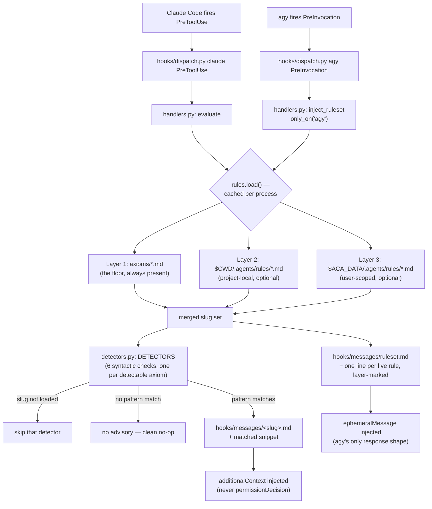

# aops-cope

Advisory, in-session rule checking against a three-layer rule set — it injects a heads-up into the agent's context, it never blocks anything.

A missing or unreadable layer 2 or layer 3 directory degrades silently to whatever did load; layer 1 (the shipped `axioms/`) is always present. A later layer can only add a slug not already claimed — it can never override an axiom's entry, so a project or user rule file cannot weaken the floor by reusing its filename.

Layer 1 counts only the `axioms/*.md` files declaring `trigger: always_on`; the index and companion docs shipped in that directory are reference material, not rules — the same line `build/axioms.py` draws when it emits a client's native rule mechanism. Layers 2 and 3 take every `*.md` as written: a project or user owns its `.agents/rules/` directory, and a rule written there without frontmatter is still a rule.

## What this plugin provides

| Component            | File                                   | Purpose                                                                       |
| -------------------- | -------------------------------------- | ----------------------------------------------------------------------------- |
| `PreToolUse` hook    | `hooks/dispatch.py` (shared, injected) | Entry point Claude Code executes on every tool call.                          |
| `PreInvocation` hook | `hooks/dispatch.py` (shared, injected) | Entry point agy executes on every turn.                                       |
| Detector handler     | `hooks/handlers.py` — `evaluate`       | Loads the rule set, runs detectors, injects the first match.                  |
| Ruleset handler      | `hooks/handlers.py` — `inject_ruleset` | Injects the live rule roster once per turn. agy only.                         |
| Rule loader          | `hooks/rules.py`                       | Three-layer loading described above.                                          |
| Detectors            | `hooks/detectors.py`                   | Six syntactic pattern checks, one per detectable axiom.                       |
| Advisory wording     | `hooks/messages/*.md`                  | One file per detectable axiom slug, plus `ruleset.md`. Editable without code. |

## The two surfaces

`PreToolUse` sees a tool call, so the detectors run there. agy has no `PreToolUse` equivalent — its hook phases map to `UserPromptSubmit` and `Stop` (`lib/hooks/clients.py`) — so on agy the detectors can never fire. What agy's `PreInvocation` does carry is the turn itself, which is enough to state which rules are live: `inject_ruleset` injects a one-line-per-rule roster, each line marked with the layer it came from. Layers 2 and 3 are the load-bearing part, because agy's static `rules/` directory is built from layer 1 alone and cannot know about a project's or a user's own rules.

The roster is scoped to agy. Claude Code fires both events, is already covered at `PreToolUse`, and has its `UserPromptSubmit` hook owned by `aops-pkb`, so a second injection there would be redundant. The scope is declared twice, both times explicitly: the manifest wires `PreInvocation` under `agy` only, and the handler carries `only_on_clients = {"agy"}` via the `only_on` decorator, which `lib/hooks/dispatch.py` honours by skipping out-of-scope handlers before running them.

## What the evaluator can and cannot detect

A `PreToolUse` hook sees a tool name and its input — not the agent's reasoning, claims, or intent. Six of the sixteen axioms have a shape that is actually visible at that surface, so `detectors.py` ships exactly these six, each a plain regex over `Bash` command text or a tool's file-path input:

- `bounded-execution` — `tail -f` / `--follow` / `--watch` / `while true` shapes with no visible terminating bound.
- `costly-ops-approval` — destructive/high-blast-radius shapes: force-push, hard reset, recursive delete, drop/truncate table, mass `find -delete`.
- `halt-on-failure` — bypassed validation gates: `--no-verify`, `--no-gpg-sign`, a disabled hooks path.
- `data-boundaries` — a command or file path that looks like a credential/secret file (`.env`, `id_rsa`, `.netrc`, `.aws/credentials`, …).
- `evidence-immutable` — an `Edit`/`Write` targeting a path that looks like fixture, golden, or evidence data.
- `full-observability` — a mutating command (`commit`, `push`, `rm`, `mv`) whose output is redirected to `/dev/null`.

The remaining ten axioms — `honest-epistemics`, `cite-sources`, `do-one-thing`, `closure`, `categorical-imperative`, `exercise-authority`, `judgment-non-delegable`, `single-source-of-truth`, `synthesize-not-accrete`, `pull-over-push` — require reading and understanding what the agent is claiming or intends. A tool call carries none of that, so this plugin does not pretend to check them; they remain rbg's and the merge-stage check's job. A detector match is a syntactic signal that triggers a heads-up, never a verdict — matching `judgment-non-delegable`'s own carve-out for deterministic syntactic checks.

## Configuration

| Variable   | Purpose                                                                 | Default                                         |
| ---------- | ----------------------------------------------------------------------- | ----------------------------------------------- |
| `ACA_DATA` | Path to the PKB repo; enables layer 3 (`$ACA_DATA/.agents/rules/*.md`). | none — absence just means layer 3 doesn't load. |

No endpoint, URL, host, path, token, or credential is baked into this plugin.

## Depends on

- `lib/hooks/` — shared hook runtime (`dispatch.py`, `context.py`, `result.py`, `clients.py`, `messages.py`), injected into `hooks/` at build time.
- `lib/axioms/` — injected into `axioms/` at build time; layer 1 of the rule set.
